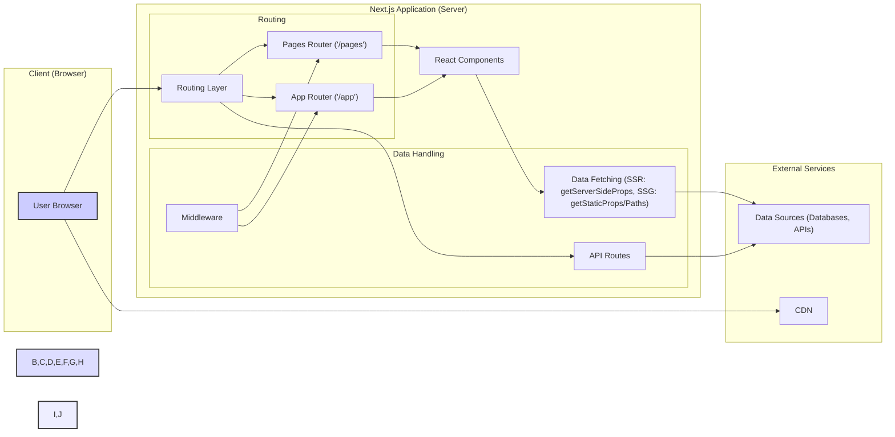
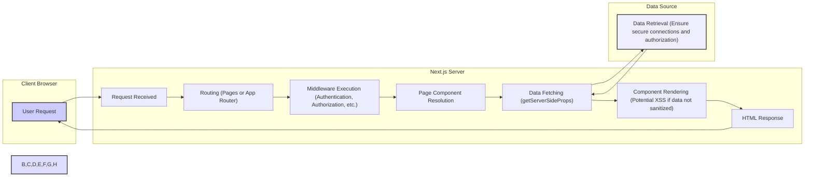

# Project Design Document: Next.js Framework

**Version:** 1.1
**Date:** October 26, 2023
**Author:** AI Software Architect

## 1. Project Overview

This document outlines the architectural design of the Next.js framework, a popular React framework for building web applications. This document serves as a foundation for subsequent threat modeling activities. It details the key components, data flow, and technologies involved in a typical Next.js application, with a focus on aspects relevant to security.

## 2. Goals

* Provide a clear and comprehensive overview of the Next.js architecture, emphasizing security-relevant aspects.
* Identify key components and their interactions, highlighting potential attack surfaces.
* Describe the typical data flow within a Next.js application, pinpointing where data manipulation or interception could occur.
* Highlight potential areas of security concern with specific examples for future threat modeling.
* Serve as a reference point for security assessments, secure development practices, and incident response planning.

## 3. Non-Goals

* This document does not aim to be an exhaustive technical specification of every Next.js feature or API.
* It does not delve into the internal implementation details of the Next.js codebase beyond what is necessary for understanding the architecture and security implications.
* It does not include a detailed threat model, specific security recommendations, or penetration testing results (those will be separate deliverables).
* It does not cover the specifics of individual user applications built with Next.js, but rather the framework's inherent architecture and potential vulnerabilities it might introduce.

## 4. Target Audience

* Security engineers and architects responsible for threat modeling, security assessments, and penetration testing of Next.js applications.
* Development teams building and maintaining Next.js applications, requiring a security-focused understanding of the framework.
* DevOps engineers involved in deploying, configuring, and managing Next.js applications in a secure manner.

## 5. Architectural Overview

Next.js is a versatile React framework enabling the development of various web application types. Understanding the rendering strategy is crucial for security analysis:

* **Server-Side Rendered (SSR) Applications:** Pages are rendered on the server upon each request, improving SEO and initial load time but introducing server-side rendering specific vulnerabilities.
* **Static Site Generation (SSG) Applications:** Pages are pre-rendered at build time and served as static files, reducing server load but potentially exposing build-time data.
* **Client-Side Rendering (CSR) Applications:**  Traditional React application behavior where rendering occurs in the browser, shifting more security responsibility to the client-side.
* **API Routes:** Backend functionality built as serverless functions within the Next.js application, requiring careful attention to API security best practices.

The architecture combines a Node.js server (for SSR and API routes) with client-side React components.

### 5.1. High-Level Architecture with Rendering Modes

### 5.2. Detailed Request Flow (SSR Example with Security Focus)

## 6. Key Components

* **Routing Layer:**  Directs incoming requests. Security considerations include:
    * **Pages Router (`/pages`):**  Susceptible to misconfigurations leading to unintended access if not carefully managed.
    * **App Router (`/app`):** Offers more flexibility but requires careful configuration to prevent unauthorized access to routes and layouts.
* **React Components:** The UI building blocks. Security concerns are primarily around:
    * **Client-Side XSS:**  Vulnerable if user-provided data is rendered without proper sanitization.
    * **State Management:**  Potential for exposing sensitive data if not handled securely in client-side state.
* **Data Fetching Methods:** How data is retrieved, with security implications depending on the method:
    * **`getServerSideProps` (SSR):**  Potential for Server-Side Request Forgery (SSRF) if fetching URLs are influenced by user input. Requires secure handling of fetched data to prevent XSS.
    * **`getStaticProps` & `getStaticPaths` (SSG):**  Data fetched at build time is embedded in the static files, so sensitive information should be avoided here.
    * **Client-Side Fetching:**  Subject to typical client-side security concerns like CORS and the security of the APIs being called.
* **API Routes (`/pages/api` or `/app/api`):** Serverless functions requiring robust API security measures:
    * **Authentication and Authorization:**  Essential to verify the identity and permissions of clients accessing the API.
    * **Input Validation:**  Crucial to prevent injection attacks (SQL, NoSQL, command injection).
    * **Rate Limiting:**  Protects against denial-of-service attacks.
    * **Output Encoding:**  Prevents information leakage and ensures data integrity.
* **Middleware (`middleware.js` or `middleware.ts`):** Functions executed before route handlers, critical for security:
    * **Authentication and Authorization:**  Commonly implemented here to protect routes.
    * **Request Modification:**  Can be used to sanitize inputs or enforce security headers.
    * **Logging and Monitoring:**  Important for detecting and responding to security incidents. Ensure middleware itself is not vulnerable to bypass.
* **Next.js Compiler (SWC or Babel):** Transforms code. Security implications are less direct but include:
    * **Source Maps:**  Ensure source maps are not exposed in production, as they can reveal source code.
    * **Dependency Security:**  The compiler relies on dependencies that need to be kept up-to-date to avoid vulnerabilities.
* **Node.js Server:** The runtime environment. Security considerations include:
    * **Node.js Vulnerabilities:**  Keeping Node.js updated is crucial.
    * **Secure Configuration:**  Properly configuring the server environment is essential.
* **Client-Side Runtime:** JavaScript executed in the browser. Security concerns include:
    * **JavaScript Vulnerabilities:**  Browser-specific vulnerabilities.
    * **Third-Party Libraries:**  Security of client-side dependencies.

## 7. Data Flow

The data flow varies significantly based on the rendering strategy, each with its own security implications:

* **Server-Side Rendering (SSR):**
    1. **User Request:** Browser sends a request to the Next.js server.
    2. **Routing:** Server determines the appropriate page.
    3. **Middleware Execution:** Security checks and modifications occur.
    4. **Data Fetching (`getServerSideProps`):** Server fetches data from external sources (potential SSRF risk if URLs are user-controlled; ensure secure connections).
    5. **Component Rendering:** React components are rendered on the server using fetched data (potential XSS if data is not sanitized before rendering).
    6. **HTML Response:** Fully rendered HTML is sent to the browser.
    7. **Hydration:** Browser makes the static HTML interactive.

* **Static Site Generation (SSG):**
    1. **Build Process:** During build time, Next.js fetches data using `getStaticProps` and pre-renders pages.
    2. **Static File Generation:** HTML files are generated and stored.
    3. **CDN/Web Server Delivery:**  Generated HTML files are served directly (no server-side rendering on request).
    4. **Client-Side Interaction:** JavaScript handles interactivity after the initial load. (Sensitive data should not be embedded in static files).

* **API Routes:**
    1. **Client Request:** Client-side application or external service sends a request to an API route.
    2. **Routing:** Request is routed to the appropriate API handler.
    3. **Middleware Execution:** Authentication, authorization, and other checks.
    4. **API Logic Execution:**  Code within the API route interacts with databases or other services (ensure secure database connections and prevent injection vulnerabilities).
    5. **Response Generation:** API route returns a JSON response or other data format (sanitize output to prevent information leakage).

* **Client-Side Data Fetching:**
    1. **Initial Page Load:** Browser receives initial HTML (potentially SSR or SSG).
    2. **JavaScript Execution:** Client-side JavaScript executes.
    3. **Data Fetching:** Client-side code makes requests to external APIs or Next.js API routes (consider CORS and API security).
    4. **UI Update:** Application updates the UI with fetched data (potential XSS if fetched data is not handled securely).

## 8. Security Considerations (Specific Examples for Threat Modeling)

This section provides concrete examples of potential security concerns to guide threat modeling:

* **Server-Side Rendering Vulnerabilities:**
    * **Cross-Site Scripting (XSS):**  Improperly sanitized data from databases or external APIs rendered directly into HTML. Example: Displaying user comments without escaping HTML entities.
    * **Server-Side Request Forgery (SSRF):**  Using user-provided input to construct URLs for data fetching in `getServerSideProps`. Example: Allowing users to specify an image URL that the server then fetches.
    * **Exposure of Sensitive Data:**  Accidentally including sensitive information in the server-rendered HTML source code. Example: Embedding API keys or internal configuration.
* **API Route Security:**
    * **Broken Authentication/Authorization:**  Lack of proper authentication mechanisms or flawed authorization logic allowing unauthorized access to data or functionality. Example: Missing JWT verification or insecure role-based access control.
    * **Injection Attacks:**  Failing to sanitize user input leading to SQL injection, NoSQL injection, or command injection vulnerabilities. Example: Directly embedding user input into a database query.
    * **Mass Assignment:**  Allowing users to modify unintended object properties through API requests. Example: Updating user roles through a profile update endpoint.
    * **Rate Limiting Issues:**  Absence of or insufficient rate limiting allowing for denial-of-service attacks.
* **Middleware Security:**
    * **Authentication/Authorization Bypass:**  Flaws in middleware logic allowing requests to bypass security checks. Example: Incorrectly implemented JWT verification allowing expired tokens.
    * **Security Header Misconfiguration:**  Missing or incorrectly configured security headers (e.g., Content-Security-Policy, HTTP Strict Transport Security) leaving the application vulnerable to various attacks.
* **Client-Side Security:**
    * **DOM-Based XSS:**  Manipulating the DOM with unsanitized user input. Example: Using `innerHTML` with user-provided content.
    * **Cross-Site Scripting (XSS) via Third-Party Libraries:**  Vulnerabilities in client-side dependencies.
    * **Cross-Site Request Forgery (CSRF):**  Lack of CSRF protection allowing attackers to perform actions on behalf of authenticated users. Example: Missing anti-CSRF tokens in form submissions.
    * **Local Storage/Session Storage Security:**  Storing sensitive data insecurely in browser storage.
* **Dependency Management:**
    * **Known Vulnerabilities:**  Using outdated or vulnerable npm packages. Example: A vulnerable version of a UI component library.
    * **Supply Chain Attacks:**  Compromised dependencies introducing malicious code.
* **Build Process Security:**
    * **Exposure of Secrets:**  Accidentally committing API keys or other secrets to the codebase.
    * **Compromised Build Environment:**  Attackers gaining access to the build server and injecting malicious code.
* **Deployment Security:**
    * **Insecure Server Configuration:**  Misconfigured web servers or hosting environments. Example: Leaving default credentials or exposing unnecessary ports.
    * **Exposure of Environment Variables:**  Storing sensitive information in environment variables without proper protection.
* **Routing Vulnerabilities:**
    * **Route Hijacking:**  Exploiting vulnerabilities in the routing logic to access unintended pages or functionalities.
    * **Information Disclosure via Error Pages:**  Revealing sensitive information in error messages.

## 9. Technologies Used

* **React:**  JavaScript library for building user interfaces (client-side XSS risks).
* **Node.js:** JavaScript runtime environment for server-side execution (Node.js vulnerabilities).
* **JavaScript/TypeScript:** Programming languages used for development (potential for coding errors leading to vulnerabilities).
* **HTML:** Markup language for structuring web content (potential for XSS if not handled carefully).
* **CSS:** Stylesheet language for styling web content (less direct security impact, but can be used for UI redressing attacks).
* **SWC or Babel:** JavaScript/JSX compilers (dependency vulnerabilities, source map exposure).
* **Webpack (or similar bundler):** Module bundler (dependency vulnerabilities).
* **npm/Yarn/pnpm:** Package managers (dependency vulnerabilities, supply chain risks).
* **Various npm packages:**  The Next.js ecosystem relies heavily on third-party libraries (dependency vulnerabilities).

## 10. Deployment Considerations

The deployment environment significantly impacts the security posture:

* **Vercel/Netlify:**  Offer managed environments with built-in security features but require understanding their specific security models and configurations.
* **AWS/GCP/Azure:**  Provide granular control but require careful configuration of security groups, IAM roles, and other security services.
* **Docker containers:**  Offer isolation but require secure image building practices and container runtime configuration.
* **Traditional web servers:**  Require manual configuration and management of security aspects like firewalls and intrusion detection systems.

## 11. Future Considerations

* **Evolution of the App Router:**  The security implications of new features and patterns within the App Router need continuous assessment.
* **Server Components:**  Understanding the security boundaries and data flow within server components is crucial for preventing vulnerabilities.
* **Edge Functions:**  The distributed nature of Edge Functions introduces new security considerations related to data locality and access control.
* **Integration with other technologies:**  As Next.js integrates with more backend services and third-party tools, the attack surface expands, requiring careful evaluation of these integrations.

This document provides a detailed architectural overview of Next.js with a strong focus on security considerations. This information will be instrumental in conducting thorough threat modeling exercises to identify and mitigate potential vulnerabilities.