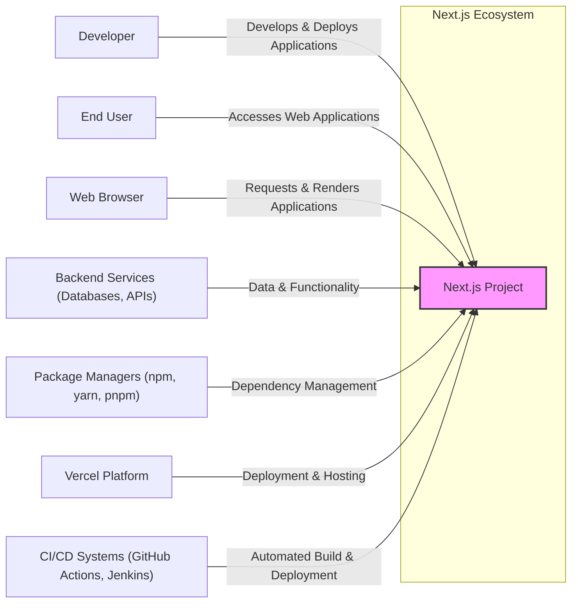
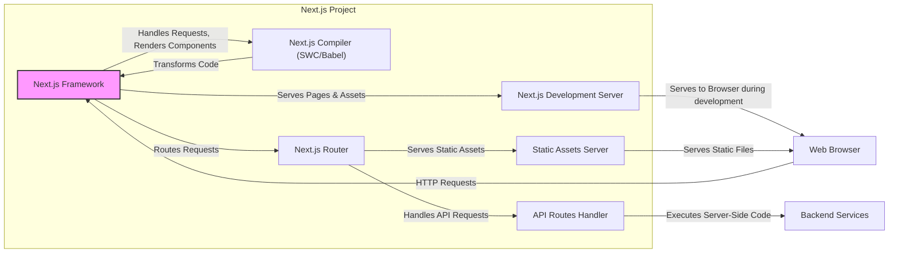
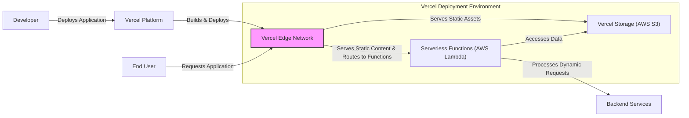
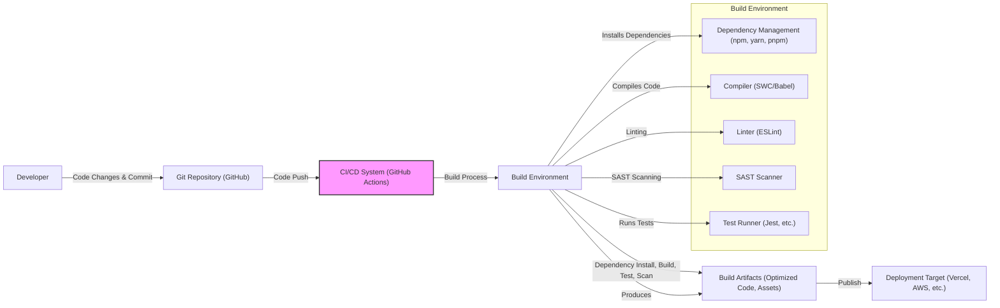

# BUSINESS POSTURE

- Business priorities and goals:
  - Next.js aims to provide a React framework for building user interfaces with excellent developer experience and optimized end-user performance.
  - It prioritizes features like server-side rendering, static site generation, routing, and API routes to enable developers to build full-stack web applications efficiently.
  - A key goal is to simplify web development and improve website performance, leading to better user engagement and business outcomes for companies using Next.js.
  - Another goal is to foster a large and active community around the framework, ensuring its continuous improvement and adoption.
- Most important business risks:
  - Risk of security vulnerabilities in the framework itself, which could impact all applications built with Next.js.
  - Risk of performance issues or instability in the framework, leading to poor user experience for applications built with Next.js.
  - Risk of developer dissatisfaction due to complexity, lack of features, or poor documentation, potentially leading to decreased adoption.
  - Risk of losing community support and contributions, hindering the framework's long-term development and relevance.

# SECURITY POSTURE

- Existing security controls:
  - security control: Regular dependency updates to address known vulnerabilities in third-party libraries. Implemented through automated dependency scanning and update processes (not explicitly documented in the repo, but standard practice for open-source projects).
  - security control: Community security audits and vulnerability reports. Implemented through open communication channels and bug bounty programs (if any, not explicitly documented in the repo).
  - security control: Secure coding practices within the Next.js development team. Implemented through code reviews and developer training (not explicitly documented, assumed best practice).
  - security control: Input validation and sanitization within the framework's core components to prevent common web vulnerabilities like XSS and injection attacks. Implemented within the framework's source code.
  - security control: Protection against common web attacks like CSRF and clickjacking are likely considered and implemented within the framework (not explicitly documented, assumed best practice for web frameworks).
- Accepted risks:
  - accepted risk: Potential for zero-day vulnerabilities to be discovered in the framework. Mitigation is through rapid response and patching when vulnerabilities are reported.
  - accepted risk: Risk of vulnerabilities in user-developed applications built with Next.js due to improper usage of the framework or insecure coding practices. This is the responsibility of the application developers, not the Next.js team.
  - accepted risk: Reliance on the security of underlying platforms and infrastructure where Next.js applications are deployed (e.g., Node.js, hosting providers).
- Recommended security controls:
  - security control: Implement a formal security vulnerability disclosure and response process.
  - security control: Conduct regular automated security scans (SAST, DAST) of the Next.js codebase.
  - security control: Consider a formal security audit by a third-party security firm.
  - security control: Enhance documentation with security best practices for developers using Next.js.
  - security control: Implement a Content Security Policy (CSP) framework within Next.js to help developers easily configure CSP for their applications.
- Security requirements:
  - Authentication: Next.js itself does not handle authentication, but provides mechanisms (API routes, middleware) for developers to implement authentication in their applications. Security requirement is to provide clear guidance and best practices for implementing secure authentication.
  - Authorization: Similar to authentication, authorization is the responsibility of the application developer. Next.js should provide tools and guidance for implementing fine-grained authorization within applications. Security requirement is to offer flexible and secure authorization patterns.
  - Input validation: Next.js framework should enforce input validation at framework level to prevent common injection attacks. Security requirement is to ensure robust input validation for all framework-handled inputs. Applications built with Next.js also need to implement their own input validation.
  - Cryptography: Next.js might use cryptography internally for certain features (e.g., secure cookies). Security requirement is to use secure cryptographic libraries and practices. For application-level cryptography, Next.js should provide guidance and best practices.

# DESIGN

## C4 CONTEXT

- Elements of Context Diagram:
  - - Name: Next.js Project
    - Type: Software System
    - Description: The Next.js framework itself, providing tools and features for building React-based web applications.
    - Responsibilities: Provides React framework, routing, server-side rendering, static site generation, build tools, and development server.
    - Security controls: Input validation within framework, secure coding practices, dependency management, vulnerability scanning.
  - - Name: Developer
    - Type: Person
    - Description: Software developers who use Next.js to build web applications.
    - Responsibilities: Develops, tests, and deploys web applications using Next.js. Configures and customizes Next.js for specific application needs.
    - Security controls: Secure coding practices, input validation in application code, authentication and authorization implementation in applications, dependency management for application dependencies.
  - - Name: End User
    - Type: Person
    - Description: Users who access web applications built with Next.js through web browsers.
    - Responsibilities: Accesses and interacts with web applications.
    - Security controls: Browser security features, user awareness of phishing and other web-based attacks.
  - - Name: Web Browser
    - Type: Software System
    - Description: Software used by end-users to access and interact with web applications.
    - Responsibilities: Sends requests to web servers, renders HTML, CSS, and JavaScript, executes client-side JavaScript code.
    - Security controls: Browser security features (e.g., Content Security Policy enforcement, XSS protection, same-origin policy), HTTPS support.
  - - Name: Backend Services (Databases, APIs)
    - Type: Software System
    - Description: External systems that provide data and functionality to Next.js applications. These can include databases, REST APIs, GraphQL APIs, and other services.
    - Responsibilities: Stores and retrieves data, provides business logic and functionality accessed by Next.js applications.
    - Security controls: Authentication and authorization for API access, input validation, secure data storage, network security controls.
  - - Name: Package Managers (npm, yarn, pnpm)
    - Type: Software System
    - Description: Tools used by developers to manage project dependencies, including Next.js and its ecosystem libraries.
    - Responsibilities: Downloads and installs dependencies, manages package versions, runs scripts defined in package.json.
    - Security controls: Integrity checks of downloaded packages (e.g., using lock files and checksums), vulnerability scanning of dependencies.
  - - Name: Vercel Platform
    - Type: Cloud Platform
    - Description: A cloud platform optimized for deploying and hosting Next.js applications.
    - Responsibilities: Provides hosting infrastructure, serverless functions, edge network, CI/CD integration, and other services for Next.js applications.
    - Security controls: Platform security controls (network security, access control, vulnerability management), DDoS protection, SSL/TLS encryption, security monitoring.
  - - Name: CI/CD Systems (GitHub Actions, Jenkins)
    - Type: Software System
    - Description: Systems used to automate the build, test, and deployment process of Next.js applications.
    - Responsibilities: Automates building, testing, and deploying Next.js applications.
    - Security controls: Access control to CI/CD pipelines, secure storage of credentials, security scanning in CI/CD pipelines.

## C4 CONTAINER

- Elements of Container Diagram:
  - - Name: Next.js Framework
    - Type: Software Library/Framework
    - Description: The core React framework and Next.js specific extensions that provide the structure and functionality for building applications.
    - Responsibilities: Component rendering, server-side rendering, static site generation, request handling, routing, middleware execution, and integration with other Next.js containers.
    - Security controls: Input validation, secure coding practices, framework-level security features (e.g., protection against common web vulnerabilities).
  - - Name: Next.js Compiler (SWC/Babel)
    - Type: Software Tool
    - Description: Compiles and transforms JavaScript/TypeScript code, JSX, and other Next.js specific syntax into browser-compatible JavaScript.
    - Responsibilities: Code compilation, optimization, and transformation.
    - Security controls: Dependency vulnerability scanning of compiler dependencies, secure configuration of compiler settings.
  - - Name: Next.js Development Server
    - Type: Software Application
    - Description: A local server that provides a development environment for building and testing Next.js applications. Includes features like hot reloading and error reporting.
    - Responsibilities: Serves application during development, provides hot reloading, handles development-time routing and asset serving.
    - Security controls: Primarily for development, security focus is on preventing exposure of sensitive development information.
  - - Name: Next.js Router
    - Type: Software Component
    - Description: Handles routing within Next.js applications, mapping URLs to specific pages or API routes.
    - Responsibilities: URL parsing, route matching, request dispatching to page components or API route handlers.
    - Security controls: Protection against route injection vulnerabilities, proper handling of URL parameters and path segments.
  - - Name: API Routes Handler
    - Type: Software Component
    - Description: Handles requests to API routes defined within the Next.js application. Allows developers to build backend functionality directly within Next.js.
    - Responsibilities: Executes server-side code for API routes, handles request and response processing for API endpoints.
    - Security controls: Input validation, authorization checks, secure handling of API requests and responses, protection against API-specific vulnerabilities (e.g., injection, broken authentication).
  - - Name: Static Assets Server
    - Type: Software Component
    - Description: Serves static assets like images, CSS files, and JavaScript files.
    - Responsibilities: Efficiently serves static files to the browser.
    - Security controls: Proper configuration to prevent directory listing, secure handling of static file requests.

## DEPLOYMENT

Deployment Solution: Vercel Platform

- Elements of Deployment Diagram (Vercel):
  - - Name: Vercel Edge Network
    - Type: CDN (Content Delivery Network)
    - Description: Vercel's global edge network that caches static assets and routes requests to serverless functions.
    - Responsibilities: Caching static content, serving static assets, routing requests based on URL, providing DDoS protection, SSL/TLS termination.
    - Security controls: DDoS protection, SSL/TLS encryption, CDN security features, access control to CDN configuration.
  - - Name: Serverless Functions (AWS Lambda)
    - Type: Serverless Compute
    - Description: Serverless functions (likely based on AWS Lambda or similar) that execute server-side code for dynamic routes and API routes in Next.js applications.
    - Responsibilities: Executes server-side code on demand, handles dynamic requests, interacts with backend services and storage.
    - Security controls: Function-level isolation, runtime security controls of serverless platform, secure configuration of function permissions, input validation within function code.
  - - Name: Vercel Storage (AWS S3)
    - Type: Object Storage
    - Description: Object storage (likely based on AWS S3 or similar) used by Vercel to store static assets and potentially other application data.
    - Responsibilities: Stores static assets, provides scalable and durable storage.
    - Security controls: Access control to storage buckets, data encryption at rest and in transit, bucket policies, versioning.
  - - Name: Vercel Platform
    - Type: Cloud Platform
    - Description: The overall Vercel platform that orchestrates deployment, hosting, and management of Next.js applications.
    - Responsibilities: Build process, deployment automation, infrastructure management, monitoring, and platform-level security.
    - Security controls: Platform security controls (network security, access control, vulnerability management), security monitoring, compliance certifications.

## BUILD

- Elements of Build Diagram:
  - - Name: Developer
    - Type: Person
    - Description: Software developer writing and committing code changes.
    - Responsibilities: Writing code, running local builds and tests, committing code to Git repository.
    - Security controls: Secure development environment, code review practices, developer training on secure coding.
  - - Name: Git Repository (GitHub)
    - Type: Version Control System
    - Description: Git repository hosted on GitHub, used for source code management and collaboration.
    - Responsibilities: Storing source code, tracking changes, managing branches and versions, access control to codebase.
    - Security controls: Access control (authentication and authorization), branch protection rules, audit logging, vulnerability scanning of repository settings.
  - - Name: CI/CD System (GitHub Actions)
    - Type: CI/CD Platform
    - Description: Automated CI/CD system (e.g., GitHub Actions) that builds, tests, and deploys the application.
    - Responsibilities: Automating build, test, and deployment pipelines, running security scans, managing build environment.
    - Security controls: Access control to CI/CD pipelines, secure storage of secrets and credentials, pipeline security configuration, audit logging.
  - - Name: Build Environment
    - Type: Software Environment
    - Description: The environment where the build process takes place, including tools and dependencies required for building the application.
    - Responsibilities: Providing necessary tools and dependencies for build process, executing build steps, running security scans and tests.
    - Security controls: Secure build environment configuration, dependency vulnerability scanning, SAST scanning, secure handling of build artifacts.
    - - Name: Dependency Management (npm, yarn, pnpm)
      - Type: Software Tool
      - Description: Tools used to manage project dependencies during the build process.
      - Responsibilities: Installing and managing project dependencies.
      - Security controls: Integrity checks of downloaded packages, vulnerability scanning of dependencies.
    - - Name: Compiler (SWC/Babel)
      - Type: Software Tool
      - Description: Compiles and transforms code during the build process.
      - Responsibilities: Code compilation and optimization.
      - Security controls: Secure configuration, dependency vulnerability scanning.
    - - Name: Linter (ESLint)
      - Type: Software Tool
      - Description: Code linter used to enforce code quality and style guidelines, and potentially identify security-related code patterns.
      - Responsibilities: Code linting and static analysis.
      - Security controls: Configuration of security-focused linting rules.
    - - Name: SAST Scanner
      - Type: Software Tool
      - Description: Static Application Security Testing (SAST) scanner used to identify potential security vulnerabilities in the source code.
      - Responsibilities: Static code analysis for security vulnerabilities.
      - Security controls: Accurate vulnerability detection, configuration for relevant security rules.
    - - Name: Test Runner (Jest, etc.)
      - Type: Software Tool
      - Description: Tool used to execute automated tests during the build process.
      - Responsibilities: Running unit tests, integration tests, and other automated tests.
      - Security controls: Secure test environment, security-focused test cases.
  - - Name: Build Artifacts (Optimized Code, Assets)
    - Type: Software Artifacts
    - Description: The output of the build process, including optimized code, static assets, and other deployable files.
    - Responsibilities: Representing the deployable application.
    - Security controls: Integrity protection of build artifacts, secure storage of build artifacts before deployment.
  - - Name: Deployment Target (Vercel, AWS, etc.)
    - Type: Deployment Environment
    - Description: The environment where the built application is deployed and run.
    - Responsibilities: Hosting and running the application.
    - Security controls: Deployment environment security controls (as described in Deployment section).

# RISK ASSESSMENT

- Critical business processes:
  - For Next.js as a framework, the critical business process is the development, maintenance, and distribution of the framework itself. Any compromise to this process can impact all users of Next.js.
  - For applications built with Next.js, critical business processes depend on the specific application. Examples include e-commerce transactions, user data management, content delivery, etc.
- Data sensitivity:
  - Next.js framework itself does not directly handle sensitive data. However, applications built with Next.js can handle various types of data, including:
    - User data (personal information, credentials, etc.)
    - Application data (business-specific data)
    - Configuration data (API keys, database credentials, etc.)
  - Sensitivity of data depends on the application and its purpose. User data and credentials are generally considered highly sensitive. Configuration data also needs strong protection.

# QUESTIONS & ASSUMPTIONS

- BUSINESS POSTURE:
  - Question: What are the primary revenue streams for Vercel (the company behind Next.js)? Understanding this can provide more context to business priorities.
  - Assumption: The primary business goal is to increase the adoption and usage of Next.js, which indirectly benefits Vercel through platform adoption and related services.
- SECURITY POSTURE:
  - Question: Does Next.js have a formal security vulnerability disclosure policy and bug bounty program?
  - Assumption: Next.js follows common open-source security practices, including community security reporting and reactive patching, but might not have a formal documented policy or bug bounty program.
  - Question: Are there regular security audits conducted on the Next.js codebase?
  - Assumption: Security audits are likely performed periodically, but the frequency and scope are not publicly documented.
- DESIGN:
  - Question: What specific technologies are used for serverless functions and storage in Vercel's deployment environment?
  - Assumption: Vercel's serverless functions are based on AWS Lambda or a similar technology, and storage is based on AWS S3 or a similar object storage service.
  - Question: What SAST and dependency scanning tools are used in the Next.js build process (internally by Vercel or recommended for users)?
  - Assumption: Standard open-source or commercial SAST and dependency scanning tools are likely used or recommended, but specific tools are not explicitly defined in the public repository.