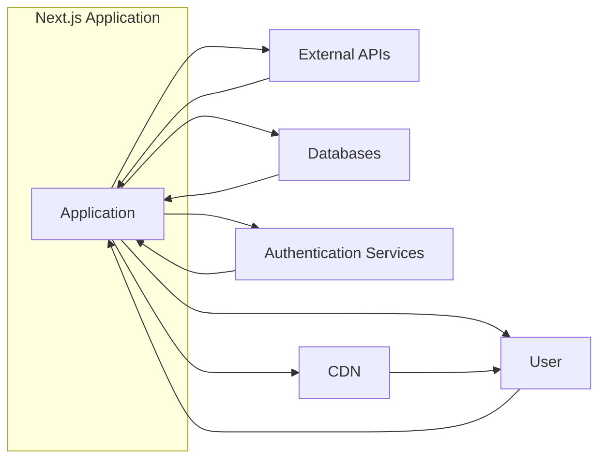
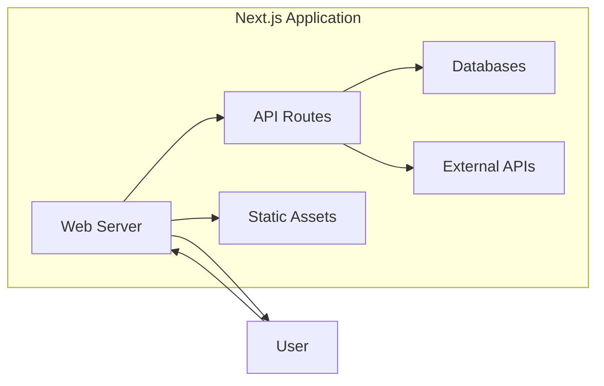
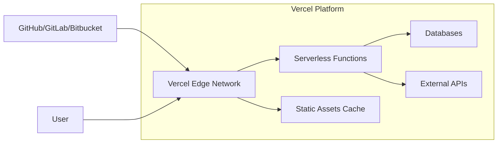

Okay, let's create a design document for the Next.js project, focusing on aspects relevant to threat modeling.

# BUSINESS POSTURE

Next.js is a React framework that enables functionality such as server-side rendering and static site generation for web applications.  It's widely used by developers ranging from individual hobbyists to large enterprises.  The business priorities and goals can be summarized as:

*   Developer Productivity: Enable rapid development of performant web applications.
*   Performance: Provide fast load times and a smooth user experience.
*   Scalability: Support applications that can handle a large number of users and requests.
*   SEO Friendliness: Facilitate good search engine optimization through server-side rendering.
*   Extensibility: Allow developers to customize and extend the framework with plugins and custom configurations.
*   Community & Ecosystem: Maintain a vibrant community and a rich ecosystem of tools and libraries.
*   Maintainability: Ensure the framework is easy to maintain and update.

Based on these, the most important business risks are:

*   Vulnerabilities in Next.js or its dependencies that could lead to website defacement, data breaches, or denial of service.
*   Performance degradation that negatively impacts user experience and SEO.
*   Scalability issues that prevent applications from handling peak loads.
*   Complexity that hinders developer productivity or makes the framework difficult to learn and use.
*   Lack of features or extensibility that limits the types of applications that can be built.
*   A decline in community support or ecosystem growth that makes the framework less attractive to developers.
*   Security misconfigurations by developers using Next.js, leading to vulnerabilities in their applications.

# SECURITY POSTURE

Next.js, as a framework, incorporates several security features and encourages secure development practices. However, the ultimate security of a Next.js application depends heavily on how it's implemented by the developers using it.

Existing Security Controls:

*   security control: XSS Protection: Built-in escaping mechanisms in React and Next.js help prevent Cross-Site Scripting (XSS) attacks. (Implemented in React and Next.js core libraries).
*   security control: CSRF Protection: Next.js API routes can be protected with CSRF tokens, although this requires explicit implementation by the developer. (Described in Next.js documentation and requires developer implementation).
*   security control: HTTP Security Headers: Next.js allows developers to configure security headers like `Content-Security-Policy`, `Strict-Transport-Security`, and `X-Frame-Options`. (Described in Next.js documentation and requires developer implementation).
*   security control: Regular Dependency Updates: The Next.js team regularly updates dependencies to address security vulnerabilities. (Managed by the Next.js maintainers).
*   security control: Code Scanning: Vercel (the company behind Next.js) likely uses code scanning tools to identify vulnerabilities in the framework itself. (Internal process of Vercel).
*   security control: Input Validation: Next.js encourages the use of libraries like Zod or Yup for input validation, although this is not enforced. (Described in Next.js documentation and requires developer implementation).
*   security control: API Route Protection: Next.js API routes provide a way to build serverless functions, which can be secured using authentication and authorization mechanisms. (Described in Next.js documentation and requires developer implementation).

Accepted Risks:

*   accepted risk: Developer Misconfiguration: Next.js provides the tools for secure development, but it's possible for developers to introduce vulnerabilities through misconfiguration or insecure coding practices.
*   accepted risk: Third-Party Dependency Vulnerabilities: While Next.js updates its dependencies, there's always a risk of zero-day vulnerabilities in third-party libraries.
*   accepted risk: Client-Side Attacks: While server-side rendering mitigates some risks, client-side attacks like DOM XSS are still possible if developers are not careful.

Recommended Security Controls:

*   Implement a robust Content Security Policy (CSP) to mitigate XSS and other code injection attacks.
*   Use a Web Application Firewall (WAF) to protect against common web attacks.
*   Implement rate limiting and other measures to protect against denial-of-service attacks.
*   Regularly conduct security audits and penetration testing of applications built with Next.js.
*   Implement robust logging and monitoring to detect and respond to security incidents.

Security Requirements:

*   Authentication:
    *   Next.js applications should use secure authentication mechanisms, such as OAuth 2.0 or OpenID Connect.
    *   Implement robust password policies and multi-factor authentication where appropriate.
    *   Protect against session hijacking and fixation attacks.
*   Authorization:
    *   Implement appropriate authorization controls to ensure that users can only access the resources they are permitted to access.
    *   Use role-based access control (RBAC) or attribute-based access control (ABAC) as needed.
*   Input Validation:
    *   All user input should be validated on the server-side, using a whitelist approach whenever possible.
    *   Sanitize input to prevent code injection attacks.
    *   Validate data types, lengths, and formats.
*   Cryptography:
    *   Use strong, industry-standard cryptographic algorithms for storing and transmitting sensitive data.
    *   Use HTTPS for all communication.
    *   Securely manage cryptographic keys.
    *   Do not store sensitive data unnecessarily.

# DESIGN

## C4 CONTEXT



Element Descriptions:

*   Element:
    *   Name: User
    *   Type: Person
    *   Description: A person interacting with the Next.js application through a web browser or other client.
    *   Responsibilities: Accessing the application, providing input, viewing output.
    *   Security controls: Browser security features, network security.
*   Element:
    *   Name: Application
    *   Type: Software System
    *   Description: The Next.js web application.
    *   Responsibilities: Handling user requests, processing data, interacting with external systems.
    *   Security controls: XSS protection, CSRF protection (if implemented), HTTP security headers (if implemented), input validation (if implemented), API route protection (if implemented).
*   Element:
    *   Name: External APIs
    *   Type: Software System
    *   Description: Third-party APIs that the Next.js application interacts with.
    *   Responsibilities: Providing data or services to the application.
    *   Security controls: API keys, OAuth 2.0, TLS encryption.
*   Element:
    *   Name: Databases
    *   Type: Software System
    *   Description: Databases used by the Next.js application to store data.
    *   Responsibilities: Storing and retrieving data.
    *   Security controls: Access controls, encryption at rest, encryption in transit.
*   Element:
    *   Name: Authentication Services
    *   Type: Software System
    *   Description: Services used for user authentication, such as Auth0, Firebase Authentication, or a custom authentication service.
    *   Responsibilities: Authenticating users, managing user sessions.
    *   Security controls: OAuth 2.0, OpenID Connect, multi-factor authentication.
*   Element:
    *   Name: CDN
    *   Type: Software System
    *   Description: Content Delivery Network used to cache static assets and improve performance.
    *   Responsibilities: Caching and delivering static assets.
    *   Security controls: HTTPS, access controls.

## C4 CONTAINER



Element Descriptions:

*   Element:
    *   Name: Web Server
    *   Type: Container (Node.js)
    *   Description: The Next.js development server or a production server (e.g., Vercel, Netlify, or a custom Node.js server).
    *   Responsibilities: Serving HTML, CSS, and JavaScript to the client, handling server-side rendering, routing requests.
    *   Security controls: XSS protection, HTTP security headers (if configured), server-side rendering security considerations.
*   Element:
    *   Name: API Routes
    *   Type: Container (Node.js)
    *   Description: Serverless functions that handle API requests.
    *   Responsibilities: Processing API requests, interacting with databases and external APIs.
    *   Security controls: CSRF protection (if implemented), input validation, authentication and authorization (if implemented).
*   Element:
    *   Name: Static Assets
    *   Type: Container (Files)
    *   Description: Static files like images, fonts, and compiled JavaScript.
    *   Responsibilities: Providing static content to the client.
    *   Security controls: Content Security Policy, Subresource Integrity (if implemented).
*   Element:
    *   Name: Databases
    *   Type: Container (Database)
    *   Description: Databases used by the Next.js application.
    *   Responsibilities: Storing and retrieving data.
    *   Security controls: Access controls, encryption at rest, encryption in transit.
*   Element:
    *   Name: External APIs
    *   Type: Container (External Service)
    *   Description: Third-party APIs used by the Next.js application.
    *   Responsibilities: Providing data or services.
    *   Security controls: API keys, OAuth 2.0, TLS encryption.
*   Element:
    *   Name: User
    *   Type: Person
    *   Description: A person interacting with the Next.js application.
    *   Responsibilities: Accessing the application, providing input, viewing output.
    *   Security controls: Browser security features, network security.

## DEPLOYMENT

Next.js applications can be deployed in various ways:

1.  **Vercel:** Vercel is the platform created by the creators of Next.js and is optimized for Next.js deployments. It offers features like automatic deployments from Git, serverless functions, and a global CDN.
2.  **Netlify:** Similar to Vercel, Netlify provides a platform for deploying Next.js applications with features like continuous deployment, serverless functions, and a CDN.
3.  **AWS Amplify:** AWS Amplify is a set of tools and services from Amazon Web Services that can be used to deploy Next.js applications.
4.  **Self-Hosting (Node.js Server):** Next.js applications can be deployed to a traditional Node.js server, using tools like PM2 or Docker.
5.  **Static Export:** Next.js can export a static HTML version of the application, which can be hosted on any static hosting provider.

We'll describe the Vercel deployment in detail:



Element Descriptions:

*   Element:
    *   Name: Vercel Edge Network
    *   Type: Infrastructure (CDN)
    *   Description: Vercel's global CDN, which caches static assets and routes requests to serverless functions.
    *   Responsibilities: Caching content, routing requests, providing DDoS protection.
    *   Security controls: HTTPS, DDoS protection, WAF (if enabled).
*   Element:
    *   Name: Serverless Functions
    *   Type: Infrastructure (Serverless Functions)
    *   Description: Serverless functions that execute API routes and server-side rendering logic.
    *   Responsibilities: Handling API requests, server-side rendering.
    *   Security controls: IAM roles, environment variables, function-level security configurations.
*   Element:
    *   Name: Static Assets Cache
    *   Type: Infrastructure (Cache)
    *   Description: Cache for static assets within the Vercel Edge Network.
    *   Responsibilities: Storing and serving static assets.
    *   Security controls: Access controls, cache invalidation policies.
*   Element:
    *   Name: Databases
    *   Type: External System (Database)
    *   Description: Databases used by the Next.js application.
    *   Responsibilities: Storing and retrieving data.
    *   Security controls: Access controls, encryption at rest, encryption in transit.
*   Element:
    *   Name: External APIs
    *   Type: External System (API)
    *   Description: Third-party APIs used by the Next.js application.
    *   Responsibilities: Providing data or services.
    *   Security controls: API keys, OAuth 2.0, TLS encryption.
*   Element:
    *   Name: GitHub/GitLab/Bitbucket
    *   Type: External System (Git Repository)
    *   Description: The Git repository where the Next.js application code is stored.
    *   Responsibilities: Version control, code storage.
    *   Security controls: Access controls, branch protection rules, code signing.
*   Element:
    *   Name: User
    *   Type: Person
    *   Description: A person interacting with the Next.js application.
    *   Responsibilities: Accessing the application, providing input, viewing output.
    *   Security controls: Browser security features, network security.

## BUILD

The build process for a Next.js application typically involves the following steps:

1.  **Development:** Developers write code and commit changes to a Git repository.
2.  **Continuous Integration (CI):** A CI system (e.g., GitHub Actions, Jenkins, CircleCI) is triggered by commits to the repository.
3.  **Dependency Installation:** The CI system installs project dependencies (e.g., using `npm install` or `yarn install`).
4.  **Linting and Testing:** The CI system runs linters (e.g., ESLint) and tests (e.g., Jest, Cypress) to ensure code quality and identify potential issues.
5.  **Building:** The CI system runs the Next.js build process (e.g., `next build`). This compiles the application, optimizes assets, and generates static files and serverless functions.
6.  **Static Analysis (SAST):** Optionally, a SAST tool (e.g., SonarQube, Snyk) can be integrated into the CI pipeline to scan the code for security vulnerabilities.
7.  **Deployment:** If the build is successful, the CI system deploys the application to the target environment (e.g., Vercel, Netlify, AWS).
8. **Artifact publishing**: Build artifacts are published to target environment.

```mermaid
graph LR
    A[Developer] --> B[Git Repository]
    B --> C[CI System]
    C --> D[Dependency Installation]
    C --> E[Linting & Testing]
    C --> F[Building (next build)]
    C --> G[SAST (Optional)]
    C --> H[Deployment]
    F --> I[Build Artifacts]
    H --> I

```

Security Controls in the Build Process:

*   **Dependency Management:** Regularly update dependencies to address known vulnerabilities. Use tools like `npm audit` or `yarn audit` to identify vulnerable packages.
*   **Linting:** Use linters to enforce coding standards and identify potential security issues.
*   **Testing:** Write unit, integration, and end-to-end tests to ensure the application functions correctly and securely.
*   **SAST:** Integrate static analysis tools to scan the code for vulnerabilities.
*   **Secret Management:** Do not store secrets (e.g., API keys, database credentials) in the code repository. Use environment variables or a dedicated secret management system.
*   **CI/CD Security:** Secure the CI/CD pipeline itself, using access controls, audit logs, and other security measures.

# RISK ASSESSMENT

*   Critical Business Processes:
    *   User authentication and authorization.
    *   Data processing and storage.
    *   API interactions with external services.
    *   Serving web content to users.
    *   Maintaining application availability and performance.

*   Data Sensitivity:
    *   Personally Identifiable Information (PII): High sensitivity. Requires strong protection and compliance with privacy regulations (e.g., GDPR, CCPA).
    *   Financial Data: High sensitivity. Requires strong protection and compliance with financial regulations (e.g., PCI DSS).
    *   Session Data: Medium sensitivity. Requires protection against session hijacking and fixation.
    *   Application Data: Varies depending on the specific application. Could range from low to high sensitivity.
    *   Logs and Monitoring Data: Medium sensitivity. Should be protected to prevent unauthorized access and tampering.

# QUESTIONS & ASSUMPTIONS

*   Questions:
    *   What specific types of PII or other sensitive data will be handled by applications built with Next.js?
    *   What are the specific compliance requirements (e.g., GDPR, CCPA, PCI DSS) for applications built with Next.js?
    *   What are the expected traffic patterns and scalability requirements for applications built with Next.js?
    *   What are the specific third-party APIs that will be used by applications built with Next.js?
    *   What is the threat model for the specific deployment environment (e.g., Vercel, AWS)?

*   Assumptions:
    *   Developers using Next.js will follow secure coding practices.
    *   The Next.js framework itself is regularly updated to address security vulnerabilities.
    *   The deployment environment (e.g., Vercel, AWS) provides a baseline level of security.
    *   Third-party APIs used by Next.js applications are reasonably secure.
    *   The primary threat actors are external attackers attempting to exploit vulnerabilities in the application or its dependencies.
    *   The business is willing to invest in security measures to protect its applications and data.
    *   Developers are aware of OWASP Top 10 and other common web vulnerabilities.