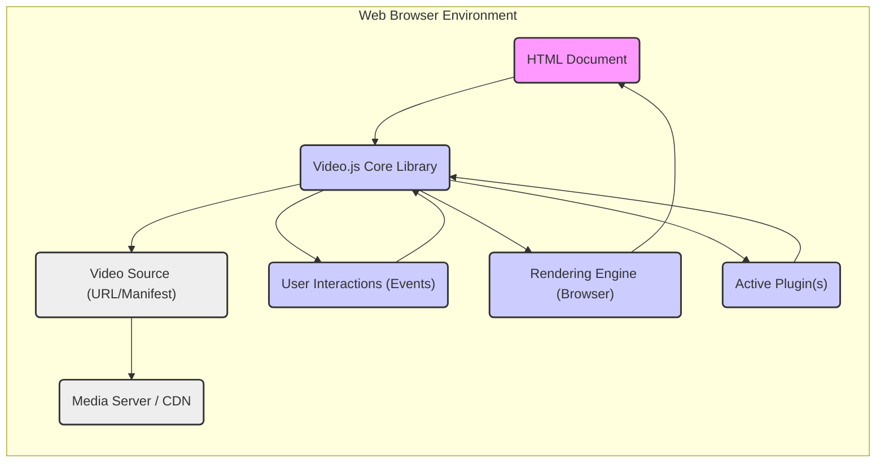
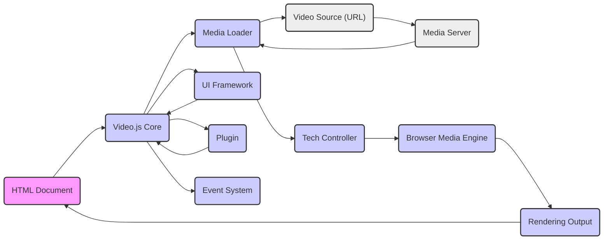

# Project Design Document: Video.js

**Version:** 1.1
**Date:** October 26, 2023
**Author:** AI Software Architect

## 1. Introduction

This document provides an enhanced design overview of the Video.js project, a widely adopted open-source HTML5 video player library. This iteration builds upon the previous version, offering more granular detail regarding the architectural components, data flows, and interactions within the system. This document is intended to serve as a robust foundation for subsequent threat modeling activities.

## 2. Goals and Objectives

The core objectives of Video.js are to:

*   Deliver a consistent and highly customizable video playback experience across a broad spectrum of web browsers and devices.
*   Provide comprehensive support for a variety of video formats (e.g., MP4, WebM) and streaming protocols (e.g., HLS, DASH, progressive download).
*   Offer a rich and extensible feature set, encompassing playback controls, closed captions, subtitles, audio tracks, and robust accessibility support.
*   Facilitate seamless embedding within diverse web environments and offer a flexible plugin architecture for extending core functionalities.
*   Maintain a lightweight, performant, and well-documented codebase, promoting ease of use and maintainability.

## 3. Scope

This design document encompasses the fundamental functionality of the Video.js library, specifically focusing on:

*   The process of loading and parsing various video source formats and streaming manifests.
*   Management of all standard playback controls, including play, pause, seek, volume adjustment, fullscreen toggle, and playback rate control.
*   The rendering pipeline for displaying video content within the browser's rendering engine.
*   Handling of different video and audio codecs and their interaction with the browser's media capabilities.
*   Support for adaptive bitrate streaming protocols, including segment loading and quality switching.
*   Implementation of accessibility features adhering to WCAG guidelines, such as keyboard navigation and screen reader compatibility.
*   The architecture and mechanisms supporting the plugin ecosystem for extending the player's capabilities.

This document explicitly excludes:

*   The design and implementation details of specific plugins or external integrations built utilizing the Video.js API.
*   The intricacies of the development, build, and testing processes employed in the creation of the library itself.
*   The infrastructure and processes involved in hosting or distributing the Video.js library files.

## 4. High-Level Architecture

**Description:**

*   The **HTML Document** serves as the container where the Video.js library is embedded and initialized.
*   The **Video.js Core Library** is the central component, orchestrating all aspects of video playback management.
*   The **Video Source (URL/Manifest)** specifies the location of the video file or the manifest for streaming content.
*   The **Media Server / CDN** hosts and delivers the video content or streaming segments.
*   **User Interactions (Events)** represent user actions such as clicks, keyboard presses, and touch events that control playback.
*   The **Rendering Engine (Browser)** is responsible for displaying the decoded video frames and UI elements.
*   **Active Plugin(s)** are optional extensions that augment the core functionality of Video.js.

## 5. Detailed Component Design

The Video.js library is structured into several interconnected modules, each with specific responsibilities:

*   **Player Core:**
    *   Manages the overarching lifecycle of a video player instance, from initialization to disposal.
    *   Handles the initial setup and configuration of the player based on provided options.
    *   Exposes the primary API for developers to interact with and control the player.
*   **Media Loader:**
    *   Responsible for fetching and loading the video source, including both direct video files and streaming manifests.
    *   Supports various network protocols, including HTTP and HTTPS, and manages request headers.
    *   Implements Cross-Origin Resource Sharing (CORS) handling for secure resource loading.
*   **Tech Controller:**
    *   Provides an abstraction layer over the underlying video playback technology utilized by the browser (primarily the HTML5 `<video>` element).
    *   Presents a consistent interface to the Player Core, shielding it from browser-specific implementation details.
    *   Manages communication with the browser's media engine for playback control and event handling.
*   **User Interface (UI) Framework:**
    *   Renders the interactive player controls, such as the play/pause button, progress bar, volume slider, and fullscreen toggle.
    *   Manages user input events and translates them into player actions.
    *   Offers extensive customization options for styling and layout of UI elements.
*   **Plugin System:**
    *   Provides a robust mechanism for extending the core functionality of Video.js through modular plugins.
    *   Defines clear interfaces and hooks for plugins to interact with the player's lifecycle and data.
    *   Supports registration and management of multiple plugins.
*   **Event System:**
    *   A central event bus for communication between different components within the player.
    *   Allows components and plugins to subscribe to and emit custom events, enabling decoupled interactions.
    *   Handles both standard media events (e.g., `play`, `pause`, `ended`) and custom player events.
*   **Text Tracks (Captions/Subtitles) Engine:**
    *   Parses and renders text tracks in various formats, including VTT, SRT, and others.
    *   Manages the display and synchronization of captions and subtitles with the video playback.
    *   Provides options for styling and customization of text track appearance.
*   **Error Handling Module:**
    *   Detects and manages errors that occur during video loading, playback, or other operations.
    *   Provides mechanisms for reporting and displaying informative error messages to the user or developers.
    *   Allows for custom error handling logic through event listeners.
*   **Accessibility Implementation:**
    *   Integrates accessibility features throughout the player, adhering to WCAG guidelines.
    *   Utilizes ARIA attributes to provide semantic information for assistive technologies.
    *   Ensures keyboard navigation is fully supported for all interactive elements.

## 6. Data Flow

The primary data flow within Video.js centers around the process of loading, processing, and rendering video content, along with handling user interactions:

1. **Initialization and Source Assignment:** The HTML document initializes a Video.js player instance, providing the URL or manifest of the video source.
2. **Media Loading Initiation:** The `Media Loader` component begins the process of fetching the video manifest (for streaming) or the video file directly.
3. **Manifest Parsing (Streaming):** If the source is a streaming protocol (e.g., HLS, DASH), the manifest file is parsed to extract information about available media segments, codecs, and bitrates.
4. **Segment Request and Loading (Streaming):** The `Media Loader` requests individual video and audio segments from the media server based on the parsed manifest and current playback conditions.
5. **Media Data Delivery (Progressive Download):** For non-streaming sources, the video file is downloaded progressively.
6. **Media Decoding and Processing:** The browser's built-in media engine decodes the video and audio data into a renderable format.
7. **Rendering Pipeline:** The `Tech Controller` interacts with the browser's rendering engine to display the decoded video frames on the screen.
8. **User Interaction Handling:** User actions within the `UI Framework` (e.g., clicking the play button) trigger corresponding events.
9. **Event Propagation:** These events are captured and propagated through the `Event System` to the `Player Core` and other relevant components.
10. **Playback Control Logic:** The `Player Core` interprets user interactions and updates the player's internal state, instructing the `Tech Controller` to perform actions like play, pause, seek, and adjust volume.
11. **Text Track Processing and Synchronization:** If text tracks are available, the `Text Tracks Engine` loads, parses, and synchronizes them with the video playback timeline.
12. **Plugin Interaction and Data Exchange:** Plugins can intercept events, access player data through the API, and modify player behavior based on their specific functionality.

## 7. Security Considerations (For Threat Modeling)

This section outlines potential security considerations relevant to Video.js, intended to guide the subsequent threat modeling process:

*   **Cross-Site Scripting (XSS) Vulnerabilities:**
    *   Improper sanitization of user-provided data, such as video URLs, captions, or plugin configurations, could lead to XSS attacks.
    *   Vulnerabilities within plugins themselves could introduce XSS risks if they handle untrusted data.
*   **Cross-Site Request Forgery (CSRF) Potential:**
    *   While primarily a client-side library, if Video.js initiates requests to backend services based on user input, CSRF vulnerabilities could arise if proper anti-CSRF measures are not in place on the server-side.
*   **Man-in-the-Middle (MITM) Attack Surface:**
    *   Loading video sources or plugin resources over insecure HTTP connections exposes the application to MITM attacks, where attackers could intercept and modify the content.
*   **Denial of Service (DoS) Scenarios:**
    *   Maliciously crafted video sources or streaming manifests could be designed to consume excessive browser resources, leading to a denial of service for the user.
*   **Dependency Chain Vulnerabilities:**
    *   Security vulnerabilities in third-party libraries or dependencies used by Video.js could be exploited if not properly managed and updated.
*   **Plugin Security Risks:**
    *   Untrusted or poorly developed plugins can introduce various security vulnerabilities, including XSS, arbitrary code execution, or data leakage.
*   **Content Security Policy (CSP) Enforcement and Bypasses:**
    *   Improper handling of inline scripts or styles within Video.js or its plugins could potentially bypass or weaken CSP directives.
*   **Data Leakage Concerns:**
    *   Accidental exposure of sensitive information through verbose error messages, logging, or insecure data transmission.
*   **Server-Side Vulnerabilities Impacting Video.js:**
    *   Vulnerabilities on the media server hosting the video content could be exploited to serve malicious content to Video.js users.
*   **Subresource Integrity (SRI) Importance:**
    *   Lack of SRI implementation when loading Video.js or its plugins from CDNs could allow attackers to serve compromised files.

## 8. Dependencies

Video.js relies on standard browser APIs and may optionally integrate with external libraries or services through its plugin ecosystem:

*   **Core Browser APIs:**
    *   HTML5 `<video>` element and associated media APIs.
    *   JavaScript APIs (DOM manipulation, Event handling, Fetch API, Promises).
    *   Media Source Extensions (MSE) for adaptive streaming implementations.
    *   Encrypted Media Extensions (EME) for Digital Rights Management (DRM).
    *   Web Cryptography API for cryptographic operations (potentially used in DRM).
*   **Optional Integrations (Primarily via Plugins):**
    *   Advertising platforms and libraries (e.g., Google IMA SDK).
    *   Analytics services for tracking video usage and engagement.
    *   DRM providers' client-side libraries for protected content playback.
    *   Specific streaming protocol implementations or polyfills.

## 9. Deployment

Video.js is typically deployed by including the necessary JavaScript and CSS files within an HTML page. Several deployment methods are commonly used:

*   **Direct File Inclusion:** Downloading the library files and hosting them directly on the web server alongside the application.
*   **Content Delivery Network (CDN) Usage:** Linking to publicly hosted versions of Video.js on CDNs like cdnjs or jsDelivr for improved performance and caching.
*   **Package Manager Integration:** Installing Video.js as a dependency using package managers like npm or yarn and bundling it with the application's build process.

The HTML page then instantiates a Video.js player instance by selecting a target HTML element and providing configuration options, including the video source.

## 10. Future Considerations

Potential future developments and changes that could influence the architecture and security of Video.js include:

*   **Adoption of newer video codecs and container formats.**
*   **Further enhancements to accessibility features and compliance.**
*   **Refactoring of core modules for improved performance, modularity, and maintainability.**
*   **Strengthening the security model for plugins, potentially through sandboxing or more rigorous validation.**
*   **Integration with emerging browser APIs and web technologies.**
*   **Improvements to error handling and reporting mechanisms.**

This revised document provides a more detailed and comprehensive design overview of the Video.js project. It aims to offer a solid understanding of the system's architecture and potential security considerations, serving as a valuable input for the threat modeling process.