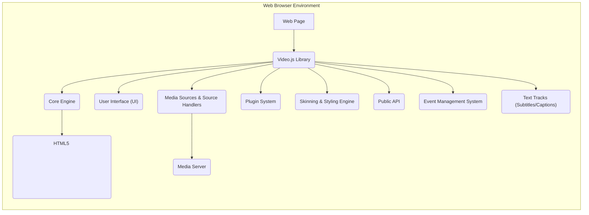
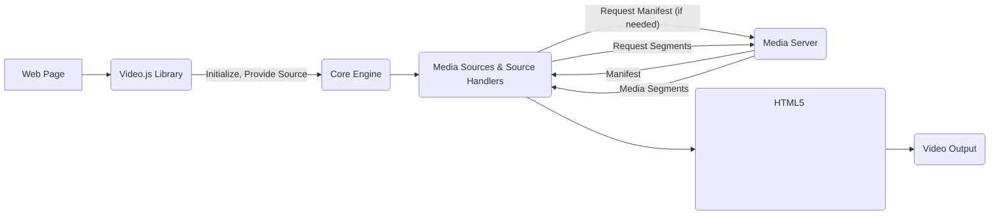
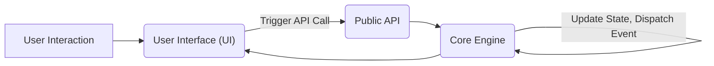

# Project Design Document: video.js

**Version:** 1.1
**Date:** October 26, 2023
**Author:** AI Software Architect

## 1. Introduction

This document provides an enhanced architectural design of the open-source JavaScript video player library, video.js (as represented by the repository at [https://github.com/videojs/video.js](https://github.com/videojs/video.js)). This revised document aims to provide a more comprehensive understanding of the system's components, their interactions, and the flow of various data types, which is crucial for detailed threat modeling activities. Improvements focus on clarifying component responsibilities and expanding on potential security considerations.

## 2. Goals and Objectives

The primary goals of this design document are to:

*   Clearly and comprehensively articulate the architecture of the video.js library, with a focus on elements relevant to security.
*   Identify key components, their specific responsibilities, and their interactions with other components.
*   Describe the different data flows within the system, including media, metadata, and user interactions.
*   Highlight potential areas of security concern with greater specificity, providing a stronger foundation for threat modeling exercises.
*   Provide a well-structured and detailed overview for security assessments and threat modeling activities.

## 3. Target Audience

This document is intended for:

*   Security engineers and architects responsible for performing detailed threat modeling of video.js integrations.
*   Software developers contributing to the video.js project, requiring a deep understanding of its architecture.
*   Developers integrating video.js into their applications, needing awareness of potential security implications.
*   Security auditors evaluating the security posture of applications using video.js.

## 4. Scope

This document covers the core architecture and functionalities of the video.js library, with a specific emphasis on aspects relevant to security. It includes:

*   A detailed breakdown of the main components of the library and their security-relevant responsibilities.
*   The interactions between these components, focusing on data exchange and potential vulnerabilities.
*   The lifecycle of video playback, from source loading to rendering, highlighting potential attack vectors.
*   The plugin architecture and its implications for security.
*   Detailed data flow diagrams illustrating the movement of various data types within the system.
*   High-level security considerations, expanded with more specific examples.

This document does *not* cover:

*   Fine-grained implementation details of individual functions or modules beyond what is necessary for architectural understanding.
*   An exhaustive list of every plugin available for video.js, although the plugin architecture itself is discussed.
*   The intricacies of specific video codecs or streaming protocols beyond their interaction with video.js components.
*   Detailed network configurations or the security of the infrastructure where video.js is deployed (e.g., web server security).

## 5. High-Level Architecture

The video.js library operates primarily within the client-side web browser environment. It enhances the HTML5 `<video>` element, providing a consistent API, extended functionality, and a customizable user interface.

*   **"Core Engine":** The central orchestrator, managing player state, interacting with the HTML5 `<video>` element, and coordinating other components. It handles API requests and event dispatching.
*   **"User Interface (UI)":**  Provides interactive controls for the video player. It translates user actions into API calls and reflects the player's state visually.
*   **"Media Sources & Source Handlers":** Responsible for loading and managing video sources. Source handlers process different streaming protocols (e.g., HLS, DASH), fetching media segments and metadata.
*   **"Plugin System":** An extensible architecture allowing developers to add custom functionalities. Plugins can interact with all parts of the library, posing potential security risks if not developed securely.
*   **"Skinning & Styling Engine":**  Manages the visual presentation of the player through CSS, offering customization options but also potential avenues for UI manipulation.
*   **"Public API":** The JavaScript interface exposed to developers for controlling the player and interacting with its features. This is a key entry point for integration and potential misuse.
*   **"Event Management System":** Facilitates communication between components and allows external code to react to player events. Improper event handling can lead to vulnerabilities.
*   **"Text Tracks (Subtitles/Captions)":** Handles the display of subtitles and captions, which can be a vector for attacks if not properly sanitized.



## 6. Component Details

*   **"Core Engine":**
    *   **Responsibilities:** Manages the player's lifecycle, state transitions (playing, paused, buffering), and error handling. Orchestrates interactions between components. Enforces core logic and security policies (to the extent implemented).
    *   **Security Relevance:** A compromised core engine could lead to complete control over the player's behavior, potentially exposing vulnerabilities in other components or the embedding application.

*   **"User Interface (UI)":**
    *   **Responsibilities:** Presents interactive controls, handles user input, and updates the UI based on player state.
    *   **Security Relevance:** Vulnerable UI components could be exploited for XSS attacks, allowing malicious scripts to be injected and executed within the user's browser.

*   **"Media Sources & Source Handlers":**
    *   **Responsibilities:**  Fetches and manages video and audio data from various sources. Source handlers interpret different streaming protocols and manage segment requests.
    *   **Security Relevance:**  Improper handling of media sources or vulnerabilities in source handlers could lead to the loading of malicious content, buffer overflows, or denial-of-service attacks. Insecure communication with the media server is also a concern.

*   **"Plugin System":**
    *   **Responsibilities:** Provides a mechanism for extending the functionality of video.js. Plugins can add new features, UI elements, or integrations.
    *   **Security Relevance:** Plugins, being third-party code, represent a significant attack surface. Vulnerabilities in plugins can compromise the entire player and potentially the embedding application. Inadequate isolation between plugins and the core library can exacerbate risks.

*   **"Skinning & Styling Engine":**
    *   **Responsibilities:** Applies CSS styles to customize the player's appearance.
    *   **Security Relevance:** While primarily for aesthetics, vulnerabilities could allow for UI manipulation, potentially misleading users or facilitating phishing attacks. Improper handling of user-provided CSS could also lead to issues.

*   **"Public API":**
    *   **Responsibilities:** Provides the primary interface for developers to interact with and control the video player.
    *   **Security Relevance:**  Improperly secured API endpoints or methods could be exploited to manipulate the player's behavior in unintended ways. Lack of input validation can lead to vulnerabilities.

*   **"Event Management System":**
    *   **Responsibilities:**  Allows components to communicate and external code to react to player events.
    *   **Security Relevance:**  Malicious actors could trigger or intercept events to gain information about the player's state or manipulate its behavior. Insecure event handling can lead to race conditions or unexpected side effects.

*   **"Text Tracks (Subtitles/Captions)":**
    *   **Responsibilities:**  Parses and displays subtitles and captions.
    *   **Security Relevance:** Subtitle files can be a vector for XSS attacks if not properly sanitized. Maliciously crafted subtitle files could execute arbitrary JavaScript within the player's context.

*   **"HTML5 `<video>` Element":**
    *   **Responsibilities:** The underlying browser API responsible for video decoding and rendering.
    *   **Security Relevance:** While primarily a browser component, vulnerabilities in the browser's video implementation can affect video.js. Video.js relies on the browser's security mechanisms for media processing.

## 7. Data Flow

The data flow within video.js can be categorized into several key types:

*   **Media Data Flow:** The streaming of video and audio content from the media server to the user's browser.
*   **Metadata Flow:** The transfer of information about the media, such as manifest files (for adaptive streaming), track information, and timed metadata.
*   **User Interaction Data Flow:**  Events generated by user actions (e.g., clicks, key presses) that control the player.
*   **Event Data Flow:** Internal communication between video.js components and external communication with event listeners.
*   **Configuration Data Flow:**  Settings and options passed to the video.js library during initialization.

**Detailed Media Data Flow:**

1. **"Web Page Request":** The web page containing the video.js player is loaded.
2. **"Video.js Initialization":** The library is initialized and associated with the `<video>` element.
3. **"Source URL Provided":** The video source URL is provided to video.js.
4. **"Source Handler Selection":**  The appropriate source handler is selected based on the URL.
5. **"Manifest Request (if applicable)":** For adaptive streaming, the source handler requests the manifest from the "Media Server".
6. **"Manifest Response":** The "Media Server" returns the manifest file.
7. **"Segment Requests":** The source handler requests individual media segments from the "Media Server".
8. **"Segment Responses":** The "Media Server" streams the media segments.
9. **"Buffering":** The browser buffers the received segments.
10. **"Decoding and Rendering":** The HTML5 `<video>` element decodes and renders the video.



**User Interaction Data Flow:**

1. **"User Action":** The user interacts with a UI control (e.g., clicks "play").
2. **"UI Event":** The UI component detects the user action.
3. **"API Call":** The UI component calls a relevant method on the "Public API".
4. **"Core Engine Processing":** The "Core Engine" processes the API call, updating the player's state.
5. **"Event Dispatch":** The "Core Engine" dispatches an event.
6. **"State Update & UI Refresh":** The UI updates to reflect the new state.



## 8. Security Considerations (Detailed)

Expanding on the initial considerations, potential security vulnerabilities include:

*   **Cross-Site Scripting (XSS):**
    *   **UI Component Vulnerabilities:** Flaws in UI rendering logic could allow injection of malicious scripts through crafted video metadata or user interactions.
    *   **Plugin Vulnerabilities:** Malicious or poorly written plugins can introduce XSS vulnerabilities.
    *   **Subtitle Injection:**  Improper sanitization of subtitle files can allow execution of arbitrary JavaScript.
*   **Dependency Vulnerabilities:** Using outdated or vulnerable third-party libraries can introduce security flaws. Regular dependency updates are crucial.
*   **Plugin Security:**
    *   **Lack of Sandboxing:** Plugins often have broad access to the video.js API and the DOM, increasing the impact of vulnerabilities.
    *   **Untrusted Sources:** Loading plugins from untrusted sources poses a significant risk.
*   **Content Security Policy (CSP) Bypasses:**  Incorrect handling of inline scripts or styles within video.js or its plugins could allow attackers to bypass CSP restrictions.
*   **Man-in-the-Middle (MITM) Attacks:**
    *   **Insecure Media Delivery:** If video content is served over HTTP, attackers can intercept and potentially modify the stream or inject malicious content.
    *   **Insecure Plugin Loading:** Loading plugins over insecure connections exposes them to tampering.
*   **Denial of Service (DoS):**
    *   **Malformed Media Sources:**  Crafted video sources could exploit parsing vulnerabilities, causing the player to crash or consume excessive resources.
    *   **Resource Exhaustion:** Malicious plugins or API calls could be used to exhaust client-side resources.
*   **Server-Side Vulnerabilities (Indirect Impact):** While video.js is client-side, vulnerabilities on the media server or CDN can lead to the delivery of malicious content.
*   **Subtitles/Captions Exploits:** Beyond XSS, vulnerabilities in subtitle parsing logic could lead to buffer overflows or other memory corruption issues.
*   **API Abuse:**  Publicly exposed API methods, if not properly secured, could be abused to manipulate the player's behavior in unintended ways.
*   **Clickjacking:**  Attackers might try to overlay malicious elements on top of the video player controls to trick users into performing unintended actions.

## 9. Technologies Used

*   **JavaScript (ES6+):** The primary programming language for the library's logic and functionality.
*   **HTML5:**  Used for structuring the video player element and its components.
*   **CSS3:**  For styling the player's appearance and managing the user interface.
*   **HTML5 Video API:** The core browser API leveraged for video playback and interaction with the underlying media engine.
*   **Various Streaming Protocols (HLS, DASH, etc.):** Handled by specific source handler implementations, potentially involving additional libraries or browser APIs (e.g., Media Source Extensions).
*   **Potentially other JavaScript Libraries:** Depending on the specific version of video.js and the plugins being used (e.g., libraries for handling specific streaming formats or UI components).

## 10. Deployment Model

Video.js is typically deployed as a client-side JavaScript library integrated into web pages. Common deployment methods include:

*   **Direct Inclusion via `<script>` tag:**  Linking the video.js JavaScript and CSS files directly in the HTML.
*   **Package Managers (npm, yarn):** Installing video.js as a project dependency for more structured development workflows.
*   **Content Delivery Networks (CDNs):** Serving video.js from a CDN for optimized loading times and caching benefits. Security of the CDN is a relevant consideration.

The library interacts with a "Media Server" or CDN responsible for hosting and delivering the video content. The security of this backend infrastructure is crucial for the overall security of the video playback experience.

## 11. Future Considerations

Ongoing development and potential future directions that could impact the architecture and security include:

*   **Support for Emerging Streaming Protocols and Codecs:**  Integration with new media formats and delivery mechanisms will require updates to source handlers and potentially the core engine.
*   **Enhanced Accessibility Features:**  Continued improvements to accessibility could introduce new components or modify existing ones.
*   **Advanced Analytics and Tracking Integrations:**  New features for collecting and reporting analytics data.
*   **DRM (Digital Rights Management) Enhancements:**  More sophisticated content protection mechanisms may require deeper integration with browser APIs and external services.
*   **Modularization of Core Components:**  Breaking down the core library into smaller, more manageable modules could improve maintainability and potentially security through better isolation.
*   **Strengthened Plugin Security Mechanisms:**  Implementing more robust sandboxing or permission models for plugins.

## Appendix A: Data Flow Diagram (Detailed)

```mermaid
graph LR
    subgraph "Web Browser"
        A["Web Page"] --> B("Video.js Library");
        B -- "Initialization" --> C("Core Engine");
        C -- "Set Source" --> D("Media Sources");
        D -- "Select Handler" --> E{Source Handler?};
        E -- "Yes" --> F("Specific Source Handler");
        E -- "No" --> G("Native Playback");
        F -- "Request Manifest" --> H("Media Server");
        H -- "Manifest" --> F;
        F -- "Request Segments" --> H;
        H -- "Media Segments" --> F;
        F -- "Pass Data" --> I("HTML5 <video> Element");
        G -- "Request Media" --> H;
        H -- "Media Data" --> I;
        I -- "Decode & Render" --> J("Video Output");
        K["User Interaction"] -- "Trigger Event" --> L("User Interface (UI)");
        L -- "Call API" --> C;
        C -- "Update State" --> C;
        C -- "Dispatch Event" --> M("Event Listeners");
    end
