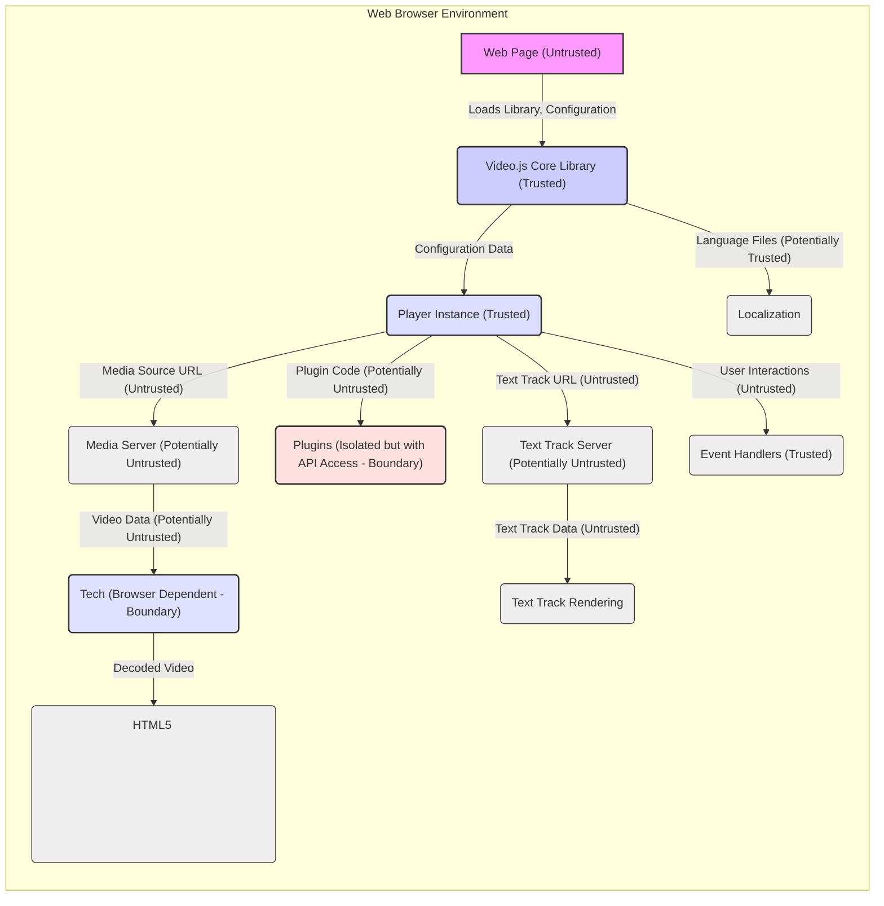

# Project Design Document: Video.js (Improved for Threat Modeling)

**Version:** 1.1
**Date:** October 26, 2023
**Author:** AI Software Architect

## 1. Introduction

This document provides an enhanced architectural design of the Video.js project, an open-source HTML5 video player library. This revised document is specifically tailored to facilitate threat modeling activities, offering a deeper understanding of the system's components, data flows, trust boundaries, and potential attack vectors. It aims to be a comprehensive resource for identifying and mitigating security risks.

## 2. Goals

*   Provide a detailed and security-focused architectural overview of the Video.js library.
*   Clearly identify key components, their interactions, and associated trust levels.
*   Elaborate on data flows, highlighting sensitive data and potential manipulation points.
*   Serve as the primary input for threat modeling sessions, enabling the identification of potential vulnerabilities.
*   Offer actionable insights for developers and security analysts to improve the security posture of Video.js integrations.

## 3. Scope

This document focuses on the client-side architecture of the Video.js library as it operates within a web browser. It encompasses the core library, plugin architecture, interaction with external resources (including video sources and text tracks), and user interactions. Server-side infrastructure hosting video content or backend integrations are considered only where they directly impact the client-side behavior and security.

## 4. Target Audience

*   Security Engineers and Analysts performing threat modeling and security assessments.
*   Software Developers contributing to or integrating Video.js into web applications.
*   Project Stakeholders interested in the security aspects of the Video.js library.

## 5. Architectural Overview

Video.js empowers developers to embed and manage video players within web pages, offering a consistent experience across diverse browsers and devices. Its core is a JavaScript engine orchestrating the HTML5 `<video>` element, user input, and plugin extensions. Understanding the interactions between these elements is crucial for identifying potential security weaknesses.

## 6. Key Components with Security Considerations

*   **Core Library (`video.js`):**
    *   The foundational JavaScript file managing player lifecycle, event dispatching, API exposure, and basic UI rendering.
    *   **Security Consideration:** Vulnerabilities here could have widespread impact. Input validation for configuration options is critical.
*   **Player Instance:**
    *   A runtime object representing a specific video player on a webpage.
    *   **Security Consideration:**  State management needs to be secure to prevent unauthorized manipulation of playback or settings.
*   **Skin/Theme (CSS, Images):**
    *   Defines the visual presentation of the player.
    *   **Security Consideration:** While primarily aesthetic, malicious CSS could potentially be used for UI redressing attacks. Ensure proper sanitization if user-provided CSS is allowed (generally not recommended).
*   **Control Bar and Control Components:**
    *   Interactive UI elements for controlling playback.
    *   **Security Consideration:** Ensure event handlers are properly secured to prevent malicious scripts from being injected or executed via user interactions.
*   **Media Sources (URL):**
    *   The location of the video content.
    *   **Security Consideration:**  URLs should be treated as untrusted input. Ensure proper handling of different protocols and potential for malicious redirects or content. HTTPS should be enforced.
*   **Tech (Technology Abstraction Layer):**
    *   Handles browser-specific video playback implementations.
    *   **Security Consideration:**  Bugs or vulnerabilities in the underlying browser's video implementation could be exposed through this layer. Stay updated with browser security advisories.
*   **Plugins:**
    *   Extend the player's functionality.
    *   **Security Consideration:** Plugins represent a significant attack surface. They have access to the player's API and can introduce vulnerabilities if not developed securely. A robust plugin security model is essential.
*   **Languages (JSON):**
    *   Translations for the UI.
    *   **Security Consideration:** While less critical, ensure proper encoding to prevent injection of malicious content into UI strings.
*   **Text Tracks (Subtitles, Captions - VTT):**
    *   External files providing subtitles or captions.
    *   **Security Consideration:**  VTT files can contain JavaScript. Ensure proper parsing and sanitization to prevent XSS attacks. Treat these as untrusted input.
*   **Event System:**
    *   Mechanism for communication between components.
    *   **Security Consideration:** Ensure events cannot be maliciously triggered or intercepted to manipulate player state or execute arbitrary code.
*   **Configuration Options:**
    *   JavaScript object customizing player behavior.
    *   **Security Consideration:**  Treat configuration options as untrusted input, especially if they originate from external sources. Improper validation can lead to vulnerabilities.

## 7. Data Flow with Trust Boundaries

**Detailed Data Flow and Trust Boundaries:**

*   **Initialization (Untrusted to Trusted):** The web page (originating from potentially untrusted sources) loads the Video.js library and provides initial configuration. This is a critical trust boundary. The core library must validate all incoming configuration data.
*   **Media Source Loading (Trusted to Potentially Untrusted):** The player instance uses the provided media source URL (which is untrusted) to request video data from a media server (also potentially untrusted). The library must handle potential errors and malicious responses from the server.
*   **Video Data Processing (Boundary):** The browser's "tech" layer receives the video data. This is a trust boundary as the browser's internal video processing is outside the direct control of Video.js. Vulnerabilities in the browser's video handling could be exploited.
*   **Plugin Interaction (Trusted to Potentially Untrusted):** Plugins (which can be from untrusted sources) are loaded and interact with the player instance through its API. This is a significant trust boundary. Plugins should operate with the least privilege necessary.
*   **Text Track Loading (Trusted to Potentially Untrusted):** Similar to media sources, the player fetches text track data from a potentially untrusted server. The content of these files must be treated as untrusted.
*   **User Interactions (Untrusted to Trusted):** User actions within the web page are passed to the player's event handlers. These interactions should be validated to prevent malicious input.

## 8. Security Considerations (Detailed)

*   **Cross-Site Scripting (XSS):**
    *   **Configuration Injection:** Malicious JavaScript in configuration options could be executed. Implement strict input validation and sanitization.
    *   **Plugin Vulnerabilities:**  Untrusted or poorly written plugins are a primary XSS risk. Implement a secure plugin loading mechanism and consider sandboxing.
    *   **Text Track Exploits:**  Maliciously crafted VTT files can contain JavaScript. Implement robust parsing and sanitization or disable JavaScript execution within text tracks.
    *   **UI Redressing:** While less direct, ensure the player's UI cannot be manipulated by external scripts to trick users.
*   **Cross-Site Request Forgery (CSRF):**
    *   Less directly applicable to the client-side library itself. However, if plugins make requests to backend services, standard CSRF protections should be in place on the server-side.
*   **Insecure Dependencies:**
    *   Regularly audit and update dependencies to patch known vulnerabilities. Utilize Subresource Integrity (SRI) for included libraries.
*   **Man-in-the-Middle (MITM) Attacks:**
    *   Enforce HTTPS for loading the library, video sources, and text tracks to prevent interception and modification of data.
*   **Denial of Service (DoS):**
    *   **Resource Exhaustion:**  Maliciously crafted video sources or rapid API calls could potentially overload the browser. Implement safeguards against excessive resource consumption.
    *   **Plugin-Induced DoS:**  Poorly written plugins could cause performance issues or crashes.
*   **Plugin Security:**
    *   **Permissions Model:**  Consider implementing a permission system for plugins to limit their access to player functionalities.
    *   **Sandboxing:** Explore techniques to isolate plugins from the main player context.
    *   **Code Review:**  Encourage or require code reviews for community plugins.
*   **Configuration Security:**
    *   Avoid exposing sensitive information in configuration options.
    *   Validate all configuration parameters against expected types and values.
*   **Content Security Policy (CSP):**
    *   Ensure Video.js is compatible with strict CSP directives. Provide guidance to developers on configuring CSP to enhance security.
*   **Subresource Integrity (SRI):**
    *   Recommend or enforce the use of SRI for loading the Video.js library and its dependencies from CDNs.
*   **Error Handling and Logging:**
    *   Implement secure error handling to prevent sensitive information from being leaked in error messages.
    *   Consider logging relevant security events for auditing purposes (client-side logging has limitations).

## 9. Dependencies

*   **Web Browser:**  Fundamental dependency. Security of the browser directly impacts Video.js.
*   **HTML `<video>` Element:** Relies on the browser's implementation.
*   **JavaScript Engine:**  Execution environment.
*   **CSS Engine:** For styling.
*   **Optional Dependencies (with security implications):**
    *   Flash Player (legacy): Known for security vulnerabilities; its use should be minimized or avoided.
    *   External libraries used by plugins:  Introduce potential vulnerabilities.

## 10. Deployment

Video.js is typically deployed by including its JavaScript and CSS files in a web page. Serving these files over HTTPS is crucial. Utilizing a CDN with SRI enabled is a recommended practice for security and performance.

## 11. Future Considerations (Security Focused)

*   **Plugin Sandboxing:**  Investigate and implement robust sandboxing mechanisms for plugins.
*   **Built-in Security Auditing Tools:**  Consider providing tools or guidelines for developers to assess the security of their Video.js integrations.
*   **Formal Security Audits:**  Regularly conduct professional security audits of the core library and popular plugins.
*   **Security-Focused Plugin Development Guidelines:**  Provide clear guidelines and best practices for developing secure Video.js plugins.

This improved design document provides a more detailed and security-centric view of the Video.js architecture. By explicitly identifying trust boundaries and elaborating on potential threats, it serves as a stronger foundation for effective threat modeling and the development of secure video playback solutions.