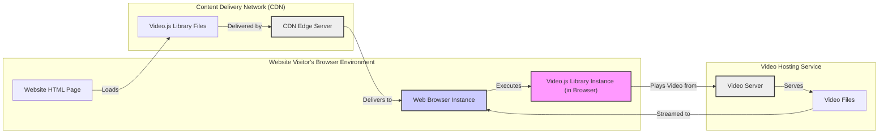
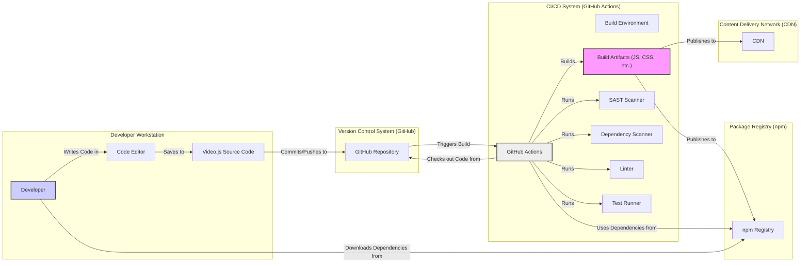

# BUSINESS POSTURE

This project, video.js, aims to provide a robust, customizable, and cross-browser compatible HTML5 video player library for web developers. The primary business priority is to offer a reliable and feature-rich solution that simplifies embedding video playback functionality into websites and web applications. The goal is to be the leading open-source HTML5 video player, widely adopted and trusted by the web development community.

Key business risks associated with this project include:

- Vulnerabilities in the video player library could be exploited to compromise websites embedding video.js, leading to potential cross-site scripting (XSS) attacks, denial-of-service (DoS), or other security breaches.
- If the library is perceived as unreliable or insecure, it could damage the reputation of the project and reduce adoption rates.
- Lack of support for emerging video formats or browser technologies could lead to obsolescence and decreased user satisfaction.
- Supply chain attacks targeting dependencies used by video.js could introduce vulnerabilities into the library itself.

# SECURITY POSTURE

Existing security controls for the video.js project are primarily focused on general web security best practices and browser-level security features.

- security control: Browser Security Model. Implemented by web browsers. Browsers provide fundamental security features like sandboxing, same-origin policy, and protection against common web vulnerabilities.
- security control: HTTPS for distribution. Implemented by CDN providers and website hosting. Ensures that the video.js library and video content are delivered over encrypted connections, protecting against eavesdropping and man-in-the-middle attacks.
- security control: Input validation within the library. Implemented in the video.js codebase. The library likely performs some level of input validation to handle video sources, user interactions, and configuration options.
- accepted risk: Reliance on browser security. The project inherently depends on the security of the underlying web browsers. Vulnerabilities in browser engines could impact video.js.
- accepted risk: Third-party dependencies. The project likely uses third-party libraries, which could introduce vulnerabilities if not properly managed and vetted.
- accepted risk: Misuse by developers. Developers embedding video.js might misconfigure it or use it in insecure contexts, leading to vulnerabilities outside the library's control.

Recommended security controls to enhance the security posture of video.js:

- recommended security control: Regular Security Audits. Periodic security audits, including penetration testing and code reviews, should be conducted to identify and address potential vulnerabilities in the video.js codebase.
- recommended security control: Dependency Scanning. Implement automated dependency scanning to detect and remediate known vulnerabilities in third-party libraries used by video.js.
- recommended security control: Static Application Security Testing (SAST). Integrate SAST tools into the development pipeline to automatically identify potential security flaws in the codebase during development.
- recommended security control: Content Security Policy (CSP) Guidance. Provide clear guidance and recommendations to developers on how to configure CSP headers to mitigate XSS risks when embedding video.js.
- recommended security control: Subresource Integrity (SRI). Encourage the use of SRI tags when including video.js from CDNs to ensure the integrity of the delivered library files.

Security requirements for the video.js project:

- Authentication: Authentication is not directly within the scope of the video player itself. However, websites using video.js might require authentication to access video content. Video.js should be designed to seamlessly integrate with website authentication mechanisms.
- Authorization: Similar to authentication, authorization for video content is typically handled at the website or backend level. Video.js should respect authorization decisions made by the website and not bypass any access controls.
- Input Validation: Video.js must rigorously validate all inputs, including video source URLs, user interactions, and configuration options, to prevent injection attacks and other input-related vulnerabilities. This includes validating URL schemes, file types, and user-provided data.
- Cryptography: Video.js should leverage browser-provided cryptographic APIs where necessary and ensure that sensitive data, such as DRM keys (if supported), is handled securely. The library should encourage and support HTTPS for all video content delivery.

# DESIGN

## C4 CONTEXT

```mermaid
flowchart LR
    subgraph "Website Visitor"
        WV("Website Visitor")
    end
    subgraph "Website Developer"
        WD("Website Developer")
    end
    subgraph "Video.js Project"
        VJ("Video.js Library")
    end
    subgraph "Web Browser"
        WB("Web Browser")
    end
    subgraph "CDN"
        CDN("Content Delivery Network (CDN)")
    end
    subgraph "Video Hosting Service"
        VHS("Video Hosting Service")
    end

    WV -- "Plays Video Content" --> WB
    WD -- "Embeds Video Player" --> VJ
    VJ -- "Delivered via" --> CDN
    VJ -- "Runs in" --> WB
    WB -- "Requests Video Content" --> VHS
    WB -- "Loads Video.js" --> CDN
    VJ -- "Plays Video Content from" --> VHS
    style VJ fill:#f9f,stroke:#333,stroke-width:2px
```

### Context Diagram Elements

- Name: Website Visitor
  - Type: Person
  - Description: End-users who visit websites and consume video content embedded using video.js.
  - Responsibilities: View video content, interact with video player controls.
  - Security controls: Browser security features, personal device security.

- Name: Website Developer
  - Type: Person
  - Description: Developers who integrate video.js into their websites to enable video playback functionality.
  - Responsibilities: Embed video.js library, configure player settings, manage video content sources.
  - Security controls: Secure development practices, input validation on website backend, Content Security Policy implementation.

- Name: Video.js Library
  - Type: Software System
  - Description: The video.js JavaScript library, providing HTML5 video player functionality.
  - Responsibilities: Play video content in web browsers, handle user interactions, provide a customizable player interface, support various video formats and streaming protocols.
  - Security controls: Input validation, output encoding, secure coding practices, dependency management, security testing.

- Name: Web Browser
  - Type: Software System
  - Description: Web browsers (e.g., Chrome, Firefox, Safari, Edge) used by website visitors to access websites and play video content.
  - Responsibilities: Execute JavaScript code (video.js), render video content, enforce web security policies, handle network requests.
  - Security controls: Browser security model (sandboxing, same-origin policy), built-in security features, regular security updates.

- Name: Content Delivery Network (CDN)
  - Type: Infrastructure
  - Description: CDNs used to host and distribute the video.js library files to website visitors.
  - Responsibilities: Provide fast and reliable delivery of video.js library files, ensure availability and scalability.
  - Security controls: HTTPS delivery, access controls, infrastructure security, DDoS protection.

- Name: Video Hosting Service
  - Type: Software System
  - Description: Services that host video content and provide streaming capabilities (e.g., YouTube, Vimeo, self-hosted video servers).
  - Responsibilities: Store and serve video content, provide streaming protocols, manage video metadata.
  - Security controls: Access controls, authentication, authorization, content encryption, infrastructure security.

## C4 CONTAINER

```mermaid
flowchart LR
    subgraph "Web Browser"
        VJ["Video.js Library (JavaScript)"]
    end

    VJ -- "Plays Video" --> "HTML5 Video Element"
    VJ -- "Interacts with" --> "Browser APIs (DOM, Media APIs)"
    VJ -- "Fetches Assets from" --> "CDN"
    VJ -- "Streams Video from" --> "Video Hosting Service"

    style VJ fill:#f9f,stroke:#333,stroke-width:2px
```

### Container Diagram Elements

- Name: Video.js Library (JavaScript)
  - Type: Container
  - Description: The core JavaScript library that implements the video player functionality. It runs within the web browser.
  - Responsibilities:  Manage the HTML5 video element, handle user interactions (play, pause, volume, etc.), implement player UI, manage video playback, handle streaming protocols, integrate with browser APIs.
  - Security controls: Input validation, output encoding, secure coding practices, dependency management, security testing, Content Security Policy compatibility.

- Name: HTML5 Video Element
  - Type: Container
  - Description: The HTML5 <video> element provided by the web browser, used by video.js to render and control video playback.
  - Responsibilities:  Render video frames, handle low-level video decoding and playback, expose browser media APIs.
  - Security controls: Browser security model, browser media API security, sandboxing.

- Name: Browser APIs (DOM, Media APIs)
  - Type: Container
  - Description: Web browser APIs that video.js interacts with to manipulate the DOM, control media playback, and access browser features.
  - Responsibilities: Provide interfaces for JavaScript to interact with the browser environment, manage DOM manipulation, provide media playback controls and events.
  - Security controls: Browser security model, API access controls, permission models.

- Name: CDN
  - Type: External Container
  - Description: Content Delivery Network serving the video.js library files.
  - Responsibilities: Deliver video.js files efficiently and reliably.
  - Security controls: HTTPS delivery, infrastructure security, access controls.

- Name: Video Hosting Service
  - Type: External Container
  - Description: Service providing video content for playback.
  - Responsibilities: Host and stream video content.
  - Security controls: Access controls, authentication, authorization, content encryption, infrastructure security.

## DEPLOYMENT

For video.js, the "deployment" primarily refers to how the library is delivered to and used within web browsers. A common deployment scenario involves using a CDN to host the library files.



### Deployment Diagram Elements

- Name: Website Visitor's Browser Environment
  - Type: Deployment Environment
  - Description: The runtime environment within a website visitor's web browser where video.js executes.
  - Responsibilities: Execute JavaScript code, render web pages, play video content.
  - Security controls: Browser security model, operating system security, user device security.

- Name: Web Browser Instance
  - Type: Software Instance
  - Description: A specific instance of a web browser running on a user's device.
  - Responsibilities: Execute video.js code, render the video player, interact with the operating system and hardware.
  - Security controls: Browser security features, sandboxing, process isolation.

- Name: Video.js Library Instance (in Browser)
  - Type: Software Instance
  - Description: An instance of the video.js library running within the web browser, loaded and executed by the HTML page.
  - Responsibilities: Implement video player functionality, manage video playback, handle user interactions within the browser.
  - Security controls: JavaScript security context, browser security policies.

- Name: Website HTML Page
  - Type: Software Instance
  - Description: The HTML page of a website that embeds and uses the video.js library.
  - Responsibilities: Load video.js, configure the player, embed the video player into the page structure.
  - Security controls: Content Security Policy, HTTPS, secure coding practices for website development.

- Name: Content Delivery Network (CDN)
  - Type: Infrastructure Instance
  - Description: CDN edge servers that host and deliver the video.js library files.
  - Responsibilities: Store and serve video.js files, provide fast and geographically distributed access.
  - Security controls: Infrastructure security, access controls, DDoS protection, HTTPS delivery.

- Name: CDN Edge Server
  - Type: Infrastructure Instance
  - Description: A specific server within the CDN infrastructure responsible for delivering content to users.
  - Responsibilities: Serve video.js files to requesting browsers.
  - Security controls: Server hardening, access controls, network security.

- Name: Video Hosting Service
  - Type: Infrastructure Instance
  - Description: Servers hosting and streaming video content.
  - Responsibilities: Store and stream video files, manage video delivery.
  - Security controls: Access controls, authentication, authorization, content encryption, infrastructure security.

- Name: Video Server
  - Type: Software Instance
  - Description: A server instance within the video hosting service responsible for streaming video content.
  - Responsibilities: Stream video data to clients, handle streaming protocols.
  - Security controls: Server hardening, access controls, streaming protocol security.

- Name: Video Files
  - Type: Data
  - Description: The actual video content files stored on the video hosting service.
  - Responsibilities: Store video data.
  - Security controls: Access controls, encryption at rest (potentially).

## BUILD



The build process for video.js likely involves the following steps, with a focus on security:

1. Developer writes code and commits it to the GitHub repository.
2. GitHub Actions (or another CI/CD system) is triggered by code changes.
3. The CI/CD pipeline checks out the source code from the repository.
4. Security checks are performed:
    - Static Application Security Testing (SAST) is run to identify potential security vulnerabilities in the code.
    - Dependency scanning is performed to detect known vulnerabilities in third-party dependencies.
    - Linters are used to enforce code quality and security best practices.
5. Automated tests (unit tests, integration tests) are executed to ensure code functionality and prevent regressions.
6. The build process compiles and bundles the JavaScript and CSS assets, creating build artifacts.
7. Build artifacts are published to:
    - npm registry for distribution as an npm package.
    - CDN for direct linking from websites.

Security controls in the build process:

- security control: Version Control System (GitHub). Implemented by GitHub. Securely stores and manages source code, provides audit trails of changes.
- security control: Automated Build Pipeline (GitHub Actions). Implemented by GitHub Actions. Automates the build, test, and deployment process, reducing manual errors and ensuring consistent builds.
- security control: Static Application Security Testing (SAST). Implemented in CI pipeline. Automatically scans source code for potential security vulnerabilities.
- security control: Dependency Scanning. Implemented in CI pipeline. Checks for known vulnerabilities in third-party dependencies.
- security control: Linting. Implemented in CI pipeline. Enforces code quality and security best practices.
- security control: Automated Testing. Implemented in CI pipeline. Ensures code functionality and prevents regressions, including security-related tests.
- security control: Secure Artifact Storage (npm, CDN). Implemented by npm and CDN providers. Securely stores and delivers build artifacts.
- security control: Code Review. Implemented as part of development process. Human review of code changes to identify potential security flaws and ensure code quality.

# RISK ASSESSMENT

Critical business process being protected:

- Providing a reliable and secure HTML5 video player library for web developers. The core business process is the development, maintenance, and distribution of the video.js library.

Data being protected and their sensitivity:

- Source code of video.js: High sensitivity. Compromise could lead to injection of vulnerabilities, intellectual property theft, and reputational damage.
- Build artifacts (JavaScript, CSS files): Medium sensitivity. Compromise could lead to distribution of malicious versions of the library to users.
- Project infrastructure (GitHub repository, CI/CD pipeline, npm account, CDN account): High sensitivity. Compromise could disrupt development, build, and distribution processes, and potentially lead to malicious code injection.
- Developer credentials: High sensitivity. Compromise could grant unauthorized access to project infrastructure and source code.

# QUESTIONS & ASSUMPTIONS

Questions:

- What is the target risk appetite for the video.js project? Is it for a fresh startup with higher risk tolerance or a Fortune 500 company with stricter security requirements? This will influence the level of security controls to be implemented.
- Are there specific regulatory compliance requirements that video.js needs to adhere to (e.g., GDPR, CCPA, accessibility standards)?
- Are there specific use cases or industries that video.js is primarily targeting (e.g., media streaming, e-learning, enterprise video)? This could highlight specific security concerns.
- What is the process for reporting and handling security vulnerabilities in video.js? Is there a dedicated security team or contact point?
- What is the budget and resources allocated for security activities for the video.js project?

Assumptions:

- The primary goal is to provide a secure and reliable video player library for general web use.
- Standard web security best practices are applicable to the video.js project.
- The project aims to minimize the risk of vulnerabilities in the library that could be exploited by malicious actors.
- Security is a priority for the video.js project, and efforts are made to incorporate security considerations throughout the development lifecycle.
- The project relies on community contributions and open-source principles for development and security.