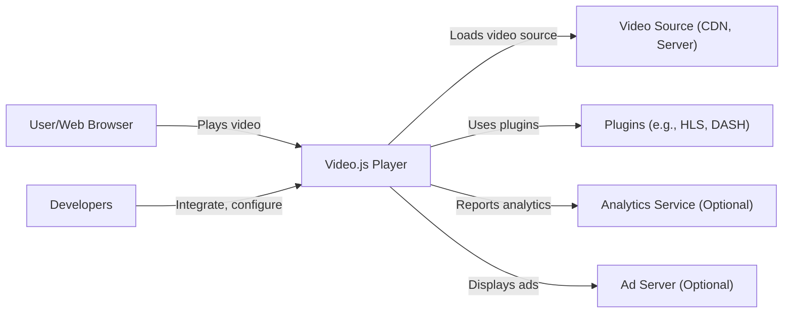
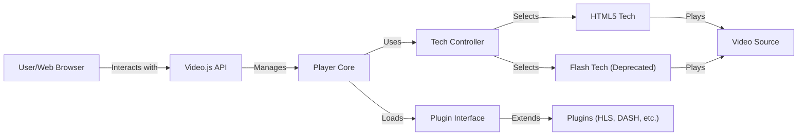
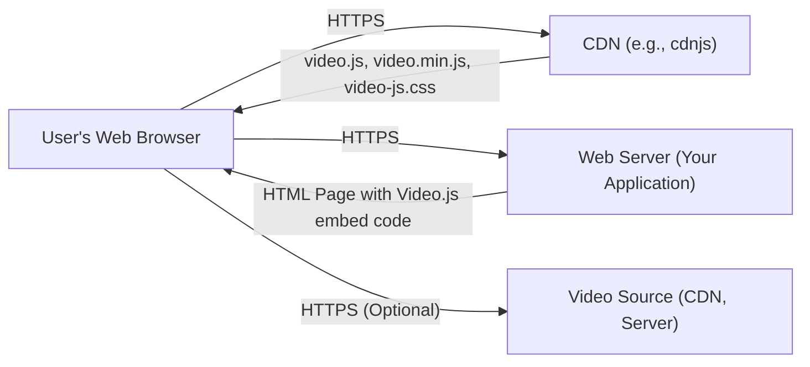
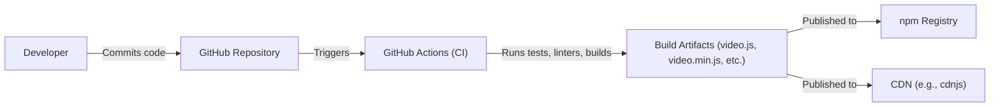

# BUSINESS POSTURE

Business Priorities and Goals:

*   Provide a free and open-source HTML5 video player framework.
*   Enable easy embedding and playback of videos in web browsers.
*   Offer a consistent and customizable user experience across different browsers and devices.
*   Support a wide range of video formats and streaming protocols.
*   Provide a plugin architecture for extending functionality.
*   Maintain a large and active community of users and contributors.
*   Ensure accessibility for users with disabilities.

Business Risks:

*   Malicious actors could exploit vulnerabilities in the player to inject malicious code or compromise user data.
*   The player's reliance on external libraries and plugins could introduce supply chain risks.
*   Lack of proper input validation could lead to cross-site scripting (XSS) attacks.
*   Inadequate security controls could allow unauthorized access to video content or user data.
*   Failure to comply with accessibility standards could exclude users with disabilities.
*   The project's open-source nature could make it a target for malicious contributions.

# SECURITY POSTURE

Existing Security Controls:

*   security control: Regular code reviews and audits. (Mentioned in the contributing guidelines and security policy)
*   security control: Use of linters and static analysis tools. (Implied by the project's build process and use of tools like ESLint)
*   security control: Dependency management using npm. (Visible in the package.json file)
*   security control: A security policy that outlines how to report vulnerabilities. (SECURITY.md file)
*   security control: Cross-Origin Resource Sharing (CORS) handling. (Implemented in the codebase)
*   security control: Content Security Policy (CSP) recommendations. (Mentioned in documentation and examples)
*   security control: Subresource Integrity (SRI) usage for loaded scripts. (Mentioned in documentation)

Accepted Risks:

*   accepted risk: Reliance on community contributions for bug fixes and security patches.
*   accepted risk: Potential for zero-day vulnerabilities in the player or its dependencies.
*   accepted risk: Limited resources for comprehensive security testing and penetration testing.

Recommended Security Controls:

*   Implement automated security testing, including dynamic analysis (DAST) and fuzzing, in the CI/CD pipeline.
*   Conduct regular penetration testing by independent security researchers.
*   Establish a bug bounty program to incentivize vulnerability reporting.
*   Implement a robust Software Bill of Materials (SBOM) management system.
*   Perform regular security training for contributors and maintainers.

Security Requirements:

*   Authentication:
    *   Not directly applicable to the core video player, as it primarily deals with playback. Authentication is typically handled by the embedding website or application.
*   Authorization:
    *   The player should respect any authorization mechanisms implemented by the embedding website or application, such as DRM or token-based access control.
*   Input Validation:
    *   All user-supplied input, including URLs, configuration options, and plugin parameters, must be strictly validated to prevent XSS and other injection attacks.
*   Cryptography:
    *   Support for encrypted media extensions (EME) for playing DRM-protected content.
    *   Secure communication over HTTPS when fetching video resources or interacting with external services.
    *   If handling sensitive data, use appropriate cryptographic libraries and algorithms.

# DESIGN

## C4 CONTEXT

Element Descriptions:

*   Element:
    *   Name: User/Web Browser
    *   Type: Person
    *   Description: A person interacting with a web page containing the Video.js player.
    *   Responsibilities: Initiates video playback, interacts with player controls, views video content.
    *   Security controls: Browser security features (e.g., sandboxing, same-origin policy), user-controlled security settings.

*   Element:
    *   Name: Video.js Player
    *   Type: Software System
    *   Description: The core Video.js library, responsible for video playback and user interface.
    *   Responsibilities: Rendering video, handling user interactions, managing plugins, loading video sources.
    *   Security controls: Input validation, CORS handling, CSP compatibility, secure coding practices.

*   Element:
    *   Name: Video Source (CDN, Server)
    *   Type: Software System
    *   Description: The source of the video content, typically a Content Delivery Network (CDN) or a web server.
    *   Responsibilities: Storing and delivering video files, handling requests for video segments.
    *   Security controls: Access controls, HTTPS, secure storage, CDN security features.

*   Element:
    *   Name: Plugins (e.g., HLS, DASH)
    *   Type: Software System
    *   Description: Optional plugins that extend Video.js functionality, such as support for specific streaming protocols.
    *   Responsibilities: Handling specific video formats or protocols, interacting with the core player.
    *   Security controls: Same security considerations as the core player, plugin-specific security measures.

*   Element:
    *   Name: Analytics Service (Optional)
    *   Type: Software System
    *   Description: An optional service that collects data about video playback and user interactions.
    *   Responsibilities: Tracking video views, playback events, and other metrics.
    *   Security controls: Data encryption, access controls, privacy compliance.

*   Element:
    *   Name: Ad Server (Optional)
    *   Type: Software System
    *   Description: An optional service that delivers advertisements to be displayed within the video player.
    *   Responsibilities: Serving ads, tracking ad impressions and clicks.
    *   Security controls: Secure ad serving protocols, ad content filtering, protection against malicious ads.

*   Element:
    *   Name: Developers
    *   Type: Person
    *   Description: Web developers who integrate and configure the Video.js player in their websites or applications.
    *   Responsibilities: Embedding the player, configuring options, integrating with other systems.
    *   Security controls: Following secure coding practices, implementing appropriate security configurations.

## C4 CONTAINER

Element Descriptions:

*   Element:
    *   Name: User/Web Browser
    *   Type: Person
    *   Description: A person interacting with the web page.
    *   Responsibilities: Initiates video playback, interacts with player controls.
    *   Security controls: Browser security features.

*   Element:
    *   Name: Video.js API
    *   Type: API
    *   Description: The public interface for interacting with the player.
    *   Responsibilities: Providing methods for controlling playback, accessing player state, and managing events.
    *   Security controls: Input validation, API rate limiting (if applicable).

*   Element:
    *   Name: Player Core
    *   Type: Component
    *   Description: The core logic of the Video.js player.
    *   Responsibilities: Managing player state, handling events, coordinating other components.
    *   Security controls: Secure coding practices, internal input validation.

*   Element:
    *   Name: Tech Controller
    *   Type: Component
    *   Description: Responsible for selecting the appropriate playback technology (Tech).
    *   Responsibilities: Determining the best Tech based on browser capabilities and video format.
    *   Security controls: Secure selection logic, preventing fallback to insecure Techs.

*   Element:
    *   Name: HTML5 Tech
    *   Type: Component
    *   Description: The primary Tech for playing video using the browser's native HTML5 video capabilities.
    *   Responsibilities: Interacting with the HTML5 video element, handling playback events.
    *   Security controls: Leveraging browser security features, secure handling of media data.

*   Element:
    *   Name: Flash Tech (Deprecated)
    *   Type: Component
    *   Description: A deprecated Tech for playing video using Adobe Flash Player (no longer supported).
    *   Responsibilities: (Deprecated)
    *   Security controls: (Deprecated - should be removed)

*   Element:
    *   Name: Plugin Interface
    *   Type: Interface
    *   Description: The interface for extending Video.js with plugins.
    *   Responsibilities: Providing hooks and methods for plugins to interact with the player.
    *   Security controls: Secure plugin loading, sandboxing (if possible).

*   Element:
    *   Name: Plugins (HLS, DASH, etc.)
    *   Type: Component
    *   Description: Optional plugins that extend Video.js functionality.
    *   Responsibilities: Handling specific video formats or protocols.
    *   Security controls: Plugin-specific security measures, secure communication with external services.

*   Element:
    *   Name: Video Source
    *   Type: External System
    *   Description: The source of the video content.
    *   Responsibilities: Providing video data.
    *   Security controls: External system security.

## DEPLOYMENT

Possible Deployment Solutions:

1.  CDN (Recommended): Include Video.js directly from a CDN (e.g., cdnjs, jsDelivr). This is the simplest and most common approach.
2.  Self-Hosting: Download the Video.js files and host them on your own web server.
3.  npm/Bundler: Install Video.js as a dependency using npm and bundle it with your application code using a bundler like Webpack or Browserify.

Chosen Solution (CDN):

Element Descriptions:

*   Element:
    *   Name: User's Web Browser
    *   Type: Software System
    *   Description: The user's web browser, where the Video.js player runs.
    *   Responsibilities: Rendering the web page, executing JavaScript, playing video.
    *   Security controls: Browser security features.

*   Element:
    *   Name: CDN (e.g., cdnjs)
    *   Type: Infrastructure Node
    *   Description: A Content Delivery Network that hosts the Video.js library files.
    *   Responsibilities: Serving Video.js files to users' browsers.
    *   Security controls: CDN provider's security measures, HTTPS.

*   Element:
    *   Name: Web Server (Your Application)
    *   Type: Infrastructure Node
    *   Description: The web server that hosts your application's HTML, CSS, and JavaScript files.
    *   Responsibilities: Serving your application's web pages.
    *   Security controls: Web server security configuration, HTTPS.

*   Element:
    *   Name: Video Source (CDN, Server)
    *   Type: Infrastructure Node/Software System
    *   Description: The source of the video content.
    *   Responsibilities: Storing and delivering video files.
    *   Security controls: Access controls, HTTPS, secure storage.

## BUILD

Build Process Description:

1.  Developers write code and commit it to the GitHub repository.
2.  GitHub Actions, the CI/CD system used by Video.js, is triggered by commits and pull requests.
3.  GitHub Actions runs a series of jobs, including:
    *   Linting: Code style checks using ESLint.
    *   Testing: Unit and integration tests using Karma and other testing frameworks.
    *   Building: Transpiling code with Babel, minifying JavaScript and CSS.
4.  Build artifacts (video.js, video.min.js, video-js.css, etc.) are generated.
5.  The artifacts are published to:
    *   npm Registry: For developers who use npm to manage dependencies.
    *   CDN (e.g., cdnjs): For direct inclusion in web pages.

Security Controls in Build Process:

*   security control: Linting (ESLint): Enforces code style and helps prevent common errors.
*   security control: Automated Testing: Unit and integration tests help ensure code quality and prevent regressions.
*   security control: Dependency Management (npm): Tracks dependencies and allows for vulnerability scanning.
*   security control: GitHub Actions: Provides a secure and automated build environment.
*   security control: Code Review: All changes are reviewed before merging.

# RISK ASSESSMENT

Critical Business Processes:

*   Delivering a functional and reliable video player.
*   Maintaining a positive user experience.
*   Protecting the reputation of the Video.js project and its community.

Data to Protect:

*   Source Code: Medium sensitivity. The code is publicly available, but unauthorized modifications could introduce vulnerabilities.
*   User Data (Indirectly): Low sensitivity. The player itself doesn't directly handle user data, but it could be used as a vector for attacks against the embedding website or application.
*   Video Content (Indirectly): Variable sensitivity, depending on the content. The player is responsible for playing the content, but the content itself is managed by the embedding website or application.

# QUESTIONS & ASSUMPTIONS

Questions:

*   Are there any specific compliance requirements (e.g., GDPR, CCPA) that the embedding website or application must adhere to, and how might these impact the use of Video.js?
*   What are the specific threat models considered by the Video.js maintainers?
*   What is the process for handling security vulnerabilities discovered in third-party plugins?
*   What level of support is provided for older browsers, and what are the security implications of supporting them?

Assumptions:

*   BUSINESS POSTURE: The primary goal is to provide a free, open-source, and widely used video player. Security is important, but it's balanced with the need for ease of use and broad compatibility.
*   SECURITY POSTURE: The project relies on community contributions and best practices for security. There is no dedicated security team, but maintainers are responsive to security reports.
*   DESIGN: The design prioritizes flexibility and extensibility, allowing for a wide range of use cases and integrations. The use of a CDN for deployment is the most common and recommended approach. The build process is automated and includes basic security checks.