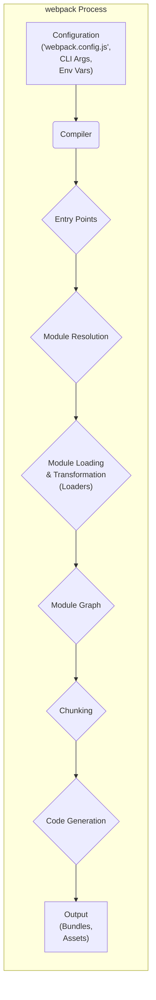

# Project Design Document: webpack

**Version:** 1.1
**Date:** October 26, 2023
**Author:** AI Software Architect

## 1. Introduction

This document provides a refined high-level architectural design of webpack, a widely used JavaScript module bundler. This design document is intended to serve as a foundation for subsequent threat modeling activities. It details the key components, data flow, and interactions within the webpack system, with a particular emphasis on potential security implications.

## 2. Goals and Objectives

The core goal of webpack is to efficiently bundle JavaScript and other web assets (such as CSS, images, and fonts) into optimized static assets suitable for deployment to a browser. Key objectives include:

* **Efficient Module Bundling:**  Combining numerous JavaScript modules and their dependencies into a single or a manageable number of optimized bundle files.
* **Flexible Code Transformation:** Enabling developers to utilize various module formats (CommonJS, AMD, ES Modules) and pre-processing tools (e.g., Babel for JavaScript transpilation, Sass for CSS pre-processing).
* **Robust Dependency Management:**  Accurately resolving and managing the intricate web of dependencies between different modules within a project.
* **Performance-Focused Code Optimization:**  Implementing optimizations like code minification, intelligent code splitting, and dead code elimination (tree shaking) to enhance application loading speed and performance.
* **Extensible Architecture:** Providing a powerful plugin system that allows developers to extend and customize virtually every aspect of the bundling process.
* **Streamlined Development Workflow:** Offering features like hot module replacement (HMR) for a faster and more efficient development experience by updating modules in the browser without full page reloads.

## 3. System Architecture

webpack's operation can be conceptually divided into a series of distinct stages:

* **Configuration Loading:**  The process of reading and interpreting the webpack configuration file(s) and command-line arguments.
* **Entry Point Identification:** Determining the initial module(s) from which the dependency graph will be built.
* **Recursive Module Resolution:**  Locating and resolving all dependencies of the entry point modules, and subsequently their dependencies, forming a complete dependency tree.
* **Module Loading and Transformation Pipeline:** Reading the raw content of each module and applying a series of configured loaders to transform the code (e.g., transpiling, applying styles).
* **Chunking and Optimization:**  Strategically splitting the bundled code into smaller, more manageable chunks based on various criteria (e.g., entry points, dynamic imports) to improve loading performance and caching.
* **Code Generation and Asset Emission:**  Generating the final bundled JavaScript code and other assets, incorporating the transformations and optimizations.
* **Output to File System:**  Writing the generated bundles and associated assets to the specified output directory.

### 3.1. Key Components

* **Configuration System:**
    *  `webpack.config.js` (or similar): The primary JavaScript file where the bundling process is configured, defining entry points, output paths, loader rules, plugin usage, and other critical options.
    *  Command-line Interface (CLI) Arguments: Options passed directly to the webpack CLI to override or supplement the configuration file.
    *  Environment Variables:  Variables set in the operating system environment that can be accessed within the webpack configuration to conditionally adjust behavior based on the environment (e.g., development vs. production).

* **Compiler Core:**
    *  The central engine of webpack, responsible for managing the entire compilation lifecycle and orchestrating the interactions between different components.
    *  Provides a system of hooks that plugins can tap into to extend or modify the compilation process at various stages.

* **Module Resolver:**
    *  The component responsible for taking module specifiers (e.g., `import 'lodash'`) and determining the absolute path to the corresponding module file on the file system.
    *  Implements various module resolution algorithms, including those mimicking Node.js's module resolution strategy.

* **Module Factory:**
    *  Creates internal module objects from the resolved file paths.
    *  Determines the type of module and initiates the process of loading and transforming its source code.

* **Loaders (Transformation Modules):**
    *  Functions that take the raw source code of a module as input and return transformed source code.
    *  Applied sequentially to a module based on rules defined in the webpack configuration (e.g., `babel-loader` for transpiling modern JavaScript to older versions, `style-loader` and `css-loader` for handling CSS).

* **Plugins (Extensibility Modules):**
    *  JavaScript modules that can hook into various stages of the webpack compilation process to perform custom actions.
    *  Used for a wide range of tasks, including code optimization, asset generation, bundle analysis, and integration with other tools.

* **Chunking Engine:**
    *  The part of webpack responsible for splitting the dependency graph into smaller, independent units called chunks.
    *  This allows for more efficient loading, especially for large applications, by enabling parallel downloads and better caching.

* **Module Graph (Dependency Graph):**
    *  An internal data structure representing the relationships and dependencies between all the modules in the project.
    *  Built during the module resolution phase and used by other components like the chunking engine.

* **Output System:**
    *  Handles the process of writing the generated bundles and other assets to the specified output directory on the file system.
    *  Configuration options control the naming and structure of the output files.

* **Development Server (Optional):**
    *  A built-in development server that provides features like hot module replacement (HMR), live reloading, and proxying.
    *  Primarily used during development to provide a faster feedback loop.

### 3.2. Data Flow Diagram

### 3.3. External Interfaces

* **Command Line Interface (CLI):**  The primary way developers interact with webpack, used to initiate the bundling process and pass configuration overrides.
* **Node.js API:**  webpack can be integrated programmatically into Node.js applications, allowing for more complex build workflows.
* **File System:**  webpack extensively interacts with the file system to read input files (modules, configuration) and write output files (bundles, assets).
* **Package Managers (npm, yarn, pnpm):**  Used to install webpack itself, as well as its dependencies, including loaders and plugins.
* **Web Browsers (via Dev Server):**  When using the Dev Server, browsers connect to it to receive the bundled application and facilitate features like HMR.
* **External Services (via Plugins):** Plugins can be developed to interact with external services for tasks such as deployment, analytics reporting, or remote asset storage.

## 4. Detailed Component Description

### 4.1. Configuration System

* **Purpose:** To define and control the behavior of the webpack bundling process.
* **Input:** `webpack.config.js` file, command-line arguments, environment variables.
* **Output:** A normalized and validated configuration object used by the Compiler.
* **Security Considerations:**
    *  **Risk of Arbitrary Code Execution:** A maliciously crafted configuration file could potentially lead to arbitrary code execution if it misconfigures loaders or plugins to execute unintended commands. For example, a loader could be configured to execute shell commands on matched files.
    *  **Exposure of Sensitive Information:** Configuration files might inadvertently contain sensitive information such as API keys, credentials, or internal paths, which could be exposed if the configuration is not properly secured.

### 4.2. Compiler Core

* **Purpose:** To manage the overall bundling process, orchestrating the other components.
* **Input:** The validated configuration object.
* **Output:** The final bundled JavaScript code and other generated assets.
* **Security Considerations:**
    *  **Vulnerabilities in Compiler Logic:** Security flaws within the core compiler logic could potentially be exploited to compromise the build process or the generated output.
    *  **Plugin Security:** The compiler's interaction with plugins introduces a potential attack surface. Malicious or vulnerable plugins could be used to inject malicious code, steal sensitive information, or disrupt the build process.

### 4.3. Module Resolver

* **Purpose:** To locate the physical file path of modules based on import or require statements.
* **Input:** Module specifiers (e.g., `import 'lodash'`, `require('./my-module.js')`).
* **Output:** Absolute file paths to the resolved modules.
* **Security Considerations:**
    *  **Path Traversal Vulnerabilities:** If the resolver does not properly sanitize module specifiers, it could be susceptible to path traversal attacks, allowing access to files outside the intended project directory. For example, `require('../../../etc/passwd')`.
    *  **Dependency Confusion Attacks:** Attackers could register malicious packages with names similar to internal or private dependencies, potentially leading the resolver to pick up the malicious package.

### 4.4. Module Factory

* **Purpose:** To create internal module objects from their source code after they have been resolved.
* **Input:** The resolved file paths of modules.
* **Output:** Module objects containing the module's code, dependencies, and other metadata.
* **Security Considerations:**
    *  **Potential for Code Injection:** If the module factory improperly handles certain types of module content or metadata, it could potentially be exploited to inject malicious code into the module representation.

### 4.5. Loaders (Transformation Modules)

* **Purpose:** To transform the source code of modules before they are included in the bundle.
* **Input:** The raw source code of a module.
* **Output:** The transformed source code of the module.
* **Security Considerations:**
    *  **Arbitrary Code Execution:** Loaders execute arbitrary code on the developer's machine during the build process. Malicious or compromised loaders can be used to execute arbitrary commands, potentially compromising the developer's system or injecting malicious code into the build output.
    *  **Vulnerabilities in Loaders:** Security vulnerabilities in popular loaders could be exploited by attackers who can influence the dependencies of a project.
    *  **Supply Chain Attacks:** Loaders are often installed as dependencies. Compromised or malicious loaders introduced through the supply chain pose a significant risk.

### 4.6. Plugins (Extensibility Modules)

* **Purpose:** To extend and customize the webpack bundling process.
* **Input:** Access to various stages of the compilation lifecycle through hooks.
* **Output:** Can modify the compilation process, generate additional assets, or perform other custom actions.
* **Security Considerations:**
    *  **Significant Control and Potential for Abuse:** Plugins have extensive control over the build process. Malicious or vulnerable plugins can introduce significant security risks, including arbitrary code execution, data exfiltration, and manipulation of the build output.
    *  **Supply Chain Attacks:** Similar to loaders, plugins are often installed as dependencies, making them a target for supply chain attacks.

### 4.7. Chunking Engine

* **Purpose:** To split the bundled code into smaller chunks for optimization and efficient loading.
* **Input:** The module graph representing the dependencies between modules.
* **Output:** Defined chunks of modules that will be bundled separately.
* **Security Considerations:**
    *  **Exposure of Sensitive Data:** Incorrect chunking configurations or vulnerabilities in the chunking logic could potentially lead to sensitive data being included in unexpected chunks, making it more accessible.

### 4.8. Code Generation

* **Purpose:** To generate the final bundled JavaScript code and other assets from the processed modules and chunks.
* **Input:** The processed modules and the defined chunks.
* **Output:** The final bundled JavaScript files and other assets ready for deployment.
* **Security Considerations:**
    *  **Vulnerabilities Leading to Malicious Output:** Security flaws in the code generation process could potentially be exploited to inject malicious code or introduce vulnerabilities into the generated bundles.
    *  **Accidental Inclusion of Sensitive Information:**  Errors in code generation could lead to the unintentional inclusion of sensitive information (e.g., API keys, internal comments) in the final bundles.

### 4.9. Output System

* **Purpose:** To write the generated bundles and assets to the specified output directory on the file system.
* **Input:** The generated bundles and assets.
* **Output:** Files written to the output directory.
* **Security Considerations:**
    *  **Risk of File Overwrite:** Improperly configured output paths could potentially lead to the overwriting of important files outside the intended output directory.

### 4.10. Development Server

* **Purpose:** To provide a local development environment with features like HMR and live reloading.
* **Input:** Project files, webpack configuration.
* **Output:** Serves the bundled application in a development environment.
* **Security Considerations:**
    *  **Cross-Site Scripting (XSS) Vulnerabilities:** If the Dev Server does not properly sanitize content or handles user input insecurely, it could be vulnerable to XSS attacks.
    *  **Server-Side Request Forgery (SSRF):** If the Dev Server allows proxying of arbitrary requests without proper validation, it could be exploited for SSRF attacks.
    *  **Exposure of Development-Only Features:**  If not properly configured, the Dev Server might expose development-specific endpoints or data that should not be accessible in a production environment.

## 5. Security Considerations (Detailed)

This section provides a more detailed overview of potential security concerns, building upon the component-specific considerations.

* **Supply Chain Attacks Targeting Loaders and Plugins:**  A significant risk arises from the reliance on third-party loaders and plugins. Attackers could compromise popular packages to inject malicious code that executes during the build process or within the final application.
* **Arbitrary Code Execution During Build Process:** Maliciously crafted configuration files, compromised loaders, or vulnerable plugins can lead to arbitrary code execution on the developer's machine during the build process.
* **Path Traversal Vulnerabilities in Module Resolution:**  Improperly sanitized module specifiers could allow attackers to access sensitive files outside the project directory.
* **Cross-Site Scripting (XSS) Vulnerabilities in Development Server:** The Dev Server, if not properly secured, can be a target for XSS attacks, potentially allowing attackers to execute malicious scripts in a developer's browser.
* **Server-Side Request Forgery (SSRF) Vulnerabilities in Development Server:**  Insecurely configured Dev Servers might be exploited to make unauthorized requests to internal or external systems.
* **Exposure of Sensitive Information:**  Sensitive data, such as API keys or credentials, could be unintentionally included in configuration files or the generated bundles.
* **Dependency Confusion Attacks:** Attackers can register malicious packages with names similar to internal dependencies, potentially tricking the resolver into using the malicious package.
* **Vulnerabilities in Core webpack Logic:**  Although less frequent, vulnerabilities in the core webpack compiler or other core components could have widespread impact.

## 6. Assumptions and Constraints

* This document describes the general architectural principles of webpack. Specific implementation details and the presence of certain features may vary across different versions of webpack.
* The primary focus is on the core bundling process and its associated components. While features like code splitting and optimization are mentioned, their detailed internal workings are not the primary focus.
* The security considerations outlined are intended to be comprehensive but may not cover every possible vulnerability. A dedicated threat modeling exercise will provide a more in-depth analysis.
* This document assumes a standard Node.js environment for running webpack and its associated tools.

## 7. Future Considerations

* Conduct a thorough threat modeling exercise based on this design document to identify and prioritize potential security vulnerabilities.
* Perform detailed security audits of commonly used loaders and plugins to identify and mitigate potential risks.
* Develop and promote security best practices for configuring and using webpack, including guidance on securing configuration files and managing dependencies.
* Explore and implement mechanisms for verifying the integrity and authenticity of loaders and plugins to mitigate supply chain risks.
