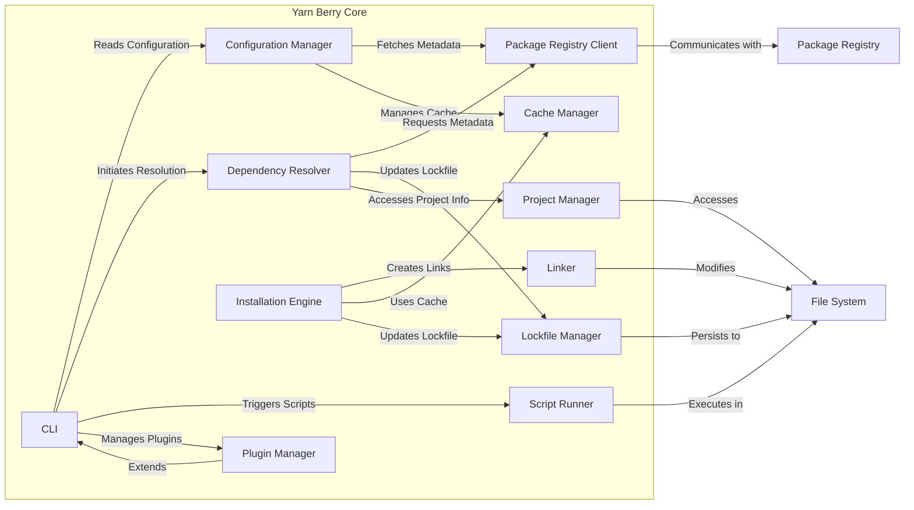
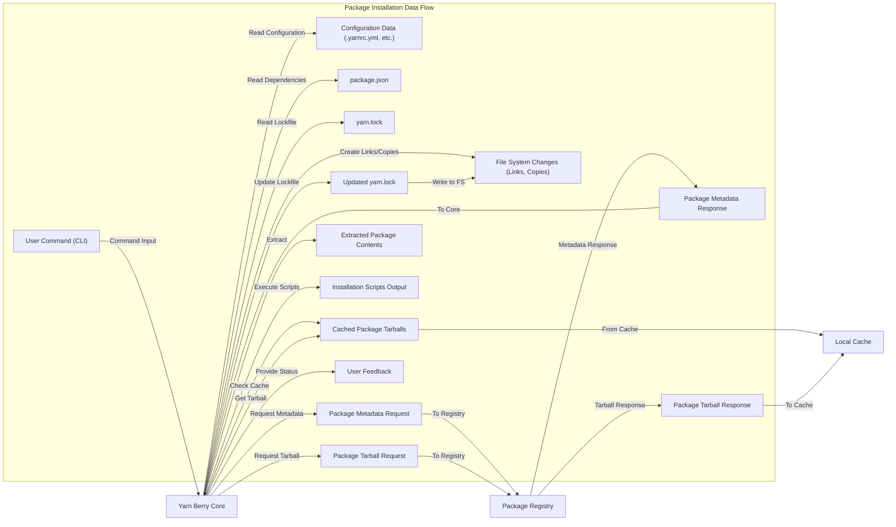

# Project Design Document: Yarn Berry

**Version:** 1.1
**Date:** October 26, 2023
**Author:** AI Software Architect

## 1. Introduction

This document provides an enhanced design overview of Yarn Berry, a modern JavaScript package manager. The aim is to deliver a comprehensive understanding of the system's architecture, key components, and data flow, serving as a robust foundation for subsequent threat modeling activities.

### 1.1. Purpose

The primary purpose of this document remains to describe the design of Yarn Berry with sufficient granularity to enable effective threat modeling. It details the system's components, their interactions, and the data they manage, providing a clear picture for security analysis.

### 1.2. Scope

This document encompasses the core functionalities of Yarn Berry, including but not limited to package installation, dependency management (including peer dependencies and optional dependencies), script execution with lifecycle hooks, and its extensible plugin architecture. The focus is on the system's architecture and data flow from a perspective relevant to identifying potential security vulnerabilities and attack surfaces.

### 1.3. Goals

* Deliver a clear, concise, and detailed description of Yarn Berry's architecture.
* Precisely identify key components and their specific responsibilities within the system.
* Clearly illustrate the flow of data within the system, highlighting data transformations and access points.
* Establish a solid and well-defined basis for identifying potential threats, vulnerabilities, and attack vectors.

## 2. System Overview

Yarn Berry stands as a performant, reliable, and secure package manager for Node.js projects. Designed as a successor to the classic Yarn and npm clients, it offers significant performance enhancements, innovative features, and a more robust architecture. Key functionalities include:

* **Sophisticated Dependency Management:**  Advanced resolution algorithms handling complex dependency graphs, including semantic versioning, peer dependencies, and optional dependencies.
* **Efficient Package Installation:** Downloading and installing packages from remote registries, local file paths, or Git repositories, optimized for speed and resource usage.
* **Monorepo Support with Workspaces:**  Streamlined management of monorepo setups, enabling efficient dependency sharing and linking between projects within the repository.
* **Extensible Script Execution:**  Running scripts defined in `package.json`, including support for lifecycle hooks triggered at various stages of the package management process.
* **Powerful Plugin System:**  A modular architecture allowing for extensive customization and extension of Yarn's core functionality through plugins.
* **Persistent Caching:**  Aggressive caching of downloaded packages and resolved dependency trees for significantly faster subsequent installations.
* **Plug'n'Play Installations:** An innovative installation strategy that eliminates the traditional `node_modules` structure, leading to faster startup times and improved disk space utilization.
* **Robust Integrity Checks:**  Verifying the integrity of downloaded packages using checksums and other mechanisms to prevent tampering.
* **Offline Support:**  Leveraging the cache to perform installations even without an active internet connection.

## 3. Architectural Design

Yarn Berry's architecture is modular, comprising several interconnected components that collaborate to deliver its functionality.

### 3.1. Key Components

* **Command Line Interface (CLI):**
    *  The primary interface through which users interact with Yarn Berry.
    *  Responsible for parsing user commands, interpreting arguments, and orchestrating the execution of internal modules.
    *  Handles input validation, error reporting, and formatting output for the user.
* **Configuration Manager:**
    *  Manages the loading, merging, and provision of Yarn's configuration settings.
    *  Reads configuration from various sources, including project-level `.yarnrc.yml`, user-level configurations, and environment variables.
    *  Provides a centralized access point for configuration values used by other components.
* **Package Registry Client:**
    *  Handles all communication with remote package registries (e.g., the npm registry, private registries).
    *  Implements protocols for fetching package metadata (package manifests), downloading package tarballs, and authenticating with registries using various authentication methods.
    *  Manages request retries and error handling for registry interactions.
* **Cache Manager:**
    *  Responsible for managing the local cache of downloaded package tarballs and other artifacts.
    *  Implements strategies for cache invalidation and eviction.
    *  Ensures the integrity of cached data, preventing corruption.
* **Dependency Resolver:**
    *  A core component responsible for analyzing project dependencies declared in `package.json` and their transitive dependencies.
    *  Implements sophisticated algorithms to determine the optimal set of package versions to install, respecting semantic versioning rules and constraints.
    *  Handles conflicts and resolution strategies for complex dependency graphs.
* **Installation Engine:**
    *  Orchestrates the process of installing packages into the project directory.
    *  Implements different installation strategies, including the Plug'n'Play approach and the traditional `node_modules` structure (in specific scenarios).
    *  Manages the extraction of package tarballs, copying of files, and execution of installation scripts defined in package manifests.
* **Linker:**
    *  Creates the necessary links or copies to make installed packages accessible to the project's code.
    *  The behavior of the linker varies significantly depending on the installation strategy (e.g., creating `.pnp.cjs` file for Plug'n'Play or symbolic links within `node_modules`).
* **Script Runner:**
    *  Executes scripts defined in the `package.json` file's `scripts` section.
    *  Manages the execution environment for scripts, including setting environment variables and handling standard input/output.
    *  Supports lifecycle hooks, triggering specific scripts at different stages of the package management process (e.g., `preinstall`, `postinstall`).
* **Plugin Manager:**
    *  Loads, registers, and manages Yarn Berry plugins.
    *  Provides an API for plugins to extend or modify Yarn's behavior, adding new commands, altering existing functionality, or integrating with external tools.
* **Lockfile Manager:**
    *  Responsible for reading and writing the `yarn.lock` file.
    *  The `yarn.lock` file stores the exact versions of all installed dependencies, ensuring consistent installations across different environments and machines.
    *  Handles updates to the lockfile when dependencies are added, removed, or updated.
* **Project Manager:**
    *  Manages the context of the current project, including locating the `package.json` file, `.yarnrc.yml`, and other project-related configuration files.
    *  Provides utilities for accessing project-specific information.

### 3.2. Component Diagram

## 4. Data Flow

The following details the data flow during a typical package installation process:

* **User initiates installation:**
    * The user executes a Yarn command (e.g., `yarn add <package>`) through the CLI.
* **Command processing and configuration loading:**
    * The CLI parses the command and invokes the relevant internal modules.
    * The Configuration Manager loads and merges project-specific and global configuration settings.
* **Dependency resolution process:**
    * The Dependency Resolver reads the `package.json` file to identify direct dependencies.
    * It consults the `yarn.lock` file to check for existing dependency resolutions.
    * If necessary, it fetches package metadata (including dependency information) from the Package Registry using the Package Registry Client.
    * The resolver analyzes the dependency tree, applying semantic versioning rules and conflict resolution strategies to determine the precise versions of all direct and transitive dependencies.
* **Cache lookup:**
    * The Cache Manager checks if the required package tarballs are already present in the local cache.
* **Package download (if required):**
    * If package tarballs are not found in the cache, the Package Registry Client downloads them from the configured Package Registry.
    * Downloaded packages are stored and managed by the Cache Manager.
* **Installation phase:**
    * The Installation Engine retrieves the resolved package tarballs (either from the cache or newly downloaded).
    * It extracts the contents of the tarballs into a temporary location.
    * It executes any installation scripts defined in the package's `package.json` (e.g., `preinstall`, `install`, `postinstall`).
* **Linking and structure creation:**
    * The Linker creates the necessary structure to make the installed packages available to the project.
    * This process varies depending on the chosen installation strategy:
        * **Plug'n'Play:** Generates a `.pnp.cjs` file that maps package names to their locations on disk, bypassing the traditional `node_modules`.
        * **`node_modules`:** Creates symbolic links or copies files into the `node_modules` directory.
* **Lockfile update:**
    * The Lockfile Manager updates the `yarn.lock` file to reflect the exact versions of all installed dependencies.
* **Completion and feedback:**
    * The CLI provides feedback to the user, indicating the success or failure of the installation process.

## 5. Key Technologies

* **Node.js:** The runtime environment on which Yarn Berry operates.
* **JavaScript/TypeScript:** The primary programming languages used for Yarn Berry's development.
* **YAML:** Used for configuration files (e.g., `.yarnrc.yml`).
* **Git:** Used for managing dependencies hosted in Git repositories and for version control of Yarn Berry itself.
* **Various npm registry protocols (e.g., HTTP, HTTPS):** For communication with package registries.
* **Checksum algorithms (e.g., SHA-512):** For verifying the integrity of downloaded packages.

## 6. Assumptions and Constraints

* **Reliable Network Connectivity:** Yarn assumes a reasonably reliable network connection for downloading packages from remote registries. Intermittent connectivity issues can lead to installation failures.
* **File System Permissions:** Yarn requires appropriate read and write permissions to the project directory, the global cache directory, and other relevant file system locations.
* **Package Registry Availability and Security:** Yarn's functionality depends on the availability, performance, and security of the configured package registries. Compromises or outages in these registries can impact Yarn's operation.
* **User Operating System Compatibility:** While designed to be cross-platform, Yarn's behavior might exhibit subtle differences across various operating systems due to underlying file system and system call variations.
* **Node.js Environment:** Yarn assumes a compatible Node.js environment is installed and available.
* **Integrity of Package Metadata:** Yarn relies on the integrity of package metadata provided by the registries.

## 7. Security Considerations (High-Level)

This section provides an expanded overview of security considerations relevant to Yarn Berry. This will be further detailed and analyzed during the threat modeling process.

* **Dependency Integrity and Supply Chain Attacks:**
    *  Risk of malicious or compromised packages being introduced as dependencies.
    *  Importance of integrity checks (checksums) to verify package authenticity.
    *  Potential for "dependency confusion" attacks where attackers publish packages with the same names as internal dependencies on public registries.
* **Package Registry Security:**
    *  Vulnerabilities in configured package registries could be exploited to inject malicious code or compromise package integrity.
    *  Reliance on the registry's authentication and authorization mechanisms.
* **Local Security and Privilege Escalation:**
    *  Risk of local privilege escalation if Yarn processes are exploited or if malicious packages execute code with elevated privileges.
    *  Importance of securing the local cache and project files from unauthorized access or modification.
* **Plugin Security:**
    *  Malicious or vulnerable plugins can introduce security risks by executing arbitrary code or compromising Yarn's functionality.
    *  The plugin system's security model and mechanisms for verifying plugin integrity are crucial.
* **Script Execution Vulnerabilities:**
    *  Scripts defined in `package.json` can execute arbitrary commands, posing a risk if dependencies are compromised or if developers introduce malicious scripts.
    *  Potential for command injection vulnerabilities in script execution.
* **Configuration Security:**
    *  Configuration files (e.g., `.yarnrc.yml`) may contain sensitive information (e.g., authentication tokens) and should be protected from unauthorized access or modification.
* **Authentication and Authorization:**
    *  Securely handling authentication credentials for accessing private registries is paramount.
    *  Risk of credential leakage or misuse.
* **Data Integrity:**
    *  Ensuring the integrity of cached packages and the `yarn.lock` file is crucial for consistent and secure installations.
    *  Protection against tampering or corruption of these data stores.

This enhanced design document provides a more detailed and comprehensive understanding of Yarn Berry's architecture and data flow. The information presented here will be invaluable for conducting a thorough and effective threat modeling exercise, enabling the identification and mitigation of potential security vulnerabilities.