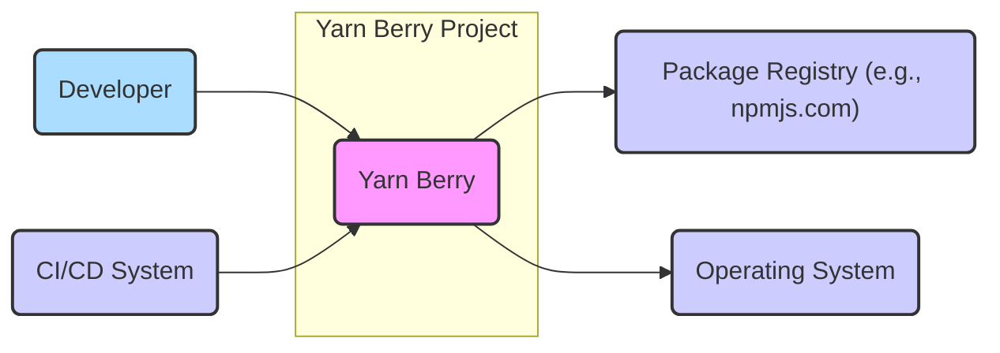
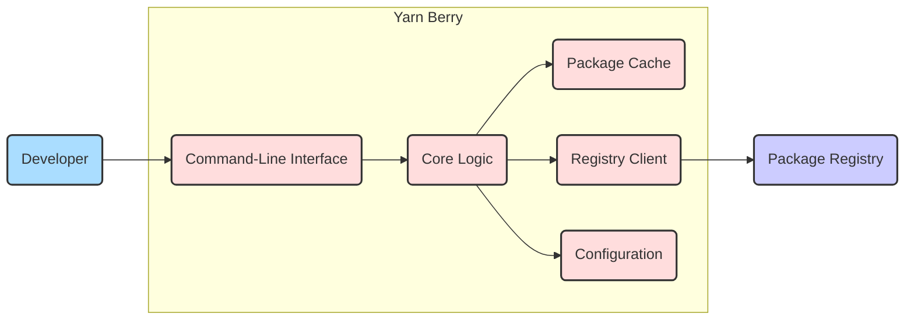
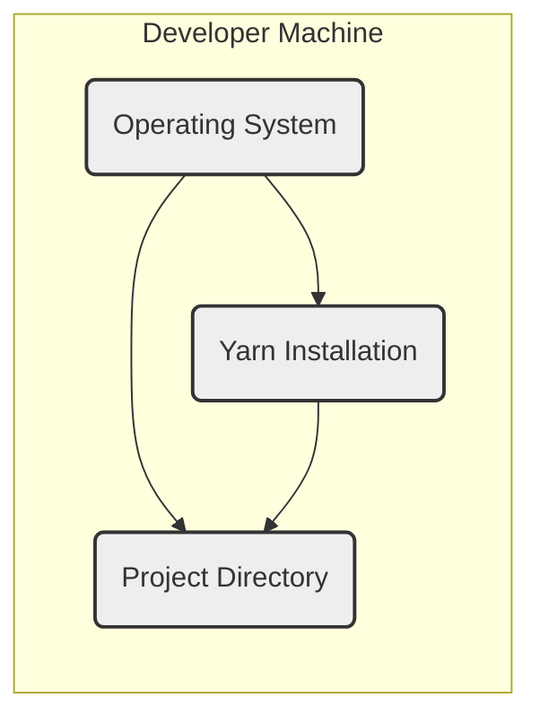
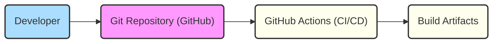

# BUSINESS POSTURE

The Yarn Berry project aims to provide a fast, reliable, and secure dependency management solution for JavaScript projects. It focuses on improving upon the original Yarn and npm by offering features like Plug'n'Play installs, constraints, and improved performance.

Business priorities and goals:
- Provide a robust and efficient package management tool for JavaScript developers.
- Ensure compatibility and seamless integration with existing JavaScript ecosystems.
- Enhance performance and reduce installation times compared to other package managers.
- Offer advanced features for managing complex project dependencies.
- Maintain a strong and active community around the project.

Most important business risks:
- Security vulnerabilities within Yarn itself could compromise developer machines and projects.
- Supply chain attacks through malicious packages downloaded and managed by Yarn.
- Data integrity issues if Yarn mishandles package data or configurations.
- Reputational damage if Yarn is perceived as unreliable or insecure, leading to decreased adoption.

# SECURITY POSTURE

Existing security controls:
- security control: Code hosted on GitHub, leveraging GitHub's security features like Dependabot for dependency vulnerability scanning. (Implemented: GitHub repository settings)
- security control: Open source project, allowing for community security reviews and contributions. (Implemented: Project governance model)
- security control: Regular updates and releases to address reported issues and vulnerabilities. (Implemented: Release management process)
- security control: Usage of HTTPS for communication with package registries to ensure data integrity and confidentiality during package downloads. (Implemented: Within Yarn's network communication logic)

Accepted risks:
- accepted risk: As an open-source project, the codebase is publicly accessible, potentially revealing vulnerabilities to malicious actors.
- accepted risk: Reliance on external package registries introduces inherent supply chain risks.
- accepted risk: Community contributions, while beneficial, require careful review to prevent introduction of vulnerabilities.

Recommended security controls:
- recommended security control: Implement automated Static Application Security Testing (SAST) in the CI/CD pipeline to identify potential code-level vulnerabilities early in the development process.
- recommended security control: Generate and distribute Software Bill of Materials (SBOM) for Yarn releases to enhance transparency and allow users to track dependencies and potential vulnerabilities.
- recommended security control: Enhance input validation and sanitization throughout Yarn, especially when parsing package manifests, lockfiles, and user inputs from the command line.
- recommended security control: Conduct regular security audits and penetration testing to proactively identify and address potential weaknesses.

Security requirements:
- Authentication:
  - Not directly applicable to Yarn's core functionality as it does not handle user authentication itself.
  - However, Yarn interacts with package registries (like npmjs.com) which require authentication for publishing and accessing private packages. Yarn should securely handle credentials provided for registry authentication, leveraging registry-specific authentication mechanisms.
- Authorization:
  - Similar to authentication, authorization is primarily relevant in the context of interacting with package registries.
  - Yarn should respect and enforce authorization policies defined by package registries when accessing and managing packages.
- Input validation:
  - Critical for Yarn to prevent various vulnerabilities.
  - Yarn must rigorously validate all inputs, including:
    - Package names and versions from package manifests (package.json, etc.).
    - Configuration parameters from yarnrc files and command-line arguments.
    - Data received from package registries.
  - Input validation should prevent injection attacks, path traversal, and other input-related vulnerabilities.
- Cryptography:
  - Yarn relies on cryptography for:
    - Verifying the integrity of downloaded packages using checksums (e.g., SHA512 hashes in lockfiles).
    - Ensuring secure communication with package registries over HTTPS.
  - Yarn should use well-established and secure cryptographic libraries and algorithms.
  - Key management for any cryptographic operations should be handled securely.

# DESIGN

## C4 CONTEXT

Context Diagram Elements:

- Element:
  - Name: Developer
  - Type: Person
  - Description: Software developers who use Yarn Berry to manage project dependencies.
  - Responsibilities: Uses Yarn CLI to install, update, and manage packages for their projects. Configures Yarn settings and project dependencies.
  - Security controls: Responsible for securely managing their development environment and project dependencies. Should follow secure coding practices and keep their Yarn installation updated.

- Element:
  - Name: Yarn Berry
  - Type: System
  - Description: The Yarn Berry package manager itself. A command-line tool for managing JavaScript project dependencies.
  - Responsibilities: Resolves project dependencies, downloads packages from registries, manages local package cache, updates dependencies, and executes scripts defined in package manifests.
  - Security controls: Implements input validation, secure communication with registries (HTTPS), package integrity verification (checksums), and follows secure development practices.

- Element:
  - Name: Package Registry (e.g., npmjs.com)
  - Type: External System
  - Description: Online repositories that host JavaScript packages. Examples include npmjs.com, GitHub Packages, and private registries.
  - Responsibilities: Stores and serves JavaScript packages. Provides package metadata, download URLs, and package content. Handles authentication and authorization for package access and publishing.
  - Security controls: Implements security measures to protect package integrity, prevent malware distribution, and secure user accounts and credentials.

- Element:
  - Name: Operating System
  - Type: External System
  - Description: The operating system on which Yarn Berry is executed (e.g., Windows, macOS, Linux).
  - Responsibilities: Provides the runtime environment for Yarn, including file system access, network connectivity, and process management.
  - Security controls: Operating system security features like user permissions, file system access controls, and network security policies affect Yarn's security posture.

- Element:
  - Name: CI/CD System
  - Type: External System
  - Description: Continuous Integration and Continuous Delivery systems that automate the build, test, and deployment processes. Yarn is often used within CI/CD pipelines to manage project dependencies.
  - Responsibilities: Automates software builds, tests, and deployments. Uses Yarn to install project dependencies as part of the CI/CD process.
  - Security controls: CI/CD systems should be securely configured to prevent unauthorized access and code modifications. Securely manages credentials used for package publishing and deployment.

## C4 CONTAINER

Container Diagram Elements:

- Element:
  - Name: Command-Line Interface (CLI)
  - Type: Container
  - Description: The command-line interface that developers interact with to use Yarn. Parses user commands and arguments, and presents output to the user.
  - Responsibilities: Provides the user interface for Yarn. Handles command parsing, input validation, and output formatting. Delegates core operations to the Core Logic container.
  - Security controls: Implements input validation to prevent command injection and other CLI-related vulnerabilities. Follows principle of least privilege in accessing system resources.

- Element:
  - Name: Core Logic
  - Type: Container
  - Description: Contains the main business logic of Yarn. Handles dependency resolution, package installation, update management, and script execution.
  - Responsibilities: Dependency resolution algorithm, package fetching and installation, lockfile management, plugin system, and execution of package scripts.
  - Security controls: Implements secure dependency resolution logic to prevent dependency confusion attacks. Verifies package integrity using checksums. Enforces security policies and constraints defined in configuration.

- Element:
  - Name: Package Cache
  - Type: Container
  - Description: Local storage for downloaded packages. Caches packages to speed up subsequent installations and reduce network traffic.
  - Responsibilities: Stores downloaded packages. Provides fast access to cached packages during installation. Manages cache size and eviction policies.
  - Security controls: Implements access controls to protect cached packages from unauthorized modification. Verifies package integrity upon retrieval from the cache.

- Element:
  - Name: Registry Client
  - Type: Container
  - Description: Handles communication with package registries. Implements protocols for fetching package metadata and downloading package files.
  - Responsibilities: Communicates with package registries over HTTPS. Authenticates with registries when required. Fetches package information and downloads package files.
  - Security controls: Enforces HTTPS for secure communication with registries. Securely handles authentication credentials for registries. Validates responses from registries to prevent data injection.

- Element:
  - Name: Configuration
  - Type: Container
  - Description: Manages Yarn's configuration settings, including project-specific configurations (e.g., .yarnrc.yml) and global settings.
  - Responsibilities: Loads and parses configuration files. Provides access to configuration parameters for other containers. Manages configuration overrides and precedence.
  - Security controls: Restricts access to sensitive configuration files. Validates configuration parameters to prevent misconfigurations that could introduce security vulnerabilities.

## DEPLOYMENT

Deployment Diagram for Developer Machine:

Deployment Diagram Elements (Developer Machine):

- Element:
  - Name: Operating System
  - Type: Deployment Environment (Software)
  - Description: The operating system running on the developer's machine (e.g., macOS, Windows, Linux).
  - Responsibilities: Provides the runtime environment for Yarn. Manages file system, processes, and network access.
  - Security controls: OS-level security controls, such as user accounts, permissions, and firewall, protect the developer environment.

- Element:
  - Name: Yarn Installation
  - Type: Deployment Node (Software)
  - Description: The installed Yarn Berry package manager on the developer's machine. Typically installed globally or within a development environment manager (e.g., nvm, asdf).
  - Responsibilities: Executes Yarn commands, manages project dependencies, and interacts with the file system and network.
  - Security controls: Yarn's built-in security features, such as input validation and secure communication, protect against vulnerabilities. Regular updates ensure the latest security patches are applied.

- Element:
  - Name: Project Directory
  - Type: Deployment Node (Data)
  - Description: The directory on the developer's machine containing the JavaScript project files, including package manifests (package.json, yarn.lock), source code, and other project assets.
  - Responsibilities: Stores project-specific files and configurations. Yarn operates within this directory to manage dependencies.
  - Security controls: File system permissions control access to project files. Developers are responsible for securing their project directories and preventing unauthorized access.

## BUILD

Build Process Description:

1. Developer: Developers write code, make changes, and commit them to a Git repository.
2. Git Repository (GitHub): The source code repository hosted on GitHub. Stores the project's codebase and tracks changes.
3. GitHub Actions (CI/CD): GitHub Actions is used for continuous integration and continuous delivery. When code is pushed to the repository, GitHub Actions workflows are triggered to build, test, and package Yarn.
4. Build Artifacts: The output of the build process, which includes distributable Yarn packages (e.g., binaries, archives). These artifacts are typically stored for distribution and release.

Build Security Controls:

- security control: Source Code Management with Git: Using Git for version control provides traceability and integrity of the codebase. Code reviews on pull requests before merging changes into the main branch. (Implemented: GitHub repository and development workflow)
- security control: Automated Build Process with GitHub Actions: Automates the build process, reducing manual steps and potential errors. Defines a repeatable and consistent build environment. (Implemented: GitHub Actions workflows)
- security control: Static Analysis Security Testing (SAST): Integrate SAST tools into the GitHub Actions workflow to automatically scan the codebase for potential vulnerabilities during the build process. (Recommended: Integrate SAST tools in CI)
- security control: Dependency Scanning: GitHub Dependabot automatically scans dependencies for known vulnerabilities. (Implemented: GitHub Dependabot)
- security control: Build Environment Security: Ensure the GitHub Actions build environment is secure and isolated. Minimize access to sensitive credentials within the build process. (Implemented: GitHub Actions security best practices)
- security control: Code Signing (Optional): Consider code signing build artifacts to ensure their integrity and authenticity. (Recommended: Code signing for releases)

# RISK ASSESSMENT

Critical business process we are trying to protect:
- Secure and reliable dependency management for JavaScript projects using Yarn.
- Integrity and availability of the Yarn package manager itself.

Data we are trying to protect and their sensitivity:
- Yarn codebase: Medium sensitivity. Publicly available but integrity is important.
- Build artifacts (Yarn distributions): Medium sensitivity. Integrity and availability are important for users.
- Package manifests (package.json, yarn.lock): Low sensitivity. Publicly available project configuration files.
- Cached packages: Low sensitivity. Re-downloadable packages.
- Potentially sensitive configuration data (registry credentials): High sensitivity. If users store registry credentials in Yarn configuration, these need to be protected.

# QUESTIONS & ASSUMPTIONS

Questions:
- What specific SAST tools are currently used or planned to be used in the Yarn Berry CI/CD pipeline?
- Is there a formal process for security vulnerability reporting and handling for Yarn Berry?
- Are there plans to implement SBOM generation for Yarn Berry releases?
- What mechanisms are in place to ensure the security of the GitHub Actions build environment and prevent supply chain attacks through the build process?
- How are registry credentials handled securely when used with Yarn?

Assumptions:
- Yarn Berry development team follows secure coding practices.
- GitHub is used as the primary platform for code hosting, collaboration, and CI/CD.
- Standard security practices are applied for open-source project development.
- Users are expected to follow best practices for securing their development environments and managing sensitive credentials.