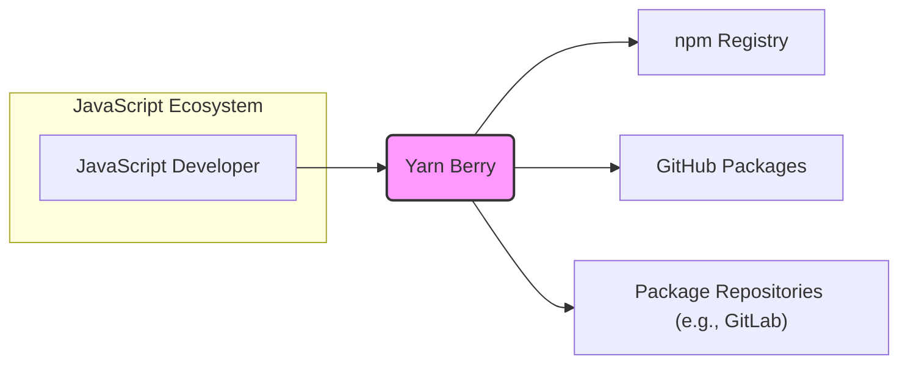
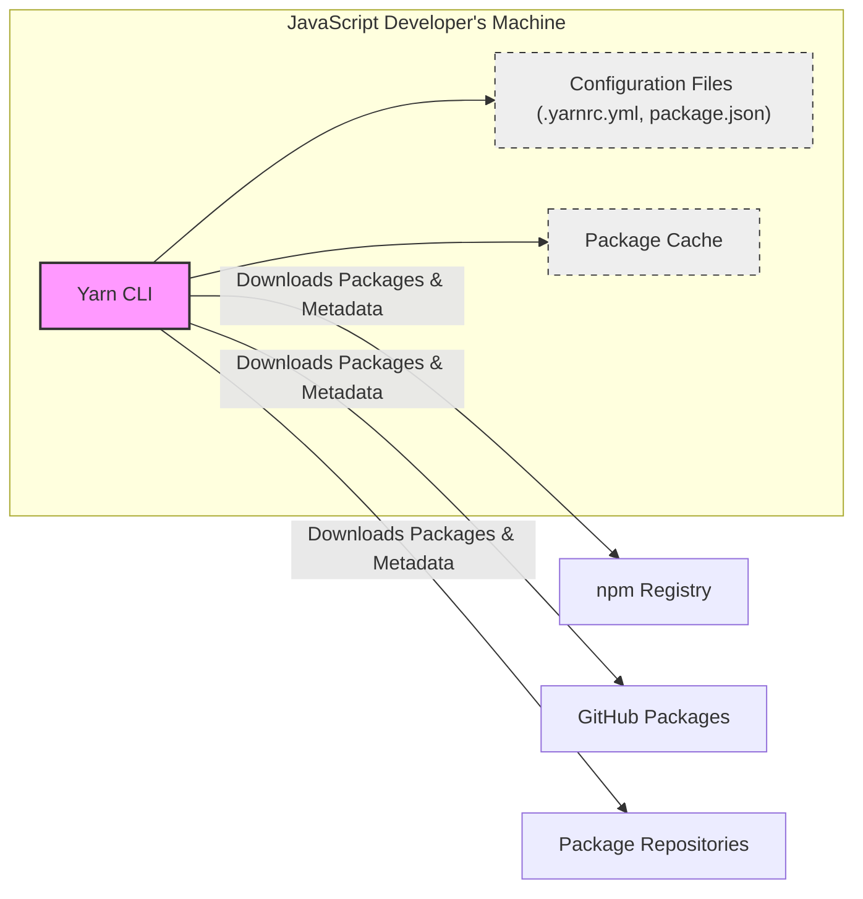
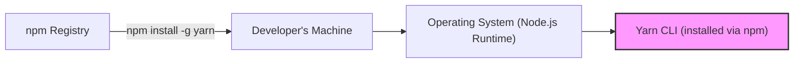
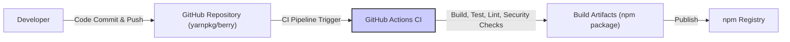

# BUSINESS POSTURE

- Business Priorities and Goals:
  - Provide a fast, reliable, and feature-rich package manager for JavaScript projects.
  - Improve developer experience by offering innovative features like Plug'n'Play installs, workspaces, and constraints.
  - Become the leading package manager in the JavaScript ecosystem, surpassing npm and pnpm in adoption and user satisfaction.
  - Maintain a strong open-source community and encourage contributions to the project.
- Business Risks:
  - Security vulnerabilities in Yarn itself could compromise developer environments and projects relying on it.
  - Supply chain attacks targeting Yarn or its dependencies could lead to widespread security incidents in the JavaScript ecosystem.
  - Data breaches involving user credentials or project configurations could damage user trust and reputation.
  - Unreliable or buggy releases could negatively impact developer productivity and adoption.
  - Competition from other package managers could hinder market share growth and community engagement.

# SECURITY POSTURE

- Existing Security Controls:
  - security control: Code review process for all contributions via GitHub Pull Requests, implemented in GitHub.
  - security control: Public issue tracker on GitHub for reporting bugs and security vulnerabilities, implemented in GitHub.
  - security control: Dependency vulnerability scanning as part of the development process (details not publicly specified but assumed for a project of this scale).
  - security control: Usage of HTTPS for all communication with package registries.
- Accepted Risks:
  - accepted risk: As an open-source project, the codebase is publicly accessible, potentially allowing malicious actors to identify vulnerabilities.
  - accepted risk: Reliance on community contributions introduces a risk of unintentionally introducing vulnerabilities.
  - accepted risk: Vulnerabilities in dependencies of Yarn itself could impact Yarn's security.
- Recommended Security Controls:
  - security control: Implement Static Application Security Testing (SAST) tools in the CI/CD pipeline to automatically detect potential code vulnerabilities.
  - security control: Implement Software Composition Analysis (SCA) tools to continuously monitor dependencies for known vulnerabilities.
  - security control: Conduct periodic penetration testing and security audits by external security experts.
  - security control: Establish a clear vulnerability disclosure and response process.
  - security control: Provide security awareness training for maintainers and contributors, focusing on secure coding practices and supply chain security.
- Security Requirements:
  - Authentication:
    - Requirement: Securely handle authentication tokens for package registries (e.g., npm, GitHub Packages).
    - Requirement: Avoid storing authentication tokens in plaintext in configuration files or environment variables.
    - Requirement: Support secure authentication methods provided by package registries (e.g., token-based authentication).
  - Authorization:
    - Requirement: Implement role-based access control for repository maintainers and contributors to manage code, releases, and project settings.
    - Requirement: Ensure proper authorization checks are in place for administrative actions within Yarn.
  - Input Validation:
    - Requirement: Thoroughly validate all inputs, including package names, versions, configuration options, and command-line arguments, to prevent injection attacks (e.g., command injection, path traversal).
    - Requirement: Sanitize user-provided data before using it in commands or file system operations.
  - Cryptography:
    - Requirement: Use strong cryptography for storing sensitive data, such as authentication tokens (if any local storage is used).
    - Requirement: Ensure all network communication, especially with package registries, is encrypted using HTTPS.
    - Requirement: Verify the integrity and authenticity of downloaded packages using cryptographic signatures (if supported by registries and implemented by Yarn).

# DESIGN

- C4 CONTEXT

- Context Diagram Elements:
  - - Name: JavaScript Developer
    - Type: Person
    - Description: Software developers who use Yarn Berry to manage dependencies for their JavaScript projects.
    - Responsibilities: Uses Yarn Berry to install, update, and manage project dependencies. Publishes packages to package registries. Configures Yarn Berry for specific project needs.
    - Security controls: Responsible for securely storing their registry credentials. Should follow secure coding practices in their projects.
  - - Name: Yarn Berry
    - Type: Software System
    - Description: A fast, reliable, and feature-rich package manager for JavaScript projects. It resolves, downloads, and manages project dependencies.
    - Responsibilities: Resolves package dependencies. Downloads packages from registries. Manages local package cache. Executes scripts defined in package.json. Provides CLI interface for developers.
    - Security controls: Input validation, secure handling of registry credentials, secure communication with registries, integrity checks of downloaded packages (if implemented).
  - - Name: npm Registry
    - Type: External System
    - Description: The default public registry for JavaScript packages. Hosts a vast collection of packages used by JavaScript developers worldwide.
    - Responsibilities: Hosts and serves JavaScript packages. Provides package metadata and download URLs. Manages user accounts and authentication for publishing packages.
    - Security controls: Authentication and authorization for package publishing. Vulnerability scanning of published packages. HTTPS for secure communication.
  - - Name: GitHub Packages
    - Type: External System
    - Description: A package registry hosted by GitHub, allowing users to host and manage packages alongside their code repositories. Supports various package formats, including npm.
    - Responsibilities: Hosts and serves JavaScript packages (and other formats). Integrates with GitHub repositories for access control and package management.
    - Security controls: Authentication and authorization via GitHub accounts. Access control based on repository permissions. HTTPS for secure communication.
  - - Name: Package Repositories (e.g., GitLab)
    - Type: External System
    - Description: Other package registries, such as GitLab Package Registry, Artifactory, or private registries, that can host JavaScript packages.
    - Responsibilities: Host and serve JavaScript packages. Provide package metadata and download URLs. May offer private package hosting and access control features.
    - Security controls: Authentication and authorization mechanisms vary depending on the registry. HTTPS for secure communication. Access control for private packages.

- C4 CONTAINER

- Container Diagram Elements:
  - - Name: Yarn CLI
    - Type: Application
    - Description: Command-line interface application written in Node.js. Provides commands for managing project dependencies, installing packages, running scripts, and configuring Yarn.
    - Responsibilities: Parses user commands. Resolves dependencies. Downloads packages. Manages package cache. Executes scripts. Reads and writes configuration files.
    - Security controls: Input validation of commands and arguments. Secure handling of registry credentials. Secure communication with registries. Access control for sensitive operations (if any).
  - - Name: Configuration Files (.yarnrc.yml, package.json)
    - Type: Data Store
    - Description: YAML and JSON files that store Yarn configuration settings, project dependencies, scripts, and other project-related information.
    - Responsibilities: Persistently store Yarn settings and project metadata. Define project dependencies and scripts.
    - Security controls: File system permissions to protect configuration files from unauthorized modification. Secure parsing of configuration files to prevent injection attacks.
  - - Name: Package Cache
    - Type: Data Store
    - Description: Local directory on the developer's machine where downloaded packages are stored to avoid redundant downloads.
    - Responsibilities: Stores downloaded packages for reuse. Provides faster package installation for subsequent projects or installations.
    - Security controls: File system permissions to protect the package cache. Integrity checks of cached packages (if implemented).
  - - Name: npm Registry, GitHub Packages, Package Repositories
    - Type: External Systems
    - Description: Remote package registries that host and serve JavaScript packages.
    - Responsibilities: Host and serve packages. Provide package metadata. Handle authentication for package access and publishing.
    - Security controls: Refer to the Context Diagram description for each registry's security controls.

- DEPLOYMENT

- Deployment Architecture Options:
  - Option 1: Distribution via npm registry (current primary method). Users install Yarn globally using `npm install -g yarn`.
  - Option 2: Standalone binaries (potentially for specific platforms). Distribute pre-compiled binaries for direct download and execution.
  - Option 3: Containerized deployment (less common for CLI tools but possible for isolated environments). Distribute Yarn as a Docker image.

- Detailed Deployment Architecture (Option 1 - npm registry distribution):

- Deployment Diagram Elements:
  - - Name: npm Registry
    - Type: Infrastructure
    - Description: Public npm registry infrastructure.
    - Responsibilities: Hosts and serves the Yarn package. Provides download access via the npm CLI.
    - Security controls: Infrastructure security of the npm registry (managed by npm, Inc.). HTTPS for package downloads.
  - - Name: Developer's Machine
    - Type: Infrastructure
    - Description: The local computer of a JavaScript developer.
    - Responsibilities: Runs the operating system and Node.js runtime. Provides environment for Yarn CLI execution.
    - Security controls: Security controls of the developer's operating system and local machine. Antivirus, firewall, and other endpoint security measures.
  - - Name: Operating System (Node.js Runtime)
    - Type: Infrastructure
    - Description: The operating system (e.g., Windows, macOS, Linux) and Node.js runtime environment installed on the developer's machine.
    - Responsibilities: Provides the execution environment for Yarn CLI (Node.js). Manages file system access, network communication, and process execution.
    - Security controls: Operating system security features (user permissions, process isolation). Node.js security features and updates.
  - - Name: Yarn CLI (installed via npm)
    - Type: Software
    - Description: Yarn CLI application installed globally on the developer's machine via the npm package manager.
    - Responsibilities: Executes Yarn commands. Manages project dependencies. Interacts with package registries.
    - Security controls: Security controls of the Yarn CLI application itself (as described in previous sections).

- BUILD

- Build Process Elements:
  - - Name: Developer
    - Type: Person
    - Description: Yarn project maintainers and contributors who write and commit code changes.
    - Responsibilities: Develops and maintains Yarn codebase. Writes tests and documentation. Submits code changes via pull requests.
    - Security controls: Secure development practices. Code review participation. Adherence to project security guidelines.
  - - Name: GitHub Repository (yarnpkg/berry)
    - Type: Code Repository
    - Description: GitHub repository hosting the Yarn Berry source code.
    - Responsibilities: Version control of the codebase. Collaboration platform for developers. Triggers CI/CD pipelines.
    - Security controls: GitHub access control and permissions. Branch protection rules. Audit logs.
  - - Name: GitHub Actions CI
    - Type: CI/CD System
    - Description: GitHub Actions workflows configured for Yarn Berry project. Automates build, test, linting, and publishing processes.
    - Responsibilities: Automated build process. Running tests and linters. Performing security checks (SAST, SCA - recommended). Creating build artifacts. Publishing to npm registry.
    - Security controls: Secure configuration of CI workflows. Secrets management for registry credentials. Isolation of build environments. Security scanning tools integration.
  - - Name: Build Artifacts (npm package)
    - Type: Software Artifact
    - Description: The packaged npm package of Yarn Berry, ready for distribution.
    - Responsibilities: Contains compiled and packaged Yarn CLI application.
    - Security controls: Signing of build artifacts (recommended). Integrity checks during build and publishing.
  - - Name: npm Registry
    - Type: Package Registry
    - Description: Public npm registry where the Yarn Berry package is published.
    - Responsibilities: Hosts and distributes the Yarn Berry package. Makes it available for download via npm CLI.
    - Security controls: Registry security controls (as described previously). Package verification and scanning by npm registry (to some extent).

# RISK ASSESSMENT

- Critical Business Processes:
  - Dependency Management for JavaScript Projects: Yarn's primary function is to manage dependencies, which is critical for the development and operation of countless JavaScript applications. Failure or compromise of Yarn could disrupt these processes.
  - Package Installation and Updates: Ensuring developers can reliably install and update packages is essential for productivity and security. Issues in this area could lead to developers using outdated or vulnerable dependencies.
- Data to Protect and Sensitivity:
  - Project Configurations (.yarnrc.yml, package.json): Contains project settings, dependencies, and scripts. Sensitivity: Medium. Exposure could reveal project structure and dependencies, potentially aiding attackers in targeting vulnerabilities.
  - Developer Credentials (npm tokens, etc.): Used for publishing packages and accessing private registries. Sensitivity: High. Compromise could allow unauthorized package publishing, access to private code, and supply chain attacks.
  - Downloaded Packages (Package Cache): Cached packages themselves are generally public, but tampering with the cache could lead to supply chain attacks. Sensitivity: Medium. Integrity of the cache is important.
  - Yarn Source Code and Build System: Integrity of the source code and build system is crucial to prevent supply chain attacks and ensure the security of Yarn releases. Sensitivity: High.

# QUESTIONS & ASSUMPTIONS

- Questions:
  - What specific SAST and SCA tools are currently used in the CI/CD pipeline (if any)?
  - Is there a formal vulnerability disclosure and response process in place?
  - Are there regular security audits or penetration testing conducted for Yarn Berry?
  - What is the process for managing and rotating registry credentials used in the CI/CD pipeline?
  - Are build artifacts (npm packages) cryptographically signed?
  - Is there a bug bounty program for security vulnerabilities in Yarn Berry?
- Assumptions:
  - BUSINESS POSTURE: The primary business goal is to provide a secure and reliable package manager for the JavaScript ecosystem. Security is a high priority for the project.
  - SECURITY POSTURE: Standard open-source security practices are followed, including code review and public issue tracking. HTTPS is used for all network communication.
  - DESIGN: Yarn Berry is primarily a client-side CLI tool. It relies on external package registries for package hosting and distribution. The build process is automated using GitHub Actions.