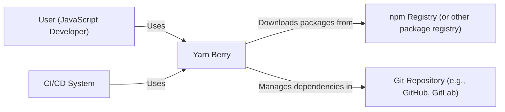
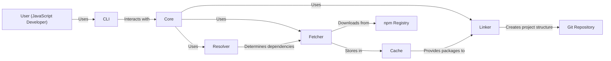
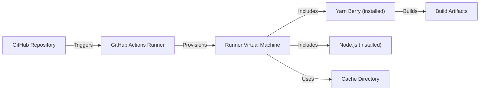

# Project Design Document: Yarn Berry

## BUSINESS POSTURE

Yarn Berry is the latest version of the Yarn package manager, a popular alternative to npm for managing JavaScript project dependencies. It aims to improve upon the original Yarn (classic) and npm in terms of speed, reliability, security, and features.

Business Priorities and Goals:

*   Provide a fast and reliable dependency management solution for JavaScript developers.
*   Improve developer experience through features like Plug'n'Play (PnP), Zero-Installs, and workspaces.
*   Enhance security by mitigating risks associated with traditional `node_modules` installations.
*   Offer a modern and extensible architecture for future development and community contributions.
*   Maintain compatibility with the vast majority of existing JavaScript projects and workflows.
*   Reduce disk space usage and improve installation times compared to traditional methods.

Most Important Business Risks:

*   Adoption: Failure to gain sufficient adoption by the JavaScript community, hindering its long-term viability.
*   Compatibility: Incompatibility with existing projects or tools, leading to user frustration and migration challenges.
*   Security Vulnerabilities: Introduction of new security vulnerabilities due to its redesigned architecture.
*   Maintenance and Support: Inability to maintain and support the project effectively, leading to bugs and unresolved issues.
*   Performance Regressions: Unexpected performance regressions compared to Yarn Classic or npm.
*   Complexity: Increased complexity for users unfamiliar with its new concepts (PnP, Zero-Installs).

## SECURITY POSTURE

Existing Security Controls:

*   security control: Integrity checking of downloaded packages using checksums (lockfile). Implemented in Yarn's core logic and described in the documentation.
*   security control: Offline cache to prevent network-based attacks during installation. Implemented in Yarn's core logic and described in the documentation.
*   security control: Strict enforcement of package versions specified in the lockfile. Implemented in Yarn's core logic and described in the documentation.
*   security control: Plug'n'Play (PnP) mode, which eliminates the `node_modules` directory, reducing the attack surface. Implemented in Yarn's core logic and described in the documentation.
*   security control: Code signing of releases (though not consistently enforced across all distribution channels). Partially implemented and needs improvement.
*   security control: Regular security audits and vulnerability scanning (details are not fully public). Mentioned in blog posts and community discussions.

Accepted Risks:

*   accepted risk: Reliance on third-party registries (e.g., npm registry) for package downloads.
*   accepted risk: Potential for supply chain attacks if a compromised package is published to a registry.
*   accepted risk: Limited control over the security practices of individual package authors.
*   accepted risk: User error, such as accidentally committing sensitive information to the repository.

Recommended Security Controls:

*   security control: Implement consistent code signing and verification for all release channels.
*   security control: Integrate Software Bill of Materials (SBOM) generation to improve supply chain visibility.
*   security control: Provide clear documentation and tooling for vulnerability reporting and remediation.
*   security control: Implement automated security checks in the CI/CD pipeline (SAST, DAST, SCA).
*   security control: Offer options for stricter security policies, such as requiring two-factor authentication for package publishing.

Security Requirements:

*   Authentication:
    *   Users publishing packages to registries should authenticate using strong credentials and preferably multi-factor authentication.
    *   Yarn should securely store and manage authentication tokens for accessing private registries.

*   Authorization:
    *   Yarn should respect registry-specific authorization mechanisms for accessing and publishing packages.
    *   Access control should be enforced to prevent unauthorized modifications to project dependencies.

*   Input Validation:
    *   Yarn should validate all user inputs, including package names, versions, and configuration options.
    *   Yarn should sanitize inputs to prevent injection attacks.

*   Cryptography:
    *   Yarn should use strong cryptographic algorithms for checksumming and integrity verification.
    *   Secure communication channels (HTTPS) should be used for all interactions with registries.
    *   Sensitive data, such as authentication tokens, should be stored securely using appropriate encryption mechanisms.

## DESIGN

### C4 CONTEXT



Element Descriptions:

*   Element:
    *   Name: User (JavaScript Developer)
    *   Type: Person
    *   Description: A developer who uses Yarn Berry to manage dependencies for their JavaScript projects.
    *   Responsibilities: Writing code, defining dependencies, running Yarn commands, configuring project settings.
    *   Security controls: Uses strong passwords, enables 2FA where available, follows secure coding practices.

*   Element:
    *   Name: Yarn Berry
    *   Type: Software System
    *   Description: The Yarn Berry package manager.
    *   Responsibilities: Resolving dependencies, downloading packages, installing packages, managing the lockfile, providing a CLI.
    *   Security controls: Integrity checking, offline cache, strict version enforcement, PnP mode, code signing (partial).

*   Element:
    *   Name: npm Registry (or other package registry)
    *   Type: External System
    *   Description: A repository where JavaScript packages are stored and published.
    *   Responsibilities: Hosting packages, providing an API for searching and downloading packages.
    *   Security controls: Registry-specific security measures (e.g., npm's security features).

*   Element:
    *   Name: Git Repository (e.g., GitHub, GitLab)
    *   Type: External System
    *   Description: A version control system where project code and configuration are stored.
    *   Responsibilities: Storing code, tracking changes, managing branches, facilitating collaboration.
    *   Security controls: Repository-specific security measures (e.g., access controls, branch protection).

*   Element:
    *   Name: CI/CD System
    *   Type: External System
    *   Description: Continuous Integration and Continuous Delivery system.
    *   Responsibilities: Build automation, testing, deployment.
    *   Security controls: Secure configuration, access control, secrets management.

### C4 CONTAINER



Element Descriptions:

*   Element:
    *   Name: User (JavaScript Developer)
    *   Type: Person
    *   Description: A developer who uses Yarn Berry to manage dependencies.
    *   Responsibilities: Interacting with the CLI.
    *   Security controls: Uses strong passwords, enables 2FA where available.

*   Element:
    *   Name: CLI
    *   Type: Container: Command-Line Interface
    *   Description: The command-line interface for interacting with Yarn Berry.
    *   Responsibilities: Parsing user commands, displaying output, interacting with the Core.
    *   Security controls: Input validation, sanitization.

*   Element:
    *   Name: Core
    *   Type: Container: Application
    *   Description: The core logic of Yarn Berry.
    *   Responsibilities: Managing the project configuration, orchestrating the dependency resolution, fetching, and linking processes.
    *   Security controls: Enforces security policies, manages authentication.

*   Element:
    *   Name: Resolver
    *   Type: Container: Component
    *   Description: Responsible for resolving dependencies based on the project's configuration and the lockfile.
    *   Responsibilities: Determining the correct versions of packages to install.
    *   Security controls: Uses lockfile for deterministic resolution, verifies package integrity.

*   Element:
    *   Name: Fetcher
    *   Type: Container: Component
    *   Description: Responsible for downloading packages from registries.
    *   Responsibilities: Retrieving packages, verifying checksums, storing packages in the cache.
    *   Security controls: HTTPS communication, checksum verification.

*   Element:
    *   Name: Linker
    *   Type: Container: Component
    *   Description: Responsible for creating the project's dependency structure (e.g., PnP or node_modules).
    *   Responsibilities: Linking packages together, creating the necessary files and directories.
    *   Security controls: Follows PnP security model, minimizes attack surface.

*   Element:
    *   Name: Cache
    *   Type: Container: Data Store
    *   Description: Stores downloaded packages for offline use and faster installations.
    *   Responsibilities: Storing and retrieving packages.
    *   Security controls: Access control, integrity checks.

*   Element:
    *   Name: npm Registry
    *   Type: External System
    *   Description: A repository where JavaScript packages are stored.
    *   Responsibilities: Hosting packages.
    *   Security controls: Registry-specific security measures.

*   Element:
    *   Name: Git Repository
    *   Type: External System
    *   Description: Stores project code and configuration.
    *   Responsibilities: Version control.
    *   Security controls: Repository-specific security measures.

### DEPLOYMENT

Possible Deployment Solutions:

1.  Global Installation: Installing Yarn Berry globally on a user's machine.
2.  Per-Project Installation: Installing Yarn Berry as a project dependency.
3.  Docker Container: Running Yarn Berry within a Docker container.
4.  CI/CD Environment: Using Yarn Berry within a CI/CD pipeline.

Chosen Solution (CI/CD Environment):

Yarn Berry is often used within CI/CD environments to build and test JavaScript projects. This section describes a typical deployment scenario using GitHub Actions.



Element Descriptions:

*   Element:
    *   Name: GitHub Repository
    *   Type: External System
    *   Description: The source code repository hosted on GitHub.
    *   Responsibilities: Storing code, triggering workflows.
    *   Security controls: Access controls, branch protection rules.

*   Element:
    *   Name: GitHub Actions Runner
    *   Type: Infrastructure Node
    *   Description: The service that executes workflows defined in the repository.
    *   Responsibilities: Provisioning virtual machines, running jobs.
    *   Security controls: GitHub Actions security features, runner isolation.

*   Element:
    *   Name: Runner Virtual Machine
    *   Type: Infrastructure Node
    *   Description: A virtual machine provisioned by GitHub Actions to execute a specific job.
    *   Responsibilities: Providing a runtime environment for the build process.
    *   Security controls: VM isolation, ephemeral environment.

*   Element:
    *   Name: Yarn Berry (installed)
    *   Type: Software
    *   Description: The Yarn Berry package manager installed on the runner VM.
    *   Responsibilities: Managing dependencies, building the project.
    *   Security controls: Inherits security controls from the Yarn Berry design.

*   Element:
    *   Name: Node.js (installed)
    *   Type: Software
    *   Description: The Node.js runtime installed on the runner VM.
    *   Responsibilities: Executing JavaScript code.
    *   Security controls: Node.js security best practices.

*   Element:
    *   Name: Cache Directory
    *   Type: Data Store
    *   Description: A directory used to cache Yarn dependencies between workflow runs.
    *   Responsibilities: Storing and retrieving cached dependencies.
    *   Security controls: Access control, cache integrity.

*   Element:
    *   Name: Build Artifacts
    *   Type: Data
    *   Description: The output of the build process (e.g., compiled code, bundled assets).
    *   Responsibilities: Representing the deployable application.
    *   Security controls: Artifact signing, secure storage.

### BUILD

The Yarn Berry project itself is built using a combination of tools and processes. This section describes the build process from a developer's perspective, focusing on security controls.

```mermaid
graph LR
    Developer["Developer"]
    LocalMachine["Local Machine"]
    Git["Git"]
    GitHub["GitHub Repository"]
    GitHubActions["GitHub Actions"]
    Tests["Tests"]
    Linters["Linters"]
    SAST["SAST (Static Analysis)"]
    Artifact["Build Artifact (npm package)"]
    npmRegistry["npm Registry"]

    Developer -- Commits code --> LocalMachine
    LocalMachine -- Pushes to --> Git
    Git -- Mirrors to --> GitHub
    GitHub -- Triggers --> GitHubActions
    GitHubActions -- Runs --> Tests
    GitHubActions -- Runs --> Linters
    GitHubActions -- Runs --> SAST
    Tests -- & Linters -- & SAST --> Artifact
    Artifact -- Published to --> npmRegistry
```

Build Process Description:

1.  Developer: A developer writes code and commits it to their local machine.
2.  Local Machine: The developer's local environment where code is written and tested.
3.  Git: The local Git repository.
4.  GitHub: The remote GitHub repository where the Yarn Berry source code is hosted.
5.  GitHub Actions: The CI/CD system used to automate the build process.
6.  Tests: Unit tests, integration tests, and end-to-end tests are executed to ensure code quality and functionality.
7.  Linters: Code linters (e.g., ESLint) are used to enforce coding style and identify potential errors.
8.  SAST (Static Analysis): Static analysis tools are used to scan the codebase for security vulnerabilities.  While the specific tools used are not explicitly mentioned in the repository, this is a recommended security control.
9.  Build Artifact (npm package): The final build artifact is a Yarn Berry npm package.
10. npm Registry: The npm registry where the Yarn Berry package is published.

Security Controls in Build Process:

*   security control: Code review: All code changes are reviewed by other developers before being merged.
*   security control: Automated testing: Extensive test suite to catch bugs and regressions.
*   security control: Linting: Enforces code style and identifies potential errors.
*   security control: Static analysis (SAST): Scans the codebase for security vulnerabilities (recommended, implementation details not fully public).
*   security control: Dependency management: Yarn Berry itself is used to manage its own dependencies, ensuring consistent and secure builds.
*   security control: CI/CD pipeline: Automates the build process, reducing the risk of manual errors.

## RISK ASSESSMENT

Critical Business Processes:

*   Dependency Management: The core process of resolving, downloading, and installing project dependencies.
*   Package Publishing: The process of publishing new versions of Yarn Berry to the npm registry.
*   Community Engagement: Maintaining an active and engaged community of users and contributors.

Data to Protect:

*   Source Code: The Yarn Berry codebase itself (sensitivity: medium).
*   Lockfile: Contains precise dependency information (sensitivity: medium).
*   Cache: Contains downloaded packages (sensitivity: medium).
*   User Credentials (for publishing): Authentication tokens for accessing private registries (sensitivity: high).
*   Build Artifacts: The compiled Yarn Berry package (sensitivity: medium).

## QUESTIONS & ASSUMPTIONS

Questions:

*   What specific SAST tools are used in the Yarn Berry build process?
*   What are the details of the security audits and vulnerability scanning procedures?
*   What is the process for handling security vulnerabilities reported by external researchers?
*   Are there any plans to implement SBOM generation?
*   What are the specific security configurations used in the CI/CD environment?
*   What mechanisms are in place to prevent or detect malicious code being introduced into the Yarn Berry codebase or its dependencies?

Assumptions:

*   BUSINESS POSTURE: The Yarn Berry project prioritizes security and aims to provide a secure dependency management solution.
*   SECURITY POSTURE: The project follows secure development practices, but there is room for improvement in areas like code signing and SBOM generation.
*   DESIGN: The design of Yarn Berry, particularly the PnP mode, inherently reduces some security risks associated with traditional `node_modules` installations. The CI/CD pipeline is configured securely. Developers follow secure coding practices.