## Project Design Document: clipboard.js

**Version:** 1.1
**Date:** October 26, 2023
**Author:** AI Software Architect

### 1. Introduction

This document provides an enhanced and detailed design overview of the `clipboard.js` library, a widely used JavaScript library designed to simplify copying text to the user's clipboard. This document is specifically crafted to serve as a foundational resource for subsequent threat modeling activities, clearly outlining the library's architecture, its constituent components, and the flow of data during its operation.

### 2. Goals and Objectives

The primary objective of `clipboard.js` is to offer a straightforward, consistent, and dependable method for web applications to interact with the user's system clipboard. Key objectives include:

* **Abstraction of Clipboard Complexity:** To hide the intricacies of the browser's underlying Clipboard API, providing a simpler interface for developers.
* **Broad Browser Compatibility:** To ensure consistent functionality across a wide range of web browsers, incorporating fallback mechanisms for older browsers lacking modern API support.
* **Event-Driven Interaction:** To initiate copy or cut actions based on user interactions, typically triggered by events like button clicks.
* **Versatile Content Selection:** To enable developers to specify the text intended for clipboard operations through various means, such as CSS selectors pointing to other elements or by directly providing the text content.
* **Transparent Feedback Mechanisms:** To provide clear indications of success or failure of clipboard operations through the use of callback functions.

### 3. Scope

This design document concentrates on the client-side architecture and operational characteristics of the `clipboard.js` library within the context of a web browser environment. The scope specifically includes:

* The fundamental building blocks and modules of the library.
* The progression of data during both copy and cut actions.
* The mechanisms of interaction with the browser's native Clipboard API.
* The role and operation of the fallback mechanism for older browsers, primarily ZeroClipboard.
* The handling of events that trigger clipboard actions and the associated user interactions.

This document explicitly excludes:

* Any server-side interactions or dependencies, as `clipboard.js` is designed as a purely client-side library.
* The detailed internal implementation of the browser's Clipboard API.
* An in-depth analysis of the ZeroClipboard library's internal workings beyond its functional role as a fallback.

### 4. Architecture and Components

The `clipboard.js` library is composed of the following essential components:

* **`ClipboardJS` Class:** This is the central class that orchestrates the library's overall functionality. Its responsibilities include:
    * Setting up and managing event listeners to capture user interactions.
    * Identifying the target element from which text should be copied or cut.
    * Retrieving the text content intended for the clipboard operation.
    * Managing the interaction with the browser's Clipboard API or activating the fallback mechanism when necessary.
    * Invoking user-defined success and error callback functions to provide feedback.
* **Event Delegation Mechanism:** The library employs event delegation as an efficient method for handling click events on elements that initiate clipboard actions. Instead of attaching individual listeners to each trigger element, a single listener is attached to a common ancestor element (often the document body). This optimizes performance and simplifies management of event handlers.
* **Target Resolution Logic:** This component within the `ClipboardJS` class is responsible for determining the origin of the text to be copied or cut. This determination can be made based on:
    * A reference to another element specified by a CSS selector, indicated by the `data-clipboard-target` attribute on the trigger element.
    * The direct text content provided within the trigger element itself, specified by the `data-clipboard-text` attribute.
* **Text Retrieval Functionality:** This refers to the internal function or method that extracts the actual text content from the element identified by the target resolution logic.
* **Action Determination Logic:** This part of the library interprets the `data-clipboard-action` attribute on the trigger element to determine whether a "copy" or "cut" operation is intended.
* **Clipboard API Interaction Module:** This is the core component that directly interfaces with the browser's asynchronous Clipboard API (`navigator.clipboard.writeText` for copying, and potentially `navigator.clipboard.readText` or `document.execCommand('cut')` for cutting, though `clipboard.js` primarily focuses on writing).
* **ZeroClipboard Fallback Implementation:** For compatibility with older browsers lacking support for the modern Clipboard API, `clipboard.js` historically incorporated ZeroClipboard. This component, which relies on a Flash-based solution, is activated when the browser does not support the native API. *Note: Modern versions of `clipboard.js` are moving away from ZeroClipboard due to Flash deprecation.*
* **Success Callback Function:** A function provided by the user that is executed when the copy or cut operation is completed successfully.
* **Error Callback Function:** A function provided by the user that is executed if the copy or cut operation encounters an error.

### 5. Data Flow

The following diagram illustrates the typical sequence of actions and data flow during a copy operation initiated by a user clicking a designated element:

```mermaid
graph LR
    A["User Initiates Action (Click on Trigger Element)"] --> B{"Event Listener Captures Event (Delegated)"};
    B --> C{"Identify Trigger Element and Attributes ('data-clipboard-target', 'data-clipboard-text', 'data-clipboard-action')"};
    C --> D{"Determine Action Type (Copy or Cut)"};
    D -- "Target Element Specified via 'data-clipboard-target'" --> E["Locate Target Element using CSS Selector"];
    D -- "Text Directly Specified via 'data-clipboard-text'" --> F["Retrieve Text from 'data-clipboard-text' Attribute"];
    E --> G["Extract Text Content from Target Element"];
    G --> H{"Check for Browser Clipboard API Support"};
    F --> H;
    H -- "Clipboard API Supported" --> I["Invoke Browser Clipboard API (e.g., navigator.clipboard.writeText)"];
    H -- "Clipboard API Not Supported" --> J["Activate ZeroClipboard Fallback (if available)"];
    I -- "Operation Successful" --> K["Execute User-Defined Success Callback"];
    I -- "Operation Failed" --> L["Execute User-Defined Error Callback"];
    J -- "Operation Successful" --> K;
    J -- "Operation Failed" --> L;
```

**Detailed Flow Description:**

1. **User Interaction:** A user interacts with the web page by clicking on an HTML element that is configured to trigger a clipboard operation. This element will typically have the `data-clipboard-target` or `data-clipboard-text` attribute.
2. **Event Handling:** The delegated event listener, attached to a parent element, intercepts the click event.
3. **Trigger Element Analysis:** The library identifies the specific element that triggered the event and examines its attributes, particularly `data-clipboard-target`, `data-clipboard-text`, and `data-clipboard-action`.
4. **Action Type Determination:** The library determines whether a "copy" or "cut" action is requested based on the value of the `data-clipboard-action` attribute.
5. **Target Resolution (if applicable):** If the `data-clipboard-target` attribute is present, the library uses the provided CSS selector to locate the DOM element whose content is intended for the clipboard.
6. **Text Retrieval:** The library retrieves the text content to be placed on the clipboard. This can occur in two ways:
    * By extracting the text content of the target element identified in the previous step.
    * By directly using the value of the `data-clipboard-text` attribute.
7. **Clipboard API Availability Check:** The library checks if the user's browser supports the modern asynchronous Clipboard API (`navigator.clipboard`).
8. **Clipboard API Interaction (if available):** If the Clipboard API is supported, the library calls the appropriate method (e.g., `navigator.clipboard.writeText()`) to write the retrieved text to the clipboard. This is an asynchronous operation.
9. **ZeroClipboard Fallback (if necessary):** If the browser lacks support for the modern Clipboard API, the library attempts to use the ZeroClipboard fallback mechanism (assuming it is included in the build). ZeroClipboard typically uses an embedded Flash object to perform the clipboard operation.
10. **Callback Execution:**
    * **Success:** If the clipboard operation is successful, the user-provided success callback function is executed, allowing the application to provide feedback to the user.
    * **Failure:** If the operation encounters an error (e.g., due to browser security restrictions or issues with the fallback mechanism), the user-provided error callback function is executed.

### 6. Security Considerations (Essential for Threat Modeling)

The following security considerations are crucial for understanding the potential threat landscape associated with `clipboard.js` and are essential for effective threat modeling:

* **Cross-Site Scripting (XSS) via Pasted Content:** While `clipboard.js` itself doesn't directly introduce XSS vulnerabilities, it facilitates the copying of text. If the source of the copied text is untrusted and this text is subsequently pasted into a vulnerable application that doesn't properly sanitize input, it could lead to XSS. *Threat Scenario:* A user copies malicious JavaScript from a compromised website using `clipboard.js` and pastes it into a form field of another website vulnerable to stored XSS.
* **Data Exfiltration through Clipboard Manipulation:** A compromised or malicious script could potentially leverage `clipboard.js` to silently copy sensitive data from the user's current page to the clipboard without the user's explicit consent or knowledge. This data could then be retrieved by other malicious processes or scripts. *Threat Scenario:* A malicious browser extension uses `clipboard.js` in the background to copy sensitive information displayed on a banking website to the clipboard.
* **Information Disclosure via Error Handling:**  Careless implementation of error callbacks or the library's internal error handling could inadvertently leak sensitive information about the application's internal state or data structure. *Threat Scenario:* An error callback reveals the path to a sensitive file or internal API endpoint.
* **Vulnerabilities in Dependencies (particularly ZeroClipboard):** If the ZeroClipboard fallback is used, any known vulnerabilities in the Adobe Flash Player could be exploited. This is a significant concern given the deprecation of Flash. *Threat Scenario:* An attacker exploits a known Flash vulnerability in ZeroClipboard to execute arbitrary code on the user's machine.
* **Clickjacking Attacks on Trigger Elements:** An attacker could potentially overlay a transparent or visually similar malicious element on top of the legitimate clipboard trigger element. This could trick the user into clicking the malicious element instead, leading to unintended actions, including copying content from a different source. *Threat Scenario:* A user intends to copy a discount code but is tricked into clicking a hidden element that copies a referral link controlled by the attacker.
* **Bypassing Browser Security Policies and Permissions:**  While browsers implement security policies to restrict clipboard access, vulnerabilities in the browser or the library itself could potentially allow these policies to be bypassed, leading to unauthorized clipboard access. *Threat Scenario:* A bug in `clipboard.js` or the browser's clipboard API allows a script to copy to the clipboard without user interaction or permission in situations where it should be blocked.
* **Man-in-the-Middle (MitM) Attacks:** If `clipboard.js` is loaded over an insecure HTTP connection, an attacker performing a MitM attack could potentially inject malicious code into the library or modify its behavior. *Mitigation:* Ensure `clipboard.js` is always loaded over HTTPS.

### 7. Deployment Model

`clipboard.js` is primarily a client-side library and is typically deployed by including its JavaScript file directly into HTML pages. Common deployment methods include:

* **Direct Inclusion via `<script>` Tag:**  Referencing the library file (either hosted locally or on a Content Delivery Network - CDN) using a `<script>` tag within the HTML document.
* **Module Bundlers (e.g., Webpack, Parcel):** Importing the library as a module in JavaScript projects that utilize module bundlers. This allows for better dependency management and optimized builds.

No server-side components are inherently required for the core functionality of `clipboard.js`.

### 8. Dependencies

* **Browser Clipboard API (`navigator.clipboard`):** The primary dependency for modern browsers is the native Clipboard API provided by the browser.
* **ZeroClipboard (Legacy):** For older browsers lacking native API support, `clipboard.js` historically depended on ZeroClipboard, which required the Adobe Flash Player plugin. *Note: Reliance on ZeroClipboard is generally discouraged due to Flash's deprecation and security concerns.*

This enhanced design document provides a more in-depth understanding of the `clipboard.js` library, specifically tailored for threat modeling purposes. By detailing the architecture, data flow, and potential security considerations, this document aims to equip security professionals with the necessary information to identify, assess, and mitigate potential risks associated with the use of this library in web applications.
