# Project Design Document: clipboard.js

**Version:** 1.1
**Date:** October 26, 2023
**Author:** Gemini (AI Language Model)

## 1. Project Overview

This document details the design of the `clipboard.js` library, a lightweight JavaScript solution for enabling copy and cut functionalities to the system clipboard without relying on Flash. This document serves as a foundational reference for understanding the library's architecture, individual components, and the flow of data within it. This understanding is crucial for subsequent threat modeling exercises.

## 2. Goals

* To provide a straightforward and efficient method for copying text to the clipboard in modern web browsers.
* To offer a robust fallback mechanism for older browsers lacking native Clipboard API support.
* To expose a developer-friendly and intuitive API for seamless integration.
* To maintain a small footprint with minimal external dependencies.
* To provide clear event notifications to developers regarding the success or failure of clipboard operations.

## 3. Non-Goals

* Implementing advanced clipboard manipulations beyond basic text copy and cut actions.
* Handling rich text formats or complex data structures for clipboard interactions.
* Providing server-side clipboard management capabilities.
* Offering a built-in user interface for clipboard interactions (the library operates programmatically).

## 4. Target Audience

* Web developers seeking to implement copy-to-clipboard or cut-to-clipboard functionality within their websites and web applications.

## 5. Architectural Overview

`clipboard.js` operates entirely on the client-side within the user's web browser. It prioritizes the browser's native asynchronous Clipboard API when available, falling back to a synchronous approach using a dynamically created, hidden `textarea` element for older browser compatibility. The library listens for user-initiated events (typically click events) on designated trigger elements and programmatically executes the requested clipboard operation.

```mermaid
graph LR
    subgraph "Browser Environment"
        A["User Interaction (e.g., Click on Trigger)"] --> B{"Event Listener (clipboard.js)"};
        B --> C{{"Determine Action (Copy or Cut) based on Attributes"}};
        C --> D{{"Identify Target Element (Source of Text)"}};
        D --> E{{"Retrieve Text Content from Target"}};
        subgraph "Clipboard API Flow (Modern Browsers)"
            E --> F{{"Call navigator.clipboard.writeText()"}};
            F --> G{{"Dispatch 'success' or 'error' Event"}};
        end
        subgraph "Fallback Flow (Older Browsers)"
            E --> H{{"Create Hidden <textarea> Element"}};
            H --> I{{"Append Text to <textarea>"}};
            I --> J{{"Select Text within <textarea>"}};
            J --> K{{"Execute document.execCommand('copy' or 'cut')"}};
            K --> L{{"Remove <textarea> Element"}};
            L --> G;
        end
    end
```

## 6. Component Description

* **`Clipboard` Class:** The core class of the library, responsible for:
    * Initializing and managing event listeners attached to trigger elements.
    * Determining the intended clipboard action (copy or cut) based on attributes of the trigger element.
    * Identifying the source element containing the text to be copied or the target element for the cut operation.
    * Orchestrating the text retrieval process from the identified source element.
    * Delegating the actual clipboard operation to either the browser's native Clipboard API or the fallback mechanism.
    * Dispatching custom events to signal the success or failure of the clipboard operation.

* **Trigger Element:** A DOM element (e.g., a `<button>`, `<a>`) designated to initiate the clipboard operation upon user interaction (typically a click). These elements are associated with `clipboard.js` through specific data attributes.

* **Target Element (Source):** The DOM element whose textual content is intended to be copied to the clipboard. This is typically specified using a CSS selector referenced by the `data-clipboard-target` attribute on the trigger element, or directly via the `data-clipboard-text` attribute.

* **Target Element (Destination - for `cut`):** The DOM element from which the text will be removed during a cut operation. This is implicitly the same as the source element in most cases.

* **Action Determination Logic:** The internal logic within the `Clipboard` class that evaluates the `data-clipboard-action` attribute of the trigger element to determine whether a "copy" or "cut" operation is requested.

* **Text Retrieval Logic:** The mechanism responsible for extracting the textual content from the designated target element. This may involve accessing the `value` property of form input elements or the `textContent` property of other DOM elements.

* **Clipboard API Interaction Module:** The section of code responsible for interacting with the browser's native asynchronous Clipboard API, primarily using the `navigator.clipboard.writeText()` method for copying text.

* **Fallback Mechanism (Hidden Textarea) Module:** The code responsible for implementing the fallback strategy for older browsers. This involves:
    * Dynamically creating a hidden `<textarea>` element and appending it to the DOM.
    * Inserting the text to be copied into the `<textarea>`.
    * Programmatically selecting the text within the `<textarea>`.
    * Executing the synchronous `document.execCommand('copy')` or `document.execCommand('cut')` command.
    * Removing the temporary `<textarea>` element from the DOM.

* **Event Dispatcher Module:** The component responsible for emitting custom events (e.g., `success`, `error`) on the trigger element. These events provide developers with feedback on the outcome of the clipboard operation and allow for custom handling.

## 7. Data Flow

The typical data flow for a copy operation proceeds as follows:

1. **User Interaction:** A user interacts with a designated trigger element (e.g., clicks a button) that is associated with `clipboard.js`.
2. **Event Handling:** The event listener attached by the `Clipboard` class intercepts the user interaction event.
3. **Action Determination:** The `Clipboard` class examines the `data-clipboard-action` attribute of the trigger element to determine if a "copy" or "cut" operation is intended.
4. **Target Identification:** The library utilizes the `data-clipboard-target` attribute (or `data-clipboard-text`) to locate the DOM element containing the text to be copied.
5. **Text Retrieval:** The textual content is extracted from the identified target element.
6. **Clipboard Operation:**
    * **Modern Browsers (Clipboard API):** The `navigator.clipboard.writeText()` method is invoked to asynchronously write the retrieved text to the system clipboard.
    * **Older Browsers (Fallback):**
        * A hidden `<textarea>` element is dynamically created and appended to the document body.
        * The retrieved text is inserted into the newly created `<textarea>`.
        * The text within the `<textarea>` is programmatically selected.
        * The `document.execCommand('copy')` command is executed synchronously.
        * The temporary `<textarea>` element is removed from the DOM.
7. **Event Dispatch:** A `success` event is dispatched on the trigger element if the operation is successful. An `error` event is dispatched if the operation fails.

For a "cut" operation, the data flow is largely similar, with the key difference being that after the text is successfully copied to the clipboard (using either the API or the fallback), the content of the target element is programmatically cleared.

## 8. Security Considerations (Detailed)

This section outlines potential security considerations relevant to `clipboard.js`, categorized for clarity:

* **Input Validation and Sanitization:**
    * **Pasting Untrusted Content:** While `clipboard.js` focuses on *copying*, the act of pasting content copied via this library into other applications could introduce vulnerabilities if the destination application doesn't properly sanitize the input. This is not a direct vulnerability of `clipboard.js` but a consideration for its usage.
    * **Data Injection via `data-clipboard-text`:** If the value of the `data-clipboard-text` attribute is dynamically generated based on unsanitized user input, it could potentially lead to the copying of malicious scripts or data.

* **Cross-Site Scripting (XSS):**
    * **Copying Malicious Content:** If the text being copied originates from an untrusted source (e.g., user-generated content without proper sanitization) and is subsequently pasted into a vulnerable application, it could lead to XSS. `clipboard.js` facilitates this transfer but doesn't inherently create the vulnerability.

* **Clickjacking:**
    * An attacker could potentially overlay a transparent or visually similar element on top of the legitimate trigger element. This could trick a user into clicking the malicious element, inadvertently triggering a copy or cut operation they did not intend, potentially copying sensitive information.

* **Clipboard Manipulation and Information Disclosure:**
    * **Unintended Data Copying:**  Care must be taken to ensure that the correct target element and text are being copied. Incorrect configuration could lead to the unintentional copying of sensitive data.
    * **Clipboard History (Operating System Dependent):** Users should be aware that copied data may be stored in the operating system's clipboard history, potentially accessible to other applications. This is a general clipboard behavior, not specific to `clipboard.js`.

* **Fallback Mechanism Security:**
    * **`document.execCommand` Security Context:** While widely supported, the security implications of `document.execCommand('copy'/'cut')` should be considered. Browser security models generally restrict clipboard access, but potential vulnerabilities in specific browser implementations could exist.

* **Dependency Chain Security:**
    * While `clipboard.js` aims for minimal dependencies, if it were to rely on external libraries in the future, the security of those dependencies would need to be considered.

* **Man-in-the-Middle (MITM) Attacks:**
    * If the website using `clipboard.js` is served over an insecure HTTP connection, an attacker performing a MITM attack could potentially inject malicious code into the `clipboard.js` library or the surrounding JavaScript, leading to unintended or malicious clipboard operations. Using HTTPS is crucial.

## 9. Technologies Used

* **JavaScript (ECMAScript 5 and above):** The primary programming language for the library's implementation.
* **DOM API (Document Object Model):** Used for interacting with HTML elements, manipulating the document structure, and attaching event listeners.
* **Clipboard API (`navigator.clipboard`):** The modern asynchronous browser API for interacting with the system clipboard.
* **`document.execCommand('copy')` and `document.execCommand('cut')`:** Synchronous commands used as a fallback mechanism for older browsers to interact with the clipboard.
* **HTML:** Used for defining the structure of web pages where `clipboard.js` is utilized and for specifying the trigger and target elements.

## 10. Deployment Considerations

* **Direct Inclusion via `<script>` Tag:** The most common method, either by linking to a hosted version on a Content Delivery Network (CDN) or by including a locally hosted copy of the `clipboard.js` file.
* **Package Managers (npm, yarn):** Installation and management of `clipboard.js` as a dependency within a larger JavaScript project using package managers like npm or yarn. This allows for easier version management and integration with build processes.
* **Bundlers (Webpack, Parcel, Rollup):** Integration of `clipboard.js` into larger application bundles using module bundlers, optimizing the delivery and management of JavaScript code.

## 11. Future Considerations

* **Further Optimization of Fallback Mechanism:** Exploring alternative or more efficient fallback strategies if `document.execCommand` becomes less reliable or is deprecated in the future.
* **Improved Error Handling and Reporting:** Enhancing the granularity and informativeness of error events to provide developers with more detailed feedback on clipboard operation failures.
* **Accessibility Enhancements:** Investigating opportunities to improve the accessibility of clipboard operations for users with disabilities, ensuring compatibility with assistive technologies.
* **Monitoring Browser API Evolution:** Continuously tracking the development and evolution of browser clipboard APIs to adopt new features and best practices.
* **Potential for Asynchronous Fallback:** Researching possibilities for implementing an asynchronous fallback mechanism to improve performance and user experience in older browsers.

This revised design document provides a more detailed and structured overview of the `clipboard.js` library. It offers a deeper understanding of its architecture, components, data flow, and security considerations, making it a more robust foundation for subsequent threat modeling activities.