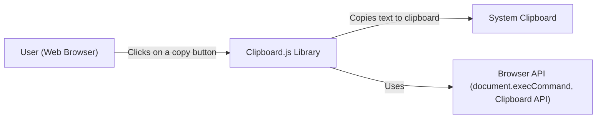
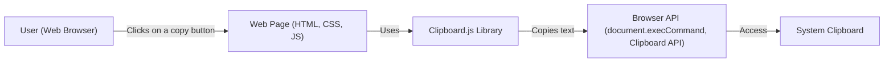
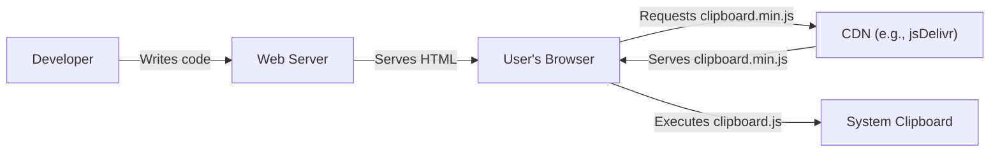
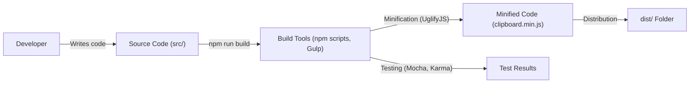

# Project Design Document: clipboard.js

## BUSINESS POSTURE

clipboard.js is a small, open-source library that provides a modern approach to copying text to the clipboard. It's designed to be lightweight and dependency-free. The project's primary goal is to simplify the often-cumbersome process of implementing copy-to-clipboard functionality in web applications, enhancing user experience.

Business Priorities:

*   Ease of Use: Provide a simple and intuitive API for developers.
*   Cross-Browser Compatibility: Ensure consistent behavior across different web browsers.
*   Lightweight and Dependency-Free: Minimize the library's footprint and avoid external dependencies.
*   Maintainability: Keep the codebase clean, well-documented, and easy to maintain.
*   Community Engagement: Foster a welcoming community and encourage contributions.

Business Risks:

*   Browser Compatibility Issues: Changes in browser APIs or security models could break functionality.
*   Security Vulnerabilities: Although primarily a client-side library, potential vulnerabilities could be exploited, especially if misused in conjunction with user-supplied data.
*   Maintenance Overhead: As an open-source project, maintaining the library and addressing issues relies on community contributions and the availability of maintainers.
*   Lack of Adoption: If developers don't find the library useful or if better alternatives emerge, the project could become obsolete.

## SECURITY POSTURE

Existing Security Controls:

*   security control: Input Sanitization: The library appears to sanitize input to some extent by focusing on text content, mitigating potential injection risks. (Implicit in the library's functionality).
*   security control: No eval(): The library avoids using `eval()`, which is a common source of security vulnerabilities. (Review of the source code).
*   security control: Limited Scope: The library's scope is limited to copying text, reducing the attack surface. (Design of the library).
*   security control: Open Source: The code is publicly available for review and scrutiny, allowing for community-driven security audits. (GitHub repository).

Accepted Risks:

*   accepted risk: Client-Side Manipulation: As a client-side library, it's inherently susceptible to manipulation by malicious users. This is a fundamental limitation of client-side code.
*   accepted risk: Browser-Specific Exploits: Undiscovered browser-specific vulnerabilities could potentially be exploited, although this is outside the direct control of the library.
*   accepted risk: Reliance on Browser APIs: The library depends on browser APIs (like `document.execCommand` and `Clipboard API`), and changes or deprecations in these APIs could affect functionality and potentially introduce security concerns.

Recommended Security Controls:

*   security control: Content Security Policy (CSP) Integration: Provide guidance in the documentation on how to integrate clipboard.js with a website's CSP to further mitigate potential XSS risks.
*   security control: Subresource Integrity (SRI) Support: If distributing via CDN, provide SRI hashes to ensure the integrity of the library file.
*   security control: Security Audits: Encourage regular security audits by independent researchers or security professionals.

Security Requirements:

*   Authentication: Not applicable, as the library doesn't handle user authentication.
*   Authorization: Not applicable, as the library doesn't manage user permissions or roles.
*   Input Validation:
    *   The library should primarily handle plain text. Any handling of HTML or other rich text formats should be carefully scrutinized for potential XSS vulnerabilities.
    *   If the library provides options for customizing the copied text (e.g., through event listeners), ensure that these options are properly sanitized.
*   Cryptography: Not directly applicable, as the library's primary function doesn't involve encryption. However, if the library were to handle sensitive data (which it shouldn't), proper encryption mechanisms should be considered.
*   Data Sensitivity: The library should treat all copied data as potentially sensitive, even if it appears to be plain text.

## DESIGN

### C4 CONTEXT

Element Descriptions:

*   Element: User
    *   Name: User
    *   Type: Person
    *   Description: A person interacting with a web page that uses clipboard.js.
    *   Responsibilities: Interacts with the web page, clicks on elements that trigger copy-to-clipboard functionality.
    *   Security controls: Relies on browser security mechanisms and website security implementation.

*   Element: Clipboard.js Library
    *   Name: Clipboard.js Library
    *   Type: Software System
    *   Description: The clipboard.js library, embedded within a web page.
    *   Responsibilities: Provides an API for copying text to the system clipboard. Handles events triggered by user interaction.
    *   Security controls: Input sanitization, avoidance of `eval()`, limited scope of functionality.

*   Element: System Clipboard
    *   Name: System Clipboard
    *   Type: Software System
    *   Description: The operating system's clipboard.
    *   Responsibilities: Stores data copied by applications, allowing it to be pasted elsewhere.
    *   Security controls: Managed by the operating system; clipboard.js has no direct control.

*   Element: Browser API
    *   Name: Browser API
    *   Type: Software System
    *   Description: The browser's built-in APIs for interacting with the clipboard (e.g., `document.execCommand`, `Clipboard API`).
    *   Responsibilities: Provides the underlying mechanism for copying text to the clipboard.
    *   Security controls: Managed by the browser vendor; clipboard.js relies on the security of these APIs.

### C4 CONTAINER

Element Descriptions:

*   Element: User
    *   Name: User
    *   Type: Person
    *   Description: A person interacting with a web page that uses clipboard.js.
    *   Responsibilities: Interacts with the web page, clicks on elements that trigger copy-to-clipboard functionality.
    *   Security controls: Relies on browser security mechanisms and website security implementation.

*   Element: Web Page
    *   Name: Web Page
    *   Type: Container: Web Application
    *   Description: The web page that embeds and uses the clipboard.js library.
    *   Responsibilities: Presents content to the user, includes and initializes clipboard.js, defines elements that trigger copy actions.
    *   Security controls: Website's overall security implementation (e.g., CSP, XSS protection).

*   Element: Clipboard.js Library
    *   Name: Clipboard.js Library
    *   Type: Container: JavaScript Library
    *   Description: The clipboard.js library, embedded within a web page.
    *   Responsibilities: Provides an API for copying text to the system clipboard. Handles events triggered by user interaction.
    *   Security controls: Input sanitization, avoidance of `eval()`, limited scope of functionality.

*   Element: Browser API
    *   Name: Browser API
    *   Type: Container: Browser API
    *   Description: The browser's built-in APIs for interacting with the clipboard (e.g., `document.execCommand`, `Clipboard API`).
    *   Responsibilities: Provides the underlying mechanism for copying text to the clipboard.
    *   Security controls: Managed by the browser vendor; clipboard.js relies on the security of these APIs.

*   Element: System Clipboard
    *   Name: System Clipboard
    *   Type: Container: Operating System Component
    *   Description: The operating system's clipboard.
    *   Responsibilities: Stores data copied by applications, allowing it to be pasted elsewhere.
    *   Security controls: Managed by the operating system; clipboard.js has no direct control.

### DEPLOYMENT

clipboard.js is a client-side JavaScript library, and its "deployment" typically involves including it in a web page. There are several ways to do this:

1.  **Direct Download:** Download the library file (`clipboard.min.js`) and include it in the project's directory structure.
2.  **CDN (Content Delivery Network):** Link to the library hosted on a CDN, such as jsDelivr or cdnjs. This is the recommended approach for most users.
3.  **Package Manager (npm, yarn):** Install the library as a dependency using a package manager. This is common for projects using build tools like Webpack or Parcel.

Chosen Deployment Method (CDN):

Element Descriptions:

*   Element: Developer
    *   Name: Developer
    *   Type: Person
    *   Description: The developer integrating clipboard.js into their web application.
    *   Responsibilities: Writes the HTML, CSS, and JavaScript code for the web page, includes clipboard.js, and configures its usage.
    *   Security controls: Follows secure coding practices.

*   Element: Web Server
    *   Name: Web Server
    *   Type: Software System
    *   Description: The server hosting the web application.
    *   Responsibilities: Serves the HTML, CSS, JavaScript, and other assets to the user's browser.
    *   Security controls: Standard web server security measures (e.g., HTTPS, firewalls).

*   Element: User's Browser
    *   Name: User's Browser
    *   Type: Software System
    *   Description: The user's web browser.
    *   Responsibilities: Renders the web page, executes JavaScript code (including clipboard.js), interacts with the system clipboard.
    *   Security controls: Browser's built-in security mechanisms.

*   Element: CDN
    *   Name: CDN
    *   Type: Software System
    *   Description: A Content Delivery Network (e.g., jsDelivr, cdnjs).
    *   Responsibilities: Hosts and serves static assets like clipboard.min.js, providing fast and reliable delivery.
    *   Security controls: CDN provider's security measures (e.g., HTTPS, DDoS protection).

*   Element: System Clipboard
    *   Name: System Clipboard
    *   Type: Software System
    *   Description: The operating system's clipboard.
    *   Responsibilities: Stores data copied by applications.
    *   Security controls: Managed by the operating system.

### BUILD

clipboard.js uses a build process to create the minified version of the library (`clipboard.min.js`) from the source files. This process typically involves:

1.  **Source Code (src/):** The core JavaScript code for the library.
2.  **Build Tools (npm scripts, Gulp):**  The project uses npm scripts and Gulp as a task runner to automate the build process.
3.  **Minification (UglifyJS):** UglifyJS is used to minify the JavaScript code, reducing its file size for faster loading in browsers.
4.  **Testing (Mocha, Karma):** The project includes unit tests using Mocha and Karma to ensure the library functions correctly.
5.  **Distribution (dist/):** The build process generates the minified `clipboard.min.js` file in the `dist/` directory.

Security Controls in Build Process:

*   security control: Dependency Management: npm is used to manage dependencies, allowing for tracking and updating of libraries used in the build process.
*   security control: Linting: The project likely uses a linter (although not explicitly mentioned, it's standard practice) to enforce code style and identify potential errors.
*   security control: Testing: Automated tests help ensure the library functions as expected and can catch regressions introduced by changes.
*   security control: Build Automation: The build process is automated using npm scripts and Gulp, reducing the risk of manual errors.

## RISK ASSESSMENT

Critical Business Processes:

*   Providing a seamless copy-to-clipboard experience for users of web applications that integrate clipboard.js.
*   Maintaining the library's reputation as a reliable and secure solution for copy-to-clipboard functionality.

Data Protection:

*   Data Sensitivity: The library primarily handles text data copied by the user. While this data is often not highly sensitive, it *could* include passwords, personal information, or other confidential data, depending on the context where clipboard.js is used. The library itself does not store or transmit this data; it only facilitates copying it to the system clipboard.
*   Data to Protect: The primary data to protect is the integrity of the library itself (preventing malicious modifications) and ensuring it doesn't introduce vulnerabilities into applications that use it.

## QUESTIONS & ASSUMPTIONS

Questions:

*   Are there any specific compliance requirements (e.g., GDPR, CCPA) that apply to the use of clipboard.js in applications? (Assumption: No specific compliance requirements beyond general data privacy best practices.)
*   Are there any plans to extend the functionality of clipboard.js beyond plain text copying? (Assumption: The library will primarily focus on plain text.)
*   What is the process for reporting and addressing security vulnerabilities discovered in clipboard.js? (Assumption: There is a process for responsible disclosure, likely through GitHub issues or a dedicated security contact.)

Assumptions:

*   BUSINESS POSTURE: The primary goal is to provide a simple, lightweight, and reliable copy-to-clipboard solution.
*   SECURITY POSTURE: The library is used in a wide range of web applications, and developers integrating it are responsible for the overall security of their applications.
*   DESIGN: The library's design prioritizes simplicity and cross-browser compatibility. The build process is automated and includes testing. The deployment model relies on standard web development practices (including the library via `<script>` tag).