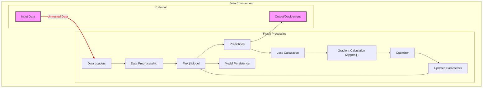

# Project Design Document: Flux.jl for Threat Modeling (Improved)

**Version:** 2.0
**Date:** October 26, 2023
**Author:** AI Software Architect

## 1. Introduction

This document provides an enhanced architectural overview of the Flux.jl project, a machine learning library written in Julia, specifically tailored for threat modeling. Building upon the previous version, this document offers more granular details about the components, data flows, and interactions within the Flux.jl ecosystem, with a stronger emphasis on potential security implications and trust boundaries. This document is intended for security engineers, developers, and anyone involved in assessing the security posture of systems utilizing Flux.jl.

## 2. Project Overview

Flux.jl is a modern, lightweight, and extensible machine learning library for the Julia programming language. Its design prioritizes composability and performance, enabling users to construct intricate neural networks and other machine learning models efficiently. Flux.jl leverages Julia's strengths in numerical computation and automatic differentiation, primarily through `Zygote.jl`, to offer a robust and adaptable platform for machine learning research and development.

## 3. System Architecture

Flux.jl's architecture is centered around its internal components and their interactions within a Julia environment. Understanding these interactions and the boundaries between them is crucial for identifying potential security vulnerabilities.

### 3.1. Key Components with Security Considerations

*   **`Core`:**  The foundation of Flux.jl, containing the essential building blocks for neural networks.
    *   **Layers:** Predefined neural network layers (e.g., `Dense`, `Conv`, `RNN`). *Security Consideration:* Custom layers defined by users could introduce arbitrary code execution risks if not carefully implemented and reviewed. Input validation within layer implementations is crucial.
    *   **Model Construction (`Chain`):**  The mechanism for sequentially composing layers. *Security Consideration:* The order and configuration of layers can impact model robustness against adversarial attacks.
    *   **Parameter Management:**  Handles the storage and manipulation of model weights and biases. *Security Consideration:*  Access control and secure storage of model parameters are important to prevent unauthorized modification or leakage.
    *   **Loss Functions:** Implementations of common loss functions (e.g., `MeanSquaredError`, `CrossEntropyLoss`). *Security Consideration:*  While generally safe, custom loss functions could introduce vulnerabilities if they involve external calls or unsafe operations.
    *   **Optimizers:** Algorithms for updating model parameters during training (e.g., `Adam`, `SGD`). *Security Consideration:* Optimizer configurations can influence the model's susceptibility to certain attacks.
    *   **Automatic Differentiation (`Zygote.jl`):** Computes gradients. *Security Consideration:*  Bugs or vulnerabilities in the AD engine could lead to incorrect gradient calculations, potentially impacting model security.

*   **`Data`:** Manages data loading and manipulation for training and inference.
    *   **Data Loaders:** Interfaces for iterating over datasets from various sources (files, network). *Security Consideration:* Data loaders are a primary entry point for external data. Input validation and sanitization within data loaders are critical to prevent data poisoning and injection attacks. Trust boundaries exist between the data source and the Flux.jl environment.
    *   **Data Transformations:** Functions for preprocessing data (e.g., normalization, augmentation). *Security Consideration:*  Carelessly implemented transformations could introduce vulnerabilities or biases.
    *   **Integration with Julia Arrays:**  Relies on Julia's efficient array types. *Security Consideration:*  While Julia arrays are generally safe, vulnerabilities in Julia's core array handling could impact Flux.jl.

*   **`Training`:** Provides tools and utilities for training machine learning models.
    *   **Training Loops:** Standardized structures for iterating over data and updating model parameters. *Security Consideration:*  Custom training loops might introduce vulnerabilities if they bypass standard security practices.
    *   **Callbacks:** Mechanisms for executing custom code during training (e.g., logging, early stopping). *Security Consideration:* Callbacks execute user-defined code and represent a significant trust boundary. Unvalidated or malicious callback code can compromise the training process.
    *   **GPU Acceleration (`CUDA.jl` / `AMDGPU.jl`):** Support for training on GPUs. *Security Consideration:*  Vulnerabilities in GPU drivers or the acceleration libraries could be exploited.

*   **`Extensions/Ecosystem`:**  Interactions with the broader Julia ecosystem.
    *   **`Zygote.jl`:** The primary automatic differentiation engine. *Security Consideration:*  As a core dependency, its security is paramount.
    *   **`Optimisers.jl`:** A separate package for optimization algorithms. *Security Consideration:*  Security of external optimizer implementations needs consideration.
    *   **`MLUtils.jl`:** Provides utilities for common ML tasks. *Security Consideration:*  Potential vulnerabilities in utility functions.
    *   **`CUDA.jl` / `AMDGPU.jl`:** For GPU acceleration. *Security Consideration:*  Security of these low-level libraries is crucial.
    *   **Other Julia Packages:** Integration with various libraries. *Security Consideration:*  Each external dependency introduces a potential attack surface. Supply chain security is a concern.

### 3.2. Component Interactions and Trust Boundaries

The following list describes how the key components interact and highlights trust boundaries:

*   **User Code <-> `Core`:** Users define models and interact with core functionalities. This is a significant trust boundary, as user-provided code can directly influence model behavior.
*   **User Data Source <-> `Data`:** External data sources are loaded through data loaders. This is a critical trust boundary where data validation and sanitization are essential.
*   **`Training` <-> Callbacks:**  Callbacks execute user-defined code within the training loop, representing a high-risk trust boundary.
*   **`Core` <-> `Zygote.jl`:** Flux.jl relies on `Zygote.jl` for automatic differentiation. The integrity of `Zygote.jl` is implicitly trusted.
*   **Flux.jl <-> External Packages:** Interactions with other Julia packages introduce dependencies and potential vulnerabilities.

### 3.3. Deployment Context and Security Implications

While Flux.jl is a library, the deployment of models trained with it introduces security considerations:

*   **Deployment within Julia Applications:**  If the application using the Flux.jl model is compromised, the model and its data are also at risk.
*   **Serving Models via APIs:**  APIs expose models to external requests, requiring careful input validation and protection against adversarial inputs. Trust boundaries exist between the API and the model.
*   **Exported Models (e.g., ONNX):**  The security of the environment where the exported model is deployed is crucial. The export process itself should be secure to prevent tampering.

## 4. Data Flow with Security Considerations

The following list describes the typical flow of data and highlights potential security concerns at each stage:

*   **Input Data (External Source) -> Data Loaders:** *Security Consideration:* This is a primary entry point for potentially malicious data. Data validation, sanitization, and integrity checks are crucial. Trust boundary.
*   **Data Loaders -> Data Preprocessing:** *Security Consideration:*  Ensure preprocessing steps do not introduce vulnerabilities or biases.
*   **Data Preprocessing -> Julia Arrays:** *Security Consideration:*  While generally safe, potential vulnerabilities in Julia's array handling could be exploited.
*   **Julia Arrays -> Training Loops:**
*   **Training Loops -> Model Layers (Forward Pass):** *Security Consideration:*  Adversarial inputs can be crafted to exploit vulnerabilities in model layers.
*   **Model Layers -> Loss Calculation:**
*   **Loss Calculation -> Gradient Calculation (`Zygote.jl`):**
*   **Gradient Calculation -> Optimizer:**
*   **Optimizer -> Updated Parameters:**
*   **Updated Parameters -> Model:**
*   **New Input Data (External Source) -> Model (Inference):** *Security Consideration:* Similar to training data, input validation is crucial to prevent adversarial attacks during inference. Trust boundary.
*   **Model -> Predictions:**
*   **Model -> Model Persistence (Storage):** *Security Consideration:* Secure storage and access control for trained models are essential to prevent unauthorized access or modification.

## 5. Security Considerations (Detailed)

This section expands on the initial security considerations, providing more specific examples and potential attack vectors.

*   **Dependency Vulnerabilities:**  Regularly audit and update dependencies. Use tools to scan for known vulnerabilities in `Zygote.jl`, `Optimisers.jl`, `MLUtils.jl`, and other external packages.
*   **Data Poisoning:** Implement robust input validation and sanitization in data loaders. Consider using techniques like anomaly detection to identify potentially poisoned data.
*   **Adversarial Attacks:**  Employ techniques like adversarial training and input sanitization to improve model robustness against adversarial examples. Be aware of different types of adversarial attacks (e.g., evasion, poisoning).
*   **Model Extraction:**  Implement measures to protect model intellectual property, such as limiting access to model parameters and using techniques like model watermarking.
*   **Code Injection:**  Carefully review and sanitize any user-provided code, especially within custom layers, loss functions, and callbacks. Avoid using `eval()` or similar functions on untrusted input.
*   **Denial of Service:**  Implement resource limits and rate limiting to prevent resource exhaustion attacks. Be mindful of computationally expensive operations within the model and training process.
*   **Supply Chain Attacks:**  Use trusted package repositories and verify the integrity of downloaded packages. Employ software bill of materials (SBOMs) to track dependencies.
*   **Insecure Deserialization:**  Use secure serialization methods when saving and loading models. Avoid using pickle or similar formats with untrusted data. Consider using formats like JLD2 with appropriate security measures.
*   **Information Disclosure:**  Review logging configurations to ensure sensitive information is not inadvertently logged. Handle errors gracefully and avoid exposing internal details in error messages.
*   **Insufficient Input Validation:**  Validate all external inputs, including data, model configurations, and user-provided code, to prevent unexpected behavior and potential exploits.
*   **Lack of Access Controls:** Implement appropriate access controls for model parameters, training data, and deployment environments.

## 6. Technologies Used

*   **Julia Programming Language:** The core language, requiring awareness of Julia-specific security considerations.
*   **Zygote.jl:**  Automatic differentiation engine.
*   **Optimisers.jl:** Optimization algorithms.
*   **MLUtils.jl:** Machine learning utilities.
*   **CUDA.jl / AMDGPU.jl:** GPU acceleration libraries.
*   **JLD2.jl:** For saving and loading Julia data structures (consider security implications).
*   **Standard Julia Libraries:**  Including those for networking, file I/O, etc.

## 7. Diagrams

### 7.1. Component Diagram with Trust Boundaries

```mermaid
graph LR
    subgraph "Flux.jl Core"
        A["Layers"]
        B["Model Construction (Chain)"]
        C["Parameter Management"]
        D["Loss Functions"]
        E["Optimizers"]
        F["Automatic Differentiation (Zygote.jl)"]
    end
    subgraph "Flux.jl Data"
        G["Data Loaders"]
        H["Data Transformations"]
        I["Julia Arrays"]
    end
    subgraph "Flux.jl Training"
        J["Training Loops"]
        K["Callbacks"]
        L["GPU Acceleration (CUDA.jl/AMDGPU.jl)"]
    end
    subgraph "User Space"
        M["User Code"]
        UD["User Data Source"]
    end

    M -- "Model Definition, Custom Layers" --> A
    UD -- "Training/Inference Data" --> G
    G -- "Loaded Data" --> I
    A --> B
    B --> C
    B --> D
    B --> E
    D --> F
    E --> F
    I --> J
    J --> B
    J --> D
    J --> E
    J --> F
    J --> I
    J -- "Custom Logic" --> K
    J --> L
    L --> I
    F --> C

    style M fill:#f9f,stroke:#333,stroke-width:2px
    style UD fill:#f9f,stroke:#333,stroke-width:2px
    linkStyle 0,1,14,15,16,17,18,19,20,21,22,23,24,25,26,27 stroke:#CC0000,stroke-width:2px,color:red;
    classDef trustBoundary fill:#f9f,stroke:#333,stroke-width:2px;
    class M,UD trustBoundary;
```

### 7.2. Data Flow Diagram with Trust Boundaries



## 8. Conclusion

This improved design document provides a more detailed and security-focused overview of the Flux.jl project. By explicitly identifying components, data flows, interactions, and trust boundaries, it serves as a more robust foundation for conducting thorough threat modeling activities. A comprehensive threat model should further analyze the security considerations outlined here, identify specific threats and vulnerabilities, and propose appropriate mitigation strategies to ensure the secure development and deployment of machine learning solutions using Flux.jl.