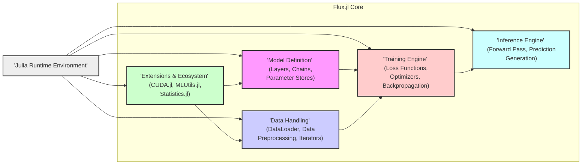
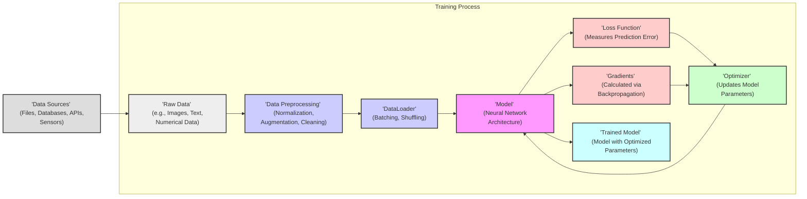
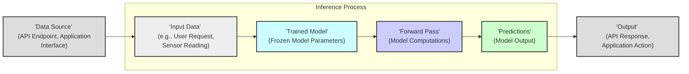

## Project Design Document: Flux.jl - The Julia Machine Learning Library

**Version:** 1.1
**Date:** October 26, 2023
**Author:** AI Architecture Expert

### 1. Introduction

This document provides a detailed architectural overview of Flux.jl, the machine learning library written in Julia, specifically tailored for threat modeling purposes. It elaborates on the key components, data flows, and interactions within the Flux.jl ecosystem, providing a comprehensive context for identifying potential security vulnerabilities and attack vectors. This document is intended for security engineers, developers, and anyone involved in assessing and mitigating security risks in systems utilizing Flux.jl.

### 2. Goals

*   Provide a granular and precise overview of the Flux.jl architecture relevant to security considerations.
*   Clearly define the boundaries and responsibilities of each key component.
*   Illustrate the primary data flows, highlighting potential interception and manipulation points.
*   Detail the interactions with external systems and data sources, emphasizing associated security risks.
*   Establish a robust foundation for conducting a systematic and thorough threat model.

### 3. Scope

This document focuses on the core architectural elements of the Flux.jl library that are pertinent to security. It covers aspects related to model definition, data handling (loading, preprocessing), training processes, inference mechanisms, and interactions with the Julia runtime and external entities. The scope includes the logical architecture and data flow but does not extend to the physical infrastructure or specific deployment configurations unless directly relevant to the library's behavior.

### 4. System Overview

Flux.jl is designed as a performant and composable machine learning library in Julia. Its architecture facilitates the construction, training, and deployment of machine learning models, particularly neural networks. The library's modular design allows for flexible customization and extension.

#### 4.1. Key Actors

*   **Developers:** Write Julia code to define model architectures, training loops, and data pipelines using Flux.jl. They are responsible for the initial security posture of the code they write.
*   **Data Scientists/ML Engineers:** Utilize Flux.jl for model development, experimentation, and deployment. They are concerned with data security and model integrity.
*   **System Administrators/DevOps:** Manage the infrastructure where Flux.jl applications are executed. They are responsible for the security of the runtime environment and external dependencies.
*   **End Users/External Systems:** Consume the predictions generated by models trained with Flux.jl, often through APIs or other interfaces. They are potential targets for attacks exploiting model vulnerabilities.

#### 4.2. High-Level Architecture

#### 4.3. Core Components

*   **Model Definition:**
    *   **Functionality:** Provides the core abstractions for defining neural network architectures. This includes `Layer` types, `Chain` for composing layers, and mechanisms for managing model parameters (weights and biases).
    *   **Security Relevance:**  Model definitions written by developers can introduce vulnerabilities if they rely on insecure external code or if they are dynamically generated from untrusted inputs, leading to code injection.
*   **Data Handling:**
    *   **Functionality:**  Manages the loading, preprocessing, and batching of data. Key components include `DataLoader` for iterating over datasets and functions for transformations and augmentation.
    *   **Security Relevance:** This component interacts directly with external data sources, making it a prime target for attacks like data poisoning (injecting malicious data) or unauthorized data access. Improper input validation can also lead to vulnerabilities.
*   **Training Engine:**
    *   **Functionality:** Implements the core training logic. This involves calculating the loss using `Loss` functions, computing gradients via backpropagation, and updating model parameters using `Optimizer` algorithms.
    *   **Security Relevance:**  The training process is susceptible to manipulation. Adversaries might try to influence the training process to create biased or backdoored models. Resource exhaustion attacks targeting the training process are also possible.
*   **Inference Engine:**
    *   **Functionality:** Executes the trained model to generate predictions on new input data through a forward pass.
    *   **Security Relevance:**  This is the point where the model interacts with the real world. Adversarial examples designed to fool the model are a major concern. Also, vulnerabilities in the inference code could lead to information leakage or denial of service.
*   **Extensions & Ecosystem:**
    *   **Functionality:** Integrates with other Julia packages to extend Flux.jl's capabilities. Examples include `CUDA.jl` for GPU acceleration and `MLUtils.jl` for data manipulation.
    *   **Security Relevance:**  Introduces dependencies that can have their own vulnerabilities. The security of Flux.jl is partially dependent on the security of these external packages.

### 5. Data Flow Diagrams

#### 5.1. Model Training Data Flow (Detailed)

*   **Data Sources:**  Potentially untrusted sources where raw data originates.
*   **Data Preprocessing:** A critical stage where data manipulation can introduce vulnerabilities if not handled carefully (e.g., format string bugs, buffer overflows in custom preprocessing functions).
*   **DataLoader:** Efficiently feeds data to the model. Vulnerabilities here could impact the training process's integrity.
*   **Model:** The core component being trained. Susceptible to attacks that manipulate its parameters or architecture during training.
*   **Loss Function:**  While generally not a direct attack surface, the choice of loss function can influence the model's robustness against adversarial attacks.
*   **Optimizer:**  Manipulation of the optimization process could lead to suboptimal or malicious model training.
*   **Gradients:**  Information leakage about the training data might be possible by observing or intercepting gradient updates.
*   **Trained Model:** The final output, which itself can be a target for theft or reverse engineering.

#### 5.2. Inference Data Flow (Detailed)

*   **Input Data:**  External input that can be crafted to exploit model vulnerabilities (adversarial examples). Lack of input validation is a major concern.
*   **Trained Model:** The artifact being used for prediction. If compromised, it can lead to incorrect or malicious outputs.
*   **Forward Pass:** The core computation. Vulnerabilities in custom layers or operations could be exploited during this stage.
*   **Predictions:** The output of the model, which could reveal sensitive information or be manipulated by attackers.

### 6. Component Deep Dive (Security Focus)

#### 6.1. Model Definition

*   **Attack Surfaces:**
    *   Loading model definitions from untrusted sources (e.g., pickle files, serialized formats).
    *   Dynamic generation of model architectures based on user input without proper sanitization.
    *   Use of external, potentially vulnerable, Julia packages in custom layer implementations.
*   **Potential Threats:**
    *   **Arbitrary Code Execution:**  Malicious code embedded in model definitions can be executed during loading.
    *   **Supply Chain Attacks:**  Compromised dependencies used in custom layers can introduce vulnerabilities.
    *   **Denial of Service:**  Crafted model definitions can lead to excessive resource consumption during instantiation.

#### 6.2. Data Handling

*   **Attack Surfaces:**
    *   Direct interaction with external data sources (files, databases, APIs).
    *   Data preprocessing pipelines where vulnerabilities in custom functions can be exploited.
    *   Deserialization of data from untrusted sources.
*   **Potential Threats:**
    *   **Data Poisoning:**  Injection of malicious data to skew model training.
    *   **Unauthorized Data Access:**  Exploiting vulnerabilities to access sensitive data.
    *   **Data Integrity Violations:**  Tampering with data during loading or preprocessing.
    *   **Format String Bugs/Buffer Overflows:** In custom data handling logic.

#### 6.3. Training Engine

*   **Attack Surfaces:**
    *   Manipulation of training data fed to the engine.
    *   Influence over training parameters (e.g., learning rate, batch size).
    *   Exposure of intermediate training artifacts (e.g., checkpoints, logs).
*   **Potential Threats:**
    *   **Backdoor Attacks:**  Manipulating the training process to embed backdoors in the model.
    *   **Model Skewing/Bias Introduction:**  Influencing training to create biased models.
    *   **Resource Exhaustion:**  Crafted training data or parameters leading to excessive resource consumption.
    *   **Information Leakage:**  Exposure of sensitive information through training logs or checkpoints.

#### 6.4. Inference Engine

*   **Attack Surfaces:**
    *   Input data provided to the model.
    *   The model itself, if it has been compromised.
    *   External libraries used during the inference process.
*   **Potential Threats:**
    *   **Adversarial Attacks:**  Crafted inputs causing the model to make incorrect predictions.
    *   **Model Extraction/Stealing:**  Reverse engineering the model from its input-output behavior.
    *   **Denial of Service:**  Malicious inputs causing crashes or resource exhaustion during inference.
    *   **Side-Channel Attacks:**  Exploiting timing or power consumption during inference to gain information about the model.

### 7. External Interactions (Security Implications)

*   **Data Sources (Files, Databases, APIs):**
    *   **Risk:** Compromised data sources can lead to data poisoning, breaches, or integrity issues. Lack of secure authentication and authorization mechanisms when accessing these sources is a major vulnerability.
*   **Julia Package Registry:**
    *   **Risk:**  Dependency vulnerabilities in downloaded packages can directly impact Flux.jl's security. Package tampering or typosquatting attacks on the registry are also concerns.
*   **Hardware Accelerators (GPUs via CUDA.jl):**
    *   **Risk:**  Vulnerabilities in GPU drivers or the CUDA library itself can be exploited. Malicious code executed on the GPU can have significant consequences.
*   **Deployment Environments (Servers, Cloud Platforms):**
    *   **Risk:**  Insecurely configured deployment environments can expose the model, data, and infrastructure to attacks. Lack of proper access controls and security updates are common issues.
*   **External APIs (for serving predictions):**
    *   **Risk:**  Standard API security vulnerabilities (e.g., injection attacks, broken authentication, lack of input validation) can be exploited to compromise the model or the systems interacting with it.

### 8. Assumptions and Constraints

*   The security of the underlying Julia runtime environment is assumed to be the responsibility of the Julia project.
*   This document primarily focuses on the logical architecture and potential software-level vulnerabilities within Flux.jl. Hardware-level security is not explicitly addressed.
*   The security of external dependencies is considered a shared responsibility, and users are expected to keep their dependencies updated.
*   Specific security measures implemented by users (e.g., access controls, encryption at rest/in transit) are outside the direct scope but are crucial for overall system security.

### 9. Future Considerations

*   A detailed threat model using frameworks like STRIDE should be conducted based on this design document to systematically identify and categorize threats.
*   Security testing, including static and dynamic analysis, should be performed on Flux.jl and applications built with it.
*   Best practices for secure development and deployment of machine learning models using Flux.jl should be documented and disseminated to the community.
*   Mechanisms for verifying the integrity of model definitions and training data should be explored.

This improved design document provides a more granular and security-focused view of Flux.jl's architecture, laying a stronger foundation for effective threat modeling and risk assessment. The detailed descriptions of components, data flows, and external interactions, along with specific potential threats, aim to facilitate a more comprehensive security analysis.
