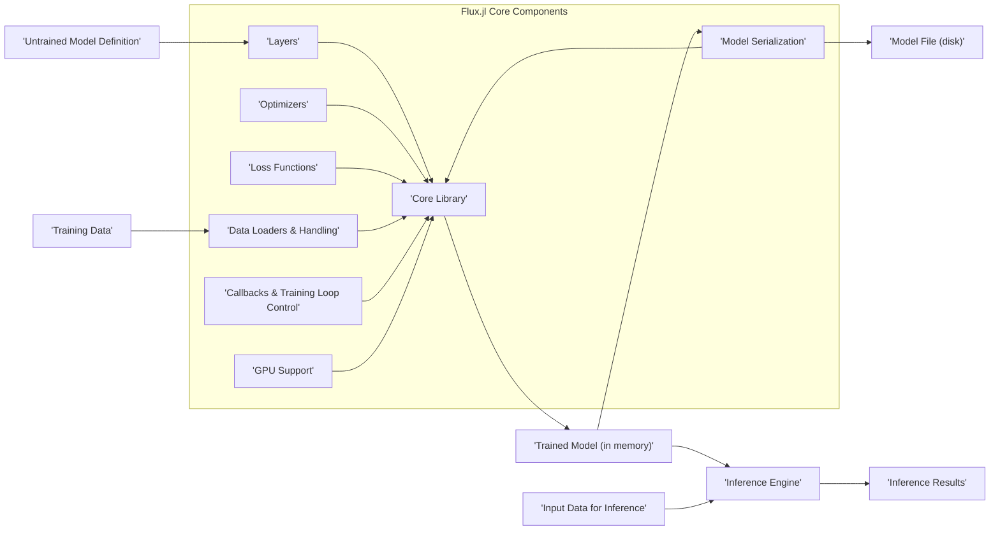
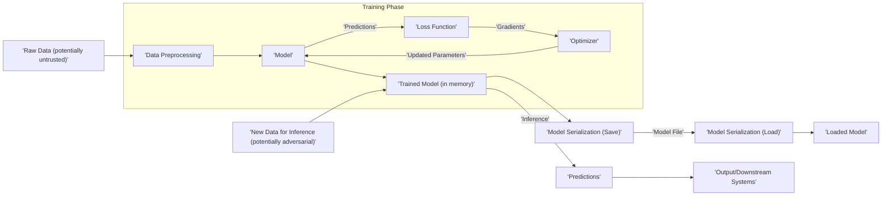

# Project Design Document: Flux.jl for Threat Modeling

**Version:** 1.1
**Date:** October 26, 2023
**Prepared By:** Gemini (AI Model)

## 1. Introduction

This document provides a detailed design overview of the Flux.jl project, a machine learning library written in Julia. The primary purpose of this document is to serve as a foundation for subsequent threat modeling activities. It meticulously outlines the key components, data flows, and interactions within the Flux.jl ecosystem, specifically highlighting areas that may be susceptible to security vulnerabilities. This document is intended for security engineers, developers, and anyone involved in assessing the security posture of systems utilizing Flux.jl. It aims to provide the necessary context to identify potential threats, vulnerabilities, and attack vectors.

## 2. Project Overview

Flux.jl is a modern machine learning library designed with composability and extensibility as core principles. It leverages Julia's strengths in performance and dynamic typing to provide a flexible and efficient platform for building, training, and deploying machine learning models. Key features include:

*   Automatic differentiation powered by Zygote.jl
*   Seamless GPU acceleration through CUDA.jl and other backends
*   A rich collection of pre-built neural network layers and optimization algorithms
*   Extensibility allowing for the creation of custom layers, loss functions, and training procedures
*   Tight integration with the broader Julia ecosystem for data manipulation and scientific computing

## 3. System Architecture

Flux.jl's architecture is modular and centers around the following key components and their interactions:

*   **Core Library:** This is the foundational layer of Flux.jl, providing essential data structures (like `AbstractArray` and specialized array types for GPU computation), the automatic differentiation engine (primarily through Zygote.jl), and the basic building blocks for constructing neural networks. This component manages the computational graph and the flow of gradients.
*   **Layers (`Flux.Dense`, `Flux.Conv`, `Flux.RNN`, etc.):** These are pre-defined building blocks representing common neural network operations. Each layer encapsulates specific mathematical transformations and holds learnable parameters (weights and biases). Layers are composable, allowing users to build complex models.
*   **Optimizers (`Flux.Descent`, `Flux.Adam`, `Flux.RMSProp`, etc.):** Implementations of various optimization algorithms used to update the parameters of the model during the training process. Optimizers determine how the model learns from the data by adjusting parameters based on the calculated gradients.
*   **Loss Functions (`Flux.Losses.mse`, `Flux.Losses.crossentropy`, etc.):** Functions that quantify the discrepancy between the model's predictions and the actual target values. The loss function guides the optimization process by providing a measure of error to minimize.
*   **Data Loaders and Handling:** Mechanisms for ingesting and processing data for training and inference. This involves interacting with Julia's standard library for file I/O, potentially external libraries for specific data formats (e.g., image loading), and custom data loading logic defined by the user. This stage often involves data transformations like normalization and batching.
*   **Model Serialization (`Flux.state`, `Flux.loadmodel!`):** Functionality to save the trained model's parameters (and potentially the model architecture) to persistent storage and load them back into memory. This is crucial for deploying and reusing trained models.
*   **Callbacks and Training Loop Control (`Flux.train!`):** Mechanisms to customize the training process. Callbacks allow users to execute specific code at different stages of training (e.g., logging metrics, saving checkpoints). The `Flux.train!` function orchestrates the training loop.
*   **GPU Support (via CUDA.jl, Metal.jl, etc.):** Integration with GPU backends to accelerate computations, particularly matrix operations involved in neural network training and inference. This involves transferring data and computations to the GPU.

## 4. Data Flow with Security Considerations

The typical data flow within a Flux.jl application, along with potential security implications at each stage, is as follows:

*   **Data Ingestion:** Raw data is loaded into the Julia environment. This can involve reading from local files (CSV, images, audio, etc.), accessing databases, or consuming data streams over a network.
    *   **Security Consideration:**  Untrusted data sources could contain malicious content designed to exploit vulnerabilities in data parsing libraries or influence model training (data poisoning).
*   **Data Preprocessing:** The raw data is transformed and prepared for model training. This might include normalization, scaling, one-hot encoding, data augmentation, and batching.
    *   **Security Consideration:**  Vulnerabilities in preprocessing libraries or custom preprocessing logic could be exploited. Improper sanitization of data could lead to issues later in the pipeline.
*   **Model Definition:** A neural network model is constructed by combining various layers. The architecture and initial parameters are defined at this stage.
    *   **Security Consideration:**  If model definitions are loaded from untrusted sources, they could contain malicious code or configurations.
*   **Training:**
    *   Data batches are fed to the model.
    *   The model makes predictions based on the input data and its current parameters.
    *   A loss function calculates the error between the predictions and the actual target values.
    *   The optimizer uses the gradients of the loss function to update the model's parameters.
    *   Callbacks might be executed at various points during training.
    *   This process is repeated for multiple epochs.
    *   **Security Consideration:** Data poisoning during training can significantly impact model accuracy and potentially introduce biases or vulnerabilities. Malicious callbacks could execute arbitrary code.
*   **Model Saving (Serialization):** The trained model's parameters (and potentially the model architecture) are serialized and saved to disk.
    *   **Security Consideration:**  If the serialization format is insecure, it could be vulnerable to manipulation or code injection during deserialization. Access control to saved model files is crucial.
*   **Inference:**
    *   New, unseen data is fed to the trained model.
    *   The model generates predictions based on its learned parameters.
    *   **Security Consideration:** Adversarial attacks can craft specific input data to cause the model to make incorrect or unexpected predictions.
*   **Output:** The inference results are presented, used for further processing, or transmitted to other systems.
    *   **Security Consideration:**  Sensitive information might be present in the output. Secure transmission and handling of output data are important.

## 5. Security Considerations and Potential Threats

This section details potential security considerations and categorizes them for clarity:

*   **Data-Related Threats:**
    *   **Data Poisoning:** Maliciously crafted training data can manipulate the model's learning process, leading to biased or inaccurate predictions.
    *   **Data Leakage:** Sensitive information present in the training data could be inadvertently learned and potentially revealed by the model.
    *   **Input Manipulation (Inference):** Adversarial examples can be designed to fool the model during inference, causing misclassification or incorrect outputs.
*   **Model-Related Threats:**
    *   **Model Inversion/Extraction:** Attackers might attempt to reverse-engineer the trained model to extract sensitive information about the training data or the model's architecture and parameters.
    *   **Model Skewing/Bias Introduction:**  Subtle manipulations of training data or the training process can introduce biases into the model, leading to unfair or discriminatory outcomes.
    *   **Unauthorized Model Access:**  Lack of proper access controls can allow unauthorized parties to access and potentially steal or modify trained models.
*   **Dependency and Supply Chain Threats:**
    *   **Dependency Vulnerabilities:** Flux.jl relies on other Julia packages. Vulnerabilities in these dependencies (e.g., Zygote.jl, NNlib.jl) could be exploited by attackers.
    *   **Malicious Packages:**  Compromised or malicious packages within the Julia ecosystem could be introduced as dependencies, potentially injecting malicious code.
*   **Code Execution and Injection Threats:**
    *   **Serialization/Deserialization Vulnerabilities:** Insecure handling of model serialization formats could allow attackers to inject malicious code that is executed when the model is loaded.
    *   **Code Injection in Custom Components:** If user-provided code for custom layers, loss functions, or callbacks is not properly sanitized, it could lead to code injection vulnerabilities.
*   **Infrastructure and Deployment Threats:**
    *   **Compromised Training Infrastructure:** If the environment where models are trained is compromised, attackers could manipulate the training process or steal sensitive data.
    *   **Insecure Model Storage:**  Storing trained models in insecure locations can lead to unauthorized access and theft.
    *   **Vulnerabilities in Deployment Environment:**  Security flaws in the systems or platforms where Flux.jl models are deployed (e.g., web servers, cloud infrastructure) can be exploited.
*   **Information Disclosure:**
    *   **Verbose Error Messages:**  Detailed error messages or logging could inadvertently reveal sensitive information about the model, data, or infrastructure.
    *   **Side-Channel Attacks:** Analyzing timing information or resource consumption during model execution could potentially reveal information about the model or input data.

## 6. Dependencies and Security Implications

Flux.jl's security posture is inherently linked to the security of its dependencies. Key dependencies and their potential security implications include:

*   **Zygote.jl (Automatic Differentiation):**  Vulnerabilities in Zygote.jl's differentiation logic could potentially be exploited to cause unexpected behavior or information leakage during gradient computation.
*   **NNlib.jl (Neural Network Primitives):**  Security flaws in the fundamental neural network operations provided by NNlib.jl could have widespread impact on models built with Flux.jl.
*   **Statistics, LinearAlgebra (Julia Standard Library):** While part of the standard library, vulnerabilities in these core components could affect data processing and numerical computations within Flux.jl.
*   **CUDA.jl, Metal.jl (GPU Support):**  Bugs or security issues in these GPU interface libraries could potentially lead to vulnerabilities when utilizing GPU acceleration.
*   **Other Julia Packages:** Any other packages used for data loading, preprocessing, or integration with other systems introduce their own set of potential vulnerabilities.

Maintaining up-to-date versions of dependencies and regularly reviewing their security advisories is crucial.

## 7. Deployment Considerations and Security Risks

The way Flux.jl models are deployed significantly impacts the potential attack surface and associated security risks:

*   **Standalone Julia Applications:**
    *   **Risk:** If the application handles external input, vulnerabilities in data parsing or processing could be exploited. Access control to the application and the data it processes is important.
*   **Web Services (via APIs using Genie.jl, HTTP.jl, etc.):**
    *   **Risk:** Exposing models through web APIs introduces common web application security risks such as injection attacks (e.g., SQL injection if interacting with databases), cross-site scripting (XSS) if user input is involved, and API abuse. Rate limiting and authentication are crucial.
*   **Embedded Systems:**
    *   **Risk:** Security considerations for embedded systems include physical access to the device, potential for reverse engineering of the model, and resource constraints that might limit the ability to implement robust security measures.
*   **Cloud Environments (AWS, Azure, GCP):**
    *   **Risk:** Cloud deployments introduce risks related to cloud security misconfigurations, access control policies, data storage security, and the security of the underlying cloud platform. Secure key management for accessing cloud resources is essential.

## 8. Threat Modeling Focus

This design document provides the necessary information for a structured threat modeling exercise. Specifically, the following elements are crucial for identifying potential threats:

*   **Components:** Understanding the different parts of the Flux.jl system (Core Library, Layers, Optimizers, etc.) helps identify potential points of attack or failure.
*   **Data Flows:** Mapping how data moves through the system (from ingestion to output) highlights where data might be intercepted, manipulated, or leaked.
*   **Trust Boundaries:** Identifying where different levels of trust exist (e.g., between user-provided data and the model, between the application and external dependencies) helps pinpoint potential areas of vulnerability.
*   **Interactions:** Understanding how different components interact with each other and with external systems reveals potential attack vectors.
*   **Data Stores:** Identifying where data (training data, models) is stored helps assess the risk of unauthorized access or modification.

Using methodologies like STRIDE or PASTA, security engineers can leverage this document to systematically analyze potential threats associated with each component and data flow.

## 9. Conclusion

This enhanced design document provides a comprehensive overview of the Flux.jl project, specifically tailored for threat modeling purposes. By detailing the architecture, data flows, dependencies, and deployment considerations, it lays the groundwork for a thorough security analysis. The identified security considerations and potential threats serve as a starting point for developing mitigation strategies and ensuring the secure development and deployment of machine learning applications built with Flux.jl. Continuous review and updates to this document are essential as the project evolves and new threats emerge.