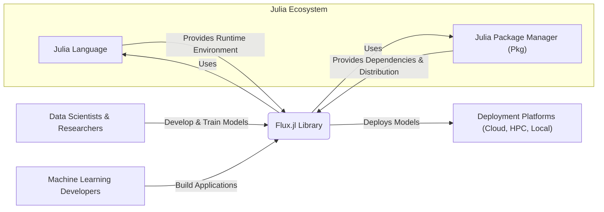
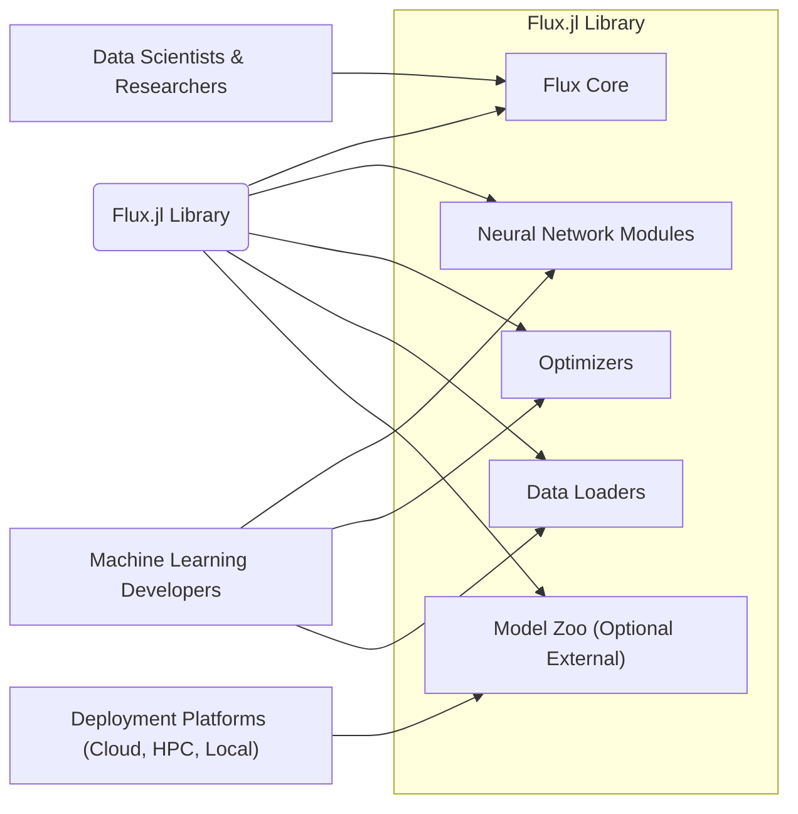
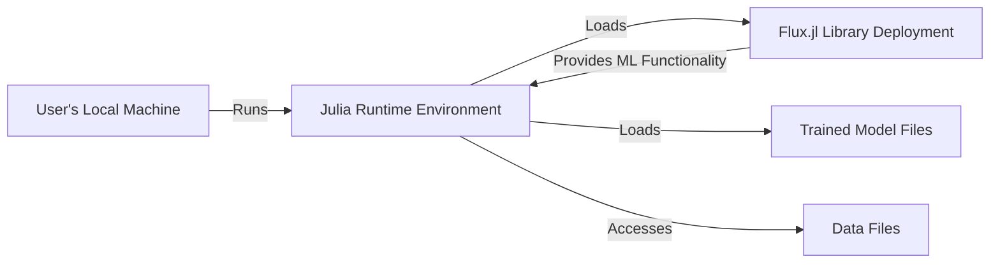
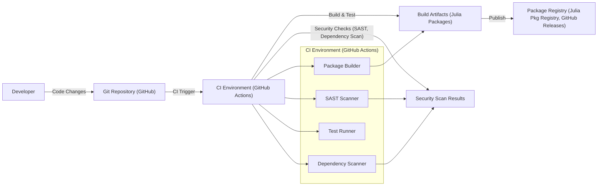

# BUSINESS POSTURE

- Business Priorities and Goals:
  - Provide a high-performance and flexible deep learning library for the Julia programming language.
  - Enable researchers and practitioners to efficiently develop, train, and deploy machine learning models.
  - Foster innovation and adoption of Julia in the machine learning community.
  - Maintain a user-friendly and well-documented library to lower the barrier to entry for deep learning.
- Business Risks:
  - Competition from established deep learning frameworks like TensorFlow and PyTorch.
  - Security vulnerabilities in the library could lead to data breaches or model manipulation in user applications.
  - Lack of community adoption and contribution could hinder the library's growth and sustainability.
  - Performance bottlenecks or instability could discourage users and limit real-world applicability.

# SECURITY POSTURE

- Existing Security Controls:
  - security control: Public code repository on GitHub, facilitating community review and issue reporting. Implemented in: GitHub repository.
  - security control: Issue tracking system for bug reports and feature requests. Implemented in: GitHub Issues.
  - security control: Version control system (Git) for managing code changes and releases. Implemented in: GitHub repository.
  - security control: Open source licensing, allowing for broad scrutiny and community contributions to security. Implemented in: LICENSE file in repository.
- Accepted Risks:
  - accepted risk: Potential vulnerabilities in dependencies that are not immediately identified and patched.
  - accepted risk: Reliance on community contributions for security vulnerability identification and remediation.
  - accepted risk: Limited resources for dedicated security testing and code audits.
- Recommended Security Controls:
  - recommended security control: Implement automated Static Application Security Testing (SAST) tools in the Continuous Integration (CI) pipeline to detect potential code vulnerabilities.
  - recommended security control: Integrate dependency vulnerability scanning to identify and alert on known vulnerabilities in third-party libraries.
  - recommended security control: Establish a clear process for reporting and handling security vulnerabilities, including a security policy and contact information.
  - recommended security control: Encourage and facilitate security code reviews by experienced developers and security experts.
  - recommended security control: Implement fuzz testing to identify potential crash-causing inputs and edge cases.
- Security Requirements:
  - Authentication: Not directly applicable to the library itself, as it is a software library and not a service requiring user authentication. However, authentication might be relevant in systems built using Flux.jl for model serving or data access.
  - Authorization: Similar to authentication, authorization is not a primary concern for the library itself. Authorization controls would be implemented in applications or services that utilize Flux.jl to manage access to models, data, or functionalities.
  - Input Validation: Critical for the library to handle various input data types and shapes robustly and securely. Input validation should be implemented in core functions to prevent unexpected behavior, crashes, or potential vulnerabilities when processing user-provided data or model inputs. This is especially important in the context of adversarial machine learning attacks.
  - Cryptography: Cryptographic functionalities might be relevant for:
    - Securely storing and loading trained models, especially if they contain sensitive information or intellectual property.
    - Implementing privacy-preserving machine learning techniques like federated learning or differential privacy within the library.
    - Ensuring secure communication channels if the library interacts with external services or systems for data retrieval or model deployment.

# DESIGN

## C4 CONTEXT

- Context Diagram Elements:
  - - Name: Data Scientists & Researchers
    - Type: Person
    - Description: Users who utilize Flux.jl to conduct research, experiment with models, and develop new machine learning algorithms.
    - Responsibilities: Develop and train machine learning models using Flux.jl. Evaluate model performance and iterate on designs. Contribute to the Flux.jl community through feedback and contributions.
    - Security controls: Responsible for secure handling of their data and models when using Flux.jl.
  - - Name: Machine Learning Developers
    - Type: Person
    - Description: Developers who build applications and systems that incorporate machine learning models trained with Flux.jl.
    - Responsibilities: Integrate Flux.jl models into applications. Deploy and maintain machine learning systems. Ensure secure and reliable operation of ML-powered applications.
    - Security controls: Responsible for secure integration and deployment of Flux.jl models within their applications. Implement security controls around data handling and model serving.
  - - Name: Flux.jl Library
    - Type: Software System
    - Description: The Flux.jl deep learning library itself, providing tools and functionalities for building, training, and deploying neural networks in Julia.
    - Responsibilities: Provide a robust, efficient, and user-friendly deep learning framework. Ensure code quality and maintainability. Address bug reports and security vulnerabilities. Facilitate community contributions.
    - Security controls: Implement secure coding practices. Conduct code reviews and testing. Address reported security vulnerabilities promptly. Manage dependencies securely.
  - - Name: Julia Language
    - Type: Software System
    - Description: The Julia programming language, which provides the runtime environment and core functionalities for Flux.jl.
    - Responsibilities: Provide a stable and performant runtime environment for Julia code. Address security vulnerabilities in the Julia language itself. Maintain language compatibility and stability.
    - Security controls: Julia language security controls are inherited by Flux.jl.
  - - Name: Julia Package Manager (Pkg)
    - Type: Software System
    - Description: The package manager for Julia, used to install, manage, and distribute Julia packages, including Flux.jl and its dependencies.
    - Responsibilities: Provide a reliable mechanism for package installation and dependency management. Ensure package integrity and security. Manage package registries and distribution infrastructure.
    - Security controls: Package manager security controls are crucial for Flux.jl's supply chain security.
  - - Name: Deployment Platforms (Cloud, HPC, Local)
    - Type: Environment
    - Description: Various environments where models trained with Flux.jl are deployed and used, ranging from local machines to cloud platforms and high-performance computing clusters.
    - Responsibilities: Provide infrastructure for deploying and running machine learning models. Ensure scalability, reliability, and security of the deployment environment.
    - Security controls: Security controls are specific to each deployment platform and are the responsibility of the deployment environment operators.

## C4 CONTAINER

- Container Diagram Elements:
  - - Name: Flux Core
    - Type: Container (Julia Package/Module)
    - Description: The core functionalities of Flux.jl, including automatic differentiation, tensor operations, and fundamental building blocks for neural networks.
    - Responsibilities: Provide the foundational API and computational engine for Flux.jl. Handle low-level operations and optimizations. Ensure performance and stability of core functionalities.
    - Security controls: Input validation for core functions. Memory safety considerations. Code review for critical components. SAST scanning.
  - - Name: Neural Network Modules
    - Type: Container (Julia Packages/Modules)
    - Description: A collection of pre-built neural network layers and modules (e.g., convolutional layers, recurrent layers, attention mechanisms) that users can compose to build complex models.
    - Responsibilities: Offer reusable and well-tested neural network components. Provide flexibility and extensibility for model building. Maintain documentation and examples for modules.
    - Security controls: Input validation within modules. Secure default configurations. Code review for module implementations.
  - - Name: Optimizers
    - Type: Container (Julia Packages/Modules)
    - Description: Implementations of various optimization algorithms (e.g., gradient descent, Adam, RMSprop) used to train neural networks.
    - Responsibilities: Provide efficient and reliable optimization algorithms. Offer a range of optimization strategies. Ensure numerical stability of optimizers.
    - Security controls: Numerical stability checks to prevent unexpected behavior. Input validation for optimizer parameters.
  - - Name: Data Loaders
    - Type: Container (Julia Packages/Modules)
    - Description: Utilities for loading and preprocessing data for training and evaluation, including handling different data formats and batching.
    - Responsibilities: Facilitate efficient data loading and preprocessing. Support various data sources and formats. Provide data augmentation and transformation capabilities.
    - Security controls: Input validation for data paths and formats. Secure handling of data access and permissions. Protection against data injection attacks.
  - - Name: Model Zoo (Optional External)
    - Type: Container (Potentially External Repository/Service)
    - Description: A collection of pre-trained models and example architectures that users can download and utilize. This might be hosted within the Flux.jl ecosystem or externally.
    - Responsibilities: Provide pre-trained models for common tasks. Offer examples and tutorials for using pre-trained models. Ensure models are trustworthy and free from malicious content (if hosted).
    - Security controls: If hosted, implement security controls for model storage and distribution. Verify integrity of models. Consider provenance and trustworthiness of models. If external, rely on security of external service.

## DEPLOYMENT

- Deployment Options:
  - Local Machine Deployment: Users can install Flux.jl and its dependencies on their local machines (desktops, laptops) to develop and run models.
  - Cloud Deployment: Models trained with Flux.jl can be deployed to cloud platforms (e.g., AWS, GCP, Azure) using virtual machines, containers (Docker, Kubernetes), or serverless functions.
  - High-Performance Computing (HPC) Clusters: For large-scale training and inference, Flux.jl can be deployed on HPC clusters, leveraging distributed computing capabilities.
- Detailed Deployment Diagram (Example: Local Machine Deployment):

- Deployment Diagram Elements (Local Machine Deployment):
  - - Name: User's Local Machine
    - Type: Infrastructure
    - Description: The user's personal computer or workstation where they develop and run Flux.jl applications.
    - Responsibilities: Provide the hardware and operating system environment for running Julia and Flux.jl. User is responsible for security of their local machine.
    - Security controls: Operating system security controls (firewall, antivirus). User account management. Physical security of the machine.
  - - Name: Julia Runtime Environment
    - Type: Software Environment
    - Description: The Julia installation and runtime environment on the user's machine, responsible for executing Julia code, including Flux.jl.
    - Responsibilities: Execute Julia code. Manage memory and resources. Provide access to system libraries and resources.
    - Security controls: Julia runtime security features. Operating system level security controls.
  - - Name: Flux.jl Library Deployment
    - Type: Software Component Deployment
    - Description: The installed Flux.jl library and its dependencies on the user's machine, ready to be loaded and used by Julia programs.
    - Responsibilities: Provide the Flux.jl library functionalities to the Julia runtime. Load necessary dependencies.
    - Security controls: Integrity of installed Flux.jl packages (verified by Pkg). File system permissions.
  - - Name: Trained Model Files
    - Type: Data Storage
    - Description: Files storing trained machine learning models created using Flux.jl, typically stored on the local file system.
    - Responsibilities: Persistently store trained models. Provide access to models for inference.
    - Security controls: File system permissions to control access to model files. Encryption of model files if necessary.
  - - Name: Data Files
    - Type: Data Storage
    - Description: Data files used for training or inference, stored on the local file system or accessible storage.
    - Responsibilities: Store data used by Flux.jl applications. Provide access to data for training and inference.
    - Security controls: File system permissions to control data access. Data encryption if necessary. Data access controls within applications using Flux.jl.

## BUILD

- Build Process Description:
  - Developer commits code changes to the Git repository (GitHub).
  - A Continuous Integration (CI) environment (e.g., GitHub Actions) is triggered upon code changes (e.g., push, pull request).
  - The CI environment performs the following steps:
    - Checkout code from the Git repository.
    - Build the Flux.jl library and related packages using Julia's build tools.
    - Run automated tests to ensure code quality and functionality.
    - Perform Static Application Security Testing (SAST) using tools to identify potential code vulnerabilities.
    - Scan dependencies for known vulnerabilities using dependency scanning tools.
    - Package the build artifacts (Julia packages) for distribution.
  - Security scan results are collected and analyzed. Failures in security checks or tests can halt the build process.
  - If the build and security checks are successful, the build artifacts (Julia packages) are published to a package registry (e.g., Julia Pkg Registry, GitHub Releases) for distribution to users.
- Build Process Security Controls:
  - security control: Automated build process in CI environment to ensure consistent and repeatable builds. Implemented in: GitHub Actions workflows.
  - security control: Static Application Security Testing (SAST) to detect potential vulnerabilities in the codebase. Implemented in: CI pipeline (e.g., using Julia linters and SAST tools).
  - security control: Dependency vulnerability scanning to identify known vulnerabilities in third-party dependencies. Implemented in: CI pipeline (e.g., using dependency scanning tools).
  - security control: Automated testing (unit tests, integration tests) to ensure code quality and prevent regressions. Implemented in: CI pipeline (Julia test framework).
  - security control: Code review process for pull requests to ensure code quality and security before merging changes. Implemented in: GitHub pull request workflow.
  - security control: Access control to the CI environment and package registry to prevent unauthorized modifications or releases. Implemented in: GitHub repository and CI environment permissions.
  - security control: Signing of packages (if supported by Julia Pkg ecosystem in the future) to ensure integrity and authenticity of distributed packages. Not currently widely implemented in Julia ecosystem, but a potential future control.

# RISK ASSESSMENT

- Critical Business Processes:
  - Development, maintenance, and distribution of the Flux.jl library.
  - Community adoption and usage of Flux.jl for machine learning research and applications.
  - Maintaining the reputation and trustworthiness of Flux.jl as a reliable deep learning framework.
- Data Sensitivity:
  - The Flux.jl library itself does not directly handle sensitive data. However, models built with Flux.jl can process various types of data, including potentially sensitive data depending on the application.
  - The sensitivity of data processed by models built with Flux.jl is determined by the users and applications of the library, not the library itself.
  - The integrity and security of the Flux.jl library are crucial to ensure the trustworthiness and security of models built using it, especially when those models process sensitive data. A vulnerability in Flux.jl could potentially be exploited to compromise models or data in downstream applications.

# QUESTIONS & ASSUMPTIONS

- Questions:
  - What are the specific security compliance requirements for the Flux.jl project (if any)?
  - Are there any specific threat models or attack scenarios that are of particular concern for Flux.jl?
  - What is the process for handling reported security vulnerabilities in Flux.jl? Is there a security team or designated contact?
  - Are there plans to implement more formal security testing or code audits for Flux.jl in the future?
  - What is the intended audience for this design document (developers, security team, project stakeholders)?
- Assumptions:
  - BUSINESS POSTURE: The primary business goal is to provide a valuable and widely adopted deep learning library for the Julia ecosystem. Security is important for maintaining trust and preventing misuse of the library.
  - SECURITY POSTURE: The project currently relies on open-source community practices for security. There is a desire to improve security posture through automated security checks and more formal processes. The focus is on preventing vulnerabilities in the library code and dependencies.
  - DESIGN: The design is modular and component-based, allowing for flexibility and extensibility. The build process is automated using CI, and there is potential to enhance build process security further. Deployment scenarios are varied, ranging from local machines to cloud and HPC environments.