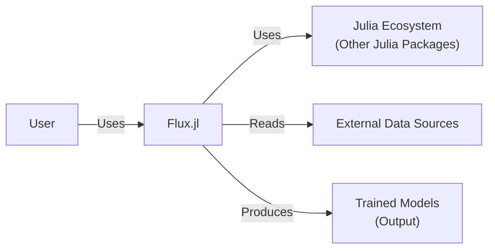
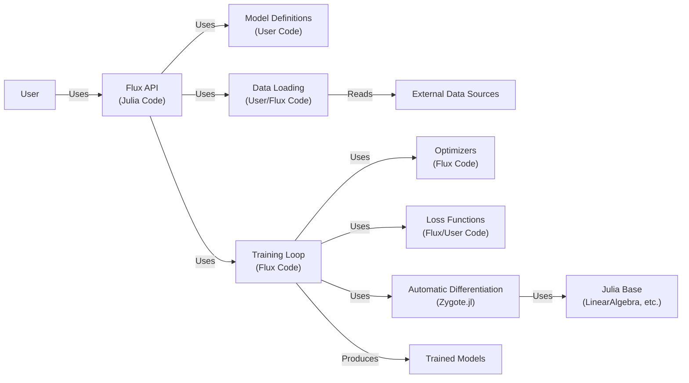
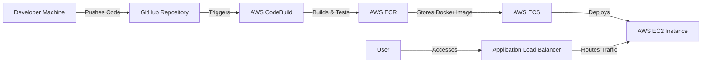
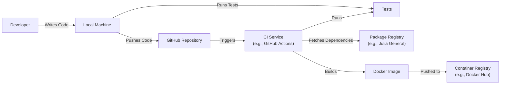

Okay, let's create a design document for the Flux.jl project.

# BUSINESS POSTURE

Flux.jl is a machine learning library written in Julia.  It appears to be a relatively mature open-source project, likely aiming for a balance between rapid innovation and stability.  The project's goals include:

*   Providing a flexible and performant machine learning framework.
*   Enabling research and development of new machine learning models and techniques.
*   Offering a user-friendly API for both beginners and experts.
*   Integrating seamlessly with the Julia ecosystem.
*   Attracting and growing a community of contributors and users.

Business priorities likely include:

*   Maintaining a high level of code quality and reliability.
*   Ensuring the library is performant and scalable.
*   Providing good documentation and support to users.
*   Keeping up with advancements in the field of machine learning.
*   Protecting the intellectual property of the project (though it's open source, proper licensing and attribution are important).

Most important business risks:

*   **Security vulnerabilities in the library or its dependencies could lead to malicious code execution or data breaches.** This is particularly concerning given the potential for Flux.jl to be used in sensitive applications.
*   **Performance bottlenecks or scalability issues could limit the library's usefulness in real-world scenarios.**
*   **Lack of adoption or a decline in community engagement could lead to the project becoming stagnant.**
*   **Competition from other machine learning libraries (e.g., TensorFlow, PyTorch) could make it difficult for Flux.jl to gain traction.**
*   **Incorrect or misleading results from models built with Flux.jl could have serious consequences, depending on the application.**

# SECURITY POSTURE

Based on the provided GitHub repository, here's an assessment of the security posture:

*   security control: The project uses GitHub for version control and issue tracking, which provides some built-in security features like access control and audit trails. (Described in GitHub repository)
*   security control: The project appears to have a continuous integration (CI) setup, as evidenced by the presence of configuration files for CI services (e.g., `.github/workflows`). This likely includes automated testing. (Described in GitHub repository)
*   security control: Code review is likely practiced as part of the pull request process, which helps to identify potential security vulnerabilities before they are merged into the main codebase. (Described in GitHub repository)
*   security control: The project uses a permissive open-source license (MIT), which allows for broad use and modification, but also means there is no warranty or liability. (Described in GitHub repository)
*   accepted risk: The project relies on numerous external dependencies (other Julia packages), which introduces the risk of supply chain attacks. While Julia's package manager has some security features, it's not foolproof.
*   accepted risk: As an open-source project, the codebase is publicly visible, which means that any vulnerabilities are also potentially visible to attackers. This is a common trade-off for open-source projects.
*   accepted risk: The project does not appear to have a dedicated security team or a formal vulnerability disclosure program. This could make it more difficult to report and address security issues.

Recommended security controls:

*   Implement a formal vulnerability disclosure program.
*   Perform regular security audits and penetration testing.
*   Use static analysis tools to identify potential security vulnerabilities in the codebase.
*   Use dynamic analysis tools (fuzzing) to test the library's robustness against unexpected inputs.
*   Implement a Software Bill of Materials (SBOM) to track all dependencies and their versions.
*   Consider using a dependency vulnerability scanner.

Security Requirements:

*   Authentication: Not directly applicable to the core library, but relevant for any web-based interfaces or services built on top of Flux.jl.
*   Authorization: Not directly applicable to the core library, but relevant for any applications built using Flux.jl that require access control.
*   Input Validation: Crucial for preventing various types of attacks, including code injection and denial-of-service.  The library should carefully validate all inputs to its functions, especially those that come from external sources (e.g., user-provided data or models).
*   Cryptography: The library should use appropriate cryptographic algorithms and libraries for any operations that require security, such as secure communication or data storage.  It should also handle cryptographic keys securely.

# DESIGN

## C4 CONTEXT

*   Elements Description:
    *   Name: User
        *   Type: Person
        *   Description: A data scientist, researcher, or developer who uses Flux.jl to build and train machine learning models.
        *   Responsibilities: Provides data, defines models, trains models, evaluates results.
        *   Security controls: Not directly applicable.
    *   Name: Flux.jl
        *   Type: Software System
        *   Description: The Flux.jl machine learning library.
        *   Responsibilities: Provides APIs for defining, training, and evaluating machine learning models.
        *   Security controls: Input validation, dependency management, secure coding practices.
    *   Name: Julia Ecosystem (Other Julia Packages)
        *   Type: Software System
        *   Description: Other Julia packages that Flux.jl depends on or interacts with.
        *   Responsibilities: Provides various functionalities, such as data manipulation, linear algebra, and visualization.
        *   Security controls: Relies on the security of individual packages.
    *   Name: External Data Sources
        *   Type: External System
        *   Description: Sources of data used for training and evaluating models.
        *   Responsibilities: Provides data in various formats.
        *   Security controls: Data integrity checks, access controls (if applicable).
    *   Name: Trained Models (Output)
        *   Type: Data
        *   Description: The output of the machine learning process – trained models.
        *   Responsibilities: Represents the learned patterns from the data.
        *   Security controls: Model integrity checks, access controls (if applicable).

## C4 CONTAINER

*   Elements Description:
    *   Name: User
        *   Type: Person
        *   Description: A data scientist, researcher, or developer.
        *   Responsibilities: Provides data, defines models, initiates training.
        *   Security controls: Not directly applicable.
    *   Name: Flux API (Julia Code)
        *   Type: Code
        *   Description: The public API of the Flux.jl library.
        *   Responsibilities: Provides functions for model definition, training, and evaluation.
        *   Security controls: Input validation, secure coding practices.
    *   Name: Model Definitions (User Code)
        *   Type: Code
        *   Description: User-written code that defines the architecture of the machine learning model.
        *   Responsibilities: Specifies the layers, connections, and activation functions of the model.
        *   Security controls: Secure coding practices (user responsibility).
    *   Name: Data Loading (User/Flux Code)
        *   Type: Code
        *   Description: Code that loads data from external sources.
        *   Responsibilities: Reads data, preprocesses it, and provides it to the training loop.
        *   Security controls: Input validation, data sanitization.
    *   Name: Training Loop (Flux Code)
        *   Type: Code
        *   Description: The core training loop that iterates over the data and updates the model parameters.
        *   Responsibilities: Manages the training process, calls optimizers and loss functions.
        *   Security controls: Secure coding practices, numerical stability checks.
    *   Name: Optimizers (Flux Code)
        *   Type: Code
        *   Description: Algorithms that update the model parameters based on the gradients.
        *   Responsibilities: Implements optimization algorithms like Adam, SGD, etc.
        *   Security controls: Secure coding practices, numerical stability checks.
    *   Name: Loss Functions (Flux/User Code)
        *   Type: Code
        *   Description: Functions that calculate the difference between the model's predictions and the true values.
        *   Responsibilities: Provides a measure of the model's performance.
        *   Security controls: Secure coding practices, numerical stability checks.
    *   Name: Automatic Differentiation (Zygote.jl)
        *   Type: Code/Library
        *   Description: A Julia package that provides automatic differentiation capabilities.
        *   Responsibilities: Calculates gradients of the loss function with respect to the model parameters.
        *   Security controls: Relies on the security of Zygote.jl.
    *   Name: Julia Base (LinearAlgebra, etc.)
        *   Type: Code/Library
        *   Description: Core Julia libraries used for numerical computation.
        *   Responsibilities: Provides fundamental mathematical operations.
        *   Security controls: Relies on the security of Julia Base.
    *   Name: External Data Sources
        *   Type: External System
        *   Description: Sources of data used for training.
        *   Responsibilities: Provides data.
        *   Security controls: Data integrity checks, access controls (if applicable).
    *   Name: Trained Models
        *   Type: Data
        *   Description: The output of training process.
        *   Responsibilities: Store model with trained parameters.
        *   Security controls: Access control, integrity checks.

## DEPLOYMENT

Flux.jl models can be deployed in various ways:

1.  **Local Execution:** Running the Julia script directly on a local machine.
2.  **Server-Based Deployment:** Deploying the model on a server (physical or virtual) running Julia.
3.  **Cloud-Based Deployment:** Using cloud services (e.g., AWS, Google Cloud, Azure) to deploy the model. This could involve virtual machines, container services (e.g., Docker, Kubernetes), or serverless functions.
4.  **Embedded Systems:** Deploying the model on embedded devices (e.g., Raspberry Pi) running Julia.

We'll describe the **Cloud-Based Deployment** using **AWS** as an example:

*   Elements Description:
    *   Name: Developer Machine
        *   Type: Device
        *   Description: The developer's local machine.
        *   Responsibilities: Code development, pushing code to GitHub.
        *   Security controls: Local security measures.
    *   Name: GitHub Repository
        *   Type: Software System
        *   Description: The source code repository.
        *   Responsibilities: Version control, code storage.
        *   Security controls: GitHub's built-in security features.
    *   Name: AWS CodeBuild
        *   Type: Service
        *   Description: A fully managed continuous integration service.
        *   Responsibilities: Builds the Docker image, runs tests.
        *   Security controls: IAM roles, build environment security.
    *   Name: AWS ECR
        *   Type: Service
        *   Description: A fully-managed Docker container registry.
        *   Responsibilities: Stores the Docker image.
        *   Security controls: IAM roles, image scanning.
    *   Name: AWS ECS
        *   Type: Service
        *   Description: A fully managed container orchestration service.
        *   Responsibilities: Deploys and manages the Docker containers.
        *   Security controls: IAM roles, security groups, network configuration.
    *   Name: AWS EC2 Instance
        *   Type: Virtual Machine
        *   Description: A virtual machine running the Docker container.
        *   Responsibilities: Executes the model serving code.
        *   Security controls: IAM roles, security groups, OS hardening.
    *   Name: Application Load Balancer
        *   Type: Service
        *   Description: Distributes incoming traffic across multiple EC2 instances.
        *   Responsibilities: Load balancing, health checks.
        *   Security controls: SSL/TLS termination, security groups.
    *   Name: User
        *   Type: Person
        *   Description: The end-user accessing the deployed model.
        *   Responsibilities: Sends requests to the model.
        *   Security controls: Not directly applicable.

## BUILD

The build process for a Flux.jl project typically involves the following steps:

1.  **Development:** The developer writes code on their local machine.
2.  **Testing:** The developer runs unit tests and integration tests locally.
3.  **Push to GitHub:** The developer pushes the code to a GitHub repository.
4.  **Continuous Integration (CI):** A CI service (e.g., GitHub Actions, Travis CI, CircleCI) is triggered by the push. The CI service:
    *   Checks out the code.
    *   Installs dependencies (Julia packages).
    *   Runs tests.
    *   Potentially builds documentation.
    *   Potentially builds a Docker image (for deployment).
5.  **Artifact Storage:** If a Docker image is built, it is pushed to a container registry (e.g., Docker Hub, AWS ECR).

Security Controls in the Build Process:

*   security control: **Dependency Management:** Julia's package manager helps manage dependencies and their versions. However, it's crucial to use a dependency vulnerability scanner to identify and address known vulnerabilities in dependencies.
*   security control: **Automated Testing:** Running unit tests and integration tests as part of the CI process helps to catch bugs and potential security vulnerabilities early.
*   security control: **Static Analysis:** Using static analysis tools (linters, code analyzers) can help identify potential security vulnerabilities in the code.
*   security control: **Code Review:** Requiring code reviews before merging changes into the main branch helps to ensure that multiple developers have reviewed the code for potential security issues.
*   security control: **Secure Containerization:** If using Docker, following best practices for building secure Docker images (e.g., using minimal base images, avoiding running as root) is important.

# RISK ASSESSMENT

*   Critical Business Processes:
    *   Model training and development.
    *   Deployment of trained models (if applicable).
    *   Community engagement and collaboration.

*   Data Sensitivity:
    *   **Training Data:** The sensitivity of the training data depends on the specific application. It could range from publicly available datasets to highly sensitive personal or proprietary information.
    *   **Model Parameters:** The trained model parameters themselves could be considered sensitive, as they may contain information about the training data or represent valuable intellectual property.
    *   **User Inputs (during inference):** If the deployed model accepts user inputs, the sensitivity of those inputs depends on the application.
    *   **Model Outputs (predictions):** The sensitivity of the model's outputs depends on the application and the potential consequences of incorrect or misleading predictions.

# QUESTIONS & ASSUMPTIONS

*   Questions:
    *   Are there any specific compliance requirements (e.g., GDPR, HIPAA) that apply to the use of Flux.jl in certain applications?
    *   What is the expected scale of deployment for models built with Flux.jl?
    *   What are the specific security concerns of the users and contributors of Flux.jl?
    *   Are there any plans to integrate Flux.jl with other security tools or services?
    *   What is the process for handling security vulnerabilities that are discovered in Flux.jl or its dependencies?

*   Assumptions:
    *   BUSINESS POSTURE: The project prioritizes open-source collaboration and community growth.
    *   BUSINESS POSTURE: The project aims for a balance between research and practical application.
    *   SECURITY POSTURE: The project relies primarily on community-based security efforts (e.g., code review, issue reporting).
    *   SECURITY POSTURE: The project does not have a dedicated security budget or team.
    *   DESIGN: The project is primarily used for research and development, but may also be used in production environments.
    *   DESIGN: The project is designed to be flexible and extensible.
    *   DESIGN: Users are responsible for the security of their own data and models.
    *   DESIGN: Deployment will be handled by users, potentially using a variety of methods.