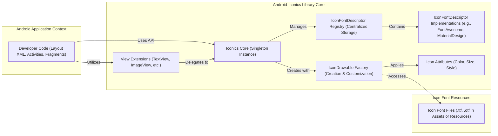
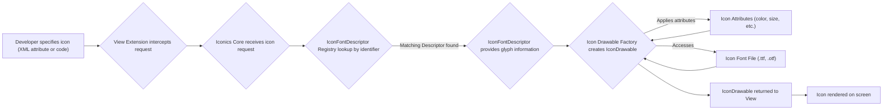

# Project Design Document: Android-Iconics Library

**Version:** 1.1
**Date:** October 26, 2023
**Author:** Gemini (AI Language Model)

## 1. Introduction

This document provides a detailed design overview of the Android-Iconics library, an open-source library for Android that simplifies the integration and usage of vector icons (icon fonts) within Android applications. This document aims to provide a comprehensive understanding of the library's architecture, components, and data flow, specifically tailored to facilitate subsequent threat modeling activities. The focus is on identifying potential vulnerabilities and attack vectors within the library's design.

## 2. Goals and Objectives

The primary goals of the Android-Iconics library are:

*   To provide a straightforward and performant mechanism for incorporating icon fonts into Android applications.
*   To offer a rich and extensible API for customizing icon rendering attributes (e.g., color, size, padding, rotation, styling).
*   To support a wide range of icon font libraries through a plugin-like architecture.
*   To enhance developer experience by abstracting the complexities of manual icon font management and rendering.

## 3. Scope

This design document comprehensively covers the architecture and functionality of the core Android-Iconics library. It focuses on the internal components and their interactions involved in:

*   Registration and management of `IconFontDescriptor` implementations.
*   Resolution of icon identifiers to specific glyphs within registered icon fonts.
*   Creation and customization of `IconDrawable` instances.
*   Integration points with Android UI elements via `View` extensions.
*   The process of loading and accessing icon font files.

This document explicitly excludes:

*   The internal implementation details of individual, third-party icon font libraries themselves (e.g., the specific glyph mappings within Font Awesome).
*   The underlying Android operating system, its rendering pipeline, or the Android SDK in general, except where they directly interface with the library.
*   Specific Android applications that integrate and utilize the Android-Iconics library. The focus is on the library as a standalone component.

## 4. High-Level Architecture

The Android-Iconics library's architecture comprises several interconnected components working together to render icons.

*   **Developer Code (Layout XML, Activities, Fragments):** The application code where developers declare and customize icons using the library's API or XML attributes.
*   **Iconics Core (Singleton Instance):** The central access point for the library's functionality, responsible for managing configurations and coordinating other components.
*   **IconFontDescriptor Registry (Centralized Storage):** A repository holding registered `IconFontDescriptor` instances, allowing the library to discover and access different icon font libraries.
*   **IconFontDescriptor Implementations (e.g., FontAwesome, MaterialDesign):** Concrete classes that provide metadata and mapping information for specific icon font libraries. They know how to translate icon identifiers into glyph codes.
*   **IconDrawable Factory (Creation & Customization):**  Responsible for instantiating `IconDrawable` objects, applying specified attributes like color, size, and styles.
*   **Icon Attributes (Color, Size, Style):** Represents the customizable properties of an icon, influencing how it's rendered.
*   **View Extensions (TextView, ImageView, etc.):**  Convenience methods added to standard Android `View` classes to simplify setting icons directly in XML or programmatically.
*   **Icon Font Files (.ttf, .otf in Assets or Resources):** The actual font files containing the vector icon glyph data, typically stored within the application's assets or resources.

## 5. Component Details

This section provides a more in-depth look at each component and its role within the library.

### 5.1. Iconics Core (Singleton Instance)

*   **Responsibilities:**
    *   Acts as the primary entry point for developers interacting with the library.
    *   Manages the lifecycle and configuration of the library.
    *   Holds a reference to the `IconFontDescriptorRegistry`.
    *   Provides methods for creating `IconDrawable` instances programmatically.
    *   Handles global settings and theming configurations.
*   **Potential Security Considerations:**
    *   Improper initialization or configuration could lead to unexpected behavior or vulnerabilities.
    *   If global settings are not handled securely, they could be manipulated.
*   **Key Classes:** `Iconics`, `Iconics.Builder`

### 5.2. IconFontDescriptor Registry (Centralized Storage)

*   **Responsibilities:**
    *   Stores and provides access to registered `IconFontDescriptor` implementations.
    *   Allows developers to register custom `IconFontDescriptor`s, extending the library's support for new icon fonts.
    *   Provides methods for retrieving `IconFontDescriptor`s based on their unique identifiers.
*   **Potential Security Considerations:**
    *   If registration is not properly controlled, malicious actors could register fake or malicious `IconFontDescriptor`s.
    *   Vulnerabilities in the registration process could lead to denial-of-service or code injection.
*   **Key Classes:** `IconFontDescriptorRegistry`

### 5.3. IconFontDescriptor Implementations (e.g., FontAwesome, MaterialDesign)

*   **Responsibilities:**
    *   Represent a specific icon font library.
    *   Provide metadata about the font (name, version, author, license).
    *   Implement the logic to map icon identifiers (e.g., "fa_star") to the corresponding character code (glyph) within the font file.
    *   Provide access to the `Typeface` object for the associated font.
*   **Potential Security Considerations:**
    *   If the mapping logic is flawed, it could lead to incorrect icon rendering or unexpected behavior.
    *   Information exposed in metadata could be misleading or malicious.
    *   Improper handling of the `Typeface` object could lead to resource leaks or other issues.
*   **Key Classes:** Implementations of the `IconFontDescriptor` interface (e.g., `FontAwesome`, `MaterialDesign`).

### 5.4. Icon Drawable Factory (Creation & Customization)

*   **Responsibilities:**
    *   Creates `IconDrawable` instances based on the provided icon identifier and customization attributes.
    *   Applies color filters, size adjustments, padding, and other styling options to the drawable.
    *   May implement caching mechanisms to improve performance by reusing previously created drawables.
*   **Potential Security Considerations:**
    *   Vulnerabilities in the customization logic could allow for unexpected visual rendering or resource exhaustion.
    *   If caching is not implemented securely, sensitive information might be exposed or manipulated.
    *   Improper handling of user-provided attributes could lead to injection attacks or denial-of-service.
*   **Key Classes:** `IconDrawable`

### 5.5. View Extensions (TextView, ImageView, etc.)

*   **Responsibilities:**
    *   Provide convenient methods (either in code or via XML attributes) to set icons on standard Android `View`s.
    *   Parse icon specifications from XML attributes, delegating the actual icon creation to the `Iconics Core`.
    *   Simplify the integration of the library into existing Android layouts.
*   **Potential Security Considerations:**
    *   If XML attribute parsing is not robust, it could be vulnerable to injection attacks.
    *   Improper handling of user input through these extensions could lead to unexpected behavior.
*   **Key Classes:** Extension functions or classes for `TextView`, `ImageView`, `Button`, etc.

### 5.6. Icon Font Files (.ttf, .otf in Assets or Resources)

*   **Responsibilities:**
    *   Contain the vector graphics data for the icons.
    *   Are accessed by the `IconFontDescriptor` implementations to retrieve glyph information.
*   **Potential Security Considerations:**
    *   Compromised or malicious font files could contain embedded code or trigger vulnerabilities in the rendering process.
    *   If font files are not loaded securely, they could be susceptible to tampering.
*   **Key Files:** `.ttf` or `.otf` files located in the application's `assets` or `res` folders.

## 6. Data Flow

The typical flow of data when an icon is requested and rendered involves several steps:

1. The developer specifies the desired icon, either through XML attributes in layout files or programmatically in their code.
2. The relevant `View Extension` intercepts the icon request.
3. The `View Extension` delegates the request to the `Iconics Core`.
4. The `Iconics Core` queries the `IconFontDescriptorRegistry` using the provided icon identifier.
5. The `IconFontDescriptorRegistry` returns the matching `IconFontDescriptor` implementation.
6. The `IconFontDescriptor` provides the necessary glyph information (character code) for the requested icon.
7. The `Icon Drawable Factory` creates an `IconDrawable` instance.
8. The `Icon Drawable Factory` applies the specified `Icon Attributes` (color, size, etc.) to the `IconDrawable`.
9. The `Icon Drawable Factory` accesses the relevant `Icon Font File` to retrieve the vector data for the glyph.
10. The `Icon Drawable Factory` returns the fully customized `IconDrawable` to the requesting `View`.
11. The `View` then renders the `IconDrawable` on the screen.

## 7. Security Considerations (For Threat Modeling)

This section expands on potential security concerns, providing more context for threat modeling activities.

*   **Icon Font File Integrity:**
    *   **Threat:** Malicious actors could replace legitimate icon font files with modified versions containing malicious code or altered glyphs that could mislead users.
    *   **Considerations:** How does the library verify the integrity of loaded font files? Are there checksums or signatures used? Are the files loaded from secure locations within the application package?
*   **Icon Identifier Handling:**
    *   **Threat:**  Crafted or malicious icon identifiers could potentially cause errors, unexpected behavior, or even trigger vulnerabilities if not properly validated.
    *   **Considerations:** How are icon identifiers validated? Is there input sanitization to prevent injection attacks if identifiers are derived from external sources? What happens if an invalid identifier is provided?
*   **Dependency Management:**
    *   **Threat:** The library might rely on external dependencies that contain known vulnerabilities.
    *   **Considerations:** What are the library's dependencies (direct and transitive)? Are these dependencies actively maintained and patched against security vulnerabilities? Is there a process for updating dependencies?
*   **Resource Consumption:**
    *   **Threat:**  Excessive or malformed icon requests could lead to denial-of-service (DoS) by consuming excessive memory, CPU, or battery.
    *   **Considerations:** Are there any limits on the number or size of icons that can be requested? Is there proper resource management and cleanup? Could a malicious application overwhelm the library with icon requests?
*   **Custom Icon Font Support:**
    *   **Threat:** Allowing developers to register custom icon fonts introduces the risk of loading and processing potentially malicious font files.
    *   **Considerations:** Are there any security checks performed on custom font files before they are registered and used? Can a malicious custom font exploit vulnerabilities in the font rendering process?
*   **Reflection/Dynamic Loading:**
    *   **Threat:** If the library uses reflection or dynamic class loading, it could be vulnerable to attacks that exploit these mechanisms.
    *   **Considerations:** Does the library use reflection or dynamic loading? If so, what are the potential security implications? Are there safeguards in place to prevent malicious code from being loaded or executed?
*   **Attribute Handling and Injection:**
    *   **Threat:** If icon attributes (color, size, etc.) are derived from user input or external sources without proper sanitization, it could lead to injection attacks or unexpected visual rendering.
    *   **Considerations:** How are icon attributes handled and validated? Is there a risk of code injection or cross-site scripting (XSS) if attributes are not properly escaped or sanitized?

## 8. Dependencies

The Android-Iconics library likely has dependencies on the following Android SDK components and potentially other external libraries:

*   **Android SDK:**
    *   `androidx.appcompat:appcompat` (for compatibility and theming)
    *   `androidx.core:core-ktx` (for Kotlin extensions, if the library is written in Kotlin or uses Kotlin features)
    *   `com.google.android.material:material` (if the library provides specific integrations with Material Design components)
    *   Standard Android framework libraries (`android.graphics`, `android.view`, `android.widget`)
*   **External Libraries (Potential):**
    *   Specific icon font libraries might be included as optional dependencies or through separate modules (e.g., a dedicated module for Font Awesome support).
    *   Libraries for image processing or caching, if the `IconDrawableFactory` implements advanced caching mechanisms.

It's crucial to review the library's `build.gradle` file to identify the exact dependencies and their versions for a thorough threat assessment.

## 9. Deployment

The Android-Iconics library is typically deployed as an Android Archive (AAR) file. Developers integrate it into their Android applications by adding the AAR as a dependency in their application's `build.gradle` file. The library's compiled code, resources (including default icon fonts if bundled), and manifest are then packaged within the application's APK file during the build process.

## 10. Future Considerations

Potential future enhancements that could impact the security landscape include:

*   **Support for Animated Vector Drawables (AVDs):**  Introducing AVD support could introduce new attack vectors related to animation processing and resource consumption.
*   **More Advanced Customization Options:**  Adding more complex customization options might increase the attack surface if input validation is not robust.
*   **Integration with Remote Icon Sources:** If the library were to support loading icons from remote URLs, it would introduce significant security considerations related to network communication, data integrity, and potential man-in-the-middle attacks.

This improved design document provides a more detailed and security-focused overview of the Android-Iconics library, offering a stronger foundation for subsequent threat modeling activities. The expanded descriptions of components, data flow, and security considerations aim to highlight potential vulnerabilities and areas requiring further scrutiny.
