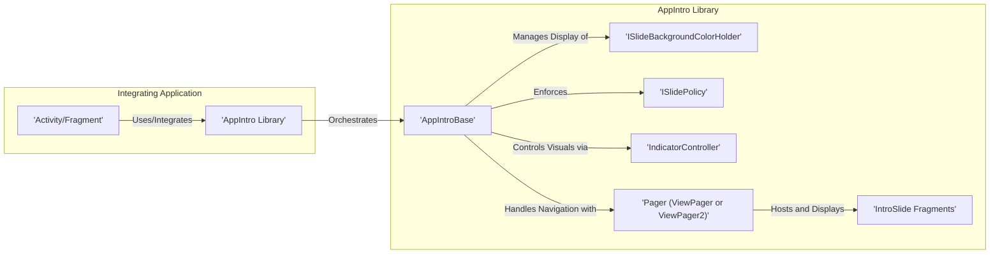
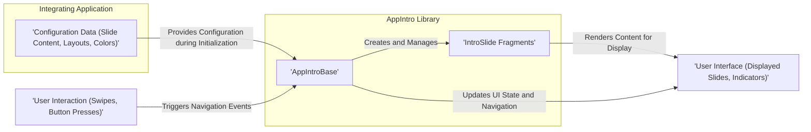

# Project Design Document: AppIntro Library

**Version:** 1.1
**Date:** October 26, 2023
**Author:** AI Software Architect

## 1. Introduction

This document provides an enhanced and detailed design overview of the AppIntro Android library, an open-source project available on GitHub at [https://github.com/AppIntro/AppIntro](https://github.com/AppIntro/AppIntro). This document aims to clearly articulate the library's architecture, components, and data flow, serving as a robust foundation for subsequent threat modeling activities.

AppIntro is a library designed to simplify the creation of visually appealing and user-friendly introduction sequences within Android applications. These intro sequences are commonly used to onboard new users, highlight key features, request necessary permissions, or present important information upon the application's initial launch.

## 2. Goals

* Provide a comprehensive and easily understandable architectural overview of the AppIntro library.
* Clearly identify and describe the purpose and interactions of key components within the library.
* Detail the flow of data within the library and between the library and the integrating application, including configuration and user interaction data.
* Establish a solid and well-defined understanding of the library's functionality to facilitate effective security analysis and threat modeling.

## 3. Non-Goals

* This document does not aim to provide an exhaustive, line-by-line code-level analysis of every class and method within the AppIntro library.
* It does not cover the specific implementation details or architectural choices of the example applications included within the AppIntro repository.
* Performance benchmarking, optimization strategies, or resource utilization analysis are outside the scope of this document.
* This document serves as a precursor to threat modeling and does not itself provide a complete threat model or vulnerability assessment.

## 4. Architectural Overview

AppIntro is structured as a modular and reusable Android library intended for seamless integration into existing Android applications. It offers a collection of UI components and associated logic to effectively manage the presentation and navigation of a series of introductory slides.

**Detailed Component Descriptions:**

* **Integrating Application ('Activity/Fragment'):** This represents the host Android application component (either an Activity or a Fragment) where the developer instantiates and utilizes the AppIntro library. This is the entry point for integrating the library's functionality and where initial configuration takes place.
* **AppIntro Library:** This encompasses the core set of classes and resources that provide the primary functionality for displaying and managing the intro slide sequence.
* **AppIntroBase:** This abstract base class serves as the foundation for concrete AppIntro implementations. It encapsulates the core logic for managing the collection of slides, handling navigation between them, and controlling the visual indicators.
* **ISlideBackgroundColorHolder:** This interface is designed to be implemented by individual slide fragments that require the ability to dynamically control the background color of the overall AppIntro view.
* **ISlidePolicy:** This interface allows individual slide fragments to define specific policies or conditions that must be met before the user can proceed to the next slide. This can be used for tasks like ensuring a user has read the content or completed a specific action on the current slide.
* **IndicatorController:** This component is responsible for managing the visual representation of the progress indicators, typically displayed as a series of dots or a progress bar, which indicate the user's current position within the intro flow.
* **Pager ('ViewPager' or 'ViewPager2'):** This refers to the standard Android `ViewPager` or the newer `ViewPager2` component. AppIntro leverages this component to enable smooth, swipe-based navigation between the individual intro slides.
* **IntroSlide Fragments:** These are individual Android `Fragment` instances, each representing a single slide within the introduction sequence. These fragments contain the specific content (text, images, animations, etc.) that is displayed to the user for that particular slide.

## 5. Data Flow

The data flow within AppIntro revolves around the initial configuration of the intro slides and the subsequent user interaction as they navigate through the sequence.

**Detailed Data Flow Description:**

* **Configuration Data ('Slide Content, Layouts, Colors'):** The integrating application provides the necessary configuration data to the AppIntro library during its initialization. This data includes the content to be displayed on each slide (text, images, custom layouts), styling information (colors, fonts), and potentially other customization parameters. This configuration is typically passed when creating and setting up the `AppIntro` instance.
* **Slide Creation and Management ('AppIntroBase' -> 'IntroSlide Fragments'):** The `AppIntroBase` class receives the configuration data and uses it to instantiate and manage the lifecycle of the individual `IntroSlide Fragments`.
* **Content Rendering ('IntroSlide Fragments' -> 'User Interface'):** Each `IntroSlide Fragment` is responsible for inflating its layout and rendering the configured content to be displayed to the user through the Android user interface.
* **User Interaction ('User Interaction (Swipes, Button Presses)'):** Users interact with the intro screens primarily through touch gestures, such as swiping left or right to navigate between slides, or by pressing navigation buttons (e.g., "Next," "Skip," "Done").
* **Navigation Event Handling ('User Interaction' -> 'AppIntroBase'):** User interactions trigger navigation events that are captured and handled by the `AppIntroBase` class. This includes determining the next slide to display or handling the completion of the intro sequence.
* **UI State Updates ('AppIntroBase' -> 'User Interface'):** Based on user interactions and internal logic, `AppIntroBase` updates the UI state. This involves transitioning to the next or previous slide, updating the visual indicators to reflect the current position, and potentially dismissing the intro screen upon completion.

## 6. Security Considerations (Expanded)

While the primary focus of this document is design, it's crucial to highlight potential areas of security concern that will require further investigation during the threat modeling process:

* **Malicious Data Injection via Configuration:** If the source of the configuration data provided by the integrating application is compromised (e.g., fetched from an insecure server or user-controlled input), it could lead to the display of malicious or misleading content within the intro slides. This could potentially be used for phishing attacks or to trick users into performing unintended actions.
* **UI Redressing or Overlay Attacks:** Although the AppIntro library itself manages the presentation of slides, vulnerabilities in the integrating application's window management or the way the intro is launched could potentially be exploited by overlay attacks. A malicious application could draw a deceptive overlay on top of the intro screen to capture user input or trick them.
* **Sensitive Information Disclosure in Intro Slides:** Developers must exercise caution when displaying sensitive information within the intro slides. If not handled properly, this information could be inadvertently exposed or logged, potentially leading to data breaches.
* **Vulnerabilities in Dependencies:** AppIntro relies on the Android SDK and potentially other support libraries. Security vulnerabilities discovered in these underlying dependencies could indirectly affect the security of applications using AppIntro. Regular updates and security patching of these dependencies are crucial.
* **Risks Associated with Customization:** While AppIntro offers customization options, improper or insecure implementation of custom slide layouts or logic by the integrating developer could introduce security vulnerabilities. For example, a poorly implemented custom slide might be susceptible to cross-site scripting (XSS) if it displays web content.
* **Insecure Handling of User Input (if any):** If custom slides within the AppIntro sequence collect user input, it's essential to ensure that this input is handled securely to prevent vulnerabilities like SQL injection or command injection, although this is less likely within the core library itself.
* **Bypassing the Intro Sequence:** Depending on the implementation, there might be ways for a malicious user or application to bypass the intended intro sequence, potentially missing important information or security prompts.

## 7. Dependencies

AppIntro's functionality relies on several components of the Android ecosystem. The specific dependencies may vary slightly depending on the exact version of AppIntro being utilized. Common dependencies include:

* **Android SDK:** The core Android Software Development Kit is a fundamental dependency.
* **AndroidX Core and UI Libraries:** For essential components like `Fragment`, `ViewPager` or `ViewPager2`, `RecyclerView`, and related UI elements.
* **Kotlin Standard Library (if using the Kotlin version):**  For projects utilizing the Kotlin version of AppIntro, the Kotlin standard library is a necessary dependency.
* **AppCompat Library:** Provides backward-compatible versions of newer Android framework APIs.
* **Potentially other UI-related or utility libraries:** Depending on specific features or extensions implemented within the AppIntro library.

A comprehensive and up-to-date list of dependencies can be found in the `build.gradle` file of the AppIntro library project on GitHub.

## 8. Deployment

AppIntro is distributed as an Android library, which developers integrate into their applications using standard Android development practices. The typical deployment process involves adding a dependency declaration to the application's `build.gradle` file.

**Standard Deployment Procedure:**

1. **Add Library Dependency:** Include the appropriate AppIntro library dependency declaration within the `dependencies` block of the integrating application module's `build.gradle` file. This usually involves specifying the group ID, artifact ID, and version of the AppIntro library.
2. **Synchronize Gradle:** After adding the dependency, synchronize the Gradle project to download the library and its transitive dependencies.
3. **Implement AppIntro in Application Code:** Create an Activity or Fragment within the integrating application that extends one of the provided AppIntro base classes (e.g., `AppIntro`, `AppIntro2`, `AppIntroFragment`).
4. **Configure and Add Slides:** Within the newly created Activity or Fragment, configure the AppIntro instance by adding individual `IntroSlide` instances or custom slide fragments, providing the necessary content and customization options.
5. **Launch the AppIntro Sequence:** Initiate the display of the AppIntro sequence at the appropriate point in the application's lifecycle, typically during the initial launch or onboarding process.

## 9. Conclusion

This enhanced design document provides a more detailed and comprehensive overview of the AppIntro library's architecture, components, and data flow. By elaborating on the key elements and potential security considerations, this document serves as a valuable resource for conducting thorough threat modeling and ensuring the secure integration of the AppIntro library into Android applications.