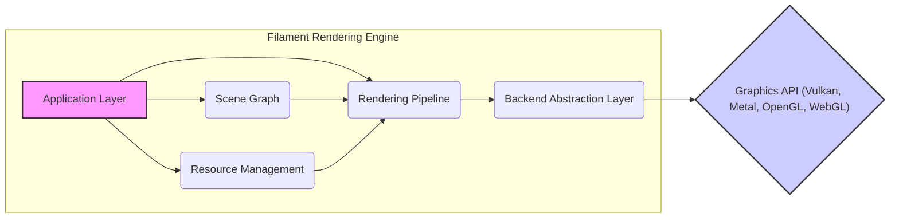
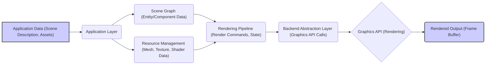

# Project Design Document: Filament Rendering Engine

**Version:** 1.1
**Date:** October 26, 2023
**Prepared By:** Gemini (AI Language Model)

## 1. Introduction

This document provides a detailed design overview of the Filament rendering engine, an open-source physically based rendering (PBR) engine for Android, iOS, Linux, macOS, Windows, and WebGL. This document aims to provide a comprehensive understanding of Filament's architecture, components, and data flow, serving as the foundation for subsequent threat modeling activities. The information presented here is based on publicly available information from the Filament GitHub repository: [https://github.com/google/Filament](https://github.com/google/Filament).

## 2. Goals and Objectives

The primary goals of this design document are:

*   To clearly articulate the high-level architecture and key components of the Filament rendering engine.
*   To describe the data flow within the engine, from input to rendered output, highlighting potential points of interaction and data transformation.
*   To identify the major interfaces and interactions between different parts of the system, focusing on boundaries where security vulnerabilities might arise.
*   To provide sufficient detail for security engineers to perform effective threat modeling, enabling the identification of potential threats and vulnerabilities.

## 3. Scope

This document covers the core architecture and functionality of the Filament rendering engine relevant for threat modeling. It includes:

*   The main components involved in the rendering pipeline and their responsibilities.
*   The different platform abstractions used by Filament and their potential security implications.
*   The key data structures and resources managed by the engine, focusing on how they are accessed and modified.
*   The interaction with external systems, specifically graphics APIs, and the security boundaries involved.

This document does not cover:

*   Specific implementation details of individual algorithms or rendering techniques beyond their architectural impact.
*   The intricacies of the build system or development environment.
*   Detailed performance optimization strategies unless they have security implications.
*   Specific application integrations using Filament, focusing instead on the engine itself.

## 4. High-Level Architecture

Filament employs a modular and layered architecture to achieve platform independence and flexibility. The core of the engine is written in C++, with platform-specific bindings for integration. This layered approach introduces clear boundaries between components, which are important for security analysis.

Here's a high-level overview of the main layers and their interactions:

*   **Application Layer:** The primary interface for applications to interact with Filament, providing APIs for scene management, rendering control, and resource manipulation. This layer is a key entry point for external input.
*   **Scene Graph:** Manages the hierarchical organization of scene objects, including entities, transformations, and components. This layer handles scene structure and object relationships.
*   **Resource Management:** Responsible for managing the lifecycle of GPU resources like meshes, textures, and materials. This layer interacts directly with the graphics backend.
*   **Rendering Pipeline:**  Orchestrates the rendering process, including visibility determination, sorting, and command generation. This is where the core rendering logic resides.
*   **Backend Abstraction Layer:** Provides a platform-independent interface to the underlying graphics APIs (Vulkan, Metal, OpenGL, WebGL). This layer acts as a crucial security boundary between Filament and the potentially less controlled graphics drivers.
*   **Platform Layer:** Offers platform-specific implementations for OS-level functionalities like windowing and input. This layer handles interactions with the operating system.

## 5. Component Details

This section provides more detail on the key components within the Filament architecture, highlighting aspects relevant to security.

### 5.1. Application Layer

*   Serves as the primary interface for external interaction, making it a critical point for input validation and access control considerations.
*   Provides APIs for creating and managing core engine objects:
    *   `Engine`: The central manager for all Filament resources and systems.
    *   `Scene`:  Contains the collection of renderable objects, lights, and cameras.
    *   `View`: Defines the rendering parameters for a specific viewport.
    *   `Entity`:  A lightweight identifier for objects in the scene.
    *   `Component`:  Data associated with entities (e.g., `Renderable`, `Light`, `Camera`), representing potential data injection points.
    *   `SwapChain`:  Represents the rendering target, where rendered output is presented.

### 5.2. Scene Graph

*   Manages the hierarchical structure of the scene, potentially exposing vulnerabilities if traversal or modification is not handled securely.
*   Handles the transformation matrices of entities, which could be manipulated to cause unexpected rendering or even crashes.
*   Facilitates efficient culling and traversal, but incorrect implementation could lead to denial-of-service by processing excessive objects.

### 5.3. Resource Management

*   Responsible for the allocation, deallocation, and management of GPU resources, a critical area for preventing resource exhaustion or memory corruption.
*   Handles:
    *   Mesh data (vertices, indices, attributes), where malformed data could lead to crashes.
    *   Texture data, which could contain malicious content if not properly validated.
    *   Shader programs, a potential vector for code injection if compilation is not secure.
    *   Buffer objects and other GPU memory allocations.

### 5.4. Rendering Pipeline

*   Orchestrates the core rendering logic, making it a complex area with potential for vulnerabilities in algorithms or state management.
*   Key stages include:
    *   Visibility determination (culling), where bypasses could lead to rendering unintended objects.
    *   Sorting of renderable objects, where incorrect sorting could lead to rendering errors or exploits.
    *   Material system interaction, where vulnerabilities in material definitions or shader execution could be exploited.
    *   Lighting calculations, which could be manipulated to cause visual artifacts or performance issues.
    *   Shadow mapping, a complex process with potential for implementation flaws.
    *   Post-processing effects, which could introduce vulnerabilities if not handled carefully.

### 5.5. Backend Abstraction Layer

*   Acts as a crucial security boundary, isolating the core engine from the specifics of the underlying graphics APIs and their drivers.
*   Handles the translation of Filament's rendering commands into API-specific calls, a potential point for translation errors or vulnerabilities.
*   Key abstractions include:
    *   `Driver`: The main interface to the graphics API, requiring careful handling of API calls and resource management.
    *   `VertexBuffer`, `IndexBuffer`: Represent mesh data on the GPU, requiring validation to prevent out-of-bounds access.
    *   `Texture`: Represents image data on the GPU, susceptible to issues if loaded from untrusted sources.
    *   `Sampler`: Defines how textures are sampled, with potential for misuse leading to rendering errors.
    *   `Program`: Represents compiled shaders, a critical area for preventing malicious code execution.
    *   `RenderPass`: Defines the rendering target and operations, requiring careful configuration to prevent unintended side effects.
    *   `CommandBuffer`: Records rendering commands, where incorrect command sequences could lead to vulnerabilities.

### 5.6. Platform Layer

*   Provides platform-specific implementations for interacting with the operating system, introducing platform-specific security considerations.
*   Handles:
    *   Window creation and management, where vulnerabilities in windowing systems could be exploited.
    *   Input handling (keyboard, mouse, touch), a potential source of malicious input.
    *   File system access, requiring careful management of permissions and paths.
    *   Threading and synchronization primitives, where incorrect usage could lead to race conditions or deadlocks.

## 6. Data Flow

The rendering process in Filament involves a flow of data through various stages, each representing a potential point for data manipulation or interception.

**Detailed Data Flow with Security Considerations:**

1. **Input (Application Data):** The application provides scene descriptions and assets. This is the initial entry point and requires rigorous validation to prevent injection of malicious data (e.g., oversized meshes, corrupted textures, malicious shader code).
2. **Application Layer Processing:** The Application Layer receives and processes the input data. Secure coding practices are crucial here to prevent vulnerabilities like buffer overflows or format string bugs.
3. **Scene Graph Management:** The Scene Graph organizes the scene data. Vulnerabilities could arise from improper handling of scene hierarchy or object transformations.
4. **Resource Management:** Mesh, texture, and shader data are loaded and managed. This stage is critical for preventing the loading of malicious assets. Shader compilation needs to be a secure process.
5. **Rendering Pipeline Execution:** The core rendering logic is executed. Vulnerabilities could exist in rendering algorithms, material processing, or state management.
6. **Backend Abstraction Layer Translation:** Rendering commands are translated into graphics API calls. Errors in this translation could lead to unexpected behavior or security issues.
7. **Graphics API Execution:** The graphics API processes the commands. While Filament has limited control here, vulnerabilities in graphics drivers could still impact the application.
8. **Output (Rendered Frame Buffer):** The final rendered image is produced. Access control to the frame buffer might be a concern in certain contexts.

## 7. Interfaces and Interactions

Key interfaces and interactions within Filament, representing potential attack surfaces, include:

*   **Application Programming Interface (API):** The primary interface for application developers. Secure API design and usage are crucial to prevent misuse or exploitation.
*   **Backend Abstraction Layer Interface:** The boundary between the platform-independent core and the platform-specific graphics APIs. This interface needs to be robust and prevent the leakage of platform-specific vulnerabilities.
*   **Material System Interfaces:** Mechanisms for defining material properties, binding parameters, and loading textures. These interfaces need to prevent the injection of malicious shader code or textures.
*   **Resource Loading Interfaces:** How Filament loads and processes external resources like meshes and textures. Secure loading practices are essential to prevent the introduction of malicious content.
*   **Platform Layer Interfaces:** The interfaces provided by the Platform Layer for interacting with the operating system. These interfaces need to be used securely to avoid platform-specific vulnerabilities.

## 8. Security Considerations (Detailed)

Building upon the preliminary considerations, here's a more detailed look at potential security concerns:

*   **Input Validation and Sanitization:**  Thorough validation of all input data, including scene descriptions, mesh data, textures, and material parameters, is paramount to prevent various attacks like buffer overflows, format string bugs, and denial-of-service.
*   **Memory Safety:** Given the use of C++, robust memory management practices are essential to prevent memory corruption vulnerabilities such as buffer overflows, use-after-free errors, and dangling pointers. Static and dynamic analysis tools should be employed.
*   **Shader Security:** The shader compilation process needs to be secure to prevent the injection of malicious code that could compromise the rendering pipeline or the system. Input validation for shader code and secure compilation practices are necessary.
*   **Resource Management Security:** Proper management of GPU resources is crucial to prevent resource exhaustion or denial-of-service attacks. This includes limiting resource consumption and preventing leaks.
*   **Third-Party Library Security:**  Careful vetting and regular updates of any third-party libraries used by Filament are necessary to mitigate vulnerabilities in those dependencies.
*   **Platform-Specific Security:**  Security considerations specific to each target platform (Android, iOS, WebGL, etc.) need to be addressed, including sandboxing, permissions, and secure API usage. WebGL contexts, in particular, require careful attention to cross-origin security.
*   **Access Control:** If Filament is integrated into a larger system, appropriate access controls should be in place to restrict access to sensitive rendering functionalities or data.
*   **Error Handling:** Robust error handling is crucial to prevent crashes or unexpected behavior that could be exploited. Error messages should not reveal sensitive information.

## 9. Deployment Considerations

Security considerations during deployment include:

*   **Secure Build Process:** Ensuring the build process is secure and free from tampering to prevent the introduction of malicious code.
*   **Dependency Management:**  Using secure channels for dependency retrieval and verifying the integrity of dependencies.
*   **Permissions and Sandboxing:**  Deploying applications using Filament with appropriate permissions and sandboxing to limit the impact of potential vulnerabilities.
*   **Regular Updates:**  Keeping Filament and its dependencies up-to-date with the latest security patches.

## 10. Future Considerations

Future development should continue to prioritize security:

*   **Security Audits:**  Regular security audits and penetration testing to identify and address potential vulnerabilities.
*   **Fuzzing:**  Utilizing fuzzing techniques to test the robustness of input parsing and processing.
*   **Static Analysis Integration:**  Integrating static analysis tools into the development process to identify potential security flaws early on.
*   **AddressSanitizer/MemorySanitizer Usage:**  Regularly using memory safety tools during development and testing.

This improved design document provides a more detailed and security-focused overview of the Filament rendering engine, better equipping security engineers for thorough threat modeling. The emphasis on data flow, interfaces, and potential vulnerabilities aims to facilitate the identification of potential attack vectors and the development of appropriate mitigation strategies.
