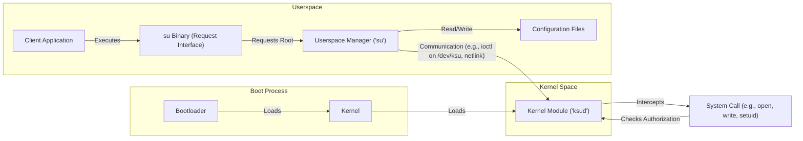

## Project Design Document: KernelSU (Improved)

**1. Introduction**

This document provides an enhanced and more detailed design overview of the KernelSU project, an open-source Android root solution operating primarily within the kernel space. This document is specifically crafted to serve as a robust foundation for subsequent threat modeling activities. It meticulously outlines the key components, architecture, and data flow of KernelSU, with a strong emphasis on highlighting potential areas of interest and attack vectors for security analysis.

**2. Project Overview**

KernelSU offers a method for granting root privileges to applications on Android devices without requiring modifications to the system partition. This approach provides benefits such as simplified over-the-air updates and a reduced risk of device failure (bricking). KernelSU achieves this by injecting code and data structures into the kernel during the boot process. This allows it to intercept and selectively modify system calls related to privilege checks, effectively granting root access to authorized applications.

**3. System Architecture**

The KernelSU architecture is composed of several interconnected components, each playing a crucial role in providing the root functionality.

*   **Kernel Module (`ksud`)**: The core of KernelSU, loaded into the Linux kernel early in the boot sequence. Its responsibilities include:
    *   **System Call Hooking**: Intercepting specific system calls related to user and group identity (UID, GID, capabilities), file access permissions, and potentially others.
    *   **Authorization Enforcement**: Maintaining an in-kernel list or data structure of applications granted root access, identified by their process ID (PID) or other attributes.
    *   **UID/GID Manipulation**: Modifying the effective and potentially real UID/GID of processes based on the authorization status.
    *   **Capability Management**:  Potentially manipulating process capabilities based on authorization.
    *   **Communication Interface**: Providing a secure and well-defined interface for the userspace manager to interact with (e.g., via `ioctl` commands on a character device, netlink sockets, or a dedicated file system interface).
    *   **Boot-time Initialization**: Setting up necessary hooks and data structures during kernel initialization.
*   **Userspace Manager (`su`)**: A privileged daemon running in userspace, responsible for managing root access policies. Its key responsibilities are:
    *   **Authorization Database Management**: Maintaining a persistent store (e.g., a file) of applications authorized for root access, along with any associated rules or permissions.
    *   **User Interface (UI) and Command-Line Interface (CLI)**: Providing mechanisms for users to grant and revoke root permissions to applications.
    *   **Communication with Kernel Module**: Securely communicating with the `ksud` kernel module to update the list of authorized applications and potentially other configuration parameters. This communication needs to be authenticated and authorized.
    *   **Root Request Handling**: Receiving requests from applications seeking root privileges (often through a standardized `su` binary or a custom API).
    *   **Policy Enforcement**: Applying user-defined rules or policies when granting or denying root access.
*   **Client Applications**: Applications that require root privileges to perform certain operations. They interact with the `su` manager (often indirectly through a `su` binary) to request and obtain elevated privileges.
*   **Configuration Files**: Files used by KernelSU to store persistent settings and data. These may include:
    *   **Authorized Application List**: A file containing the list of applications granted root access.
    *   **Configuration Parameters**: Settings for the behavior of the `ksud` module and the `su` daemon.
    *   **Logging Configuration**: Settings related to logging activities.
    These files are typically located in protected areas of the file system, requiring root privileges to modify.
*   **Boot Process Integration**: The mechanism by which the `ksud` kernel module is loaded and initialized during the Android boot process. This typically involves:
    *   **Boot Image Modification**: Modifying the `initrd` or `boot.img` to include the `ksud` module and potentially a script to load it.
    *   **Kernel Command Line Parameters**: Potentially using kernel command line parameters to configure the `ksud` module.

**4. Data Flow (Detailed)**

The following details the data flow during a root access request and the process of granting root access:

*   **Application Requests Root Access:**
    1. A "Client Application" attempts an operation requiring elevated privileges, triggering a "System Call" (e.g., `open`, `write`, `chmod`, `setuid`).
    2. The Android kernel begins processing the "System Call".
    3. The KernelSU "Kernel Module ('ksud')" intercepts the "System Call" due to pre-configured hooks.
    4. "Kernel Module ('ksud')" retrieves the process ID (PID) of the calling process.
    5. "Kernel Module ('ksud')" checks its internal "Authorized Application List" for the PID.
    6. If the PID is authorized:
        *   "Kernel Module ('ksud')" modifies the effective UID and GID of the process to 0.
        *   The original "System Call" proceeds with root privileges.
    7. If the PID is not authorized:
        *   The "System Call" proceeds with the original (non-root) privileges, potentially resulting in a permission denied error.

*   **Granting Root Access:**
    1. A user interacts with the "Userspace Manager ('su')" application (or CLI).
    2. The user grants root access to a specific "Client Application".
    3. "Userspace Manager ('su')" updates its local "Authorization Database".
    4. "Userspace Manager ('su')" establishes a secure "Communication Channel" with the "Kernel Module ('ksud')".
    5. "Userspace Manager ('su')" sends an authenticated and authorized request to "Kernel Module ('ksud')" to update the "Authorized Application List". This request includes the application's identifier (e.g., package name, UID).
    6. "Kernel Module ('ksud')" verifies the authenticity and authorization of the request.
    7. "Kernel Module ('ksud')" updates its internal "Authorized Application List".
    8. Optionally, "Userspace Manager ('su')" may update "Configuration Files" to persist the authorization.

**5. Component Interaction Diagram**

**6. Key Components and their Responsibilities (Detailed)**

*   **Kernel Module (`ksud`)**:
    *   **Fine-grained System Call Interception**: Implementing hooks for specific system calls relevant to privilege escalation.
    *   **Secure Storage of Authorized Applications**: Maintaining the list of authorized applications in a secure manner within kernel memory.
    *   **Context-Aware Authorization**: Potentially considering other factors beyond PID for authorization (e.g., user ID, SELinux context).
    *   **Robust Communication Handling**: Securely handling communication requests from the userspace manager, preventing unauthorized access or manipulation.
    *   **Error Handling and Logging**: Implementing proper error handling and logging mechanisms for debugging and security auditing.
*   **Userspace Manager (`su`)**:
    *   **Secure Authorization Database Management**: Protecting the integrity and confidentiality of the authorized application list.
    *   **User Authentication and Authorization**: Ensuring that only authorized users can grant or revoke root permissions.
    *   **Secure Communication Protocol**: Implementing a secure and authenticated communication protocol with the kernel module.
    *   **Input Validation**: Thoroughly validating user input to prevent injection attacks or other vulnerabilities.
    *   **Logging and Auditing**: Logging significant events, such as granting or revoking root access, for security auditing.
*   **Client Applications**:
    *   **Requesting Root Privileges**: Utilizing a standard mechanism (e.g., the `su` binary) or a custom API to request root access.
    *   **Handling Permission Denials**: Gracefully handling scenarios where root access is not granted.
*   **Configuration Files**:
    *   **Access Control**: Implementing strict access controls to prevent unauthorized modification.
    *   **Data Integrity**: Ensuring the integrity of the configuration data, potentially using checksums or other mechanisms.
    *   **Secure Storage**: Storing sensitive information securely, potentially using encryption.
*   **Boot Process Integration**:
    *   **Secure Loading of Kernel Module**: Ensuring the kernel module is loaded from a trusted source and has not been tampered with.
    *   **Early Initialization**: Initializing the kernel module early in the boot process to intercept system calls before malicious applications can run.

**7. Security Considerations (Elaborated)**

This section expands on the initial security considerations, providing more specific potential threats and vulnerabilities:

*   **Kernel Module Vulnerabilities (`ksud`)**:
    *   **Buffer Overflows/Underflows**: Vulnerabilities in the kernel module's code could allow attackers to overwrite kernel memory, leading to privilege escalation or system crashes.
    *   **Use-After-Free Errors**: Improper memory management could lead to use-after-free vulnerabilities, allowing attackers to execute arbitrary code in kernel space.
    *   **Race Conditions**: Concurrency issues could lead to race conditions, allowing attackers to bypass security checks.
    *   **Incorrect System Call Hooking**: Improperly implemented system call hooks could lead to unexpected behavior or security vulnerabilities.
    *   **Information Disclosure**: The kernel module might inadvertently leak sensitive information.
*   **Userspace Manager Vulnerabilities (`su`)**:
    *   **SQL Injection (if using a database)**: If the authorization database is not properly secured, it could be vulnerable to SQL injection attacks.
    *   **Command Injection**: Improper handling of user input could allow attackers to execute arbitrary commands with root privileges.
    *   **Authentication and Authorization Bypass**: Vulnerabilities in the authentication or authorization mechanisms could allow unauthorized users to manage root permissions.
    *   **Denial of Service**: The `su` daemon could be vulnerable to denial-of-service attacks, preventing legitimate users from managing root permissions.
    *   **Local Privilege Escalation**: Vulnerabilities in the `su` daemon itself could allow unprivileged users to gain root privileges.
*   **Communication Channel Security**:
    *   **Man-in-the-Middle Attacks**: If the communication channel between the `su` daemon and the `ksud` module is not properly secured, attackers could intercept and modify communication, potentially granting unauthorized root access.
    *   **Replay Attacks**: Attackers could replay legitimate communication requests to grant unauthorized root access.
    *   **Spoofing**: Attackers could spoof communication from the `su` daemon to the `ksud` module.
*   **Configuration File Security**:
    *   **Unauthorized Modification**: If configuration files are not properly protected, malicious applications or users could modify them to grant themselves root access.
    *   **Information Disclosure**: Sensitive information stored in configuration files could be exposed if access controls are not properly implemented.
*   **Boot Process Security**:
    *   **Bootloader Exploits**: Vulnerabilities in the bootloader could allow attackers to bypass KernelSU's security measures or inject malicious code before KernelSU is loaded.
    *   **Compromised Boot Image**: If the boot image is compromised, attackers could replace the `ksud` module with a malicious version or disable it entirely.
*   **API Security (if any)**:
    *   **Lack of Authentication/Authorization**: If the `su` manager exposes an API, it needs robust authentication and authorization mechanisms to prevent unauthorized access.
    *   **Input Validation Vulnerabilities**: API endpoints could be vulnerable to injection attacks if input is not properly validated.
*   **Bypass Mechanisms**:
    *   **Kernel Exploits**: Exploits targeting vulnerabilities in the underlying kernel could allow applications to gain root access without going through KernelSU.
    *   **Direct System Call Manipulation**: If applications can directly manipulate system call tables or other kernel structures, they might be able to bypass KernelSU's hooks.

**8. Assumptions and Constraints (Specific)**

*   The underlying Android operating system and kernel are assumed to be reasonably secure against common vulnerabilities *before* KernelSU is introduced.
*   The security of the device's bootloader is considered a critical dependency but is largely outside the direct control of the KernelSU project.
*   The communication channel between the userspace manager and the kernel module is assumed to be a primary target for attackers.
*   Configuration files are assumed to be a valuable target for attackers seeking to gain persistent root access.
*   The specific implementation details of the communication channel (e.g., using `ioctl` on a specific device node like `/dev/ksu`) will influence the attack surface.
*   The format and location of configuration files are implementation-specific and may vary across KernelSU versions.

**9. Glossary**

*   **Kernel Module**: A dynamically loadable piece of code that runs within the Linux kernel.
*   **Userspace**: The memory space outside the kernel where applications execute with restricted privileges.
*   **Root Access**: Unrestricted access to all commands, files, and resources in a Unix-like operating system.
*   **System Call**: A programmatic way for a computer program in userspace to request a service from the kernel.
*   **UID/GID**: User Identifier and Group Identifier, used by the operating system to determine the permissions of a process.
*   **Capabilities**: A finer-grained mechanism for controlling privileges in Linux, offering more granular control than simple UID/GID checks.
*   **ioctl**: An input/output control system call that allows userspace programs to send control commands to device drivers or kernel modules.
*   **Netlink Socket**: A socket-based interface used for communication between the kernel and userspace processes, often used for network-related events and configuration.
*   **Boot Image**: A file containing the Linux kernel, ramdisk, and other essential components required to boot an Android device.
*   **initrd**: Initial RAM disk, a temporary root file system loaded into memory during the early stages of the boot process.
*   **SELinux Context**: Security-Enhanced Linux context, a part of the SELinux security policy that defines the security attributes of processes and files.

This improved design document provides a more comprehensive and detailed understanding of the KernelSU project, specifically tailored for effective threat modeling. The enhanced descriptions of components, data flow, and security considerations offer a more robust foundation for identifying and mitigating potential security risks.