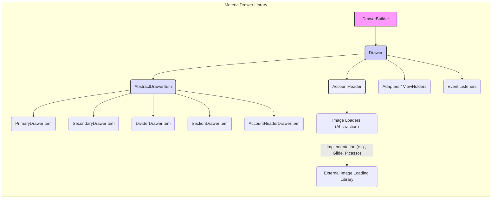
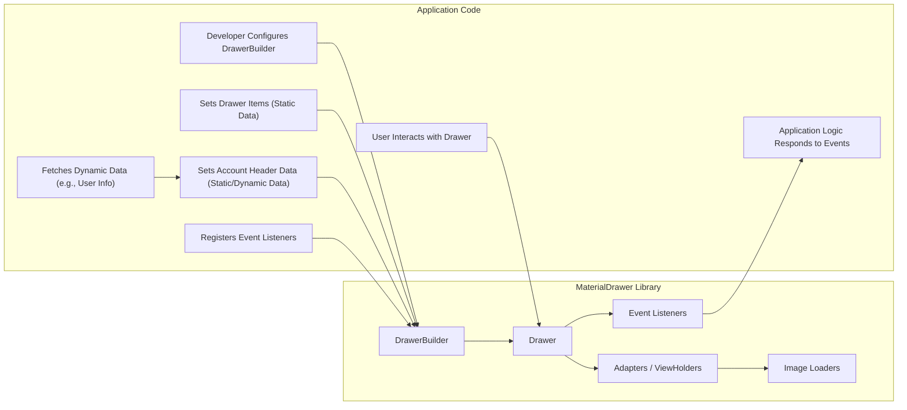

# Project Design Document: MaterialDrawer Library

**Version:** 1.1
**Date:** October 26, 2023
**Author:** Gemini (AI Language Model)

## 1. Introduction

This document provides an enhanced and more detailed design overview of the MaterialDrawer Android library, an open-source project available on GitHub at [https://github.com/mikepenz/MaterialDrawer](https://github.com/mikepenz/MaterialDrawer). Building upon the previous version, this document aims to provide an even clearer and more comprehensive articulation of the library's architecture, components, and data flow to facilitate more effective threat modeling. It will serve as a robust foundation for identifying potential security vulnerabilities and designing appropriate mitigation strategies.

## 2. Goals

*   Provide a highly detailed and comprehensive architectural overview of the MaterialDrawer library, elaborating on component interactions.
*   Clearly identify key components and meticulously describe their interactions and responsibilities.
*   Describe the data flow within the library with greater precision, including the handling of different data types.
*   Highlight potential areas of security concern with specific examples for subsequent threat modeling.
*   Serve as an authoritative and easily understandable reference for developers, security analysts, and anyone seeking a deep understanding of the library's design.

## 3. Overview

MaterialDrawer is a versatile and highly customizable navigation drawer implementation for Android applications, strictly adhering to Material Design principles. It empowers developers to seamlessly integrate a visually appealing, user-friendly, and highly functional navigation menu into their applications. The library offers an extensive range of customization options for drawer items, headers, footers, and the overall visual appearance. It supports a diverse set of drawer item types, including primary items, secondary items, dividers, section headers, and the ability to implement fully custom items.

## 4. Architecture

The MaterialDrawer library is designed with a strong emphasis on modularity, with well-defined components each responsible for specific aspects of the drawer's functionality. This separation of concerns enhances maintainability and testability.

### 4.1. Key Components

*   **`DrawerBuilder`:** This serves as the central and primary entry point for configuring and ultimately creating an instance of the `Drawer`. It provides a fluent interface allowing developers to set a wide array of options, including:
    *   Adding various types of drawer items.
    *   Configuring the optional `AccountHeader`.
    *   Setting a custom footer view.
    *   Registering event listeners for user interactions.
    *   Defining the drawer's initial state (opened or closed).
    *   Customizing the drawer's visual appearance.
*   **`Drawer`:** This class embodies the actual navigation drawer UI element. It is responsible for:
    *   Managing the display of the configured drawer items within a `RecyclerView`.
    *   Handling user interactions such as item clicks and drawer state changes.
    *   Integrating with the host `Activity` or `Fragment` to display the drawer.
    *   Coordinating the display of the `AccountHeader` and footer.
*   **`AbstractDrawerItem`:** This abstract base class defines the common structure and properties shared by all types of drawer items. It includes attributes such as:
    *   A unique identifier for the item.
    *   The text to be displayed for the item.
    *   An optional icon.
    *   Flags indicating whether the item is enabled, selectable, or hidden.
    *   Methods for handling item clicks and other events.
*   **Concrete Drawer Item Implementations:** These are concrete classes that inherit from `AbstractDrawerItem`, each representing a specific type of drawer item with its own unique visual representation and behavior:
    *   `PrimaryDrawerItem`: Represents a main navigation entry, typically with a prominent icon.
    *   `SecondaryDrawerItem`: Represents a less prominent navigation entry, often with a smaller icon or no icon.
    *   `DividerDrawerItem`: Represents a visual separator used to group related items.
    *   `SectionDrawerItem`: Represents a header for a logical grouping of drawer items.
    *   `AccountHeaderDrawerItem`: Represents an interactive item within the `AccountHeader`, such as a profile switcher.
    *   Custom Drawer Items: Developers have the flexibility to create their own specialized drawer item types by extending `AbstractDrawerItem`, allowing for highly tailored navigation elements.
*   **`AccountHeader`:** This optional component provides a dedicated area at the top of the drawer to display user account information. It can include:
    *   A profile picture or avatar.
    *   The user's name and email address.
    *   Multiple user profiles with a profile switching mechanism.
    *   Customizable background images or colors.
*   **Adapters and ViewHolders:** The library leverages the `RecyclerView.Adapter` and `RecyclerView.ViewHolder` design pattern for efficient management and rendering of the potentially large list of drawer items. This ensures smooth scrolling and optimal performance.
*   **Event Listeners:**  The library provides a set of interfaces that enable developers to respond to various user interactions and drawer lifecycle events:
    *   `OnDrawerItemClickListener`:  Invoked when a drawer item is clicked, providing information about the clicked item.
    *   `OnDrawerListener`: Provides callbacks for drawer open, close, and slide events.
    *   Other specialized listeners for specific components like the `AccountHeader`.
*   **Image Loaders (Abstraction Layer):**  MaterialDrawer employs an abstraction layer for handling asynchronous image loading. While it doesn't mandate a specific image loading library, it often integrates seamlessly with popular libraries like Glide or Picasso. This abstraction allows developers to choose their preferred library or even implement a custom image loading strategy.

### 4.2. Component Diagram

## 5. Data Flow

The data flow within the MaterialDrawer library encompasses the initial configuration of the drawer, the dynamic loading of data, and the handling of user interactions.

### 5.1. Drawer Configuration

1. The application developer instantiates a `DrawerBuilder`.
2. Drawer items are created (instances of concrete `AbstractDrawerItem` implementations) and added to the `DrawerBuilder`. This involves setting properties such as:
    *   `identifier`: A unique identifier for programmatic access.
    *   `name`: The text displayed for the item.
    *   `icon`:  A resource ID or `Drawable` for the item's icon.
    *   `isEnabled`:  A boolean indicating if the item is interactive.
    *   `isSelectable`: A boolean indicating if the item can be visually selected.
3. If an `AccountHeader` is desired, it is configured and added to the `DrawerBuilder`. This includes setting:
    *   User profile information (name, email).
    *   Profile picture resources or URIs.
    *   Account switcher items.
4. Event listeners (implementations of the provided listener interfaces) are registered with the `DrawerBuilder` to receive callbacks for user interactions and drawer state changes.
5. The `build()` method of the `DrawerBuilder` is invoked, which:
    *   Creates the `Drawer` instance.
    *   Inflates the necessary layout files.
    *   Initializes the UI components (e.g., the `RecyclerView`).
    *   Sets up the adapters and view holders.
6. The `Drawer` then uses the configured adapters and view holders to render the list of drawer items within the `RecyclerView`.
7. If image resources or URIs are provided for icons or profile pictures, the configured (or default) image loader is used asynchronously to fetch and display these images.

### 5.2. User Interaction

1. The user interacts with the navigation drawer, typically by:
    *   Opening the drawer (often via a hamburger menu icon or a swipe gesture).
    *   Clicking on a drawer item.
    *   Interacting with elements within the `AccountHeader`.
2. When a drawer item is clicked:
    *   The `RecyclerView`'s item click listener detects the interaction.
    *   The `Drawer` identifies the specific item that was clicked based on its position in the list.
    *   The registered `OnDrawerItemClickListener` (if any) is invoked.
    *   The `OnDrawerItemClickListener` receives information about the clicked item, including its identifier and the event.
    *   The application code, within the `OnDrawerItemClickListener`, can then perform actions based on the clicked item (e.g., navigating to a new screen, executing a specific function).
3. Drawer open and close events trigger the registered `OnDrawerListener`, providing callbacks indicating the drawer's current state.
4. Interactions within the `AccountHeader` (e.g., clicking on a profile switcher item) trigger specific listeners associated with the `AccountHeader`.

### 5.3. Data Sources

*   **Static Data:**  The majority of drawer item properties (name, icon resources, identifiers) are typically defined statically within the application's code when configuring the `DrawerBuilder`.
*   **Dynamic Data:** Certain aspects of the drawer, particularly within the `AccountHeader`, often involve dynamic data:
    *   User names, email addresses, and profile picture URIs might be fetched from local storage (e.g., SharedPreferences), databases, or remote APIs.
    *   The list of accounts in a profile switcher might be dynamically populated based on the user's logged-in accounts.
    *   The availability or visibility of certain drawer items might be determined dynamically based on application state or user permissions.

### 5.4. Data Flow Diagram

## 6. Security Considerations (For Threat Modeling)

This section provides specific examples of potential security concerns to guide the threat modeling process.

*   **Input Validation of Drawer Item Data:**
    *   **Threat:** If drawer item names or other displayed text are sourced from untrusted external sources (e.g., a remote API without proper sanitization), malicious actors could inject code or scripts. While direct execution within the Android UI is less likely, it could lead to UI manipulation, unexpected behavior, or even data exfiltration if the content is later used in a web context.
    *   **Example:** A malicious API response could include a drawer item name like ``, which, if not properly handled, might be displayed verbatim or could potentially cause issues if the application later processes this data in a web view.
*   **Image Loading Vulnerabilities:**
    *   **Threat:** If the underlying image loading library (e.g., Glide, Picasso) has vulnerabilities related to processing malicious image files, an attacker could potentially trigger arbitrary code execution or denial-of-service by providing crafted image URLs for drawer item icons or profile pictures.
    *   **Example:** A malicious user could provide a link to a specially crafted PNG file as their profile picture, which exploits a known vulnerability in the image loading library, leading to a crash or, in a worst-case scenario, code execution within the application's context.
*   **Handling of Sensitive Data in Account Header:**
    *   **Threat:** If the `AccountHeader` displays sensitive user information (e.g., email address), this data could be exposed if the device is compromised or if the application has vulnerabilities that allow unauthorized access to its memory or resources.
    *   **Example:** If the application doesn't properly protect its process memory, a malicious app running on the same device could potentially read the user's email address displayed in the `AccountHeader`.
*   **Event Listener Security:**
    *   **Threat:** While less common, if the application's design allows external components or untrusted code to register event listeners with the `Drawer`, a malicious component could intercept user interactions (e.g., item clicks) and perform unintended actions without the user's knowledge.
    *   **Example:** A rogue library integrated into the application could register an `OnDrawerItemClickListener` that silently sends the identifiers of clicked items to a remote server.
*   **Deep Links and Intent Handling:**
    *   **Threat:** If clicking on a drawer item triggers a deep link or an intent to launch another activity, improper validation of the link or intent data could lead to vulnerabilities like intent redirection, where a malicious application intercepts the intent and performs an unintended action.
    *   **Example:** A drawer item intended to open the user's profile could be manipulated to launch a malicious application that spoofs the login screen to steal credentials.
*   **Custom Drawer Items:**
    *   **Threat:** If developers create custom drawer item implementations, vulnerabilities in their custom code could introduce security risks. This includes improper handling of user input, insecure data storage, or vulnerabilities in the custom item's rendering logic.
    *   **Example:** A custom drawer item that displays user-generated content might be vulnerable to cross-site scripting if the content is not properly sanitized before rendering.

## 7. Dependencies

The MaterialDrawer library relies on several Android Support/AndroidX libraries and potentially external image loading libraries, which are important to consider from a security perspective:

*   `androidx.recyclerview:recyclerview`:  A vulnerability in the `RecyclerView` could affect how drawer items are displayed and handled.
*   `androidx.appcompat:appcompat`:  Security issues in the base Android UI components could indirectly impact the drawer's security.
*   `com.google.android.material:material`:  Vulnerabilities in the Material Design components used by the drawer could be exploited.
*   Image Loading Libraries (e.g., Glide, Picasso): As discussed in the security considerations, vulnerabilities in these libraries are a significant concern. The specific version of the image loading library used by the application is crucial for assessing potential risks.

It's important to regularly review the security advisories for these dependencies and update them to the latest versions to mitigate known vulnerabilities.

## 8. Deployment

The MaterialDrawer library is distributed as an Android Archive (AAR) file. Developers include it as a dependency in their Android application's `build.gradle` file. When the application is built and run on an Android device, the MaterialDrawer library's code executes within the security context and process of the host application. This means that any vulnerabilities within the MaterialDrawer library could potentially be exploited within the application's sandbox.

## 9. Future Considerations

Potential future developments or modifications to the library that could have security implications include:

*   **Introduction of New Features:** Adding new features, especially those involving handling external data or user input, could introduce new attack vectors if not designed and implemented securely.
*   **Changes in Dependency Requirements:**  Switching to new or different dependency libraries could introduce new security considerations based on the vulnerabilities present in those new dependencies.
*   **More Complex Customization APIs:** Providing more extensive customization options might inadvertently create opportunities for developers to introduce security vulnerabilities through insecure custom configurations.

This enhanced design document provides a more in-depth understanding of the MaterialDrawer library's architecture and potential security considerations. This detailed information is crucial for conducting a comprehensive and effective threat model to identify and mitigate potential risks.