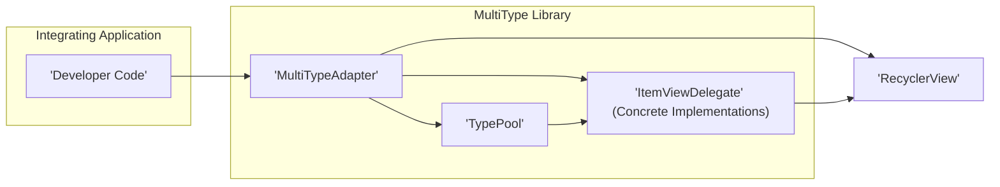
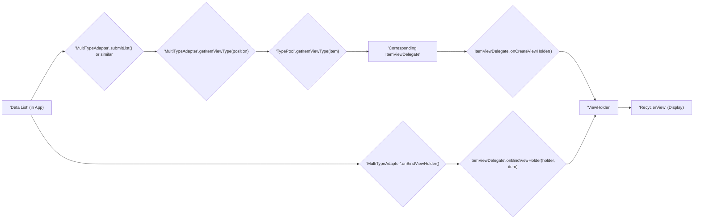

# Project Design Document: MultiType Library

**Version:** 1.1
**Date:** October 26, 2023
**Author:** Gemini (AI Language Model)

## 1. Introduction

This document provides an enhanced design overview of the MultiType Android library, as found on GitHub at [https://github.com/drakeet/MultiType](https://github.com/drakeet/MultiType). This revised document aims to provide an even stronger foundation for subsequent threat modeling activities by offering greater clarity and detail regarding the library's architecture, components, and data flow.

MultiType is an Android library specifically designed to streamline the display of diverse data types within a `RecyclerView`. It empowers developers to establish clear mappings between distinct data model classes and their corresponding `ViewHolder` implementations. This approach fosters a cleaner, more organized, and ultimately more maintainable method for managing lists containing heterogeneous items, moving away from less elegant solutions like complex `getItemViewType` logic.

## 2. Goals

*   To offer a highly adaptable and extensible framework for rendering various data types within a `RecyclerView`.
*   To achieve a clear separation between data models and their visual representations on the screen.
*   To simplify the process of creating and maintaining `RecyclerView.Adapter` implementations, particularly for lists with complex and varied content.
*   To enhance code readability and long-term maintainability compared to traditional methods of handling multiple view types in `RecyclerView` adapters.

## 3. Non-Goals

*   To provide pre-built, specialized UI components beyond the fundamental `RecyclerView` and `ViewHolder`. The library focuses on the logic of managing different view types, not on providing custom UI elements.
*   To handle the complexities of data fetching from remote sources or local persistence mechanisms. MultiType's responsibility is strictly within the presentation layer of the application.
*   To implement intricate animations or transitions beyond the standard capabilities offered by the Android `RecyclerView` component.
*   To incorporate specific, built-in security features beyond adhering to general Android development best practices. Security is considered the primary responsibility of the application integrating the library.

## 4. Architectural Overview

MultiType employs a plugin-based architecture. Different data types are rendered using dedicated "type adapters," which are concrete implementations of the `ItemViewDelegate` interface. The core of the library acts as a central manager, maintaining the association between data types and their respective delegates.



**Components:**

*   **Integrating Application ("Developer Code"):** This represents the Android application that incorporates and utilizes the MultiType library. The application code is responsible for providing the data to be displayed and for instantiating the `MultiTypeAdapter`.
*   **MultiTypeAdapter:** This class extends `RecyclerView.Adapter` and serves as the central orchestrator within the library. It holds a reference to the `TypePool` and is responsible for delegating the creation of `ViewHolder` instances and the binding of data to the appropriate `ItemViewDelegate` based on the data type.
*   **TypePool:** This component acts as a registry, maintaining a mapping between specific data model classes and their corresponding `ItemViewDelegate` implementations. It allows the `MultiTypeAdapter` to efficiently determine which delegate is responsible for a given data item.
*   **ItemViewDelegate (Concrete Implementations):** These are the individual components responsible for the visual representation of a specific data type. Each concrete implementation of `ItemViewDelegate` is responsible for creating the `ViewHolder` for its associated data type and for binding the data to the views within that `ViewHolder`. Developers create these concrete subclasses to define how each data type should be displayed.
*   **RecyclerView:** This is the standard Android UI component used to display lists of data. MultiType leverages the existing functionality of `RecyclerView` for rendering the list items.

## 5. Data Flow

The process of displaying data using the MultiType library follows these steps:

1. **Data Provision:** The integrating application provides a collection (typically a `List`) of data objects to the `MultiTypeAdapter`. This list can contain objects of various types.
2. **Type Determination:** When the `RecyclerView` needs to display an item at a particular position, the `MultiTypeAdapter` retrieves the data object at that position from the provided data list.
3. **Delegate Lookup:** The `MultiTypeAdapter` then queries the `TypePool` to find the appropriate `ItemViewDelegate` that is registered for the class of the retrieved data object.
4. **ViewHolder Instantiation:** The identified `ItemViewDelegate` is responsible for creating a new `ViewHolder` instance. This `ViewHolder` is specifically designed to display the data type handled by that delegate.
5. **Data Binding:** The `MultiTypeAdapter` invokes the `onBindViewHolder` method of the resolved `ItemViewDelegate`, passing the created `ViewHolder` instance and the data object. The delegate then populates the views within the `ViewHolder` with the data from the provided object.
6. **Display Rendering:** Finally, the `RecyclerView` takes the populated `ViewHolder` and renders it on the screen as part of the list.



## 6. Component Details

### 6.1. MultiTypeAdapter

*   **Responsibilities:**
    *   Inherits from `RecyclerView.Adapter`, providing the necessary framework for managing items in a `RecyclerView`.
    *   Maintains a reference to the `TypePool`, enabling it to access the registered delegate mappings.
    *   Accepts the list of data items to be displayed from the integrating application.
    *   Determines the appropriate view type for each item in the list by querying the `TypePool` based on the item's data type.
    *   Delegates the creation of `ViewHolder` instances to the corresponding `ItemViewDelegate` based on the determined view type.
    *   Delegates the process of binding data to the `ViewHolder` to the appropriate `ItemViewDelegate`.
    *   Manages the underlying data list, potentially utilizing `DiffUtil` for efficient updates to the `RecyclerView`.
*   **Key Methods:**
    *   `register(Class<?> itemClass, ItemViewDelegate delegate)`: Registers a mapping between a specific data class and its associated `ItemViewDelegate`.
    *   `unregister(Class<?> itemClass)`: Removes a previously registered mapping for a given data class.
    *   `getItemViewType(int position)`: Returns an integer representing the view type for the item at the specified position in the data list. This value is typically derived from the registered `ItemViewDelegate`.
    *   `onCreateViewHolder(ViewGroup parent, int viewType)`: Creates a new `ViewHolder` instance. This method delegates the actual creation to the `ItemViewDelegate` associated with the given `viewType`.
    *   `onBindViewHolder(ViewHolder holder, int position)`: Binds the data at the specified position to the provided `ViewHolder`. This method delegates the binding process to the `ItemViewDelegate` responsible for the view type of the item at that position.

### 6.2. TypePool

*   **Responsibilities:**
    *   Serves as a central repository for storing the associations between data model classes and their corresponding `ItemViewDelegate` instances.
    *   Provides methods for registering new mappings and unregistering existing ones.
    *   Offers a mechanism to resolve the correct `ItemViewDelegate` for a given data object based on its class.
*   **Data Structures:** Internally, the `TypePool` typically utilizes a `HashMap` or a similar data structure to efficiently store and retrieve the class-to-delegate mappings.
*   **Key Methods:**
    *   `register(Class<?> itemClass, ItemViewDelegate delegate)`: Adds a new mapping between a data class and its delegate to the pool.
    *   `unregister(Class<?> itemClass)`: Removes the mapping for a specific data class from the pool.
    *   `getItemViewType(Object item)`: Returns the view type integer associated with the class of the provided data item.
    *   `getDelegate(int viewType)`: Retrieves the `ItemViewDelegate` instance that is registered for the given view type.

### 6.3. ItemViewDelegate

*   **Responsibilities:**
    *   Encapsulates the logic for how a particular data type should be visually presented within the `RecyclerView`.
    *   Is responsible for creating the specific `ViewHolder` implementation required to display its associated data type.
    *   Handles the process of binding the data from a data object to the views within its designated `ViewHolder`.
*   **Implementation:** Developers implement concrete subclasses of the abstract `ItemViewDelegate` class for each distinct data type they need to display in the `RecyclerView`.
*   **Key Methods:**
    *   `isForViewType(Object item, int position)`: Determines whether this particular delegate is responsible for handling the given data item at the specified position. This method is crucial for the `MultiTypeAdapter` to select the correct delegate.
    *   `onCreateViewHolder(LayoutInflater inflater, ViewGroup parent)`: Creates and returns a new instance of the `ViewHolder` that is appropriate for the data type handled by this delegate.
    *   `onBindViewHolder(VH holder, T item)`: Binds the data from the provided `item` to the views within the given `holder`. The types `VH` and `T` are generic types representing the specific `ViewHolder` and data item types, respectively.

## 7. Security Considerations (Detailed for Threat Modeling)

*   **Data Injection and Malicious Content Rendering:** If the integrating application fails to properly sanitize or validate the data it provides to the `MultiTypeAdapter`, it could lead to the display of malicious content. For example, unsanitized HTML within a text field could lead to cross-site scripting (XSS) vulnerabilities if the `ItemViewDelegate` renders it directly in a `WebView`. Similarly, displaying arbitrary URLs without validation could lead to users being redirected to phishing sites.
*   **Denial of Service (DoS) through Resource Exhaustion:** Providing a large number of unique data types without proper limits or inefficient `ItemViewDelegate` implementations could lead to excessive object creation and memory consumption, potentially causing the application to crash or become unresponsive. Furthermore, computationally expensive operations within `onBindViewHolder` of a frequently used delegate could also lead to performance issues and a form of DoS.
*   **Type Confusion and Data Mismatch:** Errors in registering `ItemViewDelegate` mappings or inconsistencies in how data types are handled could lead to the wrong delegate being invoked for a particular data item. This could result in incorrect data being displayed, application crashes due to type casting exceptions, or even the exposure of sensitive information if a delegate designed for one type of data is used to display another.
*   **Vulnerabilities within Custom ItemViewDelegate Implementations:** Security flaws within the developer-created `ItemViewDelegate` implementations are a significant concern. These could include:
    *   **Improper Input Handling:** Delegates might not adequately sanitize user input displayed in their views, leading to vulnerabilities like XSS.
    *   **Insecure Data Handling:** Delegates might store sensitive data insecurely or expose it unintentionally.
    *   **Logic Errors:** Flaws in the delegate's logic could lead to unexpected behavior or security breaches.
*   **Dependency Vulnerabilities Introduced by Integrating Application or Delegates:** While MultiType itself has minimal dependencies, the integrating application and the custom `ItemViewDelegate` implementations may rely on external libraries that contain known security vulnerabilities. These vulnerabilities could be exploited through the application's UI if the vulnerable components are used within the displayed views.
*   **Information Disclosure through Logging or Error Handling:** Improperly configured logging within `ItemViewDelegate` implementations or the MultiType library itself could inadvertently expose sensitive data. Similarly, overly verbose error messages displayed to the user could provide attackers with valuable information about the application's internal workings.

## 8. Deployment

The MultiType library is integrated into an Android application project by adding its dependency declaration to the application's `build.gradle` file.

```
dependencies {
    implementation 'com.github.drakeet.multitype:multitype:4.3.0' // Example version number
}
```

After adding the dependency, the library's classes can be used within the application code. This typically involves creating an instance of `MultiTypeAdapter`, registering the necessary `ItemViewDelegate` implementations for the different data types to be displayed, and then setting this adapter on a `RecyclerView` instance in the application's layout.

## 9. Dependencies

The core MultiType library has a minimal set of dependencies. Its primary dependency is on the AndroidX library, specifically the `androidx.recyclerview:recyclerview` component, which provides the fundamental `RecyclerView` functionality.

## 10. Future Considerations (Potential Areas for Evolution)

*   **Advanced Type Matching Strategies:** Exploring more sophisticated and flexible mechanisms for matching data types to their corresponding delegates. This could involve using annotations, custom matching logic, or support for more complex type hierarchies.
*   **Pre-built Delegates for Common Data Types:** Providing a collection of pre-built `ItemViewDelegate` implementations for commonly used data types (e.g., text, images, basic UI elements) to reduce the amount of boilerplate code developers need to write.
*   **Enhanced Error Handling and Debugging Tools:** Implementing more robust error handling within the library, along with improved logging and debugging capabilities, to assist developers in identifying and resolving issues related to delegate registration and data binding. This could include more informative error messages and potentially visual debugging aids.
*   **Support for Asynchronous Data Binding:** Exploring ways to facilitate asynchronous data loading and binding within `ItemViewDelegate` implementations to improve UI responsiveness, especially when dealing with large or complex data.

## 11. Threat Modeling Scope

The subsequent threat modeling activities should specifically focus on the following aspects of the MultiType library and its integration within an Android application:

*   **The interface and interactions between the integrating application code and the `MultiTypeAdapter`:**  Analyzing how data is passed to the adapter and identifying potential vulnerabilities in this data transfer process, including the possibility of injecting malicious data.
*   **The functionality and security of the `TypePool`:** Examining the mechanisms for registering and managing `ItemViewDelegate` mappings, looking for potential weaknesses that could lead to type confusion or manipulation of these mappings.
*   **The lifecycle, implementation, and execution of custom `ItemViewDelegate` implementations:**  Thoroughly assessing the security of the developer-created delegates, ensuring they handle data safely, sanitize user inputs appropriately, and do not introduce vulnerabilities.
*   **The potential impact of providing malicious or malformed data to the library:** Evaluating how the library handles unexpected or invalid data and whether this could lead to crashes, unexpected behavior, or security vulnerabilities.
*   **The dependencies introduced by the integrating application and any custom `ItemViewDelegate` implementations:** Identifying and assessing the risk associated with known vulnerabilities in these external dependencies.
*   **The potential for information disclosure through logging, error handling, or other mechanisms within the library and its integrating components.**

This enhanced design document provides a more detailed and comprehensive overview of the MultiType library's architecture and functionality, aiming to serve as an even stronger foundation for conducting a thorough and effective threat modeling exercise.
