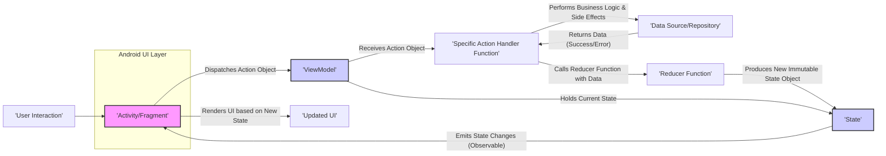

# Project Design Document: MvRx

**Version:** 1.1
**Date:** October 26, 2023
**Author:** AI Software Architect

## 1. Introduction

This document provides an enhanced design overview of the MvRx (Model-View-RxJava) library, an Android framework facilitating the development of robust and maintainable applications based on the Model-View-Intent (MVI) architectural pattern. This revised document offers a more detailed understanding of MvRx's architecture, components, and data flow, specifically tailored to serve as a comprehensive foundation for subsequent threat modeling activities. We aim to highlight aspects crucial for security analysis.

## 2. Goals

*   Clearly and precisely define the architecture and individual components of the MvRx library, emphasizing their roles in data handling.
*   Illustrate the complete lifecycle of data flow within an MvRx-based application, from user interaction to UI update.
*   Identify key areas and specific components that are most relevant for security considerations and potential vulnerabilities.
*   Provide a well-structured and detailed overview that directly supports effective threat modeling exercises.

## 3. Overview

MvRx is a Kotlin library for Android designed to streamline state management and promote a reactive programming approach using RxJava. It enforces a unidirectional data flow, enhancing application predictability, testability, and ease of reasoning. The fundamental principles of MvRx are:

*   **State:** A single, immutable, and well-defined source of truth representing the UI's current condition.
*   **Actions (Intents):**  Discrete events, often triggered by user interactions, signifying the *intent* to modify the application's state.
*   **Reducers:** Pure functions that deterministically transform the current state based on an incoming action, producing a new state.
*   **View:** The user interface layer (Activities, Fragments, Custom Views) responsible for observing state changes and rendering the UI accordingly.
*   **ViewModel:** The central orchestrator, managing the application's state, processing actions, and providing state updates to the View. It survives Android configuration changes.

MvRx significantly reduces boilerplate code associated with state management in Android development and offers robust mechanisms for handling asynchronous operations and managing component lifecycles.

## 4. Architecture

The following diagram provides a more detailed illustration of the architecture and data flow within an MvRx application:

### 4.1. Component Descriptions

*   **Activity/Fragment:**  Represents the UI layer in the Android application. It observes the stream of state updates emitted by the ViewModel and re-renders the UI to reflect the latest state. It also captures user interactions and dispatches corresponding Action objects to the ViewModel.
*   **User Interaction:** Any event initiated by the user, such as button presses, text input, gestures, or navigation events. These interactions trigger the creation and dispatch of Actions.
*   **ViewModel (BaseMvRxViewModel):** The central hub responsible for managing the application's state. It receives Action objects from the View, delegates them to specific action handlers, and updates the state through reducer functions. Its lifecycle is tied to the Activity or Fragment, surviving configuration changes.
*   **Specific Action Handler Function:** A dedicated function within the ViewModel responsible for processing a particular type of Action. This function often involves orchestrating business logic, interacting with data sources, and handling potential errors.
*   **Data Source/Repository:**  An abstraction layer responsible for fetching, persisting, and managing data. This could involve interacting with local databases, remote APIs, or other data storage mechanisms. It handles data retrieval and persistence logic.
*   **Reducer Function:** A pure function that takes the current State and an Action (along with any relevant data from side effects) as input and returns a new, immutable State object. Reducers are deterministic and should not have any side effects.
*   **State (MvRxState):** An immutable data class that represents the complete UI state at a specific point in time. It serves as the single source of truth for the UI.
*   **Updated UI:** The visual representation of the application's interface, reflecting the most recent state changes.

### 4.2. Data Flow

The typical sequence of events in an MvRx application's data flow is as follows:

1. **User Interaction:** A user interacts with the application's UI (e.g., taps a button, enters text).
2. **Dispatch Action Object:** The Activity or Fragment creates and dispatches an Action object to the associated ViewModel. This object encapsulates the intent of the user interaction.
3. **ViewModel Receives Action:** The ViewModel receives the dispatched Action object.
4. **Action Handling:** The ViewModel identifies the appropriate action handler function based on the type of Action received and invokes it.
5. **Business Logic and Side Effects (Optional):** The action handler function executes business logic, which may involve performing side effects such as making network requests via the Data Source/Repository.
6. **Data Retrieval/Processing:** The Data Source/Repository retrieves or processes data, potentially returning success or error states.
7. **Call Reducer Function:** The action handler function calls a specific reducer function, passing the current State and any relevant data obtained from the side effect (or the Action itself).
8. **Produce New Immutable State Object:** The reducer function creates a new, immutable State object based on the previous State and the information provided.
9. **State Update:** The ViewModel updates its internal state reference to point to the newly created State object.
10. **Emit State Change:** The ViewModel emits the new State object through an observable stream (typically a `BehaviorRelay` in RxJava).
11. **View Observes State:** The Activity or Fragment observes the state change emitted by the ViewModel.
12. **Render UI:** The Activity or Fragment updates the UI elements based on the data contained within the new State object.

## 5. Key Components and Concepts

This section provides a more in-depth look at the core components and concepts within MvRx, highlighting aspects relevant to security considerations.

*   **`BaseMvRxViewModel<S: MvRxState>(initialState: S)`:** The abstract base class for all ViewModels in MvRx. It is responsible for:
    *   Holding the current, immutable application state.
    *   Providing mechanisms for dispatching actions (`dispatch(action)`).
    *   Enabling state updates through reducer functions (`setState { ... }`, `withState { ... }`).
    *   Utilizing `BehaviorRelay` (from RxJava) to emit state changes to observing Views. This stream represents the flow of potentially sensitive data.
    *   Managing the lifecycle of asynchronous operations and preventing memory leaks.
*   **`MvRxState` Interface:** A marker interface that all state classes must implement. It signifies that a class represents the application's UI state. State classes are strongly encouraged to be immutable data classes to ensure predictable state transitions and simplify debugging. The data contained within these state objects is a primary focus for security analysis.
*   **`MvRxView` Interface:** An interface that Activities and Fragments can optionally implement to streamline the connection to a ViewModel and the observation of state changes. It provides convenient extension functions for subscribing to state updates and rendering the UI.
*   **Actions (Data Classes or Sealed Classes):** Represent discrete events that trigger state changes. They are typically implemented as data classes or sealed classes to encapsulate the information necessary to perform a specific action. The data contained within Actions might also be subject to security considerations, especially if it originates from user input.
*   **Reducers (Lambda Functions or Methods):** Pure functions defined within the ViewModel that take the current state and an action (and potentially data from side effects) as input and return a new state. Their deterministic nature is crucial for maintaining state integrity.
*   **Side Effects (Managed within Action Handlers):** Operations that interact with the external world, such as API calls, database interactions, or accessing device sensors. These are typically handled within the action handler functions in the ViewModel. The security of these interactions and the data they handle is paramount. MvRx encourages explicit management of side effects to improve testability and maintainability.
*   **State Persistence (Implementation-Specific):** MvRx does not provide built-in state persistence. Developers may integrate external libraries or Android mechanisms (e.g., `onSaveInstanceState`, Room database) for persisting state across application restarts or configuration changes. The security of the chosen persistence mechanism is a critical consideration.

## 6. Security Considerations (Detailed)

This section expands on the initial security considerations, providing more specific points relevant to MvRx's architecture:

*   **Sensitive Data in State:** The State object holds all the information required to render the UI. Care must be taken to avoid storing highly sensitive information (e.g., passwords, API keys) directly within the State, especially if the state is being logged or persisted. Consider encrypting sensitive data if it must reside in the state.
*   **Side Effect Security:** The security of the side effects performed within action handlers is crucial. This includes:
    *   **Secure API Communication:** Ensuring HTTPS is used for all API calls, validating server certificates, and implementing proper authentication and authorization mechanisms.
    *   **Secure Data Storage:** If data is persisted, using secure storage mechanisms (e.g., encrypted shared preferences, Android Keystore) and adhering to secure coding practices to prevent data breaches.
    *   **Input Sanitization and Validation:**  While MvRx doesn't enforce input validation, it's critical to sanitize and validate any user input received in Actions before it's used in side effects or to update the state. This prevents injection attacks (e.g., SQL injection, cross-site scripting).
*   **Action Payload Security:** The data carried within Action objects, especially those originating from user input, should be treated with caution. Malicious input could be crafted to exploit vulnerabilities in the action handlers or reducers.
*   **Dependency Vulnerabilities:** Regularly review and update MvRx's dependencies (RxJava, AndroidX libraries, etc.) to patch any known security vulnerabilities. Utilize dependency scanning tools to identify potential risks.
*   **State Manipulation Risks:** While the unidirectional data flow of MvRx makes direct state manipulation less likely, ensure that the ViewModel and State are designed in a way that prevents unauthorized modification or injection of malicious state.
*   **Logging and Debugging Practices:** Avoid logging sensitive state information or action payloads in production builds. Ensure that debug logs are properly secured and not exposed.
*   **Improper Error Handling:**  Ensure that error states resulting from side effects are handled gracefully and do not expose sensitive information to the user or through logs.
*   **State Persistence Security:** If state persistence is implemented, the chosen method must be secure. Consider encryption for sensitive data stored persistently. Ensure proper access controls are in place.

## 7. Dependencies

MvRx relies on the following key dependencies, which should be considered during security assessments:

*   **Kotlin (Programming Language):**  Security vulnerabilities in the Kotlin compiler or standard library could potentially impact MvRx applications.
*   **RxJava (Reactive Extensions for the JVM):**  A powerful library for asynchronous and event-based programs. Security vulnerabilities in RxJava could affect MvRx's state management and data flow.
*   **AndroidX Libraries:**  A suite of support libraries for Android development. Security vulnerabilities in these libraries could impact the underlying platform and MvRx's integration with it.
*   **Kotlin Coroutines (Optional):** An alternative to RxJava for managing asynchronous operations. If used, its security should also be considered.

## 8. Deployment

MvRx is deployed as a library dependency within Android applications. Developers integrate it by adding the appropriate dependencies to their application's `build.gradle` file. The security of the deployment environment (the Android device and operating system) also plays a crucial role in the overall security of an MvRx-based application.

## 9. Future Considerations

*   Detailed analysis of potential security implications related to specific MvRx features, such as the handling of transient state or the integration with different architectural layers.
*   Development of best practices and guidelines for handling sensitive data within the MvRx framework, including recommendations for encryption and secure storage.
*   Investigation of potential security vulnerabilities that could arise from complex state transitions or asynchronous operations within MvRx applications.
*   Exploration of static analysis tools and techniques that can be used to identify potential security flaws in MvRx-based code.

This revised document provides a more comprehensive and security-focused understanding of the MvRx library's design. The detailed information presented here will serve as a robust foundation for conducting thorough threat modeling exercises to identify potential security risks and develop appropriate mitigation strategies.