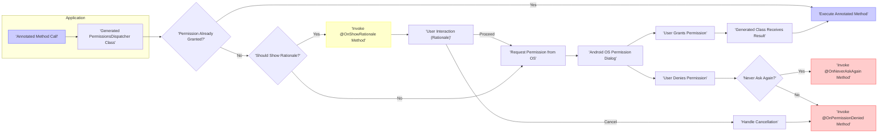

# Project Design Document: PermissionsDispatcher

**Version:** 1.1
**Date:** October 26, 2023
**Author:** AI Architecture Expert

## 1. Introduction

This document provides an enhanced design overview of the PermissionsDispatcher library, an open-source Android library designed to streamline the process of requesting and managing runtime permissions. This document aims to offer a more detailed and refined understanding of the library's architecture, components, and interactions, serving as a robust foundation for subsequent threat modeling activities.

## 2. Goals and Objectives

The primary goals of the PermissionsDispatcher library are:

* To significantly reduce the amount of boilerplate code typically required for handling Android runtime permissions.
* To offer a declarative and intuitive approach to defining actions that depend on specific permissions.
* To enhance code readability and simplify the maintenance of permission-related logic.

This design document aims to:

* Clearly and comprehensively outline the architecture and individual components of the PermissionsDispatcher library.
* Accurately describe the flow of data and the interactions both within the library and with the underlying Android operating system.
* Precisely identify key areas and specific components that are relevant for security analysis and threat modeling.

## 3. Scope

This document encompasses the design of the core functionalities within the PermissionsDispatcher library, as represented in the provided GitHub repository. The focus is on the mechanisms for initiating permission requests, processing the results of those requests, and executing designated methods based on the granted permissions.

This document explicitly excludes:

* The intricate internal mechanisms of the Android operating system's permission management framework.
* Specific implementation details found within example applications that utilize the library.
* External libraries or dependencies that the library might rely on (beyond the standard Android SDK).

## 4. Architecture and Design

The PermissionsDispatcher library leverages annotation processing during the compilation phase to generate code that abstracts away the complexities of handling runtime permissions. The key components and their interactions are detailed below.

### 4.1. Components

* **`@NeedsPermission` Annotation:**
    * Function: Marks methods that require one or more specific permissions to be granted before they can be executed.
    * Parameters: Specifies the string identifier(s) of the required Android permission(s).
    * Related Annotations: Can be associated with `@OnGranted`, `@OnDenied`, and `@OnNeverAskAgain` to define corresponding callback methods.

* **`@OnShowRationale` Annotation:**
    * Function: Designates a method that will be invoked to provide the user with an explanation of why the requested permission is necessary, before the actual permission request is initiated.
    * Parameter: Receives a `PermissionRequest` object, which is used to proceed with the permission request.

* **`@OnPermissionDenied` Annotation:**
    * Function: Identifies a method that will be executed if the user explicitly denies the permission request.

* **`@OnNeverAskAgain` Annotation:**
    * Function: Specifies a method that will be invoked if the user denies the permission request and also selects the "Never ask again" option.

* **`PermissionsDispatcher` Class (Generated):**
    * Function: A concrete class generated by the annotation processor for each Activity or Fragment that utilizes the permission-related annotations.
    * Responsibilities:
        * Contains methods (e.g., `methodNameWithPermissionCheck`) that act as entry points for initiating permission requests.
        * Orchestrates the entire permission request workflow.
        * Delegates execution to the appropriate annotated methods based on the outcome of the permission grant.

* **`PermissionRequest` Interface:**
    * Function: An interface that is passed as a parameter to the method annotated with `@OnShowRationale`.
    * Method: Provides a `proceed()` method, which, when called, triggers the actual permission request to the Android OS.

### 4.2. Data Flow

The following flowchart illustrates the typical sequence of actions when using PermissionsDispatcher to request a permission:

**Detailed Steps:**

* **Annotated Method Call:** The application code invokes a method that has been annotated with the `@NeedsPermission` annotation.
* **Generated PermissionsDispatcher Class:** The invocation is intercepted by the corresponding method within the generated `PermissionsDispatcher` class (e.g., a method named like `methodNameWithPermissionCheck`).
* **Permission Check:** The generated class performs a check to determine if the required permission is already granted to the application.
* **Permission Granted:** If the permission is currently granted, the original annotated method within the application code is executed directly.
* **Should Show Rationale?** If the permission is not granted, the library evaluates whether a rationale should be presented to the user before requesting the permission (this is based on whether the user has previously denied the permission).
* **Invoke `@OnShowRationale` Method:** If a rationale should be shown, the method annotated with `@OnShowRationale` is invoked. This method receives a `PermissionRequest` object.
* **User Interaction (Rationale):** The application displays a user interface element (e.g., a dialog) to explain why the permission is needed.
* **Proceed:** If the user understands and agrees, the `proceed()` method of the `PermissionRequest` object is called, initiating the actual permission request.
* **Request Permission from OS:** The generated class makes a request to the Android operating system to display the permission dialog to the user.
* **Android OS Permission Dialog:** The standard Android permission request dialog is presented to the user.
* **User Grants Permission:** If the user grants the requested permission through the dialog.
* **Generated Class Receives Result:** The `onRequestPermissionsResult` method in the relevant Activity or Fragment receives the result of the permission request.
* **Execute Annotated Method:** The generated `PermissionsDispatcher` class processes the received result and, if the permission was granted, executes the original annotated method in the application code.
* **User Denies Permission:** If the user denies the permission through the dialog.
* **Never Ask Again?** The library checks if the user selected the "Never ask again" option when denying the permission.
* **Invoke `@OnNeverAskAgain` Method:** If the "Never ask again" option was selected, the method annotated with `@OnNeverAskAgain` is invoked.
* **Invoke `@OnPermissionDenied` Method:** If the permission was denied, but the "Never ask again" option was *not* selected, the method annotated with `@OnPermissionDenied` is invoked.
* **Cancellation:** If the user cancels the rationale flow (if a rationale was shown), this can be handled similarly to a permission denial.

### 4.3. Interactions

The PermissionsDispatcher library interacts with the following key entities:

* **Application Code:** Developers integrate the library into their application code by using the provided annotations to define permission requirements and implement the corresponding callback methods.
* **Annotation Processor:** During the application's compilation process, the PermissionsDispatcher annotation processor analyzes the annotations and generates the necessary `PermissionsDispatcher` classes.
* **Android Operating System:** The library directly interacts with the Android OS to check the current status of permissions and to initiate requests for permissions.
* **User:** The user interacts with the standard Android permission dialogs presented by the operating system in response to permission requests initiated by the library.

## 5. Security Considerations

While PermissionsDispatcher simplifies the management of permissions, it's essential to carefully consider potential security implications:

* **Circumventing Permission Checks:**
    * Risk: Malicious actors or unintentional coding errors could potentially bypass the generated `PermissionsDispatcher` class and directly invoke the annotated methods, potentially executing permission-protected code without proper authorization.
    * Mitigation: Employ code obfuscation techniques to make reverse engineering and bypassing the generated checks more difficult. Conduct thorough code reviews to ensure that annotated methods are *always* accessed through the generated dispatcher.

* **Inaccurate Permission Declarations:**
    * Risk: Developers might inadvertently specify incorrect or insufficient permissions in the `@NeedsPermission` annotation. This could lead to granting access to sensitive functionalities without the appropriate level of authorization, or conversely, blocking access when it should be allowed.
    * Mitigation: Implement rigorous code review processes and thorough testing to validate the correctness of permission declarations. Utilize static analysis tools to identify potential discrepancies between declared permissions and actual code behavior.

* **Information Exposure in Callbacks:**
    * Risk: The methods annotated with `@OnGranted`, `@OnDenied`, and `@OnNeverAskAgain` might handle or process sensitive data. If these methods are not implemented securely, they could inadvertently leak sensitive information.
    * Mitigation: Treat the callback methods as security-sensitive components. Implement secure coding practices within these methods, ensuring proper data handling and avoiding any potential for information disclosure (e.g., logging sensitive data, transmitting it insecurely).

* **Vulnerabilities in Generated Code:**
    * Risk: Although less likely, there is a possibility of vulnerabilities existing within the code generated by the annotation processor itself.
    * Mitigation: Keep the PermissionsDispatcher library updated to the latest version to benefit from bug fixes and security patches. Monitor the library's issue tracker and security advisories for any reported vulnerabilities.

* **Dependency Chain Security:**
    * Risk: The security of the build process and the annotation processing toolchain is crucial. Compromised dependencies or a vulnerable build environment could lead to the injection of malicious code into the generated `PermissionsDispatcher` classes.
    * Mitigation: Employ secure dependency management practices, such as using dependency checksum verification and regularly scanning dependencies for known vulnerabilities. Secure the build environment and restrict access to it.

## 6. Deployment Considerations

The PermissionsDispatcher library is integrated into Android projects as a standard library dependency, typically declared in the `build.gradle` file. The annotation processor component of the library executes during the application's compilation phase to generate the necessary code.

Key security considerations during deployment:

* **Secure Dependency Management:** Utilize a robust and secure dependency management system (e.g., using a private Maven repository with access controls) and rigorously verify the integrity of the PermissionsDispatcher library before including it in the project.
* **Build Environment Security:** Ensure the security of the entire build environment, including the machines used for compilation and the tools involved in the build process, to prevent unauthorized modification of the annotation processing or the generated code.
* **Code Obfuscation and Proguard:** Strongly consider using code obfuscation tools like ProGuard or R8 to make it significantly more difficult to reverse engineer the generated code and understand the underlying permission handling logic. This adds a layer of defense against potential attackers trying to bypass the library's security mechanisms.

## 7. Future Considerations

* **Jetpack Compose Support:** Adapting the library to provide seamless integration and support for declarative UI development using Jetpack Compose.
* **Enhanced Customization:** Offering more granular control and customization options for the permission request flow, allowing developers to tailor the user experience more effectively.
* **Improved Error Handling and Logging:** Enhancing error handling mechanisms and providing more informative error messages and logging capabilities to aid in debugging and troubleshooting permission-related issues.

## Appendix

This section contains the Mermaid diagram used in the document.

