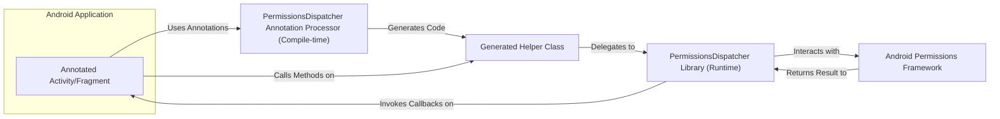
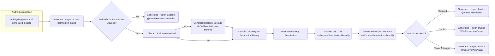

# Project Design Document: PermissionsDispatcher

**Version:** 1.1
**Date:** October 26, 2023
**Author:** AI Software Architect

## 1. Introduction

This document provides an enhanced and detailed design overview of the PermissionsDispatcher Android library. Building upon the previous version, this document aims to provide an even clearer articulation of the library's architecture, components, and data flow, serving as a robust foundation for subsequent threat modeling activities. It meticulously outlines the key functionalities and interactions within the library to facilitate a comprehensive understanding of its security posture.

## 2. Goals

*   Provide a clear, concise, and more detailed description of the PermissionsDispatcher library's architecture and functionality.
*   Identify and elaborate on the key components and their interactions within the library, including the compile-time and runtime aspects.
*   Illustrate the data flow during the permission request process with greater granularity, covering various scenarios.
*   Highlight potential areas of security concern with more specific examples for future threat modeling.

## 3. Scope

This document covers the design of the core PermissionsDispatcher library as represented in the provided GitHub repository. It focuses on both the compile-time behavior of the annotation processor and the runtime behavior, detailing the interaction between the library, generated code, and the Android operating system's permission framework.

## 4. Target Audience

This document is intended for:

*   Security engineers responsible for in-depth threat modeling and security assessments.
*   Android developers seeking a thorough understanding of the internal workings of PermissionsDispatcher for effective and secure usage.
*   Software architects planning to integrate PermissionsDispatcher into larger Android application architectures, requiring a deep understanding of its mechanisms.

## 5. Overview

PermissionsDispatcher is an Android library designed to abstract and simplify the complexities of requesting and handling runtime permissions. It employs annotations to trigger the generation of boilerplate code, promoting a more declarative and less error-prone approach to permission management. The library significantly reduces the manual effort and potential for errors associated with checking permission status, initiating permission requests, and managing the resulting outcomes.

## 6. Architecture

The PermissionsDispatcher library's functionality is realized through a combination of compile-time annotation processing and runtime interactions. The key components involved in the permission request flow are:

*   **Annotated Activity/Fragment:** The Android Activity or Fragment requiring runtime permissions. This component utilizes specific PermissionsDispatcher annotations (e.g., `@NeedsPermission`, `@OnShowRationale`) to mark methods that should be executed based on the state of the requested permissions.
*   **PermissionsDispatcher Annotation Processor (Compile-time):** This Gradle plugin component processes the PermissionsDispatcher annotations during the application's build process. It analyzes the annotated code and generates corresponding helper classes that encapsulate the permission handling logic.
*   **Generated Helper Class:** A Java/Kotlin class automatically generated by the annotation processor. This class is named after the annotated Activity/Fragment with a designated suffix (e.g., `MainActivityPermissionsDispatcher`). It contains methods to initiate permission requests, check permission status, and delegate to the annotated methods in the original Activity/Fragment.
*   **PermissionsDispatcher Library (Runtime):** The core library providing the fundamental interfaces and utility methods used by the generated code at runtime. This library facilitates the interaction with the Android Permissions Framework.
*   **Android Permissions Framework:** The integral Android operating system component responsible for managing permission requests, user grants, and denials. It enforces the security policies related to accessing protected resources.

## 7. Data Flow

The process of requesting and handling a permission using PermissionsDispatcher involves a detailed sequence of actions:

1. The Activity/Fragment initiates a permission request by calling a specific method on the generated helper class. This method is named based on the annotated method and the required permissions (e.g., `MainActivityPermissionsDispatcher.requestCameraPermission(activity)`).
2. The generated helper class first checks if the necessary permission is already granted by querying the Android Permissions Framework using methods like `ContextCompat.checkSelfPermission()`.
3. **Scenario A: Permission Already Granted:** If the permission is already granted, the generated helper class directly invokes the method in the Activity/Fragment annotated with `@NeedsPermission`.
4. **Scenario B: Permission Not Granted (Initial Request):** If the permission is not granted, the generated helper class initiates a permission request to the Android Permissions Framework using `ActivityCompat.requestPermissions()`. This triggers the display of a permission dialog to the user.
5. **Scenario C: Showing Rationale:** If the system determines that a rationale should be shown to the user (e.g., the user has previously denied the permission), the generated helper class will invoke the method annotated with `@OnShowRationale` in the Activity/Fragment *before* requesting the permission. This allows the application to explain why the permission is needed.
6. The Android system presents the standard permission request dialog to the user.
7. The user interacts with the dialog, either granting or denying the requested permission.
8. The Android system delivers the result of the permission request by calling the `onRequestPermissionsResult()` method of the Activity/Fragment.
9. The generated helper class intercepts this `onRequestPermissionsResult()` call. This is crucial for processing the permission result.
10. Based on the outcome of the permission request, the generated helper class invokes the appropriate callback method within the Activity/Fragment:
    *   If the permission is granted, the method annotated with `@NeedsPermission` is executed.
    *   If the permission is denied, the method annotated with `@OnPermissionDenied` is executed.
    *   If the user has selected "Never ask again," the method annotated with `@OnNeverAskAgain` is executed.

## 8. Security Considerations (For Threat Modeling)

The following points provide more specific areas of focus for threat modeling activities:

*   **Circumventing Permission Checks:** Could a malicious application or compromised component within the application directly invoke methods requiring permissions without going through the PermissionsDispatcher flow, thereby bypassing the intended permission checks?
*   **Information Leakage via Callbacks:** Could sensitive data be inadvertently exposed through the parameters or execution context of the callback methods (`@NeedsPermission`, `@OnShowRationale`, `@OnPermissionDenied`, `@OnNeverAskAgain`)? For instance, could the rationale message reveal confidential information?
*   **Exploiting Annotation Processor Vulnerabilities:** While compile-time, are there potential vulnerabilities within the PermissionsDispatcher annotation processor itself that could be exploited during the build process to inject malicious code into the generated helper classes or alter their intended behavior?
*   **Manipulation of "Never Ask Again" State:** Could a malicious actor somehow manipulate the underlying Android system state related to the "Never ask again" flag, leading to unexpected behavior or denial of service?
*   **Race Conditions in Permission Flow:** Are there potential race conditions between the permission check, the request, and the handling of the result that could lead to a state where a protected resource is accessed without proper authorization?
*   **Vulnerabilities in Dependencies:** A thorough analysis of the dependencies (e.g., `androidx.core`) is crucial. Are there any known security vulnerabilities in these libraries that could be indirectly exploited through PermissionsDispatcher?
*   **Logic Flaws in Generated Code:** While the code is generated, a careful review of the generation logic is necessary. Could there be subtle logic flaws in the generated helper classes that could be exploited to bypass security checks or cause unexpected behavior?
*   **Indirect Intent Tampering:** Although PermissionsDispatcher doesn't directly handle Intents for permission requests, could a malicious application intercept or influence the Intents related to permission dialogs, potentially misleading the user?
*   **Improper Handling of Edge Cases:** How does the library handle scenarios where permissions are revoked while the application is running? Are there any vulnerabilities in the handling of such edge cases?

## 9. Dependencies

The PermissionsDispatcher library has dependencies on the following Android SDK and support libraries:

*   `androidx.core:core-ktx` (or equivalent Java version) for accessing `ActivityCompat` and `ContextCompat`. Specific version should be checked in the library's `build.gradle`.
*   Android Annotation Processing API (typically provided by the Android Gradle Plugin).

## 10. Deployment

PermissionsDispatcher is integrated into an Android application project as a library dependency. This involves:

*   Adding the library and annotation processor dependencies to the application's `build.gradle` file.
*   Applying the annotation processor plugin.

## 11. Future Considerations

*   Continuous monitoring for potential security vulnerabilities in dependencies.
*   Regular security audits of the annotation processing logic and generated code patterns.
*   Exploration of more robust mechanisms for handling permission revocation scenarios.
*   Consideration of providing more granular control over the generated code or customization options for advanced use cases.

This enhanced document provides a more comprehensive and detailed understanding of the PermissionsDispatcher library's design, offering a stronger foundation for thorough security analysis and threat modeling.
