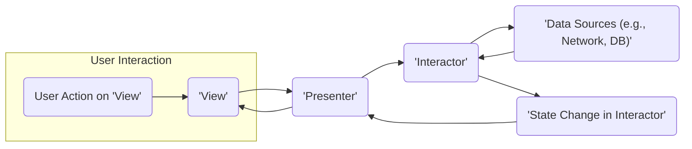
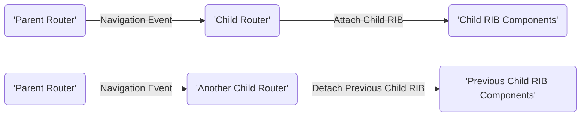

# Project Design Document: Uber RIBs Framework

**Version:** 1.1
**Date:** October 26, 2023
**Prepared By:** Gemini (AI Language Model)

## 1. Introduction

This document provides an enhanced design overview of Uber's RIBs (Router, Interactor, Builder) framework, specifically tailored for threat modeling. It details the key components, their interactions, and the architectural patterns inherent in applications built using RIBs. This document serves as a crucial input for subsequent threat modeling exercises.

### 1.1. Purpose

The primary goal of this document is to establish a clear and comprehensive understanding of the RIBs framework's architecture and its constituent parts. This understanding is paramount for effectively identifying potential security vulnerabilities and formulating appropriate mitigation strategies during the threat modeling process. It aims to provide a structured view of the system for security analysis.

### 1.2. Scope

This document focuses on the core architectural principles and components of the RIBs framework as presented in the official GitHub repository: [https://github.com/uber/RIBs](https://github.com/uber/RIBs). It emphasizes the logical relationships and interactions between the fundamental building blocks. Implementation specifics within particular RIBs examples or platform-specific details are generally excluded, unless they directly impact the architectural understanding relevant for security analysis.

### 1.3. Target Audience

This document is primarily intended for:

* Security engineers and architects responsible for performing threat modeling on RIBs-based applications.
* Software developers who are new to the RIBs framework and require a solid architectural foundation.
* Anyone involved in the design, development, security assessment, or maintenance of applications constructed using the RIBs framework.

## 2. Overview of RIBs Framework

RIBs is a modular architectural pattern designed for building robust and scalable mobile applications, primarily on Android and iOS. It promotes separation of concerns, testability, and maintainability by structuring application logic into distinct, interconnected components organized in a hierarchical manner.

### 2.1. Core Components

The fundamental building blocks of a RIBs application are:

* **Router:**  The navigation and lifecycle manager for a specific part of the application. It orchestrates the attachment and detachment of child RIBs based on application state changes or user interactions.
* **Interactor:**  The central component containing the business logic and managing the state for a particular feature or screen. It receives user inputs from the Presenter, processes them, and updates the application state.
* **Builder:** A factory responsible for creating and assembling all the necessary components of a RIB (Router, Interactor, and optionally Presenter and View). It handles dependency injection, ensuring proper initialization and configuration.
* **Presenter:**  Acts as a mediator between the Interactor and the View. It formats data from the Interactor into a displayable format for the View and relays user actions from the View back to the Interactor. It aims to keep the Interactor and View independent.
* **View:** The user interface element responsible for displaying information to the user and capturing user input. This is typically an Activity or Fragment in Android, or a ViewController in iOS.
* **Component:** A dependency injection container (often implemented using Dagger or similar frameworks) that provides instances of dependencies required by the RIB's components, managing their lifecycle within the scope of the RIB.

### 2.2. Hierarchical Structure

RIBs applications are organized as a tree-like hierarchy of interconnected RIBs. Each RIB encapsulates a specific feature or a portion of the user interface. The top-level RIB is often referred to as the "Root RIB." Parent RIBs manage the lifecycle of their child RIBs, enabling modularity and independent development and testing of features. This hierarchy also defines the scope of influence and communication between different parts of the application.

## 3. Detailed Design

This section provides a more granular examination of the components and their interactions within the RIBs framework.

### 3.1. Component Breakdown

* **Router:**
    * **Responsibility:** Manages the display and lifecycle of child RIBs. Determines when to attach or detach them.
    * **Functionality:** Holds references to child Routers, listens for events or state changes that necessitate navigation, and interacts with platform-specific navigation mechanisms (e.g., FragmentManager in Android).
    * **Example:** A `SettingsRouter` might attach `ProfileSettingsRIB` and `NotificationSettingsRIB` as child RIBs.
* **Interactor:**
    * **Responsibility:** Contains the core business logic, manages the state, and orchestrates data flow for the RIB.
    * **Functionality:** Receives actions from the Presenter, interacts with data sources (e.g., repositories, network APIs), updates its internal state, and notifies the Presenter of state changes.
    * **Example:** A `LoginInteractor` would handle user authentication logic, interact with an authentication service, and update the login state.
* **Builder:**
    * **Responsibility:**  Creates and assembles all the components of a RIB.
    * **Functionality:**  Takes dependencies as input and provides them to the created Router, Interactor, Presenter, and View. Ensures proper initialization and configuration of the RIB.
    * **Example:** A `LoginBuilder` would create instances of `LoginRouter`, `LoginInteractor`, `LoginPresenter`, and the `LoginView`.
* **Presenter:**
    * **Responsibility:**  Acts as an intermediary, decoupling the Interactor from the View.
    * **Functionality:**  Formats data from the Interactor into a format suitable for display in the View and relays user actions from the View back to the Interactor. Contains no business logic.
    * **Example:** A `LoginPresenter` would format user login status messages from the `LoginInteractor` for display in the `LoginView`.
* **View:**
    * **Responsibility:**  Displays information to the user and captures user interactions.
    * **Functionality:**  Renders UI elements based on data provided by the Presenter and notifies the Presenter of user actions (e.g., button clicks, text input).
    * **Example:** A `LoginView` (an Activity or Fragment) would display login fields and buttons and notify the `LoginPresenter` when the user attempts to log in.
* **Component:**
    * **Responsibility:** Provides dependencies to the RIB's components, managing their lifecycle.
    * **Functionality:**  Acts as a dependency injection container, often generated using frameworks like Dagger. Scopes dependencies to the lifecycle of the RIB, ensuring proper resource management.
    * **Example:** A `LoginComponent` would provide instances of dependencies like an authentication service or a user repository to the `LoginInteractor`.

### 3.2. Data Flow and Interactions

The typical flow of data and interactions within a RIB follows a unidirectional pattern:

**Detailed Explanation of Data Flow:**

* **User Interaction:** The user initiates an action by interacting with the **View**.
* **View to Presenter:** The **View** notifies the **Presenter** about the user's action (e.g., a button click).
* **Presenter to Interactor:** The **Presenter** translates the user action into a command or event and sends it to the **Interactor**.
* **Interactor Logic:** The **Interactor** processes the received command, potentially interacting with external **Data Sources** (like network APIs or local databases) to retrieve or modify data.
* **Data Sources:** These are external systems or local storage mechanisms used by the **Interactor** to manage data.
* **State Change:** Based on the processing, the **Interactor** updates its internal state.
* **Interactor to Presenter:** The **Interactor** notifies the **Presenter** about the change in its state.
* **Presenter to View:** The **Presenter** formats the updated data from the Interactor into a format suitable for display in the **View**.
* **View Update:** The **View** re-renders its UI based on the formatted data received from the **Presenter**.

**Inter-RIB Communication:**

* **Parent to Child:** Parent RIBs can communicate with their child RIBs, typically through interfaces defined in the child RIB's Interactor or Router. This allows the parent to influence the child's behavior or state.
* **Child to Parent:** Child RIBs can communicate back to their parent RIBs using listener interfaces defined in the parent RIB's Interactor. This enables the child to notify the parent about events or state changes within its scope.
* **Sibling Communication:** Direct communication between sibling RIBs is generally discouraged. Instead, communication should ideally flow through a common ancestor RIB to maintain a clear hierarchy and avoid complex dependencies. Shared dependencies provided by the Component can also facilitate communication, but should be used judiciously.

### 3.3. Navigation Flow

Navigation between different parts of the application, represented by different RIBs, is orchestrated by the **Router**.

**Explanation of Navigation Flow:**

* A **Parent Router** receives a navigation event. This event can be triggered by a user action within its scope or by a state change within its Interactor.
* Based on the navigation event, the **Parent Router** determines the target RIB to navigate to.
* The **Parent Router** instructs the **Child Router** of the target RIB to attach its components (Interactor, Presenter, View) to the screen. This involves creating instances of these components and managing their lifecycles.
* If the navigation involves moving away from a previous RIB, the **Parent Router** instructs the **Child Router** of the previous RIB to detach its components, releasing resources.
* The **Router** interacts with platform-specific navigation mechanisms provided by the operating system (e.g., Fragment Transactions in Android, View Controller transitions in iOS) to perform the actual UI transition and display the new screen.

## 4. Security Considerations (For Threat Modeling)

This section highlights potential security vulnerabilities and attack vectors within the RIBs framework, providing a basis for threat modeling activities.

### 4.1. Potential Threat Areas

* **Interactor Logic Vulnerabilities:**
    * **Insufficient Input Validation:** If the Interactor directly processes user input without proper validation and sanitization, it can be susceptible to injection attacks (e.g., SQL injection if interacting with databases, command injection).
    * **Business Logic Flaws:** Errors or oversights in the Interactor's business logic can be exploited to bypass intended application behavior, leading to unauthorized access or data manipulation.
* **Data Handling in Interactor:**
    * **Insecure Data Storage:** Sensitive data handled or stored within the Interactor (or by services it interacts with) without proper encryption or secure storage mechanisms can be vulnerable to unauthorized access.
    * **Data Leaks:** Improper handling of data retrieved from external sources or exposed through inter-RIB communication could lead to unintended data disclosure.
* **Inter-RIB Communication:**
    * **Lack of Authorization:** If communication channels between RIBs lack proper authorization checks, a compromised or malicious RIB could potentially access or manipulate data and functionality of other RIBs.
    * **Eavesdropping:** If communication between RIBs is not encrypted, sensitive information exchanged could be intercepted.
* **Dependency Injection Vulnerabilities:**
    * **Malicious Dependencies:** If the dependency injection mechanism is not carefully managed, it might be possible to inject malicious dependencies that could compromise the application's security.
    * **Dependency Confusion:**  Vulnerabilities in dependency management could lead to the inclusion of unintended or malicious dependencies.
* **View Layer Vulnerabilities:**
    * **Cross-Site Scripting (XSS):** While the Presenter should handle data formatting, vulnerabilities in the View layer, especially if rendering web content, could still lead to XSS attacks if user-provided data is not properly escaped.
    * **Information Disclosure:**  Displaying sensitive information unnecessarily in the View could lead to information disclosure.
* **Navigation and Access Control:**
    * **Unauthorized Access:** Improperly implemented navigation logic or missing access control checks could allow users to access features or screens they are not authorized to view or interact with.
    * **Path Traversal:** Vulnerabilities in navigation logic could potentially allow attackers to navigate to unintended parts of the application.
* **State Management:**
    * **State Tampering:** If application state is not managed securely, malicious actors might be able to tamper with it, leading to unexpected behavior or security breaches.
    * **Insecure Storage of State:** Storing sensitive state data in insecure locations (e.g., shared preferences without encryption) can expose it to unauthorized access.

### 4.2. Security Best Practices to Consider

* **Robust Input Validation:** Implement thorough input validation and sanitization in the Interactor to prevent injection attacks and other input-related vulnerabilities. Use whitelisting where possible.
* **Secure Data Handling:** Encrypt sensitive data at rest and in transit. Follow secure coding practices when handling user data, adhering to principles like least privilege.
* **Secure Inter-RIB Communication:** Implement secure communication channels between RIBs, using appropriate authorization and authentication mechanisms to control access and prevent eavesdropping.
* **Secure Dependency Management:** Use a reputable dependency management system and regularly update dependencies to patch known vulnerabilities. Implement mechanisms to verify the integrity of dependencies.
* **Output Encoding:** Ensure proper output encoding in the View layer to prevent XSS attacks.
* **Principle of Least Privilege:** Grant components only the necessary permissions and access to resources.
* **Regular Security Audits and Penetration Testing:** Conduct regular security assessments to identify and address potential vulnerabilities.
* **Secure Code Reviews:** Implement thorough code review processes, with a focus on security, to catch flaws early in the development lifecycle.
* **Secure State Management:** Use secure storage mechanisms for sensitive state data and implement integrity checks to prevent tampering.

## 5. Deployment Considerations

The deployment environment significantly impacts the security posture of a RIBs-based application. Consider the following aspects during threat modeling:

* **Target Platform (Android/iOS):** Understand the specific security features and vulnerabilities inherent to each platform. Utilize platform-provided security mechanisms.
* **App Distribution Method:** Distribution through official app stores (Google Play Store, Apple App Store) involves some level of security vetting, while sideloading introduces greater risks and requires more stringent security measures within the application itself.
* **Backend Infrastructure:** RIBs applications often interact with backend services. The security of these backend services (authentication, authorization, data protection) is paramount and directly impacts the overall security of the application.
* **Device Security:** The security posture of the user's device (e.g., rooted/jailbroken status, malware presence) can influence the application's security. Consider implementing mechanisms to detect and respond to compromised devices.
* **Network Security:**  Ensure secure communication channels (HTTPS) are used for all network interactions to protect data in transit.

## 6. Future Considerations

* **Standardized Security Patterns for RIBs:** Develop and document common security patterns and best practices specifically tailored for the RIBs architecture to guide developers in building secure applications.
* **Integration with Security Libraries and Frameworks:** Explore and document how RIBs can be effectively integrated with existing security-focused libraries and frameworks to enhance security capabilities.
* **Automated Security Testing for RIBs:** Investigate and implement automated security testing tools and techniques specifically designed for RIBs-based applications.

## 7. Conclusion

This enhanced design document provides a detailed architectural overview of the Uber RIBs framework, with a specific focus on aspects relevant to threat modeling. By understanding the framework's components, their interactions, and potential security vulnerabilities, development and security teams can collaboratively build more secure and resilient mobile applications using the RIBs architecture. This document serves as a valuable resource for identifying potential threats and implementing appropriate mitigation strategies.