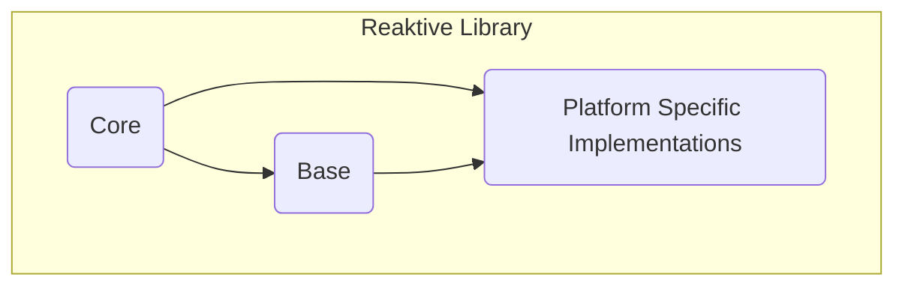
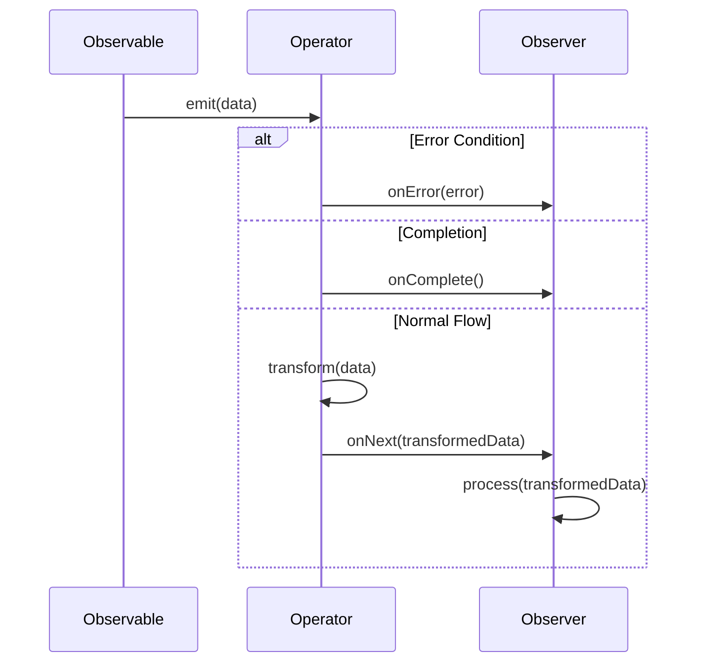

## Project Design Document: Reaktive Library

**Version:** 1.1
**Date:** October 26, 2023
**Author:** AI Software Architect

### 1. Introduction

This document provides a detailed design overview of the Reaktive library, a Kotlin multiplatform library for implementing reactive programming paradigms. This document aims to provide a comprehensive understanding of the library's architecture, key components, data flow, and security considerations. This information will serve as the foundation for subsequent threat modeling activities.

### 2. Goals

* Provide a clear and concise description of the Reaktive library's architecture and components.
* Outline the key functionalities and data flow within the library.
* Identify potential security considerations and areas of concern for threat modeling, with more specific examples.
* Serve as a reference document for developers and security analysts.

### 3. Non-Goals

* This document does not provide a detailed code-level explanation of every class and function within the Reaktive library.
* This document does not cover the specific implementation details of the underlying platforms (JVM, JS, Native) in exhaustive detail.
* This document does not include a comprehensive list of all possible threats or vulnerabilities. That will be the output of the subsequent threat modeling exercise.
* This document does not provide specific mitigation strategies for identified threats.

### 4. High-Level Architecture

The Reaktive library is designed as a multiplatform library, meaning it can be used on various platforms like the Java Virtual Machine (JVM), JavaScript environments, and Native platforms. The core concepts revolve around reactive streams, enabling asynchronous data processing and event handling.

* **Core:** Contains the fundamental interfaces and abstract classes that define the reactive programming model. This includes interfaces like `Observable`, `Observer`, `Subject`, `Scheduler`, and `Disposable`. These are platform-agnostic and define the core contracts.
* **Base:** Provides common, platform-agnostic implementations and utilities built upon the Core interfaces. This layer offers concrete implementations of operators and schedulers that can be shared across platforms where possible, reducing code duplication.
* **Platform Specific Implementations:** Contains platform-specific implementations of certain functionalities, particularly around threading and concurrency (Schedulers) and interactions with platform-specific APIs. This layer adapts the core reactive concepts to the specifics of each target platform (JVM, JS, Native), handling differences in threading models and event loops.

### 5. Key Components

This section describes the main building blocks of the Reaktive library, highlighting potential security implications where relevant.

* **Observable:** Represents a stream of data or events that can be observed. It emits zero or more items over time and can eventually complete successfully or terminate with an error. *Security Consideration:* Uncontrolled emission rates or emissions of sensitive data need careful management by the application using the Observable.
* **Observer:** An interface that defines methods to react to events emitted by an Observable (`onNext`, `onError`, `onComplete`). *Security Consideration:*  Error handling within the Observer is critical to prevent information leaks or unexpected application behavior.
* **Subject:** A special type of Observable that is also an Observer. It can both emit items and subscribe to other Observables, acting as a bridge or multicast hub. *Security Consideration:* Subjects can introduce vulnerabilities if not properly controlled, potentially allowing unauthorized data injection or observation.
* **Scheduler:** Manages the execution of tasks and the delivery of notifications on specific threads or execution contexts. Reaktive provides different schedulers for various purposes (e.g., computation, I/O, main thread). *Security Consideration:*  Misconfigured or malicious Schedulers could lead to denial of service (by consuming excessive resources) or expose sensitive operations to unintended threads.
* **Disposable:** Represents a resource that needs to be released when an Observer no longer needs to listen to an Observable, preventing resource leaks. This is crucial for preventing memory leaks and managing resources. *Security Consideration:* Failure to dispose of resources can lead to resource exhaustion, a potential denial-of-service vector.
* **Operators:** Functions that transform, filter, combine, or otherwise manipulate the streams of data emitted by Observables. Examples include `map`, `filter`, `merge`, `flatMap`, etc. *Security Consideration:*  Careless use of operators, especially those involving external data or computations, can introduce vulnerabilities if input is not validated or sanitized.
* **ConnectableObservable:** An Observable that does not start emitting items until its `connect()` method is called. This allows for more control over when the stream starts producing data, useful for shared sources. *Security Consideration:*  Improper management of connection initiation could lead to unexpected data flows or resource consumption.
* **CompositeDisposable:** A utility class to manage multiple `Disposable` instances, allowing for easy disposal of all associated resources. *Security Consideration:*  While a utility, its correct usage is vital to prevent resource leaks.

### 6. Data Flow

The fundamental data flow in Reaktive revolves around Observables emitting items that are then processed by Operators and consumed by Observers. Error and completion signals also play a crucial role.

1. **Emission:** An `Observable` emits data items or events.
2. **Transformation (Optional):** Operators intercept the emitted items and perform transformations, filtering, or other manipulations. Multiple operators can be chained together to create complex processing pipelines.
3. **Notification:** The operator (or the Observable directly if no operators are involved) notifies the subscribed `Observer`. This can be through:
    * `onNext`:  Delivering a data item.
    * `onError`: Signaling an error condition, potentially carrying error details.
    * `onComplete`: Signaling the successful end of the data stream.
4. **Consumption:** The `Observer` receives the emitted item in its `onNext` method and performs the desired action. It handles errors in `onError` and performs cleanup or finalization in `onComplete`.
5. **Error Propagation:** Errors can propagate through the reactive stream. If an operator encounters an error, it typically signals `onError` to its subscribers.
6. **Completion Signal:** Once an Observable has emitted all its data, it signals `onComplete` to indicate the end of the stream.

Schedulers play a crucial role in determining which thread or execution context these steps occur on, impacting concurrency and potential race conditions.

### 7. Security Considerations

This section details potential security considerations when using the Reaktive library, categorized for clarity.

* **Data Handling and Information Disclosure:**
    * **Error Propagation:** Errors propagated through `onError` might inadvertently expose sensitive information (e.g., database connection strings, internal paths) if not carefully handled and sanitized.
    * **Logging:** Logging within reactive streams, especially within Operators or Observers, could unintentionally log sensitive data.
    * **Unintended Data Emission:**  Incorrectly implemented Observables or Subjects might emit data to unintended subscribers, leading to data breaches.
* **Resource Management and Denial of Service:**
    * **Memory Leaks:** Failure to dispose of `Disposable` resources (e.g., subscriptions, timers) can lead to memory leaks, eventually causing application crashes or instability, a form of denial of service.
    * **Thread Starvation/Exhaustion:** Blocking operations performed on inappropriate Schedulers (e.g., computation scheduler) can starve threads, leading to unresponsiveness. Creating an excessive number of threads through misuse of Schedulers can also exhaust system resources.
    * **Backpressure Issues:**  If an Observable emits data faster than the Observer can process it and backpressure is not handled correctly, it can lead to unbounded buffering and memory exhaustion.
* **Concurrency and Threading Vulnerabilities:**
    * **Race Conditions:**  Accessing and modifying shared mutable state from different reactive streams or threads without proper synchronization can lead to race conditions and unpredictable, potentially exploitable behavior.
    * **Deadlocks:** Complex interactions between multiple reactive streams and Schedulers, especially involving blocking operations, can lead to deadlocks, causing the application to hang.
* **Input Validation and Injection Attacks:**
    * While Reaktive doesn't directly handle external input, data flowing through reactive streams often originates from external sources. If this data is not validated and sanitized *before* entering the reactive pipeline, it can be vulnerable to injection attacks (e.g., if used in database queries or system commands).
    * Operators that perform transformations or filtering based on external input are particularly susceptible if the input is not validated.
* **Third-Party Dependencies:**
    * The security of Reaktive relies on the security of its dependencies (primarily the Kotlin standard library). Vulnerabilities in these dependencies could indirectly affect applications using Reaktive. Regularly updating dependencies is crucial.
* **Platform Specific Security Risks:**
    * **JavaScript:** In web environments, reactive streams handling user input or rendering dynamic content can be vulnerable to cross-site scripting (XSS) if proper sanitization is not performed within the Observers.
    * **Native:** On native platforms, memory safety issues and vulnerabilities related to interactions with native code through Reaktive's multiplatform capabilities need careful consideration.
* **Scheduler Security:**
    * Using custom Schedulers or misconfiguring existing ones can introduce security risks. For example, a scheduler that grants access to privileged resources or bypasses security checks could be exploited.
* **Subject Misuse:**
    * Subjects, acting as both Observable and Observer, can be misused to inject malicious data into a stream or to eavesdrop on sensitive data flowing through a stream if access is not properly controlled.

### 8. Deployment Considerations

Reaktive is a library embedded within applications, so deployment security largely depends on the application's deployment practices. However, Reaktive's usage can influence the application's security in a deployed environment:

* **Configuration Management:**  Scheduler configurations (e.g., thread pool sizes, custom implementations) should be carefully managed and reviewed for potential security implications. Overly permissive configurations could be exploited.
* **Monitoring and Logging:** Comprehensive logging of events, errors, and resource usage within reactive streams is essential for security monitoring and incident response. However, care must be taken to avoid logging sensitive data.
* **Dependency Management:**  Ensure that the Reaktive library and all its transitive dependencies are kept up-to-date to patch known security vulnerabilities. Use secure dependency management practices.
* **Resource Limits:** In containerized or cloud environments, setting appropriate resource limits (CPU, memory) can help mitigate potential denial-of-service attacks caused by resource exhaustion within reactive streams.
* **Secure Communication:** If reactive streams are used to handle data transmitted over a network, ensure that appropriate encryption and authentication mechanisms are in place at the application level.

### 9. Assumptions

The following assumptions are made in this design document:

* Developers using the Reaktive library possess a solid understanding of reactive programming principles and best practices.
* The underlying platforms (JVM, JS, Native) provide their own base-level security mechanisms and are configured according to security best practices.
* Applications utilizing Reaktive are responsible for implementing their own robust authentication and authorization mechanisms to control access to sensitive data and operations.
* Secure coding practices, including input validation, output encoding, and proper error handling, are consistently followed when implementing Observers and Operators that handle sensitive data.

### 10. Out of Scope

The following are explicitly out of scope for this design document:

* Security analysis of specific applications that integrate and utilize the Reaktive library.
* Performance benchmarking and optimization of the Reaktive library.
* Detailed comparisons with other reactive programming libraries or frameworks.
* Specific code examples or implementation details beyond the high-level architectural overview.
* Threat modeling of the underlying platforms (JVM, JS, Native) themselves.

This document provides a more detailed and security-focused understanding of the Reaktive library's design, serving as a robust foundation for conducting a thorough threat modeling exercise. The identified security considerations will be further analyzed during the threat modeling process to pinpoint potential vulnerabilities and devise appropriate mitigation strategies.
