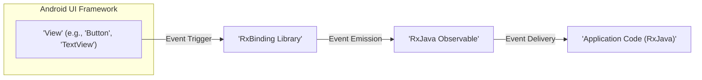
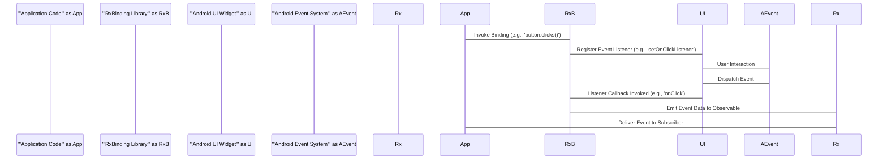

# Project Design Document: RxBinding

**Version:** 1.1
**Date:** October 26, 2023
**Author:** Gemini (AI Language Model)

## 1. Introduction

This document provides a detailed design overview of the RxBinding library, a set of Kotlin and Java bindings that offer a fluent API for creating RxJava `Observable` instances from Android UI widget events. This document aims to clearly articulate the library's architecture, components, and data flow, making it suitable for subsequent threat modeling activities. This revision includes more detail on internal mechanisms and potential security implications.

## 2. Goals and Objectives

The primary goals of RxBinding are:

* **Simplify RxJava integration with Android UI:** Provide a convenient and type-safe mechanism to observe UI events using RxJava's reactive streams.
* **Reduce boilerplate code:** Eliminate the need for manual `OnClickListener` implementations, `TextWatcher` setups, and similar event handling mechanisms when integrating with RxJava.
* **Improve code readability and maintainability:** Offer a declarative and concise approach to handling asynchronous UI events.
* **Provide a comprehensive set of bindings:** Cover a wide range of common Android UI widgets and their associated user interaction and state change events.

## 3. Target Audience

This document is intended for:

* Security engineers performing threat modeling on applications utilizing RxBinding to understand potential attack surfaces.
* Developers contributing to or maintaining the RxBinding library, requiring a deep understanding of its architecture.
* Architects designing systems that incorporate RxBinding and need to assess its impact on the overall application design and security posture.

## 4. Scope

This document covers the design and architecture of the RxBinding library itself, focusing on its internal mechanisms and interactions with the Android UI framework and RxJava. It details how the library facilitates the transformation of UI events into reactive streams. It does not cover the design of specific applications that utilize RxBinding, but provides the necessary information to analyze their security.

## 5. High-Level Architecture

RxBinding acts as an intermediary layer, bridging the event-driven nature of the Android UI framework with the reactive programming paradigm of RxJava. It achieves this by providing extension functions and factory methods that instantiate RxJava `Observable` instances. These `Observable`s emit events triggered by user interactions or changes in the state of observed UI widgets.



* **Android UI Framework:** Represents the standard Android UI components and their built-in event handling mechanisms (e.g., listeners, callbacks).
* **RxBinding Library:** Contains the extension functions, factory methods, and internal listener implementations responsible for intercepting UI events and emitting them as RxJava signals.
* **RxJava Observable:** The reactive stream that emits events originating from the observed UI widget. These streams can be further processed using RxJava's extensive set of operators.
* **Application Code (RxJava):** The part of the application that subscribes to the RxJava `Observable`s provided by RxBinding and reacts to the emitted events.

## 6. Component Description

RxBinding is logically organized into modules, each targeting specific Android UI components or groups of related components. Understanding the internal components is crucial for threat modeling. Key components include:

* **Core Bindings (`rxbindingcore`):**
    * **`ViewObservable`:**  Provides base classes and utility methods for creating Observables from `View` events.
    * **`Functions`:** Contains utility functions, including predicates for filtering events.
    * **`Preconditions`:**  Used for argument validation.
* **View Bindings (`rxbinding`):**
    * **Specific `View` event Observables:**  Classes like `ViewClickObservable`, `ViewLongClickObservable`, `ViewFocusChangeObservable`, which internally manage listeners for specific `View` events.
    * **Factories for creating these Observables:** Extension functions like `view.clicks()`, `view.longClicks()`, etc.
* **Specific Widget Bindings (e.g., `rxbinding-appcompat`, `rxbinding-textview`):**
    * **Widget-specific `Observable` implementations:**  For example, `TextViewTextChangeObservable` in `rxbinding-textview` that uses a `TextWatcher`.
    * **Factories for widget-specific Observables:** Extension functions like `editText.textChanges()`.
* **Listener and Callback Implementations:**
    * **Custom Listeners:** RxBinding internally implements custom listeners (e.g., `OnClickListener`, `TextWatcher`) that intercept UI events. These listeners then emit the relevant event data onto the associated RxJava `Observable`.
    * **Event Data Extraction:** These listeners are responsible for extracting the relevant data from the UI event (e.g., the clicked `View`, the changed text).
* **Checkers and Predicates:**
    * **Filtering Logic:**  Some bindings utilize predicates (often from `Functions`) to filter events based on specific criteria before emitting them on the `Observable`. This can be used to prevent unnecessary emissions.

## 7. Data Flow

The typical data flow within RxBinding involves the following sequence of actions:

1. **Binding Invocation:** The application code calls an RxBinding extension function (e.g., `button.clicks()`) on a UI widget.
2. **Observable Creation and Listener Setup:** RxBinding's extension function creates a specific `Observable` implementation (e.g., `ViewClickObservable`) and internally sets up the appropriate Android event listener (e.g., `OnClickListener`) on the target UI widget.
3. **User Interaction:** The user interacts with the UI widget, triggering an event (e.g., clicking the button).
4. **Android Event Dispatch:** The Android UI framework dispatches the event, invoking the callback method of the listener registered by RxBinding.
5. **Event Data Processing and Emission:** The RxBinding listener implementation receives the event callback. It extracts the relevant event data (e.g., the `View` instance) and emits it as an item on the associated RxJava `Observable`.
6. **Observable Stream:** The emitted event data flows through the `Observable` stream.
7. **Subscription and Consumption:** Application code that has subscribed to this `Observable` receives the emitted event and can then process it using RxJava operators.



## 8. Key Interactions and Interfaces

* **Kotlin Extension Functions (and Java equivalents):** Provide a concise and readable API for creating `Observable`s. These are the primary entry points for using RxBinding.
* **`Observable` Factories:** Methods within RxBinding modules responsible for instantiating specific `Observable` implementations tailored to different UI events.
* **Android Listeners and Callbacks:** Standard Android interfaces (e.g., `OnClickListener`, `TextWatcher`, `OnFocusChangeListener`) are implemented internally by RxBinding to intercept UI events.
* **RxJava `Observable`:** The core reactive type used to represent the stream of UI events.
* **RxJava Operators:** While RxBinding focuses on *creating* `Observable`s, the power of RxJava operators (e.g., `map`, `filter`, `debounce`, `throttleFirst`) is crucial for processing and controlling the flow of events in the application code.

## 9. Security Considerations

While RxBinding itself doesn't handle sensitive data directly, its role in bridging UI events to reactive streams introduces several security considerations:

* **Accidental Emission of Sensitive Data:** If UI widgets display sensitive information (e.g., passwords in an `EditText`), ensure that the application code subscribing to RxBinding `Observable`s does not inadvertently log or transmit this data. Carefully review the data emitted by bindings like `TextViewTextChangeObservable`.
* **Denial of Service (DoS) through Event Flooding:**  Rapid or uncontrolled UI events (e.g., from a malfunctioning sensor or a malicious script manipulating the UI) could lead to a flood of events being emitted by RxBinding. If the application's RxJava processing is not designed to handle such volumes, it could lead to resource exhaustion and a DoS. Employing RxJava operators like `throttleFirst`, `debounce`, or `sample` can mitigate this.
* **Input Validation and Sanitization:** While RxBinding primarily *reacts* to UI events, if the application logic directly uses the data emitted by RxBinding (e.g., text from an `EditText`), it's crucial to perform proper input validation and sanitization *after* receiving the event from the `Observable` to prevent injection attacks (e.g., cross-site scripting if the data is used in a web view).
* **Dependency Vulnerabilities:** RxBinding depends on RxJava and potentially other Android support libraries. Ensure that all dependencies are kept up-to-date to patch any known security vulnerabilities. Regularly audit the project's dependencies.
* **Incorrect Listener Implementation (Internal Library Vulnerabilities):** Although less likely, vulnerabilities could exist within RxBinding's internal listener implementations. These could potentially lead to unexpected behavior, information leakage, or even allow malicious actors to trigger unintended actions. Rely on the library's maintainers to address such issues promptly.
* **UI Redressing/Clickjacking:** While RxBinding doesn't directly cause these vulnerabilities, developers using RxBinding should be aware of them. If UI events are handled without proper context or validation, it might be possible for an attacker to trick a user into performing actions they didn't intend.
* **Observable Side Effects:** Be mindful of side effects within the `onNext`, `onError`, or `onComplete` methods of subscribers to RxBinding `Observable`s. Unintended side effects, especially those involving external systems or data persistence, could introduce security risks if not handled carefully.

## 10. Deployment Considerations

RxBinding is a library integrated into Android applications. Deployment considerations primarily revolve around:

* **Dependency Management:** Utilize a build system like Gradle or Maven to manage the RxBinding dependency and ensure consistent versions across the development team.
* **Version Compatibility:** Verify compatibility between the RxBinding version, the target Android SDK version, the RxJava version, and other relevant Android support libraries. Incompatibilities can lead to runtime errors or unexpected behavior.
* **Proguard/R8 Configuration:** Configure Proguard or R8 (Android's code shrinking and obfuscation tools) to prevent the removal or obfuscation of essential RxBinding classes and methods, which could break the library's functionality. Specific keep rules might be necessary.

## 11. Future Considerations

Potential future enhancements to RxBinding could include:

* **Expanding coverage to new Android UI components and events introduced in newer Android SDK versions.**
* **Providing more fine-grained control over event emission, such as custom filtering or transformation within the binding itself.**
* **Improving error handling and reporting mechanisms within the library.**
* **Exploring integration with other reactive programming libraries beyond RxJava.**
* **Potentially offering more secure defaults or guidance for handling common security concerns.**

## Appendix: Diagrams

### High-Level Architecture Diagram


### Data Flow Sequence Diagram

```mermaid
sequenceDiagram
    participant "'Application Code'" as App
    participant "'RxBinding Library'" as RxB
    participant "'Android UI Widget'" as UI
    participant "'Android Event System'" as AEvent
    participant "'RxJava'" as Rx

    App->RxB: Invoke Binding (e.g., 'button.clicks()')
    RxB->UI: Register Event Listener (e.g., 'setOnClickListener')
    UI->AEvent: User Interaction
    AEvent->UI: Dispatch Event
    UI->RxB: Listener Callback Invoked (e.g., 'onClick')
    RxB->Rx: Emit Event Data to Observable
    Rx->App: Deliver Event to Subscriber
