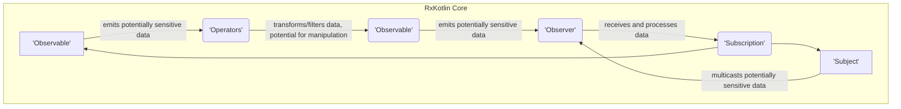
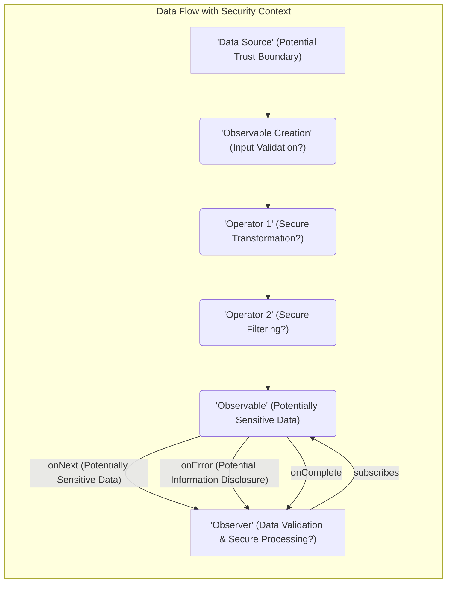

## Project Design Document: RxKotlin (Improved for Threat Modeling)

**1. Introduction**

This document provides a detailed architectural overview of the RxKotlin project, a library for composing asynchronous and event-based programs using observable sequences for the Kotlin programming language. This document is specifically designed to serve as a foundation for threat modeling activities by clearly outlining the key components, data flow, potential trust boundaries, and dependencies within the project. Understanding these aspects is crucial for identifying potential vulnerabilities and attack vectors.

**2. Project Goals**

* Provide a secure and reliable first-class Reactive Extensions (Rx) implementation for Kotlin.
* Offer a set of tools and abstractions for handling asynchronous operations and event streams in a declarative and composable manner, with security considerations integrated into the design.
* Leverage Kotlin's language features, such as coroutines and extension functions, to provide a concise and idiomatic API while minimizing potential security pitfalls.
* Maintain compatibility and interoperability with RxJava where applicable, while carefully evaluating the security implications of shared concepts.
* Offer a robust and well-tested library for building reactive applications in Kotlin, with a strong emphasis on secure coding practices.

**3. Non-Goals**

* To be a full-fledged application framework with built-in security features beyond the scope of a reactive programming library. Security of the application using RxKotlin is the responsibility of the application developer.
* To provide UI-specific security components or bindings. Security in UI contexts needs to be handled at the UI layer.
* To deviate from the core principles and patterns of Reactive Extensions in a way that compromises established security best practices within the Rx ecosystem.

**4. Architectural Overview**

RxKotlin provides the building blocks for reactive programming. The core concepts of `Observable`, `Observer`, and `Operators` form the foundation. Understanding how data flows through these components and the potential for manipulation at each stage is critical for threat modeling.

**5. Key Components (with Security Considerations)**

* **Observable:** Represents a stream of data. Security considerations include:
    * **Data Sensitivity:**  What type of data is being emitted? Is it sensitive information that needs protection?
    * **Source Trustworthiness:** Where does the data originate? Is the source reliable and free from malicious intent?
    * **Unintended Data Exposure:** Could the observable inadvertently expose data to unauthorized observers?
    * **Resource Exhaustion:**  Can a malicious source flood the observable with data, leading to denial-of-service?
    * **Error Handling:** How are errors handled? Do error messages reveal sensitive information?
    * **Cold vs. Hot Observables:**  Cold observables offer better isolation per subscriber, while hot observables require careful consideration of shared state and potential side effects.
* **Observer:** Consumes data emitted by an Observable. Security considerations include:
    * **Data Validation:** Does the observer validate the received data to prevent processing of malicious input?
    * **Secure Storage/Processing:** How is the received data stored or processed? Are appropriate security measures in place?
    * **Side Effects:**  Are the side effects of the observer secure? Could they lead to unintended consequences or vulnerabilities?
* **Operators:** Transform and manipulate data streams. Security considerations include:
    * **Data Sanitization:** Are operators used to sanitize or validate data before it reaches the observer?
    * **Transformation Logic:** Could malicious input exploit vulnerabilities in the operator's transformation logic?
    * **Timing and Concurrency:** Do operators introduce race conditions or other concurrency issues that could be exploited?
    * **Operator-Specific Vulnerabilities:** Are there known vulnerabilities in specific RxKotlin operators?
* **Subject:** Acts as both an Observable and an Observer, allowing for multicasting. Security considerations include:
    * **Access Control:** Who can publish data to the subject? Who can subscribe?
    * **Data Integrity:** Can malicious actors inject or modify data within the subject?
    * **Broadcast Scope:** Is the scope of the broadcast appropriate? Could sensitive data be inadvertently shared?
* **Scheduler:** Controls the concurrency of operations. Security considerations include:
    * **Thread Safety:** Are operations performed on schedulers thread-safe to prevent data corruption or race conditions?
    * **Resource Limits:** Are there limits on the resources consumed by schedulers to prevent denial-of-service?
    * **Context Switching:**  Does context switching introduce any security vulnerabilities?
* **Subscription:** Manages the connection between an Observable and an Observer. Security considerations include:
    * **Resource Leaks:** Failure to unsubscribe can lead to resource leaks.
    * **Unauthorized Access:** Can a malicious actor interfere with or terminate subscriptions?
* **ConnectableObservable:** Requires explicit connection to start emitting. Security considerations are similar to regular Observables, but with added control over the start time.
* **Disposable:** Used for managing resources, similar to Subscription. Security considerations are also similar, focusing on preventing resource leaks.

**6. Data Flow (with Security Context)**

Understanding the flow of data, especially sensitive data, is crucial for identifying potential vulnerabilities. Consider the following stages:

* **Data Source (Potential Trust Boundary):**  Where does the data originate? Is it a trusted source (e.g., internal system) or an untrusted source (e.g., user input, external API)? This is a primary point for potential attacks.
* **Observable Creation (Potential for Injection):** How is the Observable created? If it involves external input, is the input properly sanitized and validated to prevent injection attacks?
* **Operator Application (Transformation and Filtering - Potential for Manipulation):**  Operators transform and filter data. Are these transformations secure? Could a malicious actor craft input that bypasses filters or exploits transformation logic?
* **Subscription (Establishment of Data Flow):** How is the subscription established? Are there any authorization checks involved?
* **Data Emission (Transmission of Potentially Sensitive Data):**  Data is emitted through the Observable chain. Is this transmission secure? Is the data encrypted if necessary?
* **Observer Processing (Consumption and Potential Vulnerabilities):** The Observer processes the data. Is this processing secure? Does it validate the data? Could it be vulnerable to attacks based on the received data?
* **Error Handling (Information Disclosure):** How are errors handled? Do error messages reveal sensitive information that could be exploited?

**7. Dependencies (and Supply Chain Security)**

RxKotlin relies on external libraries. Security considerations include:

* **Kotlin Standard Library:**  Generally considered a trusted dependency, but vulnerabilities can still occur.
* **kotlinx.coroutines:**  If used, the security of the coroutines library is also relevant.
* **Potentially RxJava:**  If there are transitive dependencies or interoperability points with RxJava, the security of RxJava needs to be considered.
* **Build System (Gradle):** The build system itself can be a target for attacks. Ensure the build environment is secure and dependencies are managed securely.
* **Dependency Vulnerability Scanning:** Implement processes to regularly scan dependencies for known vulnerabilities.
* **Supply Chain Attacks:** Be aware of the risk of supply chain attacks targeting dependencies. Use trusted repositories and verify checksums.

**8. Security Considerations (Detailed)**

This section expands on the initial thoughts and provides more specific security considerations:

* **Input Validation and Sanitization:**  Crucial at the boundaries where data enters the reactive streams, especially from untrusted sources. Prevent injection attacks (e.g., SQL injection if data is used in database queries, command injection).
* **Resource Management and Denial of Service:**  Protect against resource exhaustion attacks by implementing backpressure strategies and setting limits on resource consumption. Avoid unbounded streams that could consume excessive memory or CPU.
* **Thread Safety and Concurrency Control:**  Ensure that shared mutable state accessed by Observables and Observers is properly synchronized to prevent race conditions and data corruption.
* **Error Handling and Information Disclosure:**  Avoid revealing sensitive information in error messages or stack traces. Implement robust error handling that gracefully handles failures without exposing internal details.
* **Secure Data Storage and Transmission:** If RxKotlin is used to process sensitive data, ensure that data is stored and transmitted securely (e.g., encryption at rest and in transit).
* **Access Control and Authorization:**  Implement appropriate access controls to restrict who can publish to Subjects or subscribe to Observables, especially when dealing with sensitive data.
* **Secure Coding Practices:** Follow secure coding practices when implementing custom Operators or Observers to avoid introducing vulnerabilities.
* **Regular Security Audits and Penetration Testing:** Conduct regular security audits and penetration testing to identify potential vulnerabilities in applications using RxKotlin.
* **Dependency Management and Updates:** Keep dependencies up-to-date to patch known vulnerabilities.
* **Backpressure Strategies:** Implement appropriate backpressure mechanisms to handle situations where the producer emits data faster than the consumer can process it, preventing resource exhaustion and potential denial-of-service.

**9. Threat Modeling Integration**

This design document serves as a crucial input for the threat modeling process. It provides the necessary information to:

* **Identify Assets:**  What are the valuable assets being processed by RxKotlin (e.g., sensitive data, system resources)?
* **Identify Entry Points:** Where does data enter the RxKotlin system (e.g., Subjects, Observables from external sources)?
* **Identify Trust Boundaries:** Where are the boundaries between trusted and untrusted components or data sources?
* **Identify Threats:** What are the potential threats to these assets (e.g., data breaches, denial of service, manipulation of data)?
* **Identify Vulnerabilities:** What are the weaknesses in the design or implementation that could be exploited by these threats?
* **Analyze Attack Vectors:** How could an attacker exploit these vulnerabilities?

By understanding the architecture and data flow outlined in this document, security professionals can effectively analyze potential threats and design appropriate mitigations. This document helps answer questions like:

* What happens if an untrusted source publishes data to a Subject?
* How can we ensure that sensitive data is not leaked through error handling?
* Are there any race conditions in the processing of events?
* How can we prevent a malicious actor from overwhelming the system with events?
* What are the security implications of using specific operators?

**10. Conclusion**

This improved design document provides a more security-focused overview of the RxKotlin project. By explicitly highlighting potential trust boundaries, data sensitivity, and security considerations for each component and stage of the data flow, this document serves as a valuable resource for conducting thorough threat modeling activities. Understanding these aspects is crucial for building secure and resilient applications using RxKotlin.