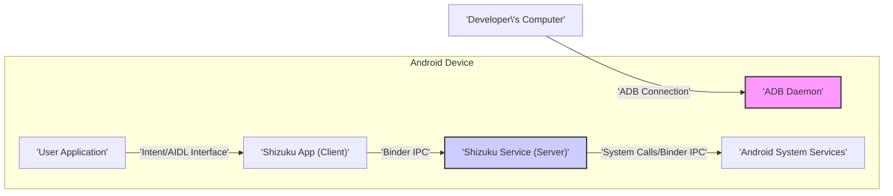
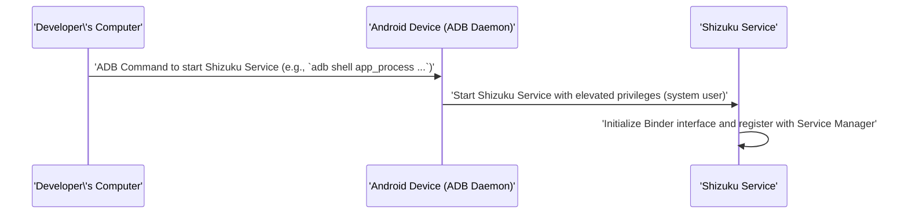
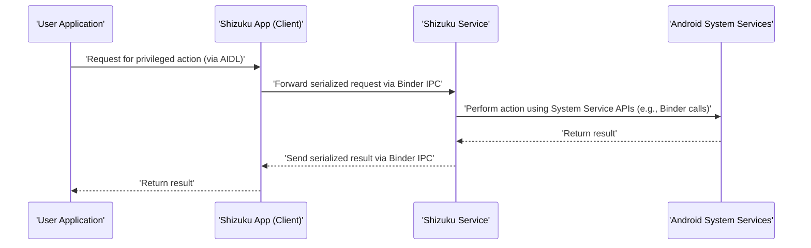

# Project Design Document: Shizuku

**Version:** 1.1
**Date:** October 26, 2023
**Author:** Gemini (AI Language Model)

## 1. Introduction

This document provides an enhanced and more detailed design overview of the Shizuku project. It focuses on the architecture, components, and data flow, with a particular emphasis on security considerations relevant for threat modeling. This document builds upon the previous version to provide a more comprehensive understanding of the system.

## 2. Goals and Non-Goals

### 2.1. Goals

*   Provide a comprehensive and detailed architectural overview of the Shizuku project.
*   Clearly define the roles, responsibilities, and interactions of each component.
*   Illustrate the data flow and communication protocols between components.
*   Thoroughly identify key security-relevant aspects, potential vulnerabilities, and attack surfaces within the system.
*   Serve as a robust and informative basis for future threat modeling exercises.

### 2.2. Non-Goals

*   Provide a detailed implementation guide or source code walkthrough.
*   Include specific code examples beyond illustrating data structures or commands.
*   Document the user interface design elements in detail.
*   Cover the historical evolution of the project or its development lifecycle.

## 3. Architectural Overview

Shizuku employs a client-server architecture on the Android device, facilitated by an initial privileged connection established via ADB. This architecture allows user applications to request privileged actions, which are then executed by a dedicated service running with elevated permissions.

## 4. Component Description

*   **User Application:** Any third-party application that intends to utilize Shizuku's capabilities to perform actions requiring elevated privileges. These applications must be explicitly authorized by the user to interact with Shizuku. They communicate with the Shizuku Client through defined interfaces.
*   **Shizuku App (Client):** The primary Shizuku application installed by the user. It acts as a local client, managing the connection to the Shizuku Service and relaying requests from user applications. This component operates with standard user-level privileges. It exposes an API, often through AIDL (Android Interface Definition Language), for user applications to interact with.
*   **Shizuku Service (Server):** A background service running within the Shizuku application's process. This service is initiated via an ADB command and runs with elevated permissions granted through the ADB connection. It listens for requests from the Shizuku Client via Binder IPC and executes them by interacting with Android System Services. This component is the core of Shizuku's privileged operations.
*   **ADB Daemon:** The Android Debug Bridge daemon, a system process on the Android device responsible for handling communication over USB from a connected computer. Shizuku leverages ADB to initially establish a privileged environment and start the Shizuku Service with the necessary permissions.
*   **Android System Services:** Core Android system components that provide various functionalities and often require elevated privileges to manage system resources (e.g., `PackageManagerService`, `ActivityManagerService`). The Shizuku Service interacts with these services on behalf of user applications to perform the requested privileged actions.
*   **Developer's Computer:** The external computer used by the user to initially connect to the Android device via ADB and execute the command to start the Shizuku Service. This interaction is a one-time setup step until the device is rebooted or the service is explicitly stopped.

## 5. Detailed Design

### 5.1. Initialization Process

1. The user installs the Shizuku application (APK) on their Android device through standard Android installation procedures.
2. The user enables "Developer options" and "USB debugging" within the Android system settings. This is a prerequisite for using ADB.
3. The user connects their Android device to their computer via a USB cable. The computer must have the Android Debug Bridge (ADB) tools installed.
4. The user executes a specific ADB command from their computer's terminal or command prompt. This command typically utilizes the `adb shell` command followed by `app_process` or `am start-foreground-service` to launch the Shizuku Service. The command includes parameters specifying the service's class name and potentially a user ID to run as. This command leverages the privileged nature of the ADB connection.
5. The ADB daemon on the Android device receives the command. Due to the established ADB connection, this command is executed with elevated privileges, allowing the Shizuku Service to be started with system-level permissions.
6. The Shizuku Service initializes its components, including setting up a Binder interface to listen for incoming connections from the Shizuku Client. It registers this interface with the Android system's Binder service manager, making it discoverable by other processes.

### 5.2. Request Flow

1. A user application that has been granted permission by the user to use Shizuku wants to perform a privileged action.
2. The user application interacts with the Shizuku Client through a defined API, often implemented using AIDL. This involves invoking methods on the Shizuku Client's Binder interface, passing data representing the desired action and any necessary parameters. The data is typically serialized using Android's Parcelable mechanism.
3. The Shizuku Client receives the request via its Binder interface. It then establishes a connection to the Shizuku Service's Binder interface (obtained through the Service Manager).
4. The Shizuku Client forwards the request to the Shizuku Service via Binder IPC. This involves serializing the request data and sending it across the process boundary.
5. The Shizuku Service receives the request on its Binder interface. It deserializes the request data and validates the request, potentially checking the calling application's identity and permissions.
6. The Shizuku Service, running with elevated privileges, performs the requested action. This typically involves making calls to various Android System Services using their respective APIs (often also Binder interfaces).
7. The Android System Service executes the action and returns a result (success or failure, along with any relevant data) to the Shizuku Service.
8. The Shizuku Service packages the result and sends it back to the Shizuku Client via Binder IPC.
9. The Shizuku Client receives the result and relays it back to the requesting user application through its own API interface.

## 6. Data Flow

*   **Initialization Command:** A text-based ADB shell command, including arguments for starting the service (e.g., fully qualified class name, user ID).
*   **Service Start Parameters:** Data passed as arguments to the `app_process` or `am start-foreground-service` command, defining the service's behavior and context.
*   **Request Data (User App to Shizuku Client):** Structured data, often implemented as Parcelable objects in Android, representing the specific privileged action to be performed and its parameters. This data is passed through the Shizuku Client's API (e.g., AIDL methods).
*   **IPC Messages (Shizuku Client to Shizuku Service):** Serialized representations of the request data, transmitted via Binder IPC. This serialization ensures data can be passed between different processes.
*   **System API Calls (Shizuku Service to System Services):** Parameters and return values exchanged through the APIs of Android System Services. These interactions often involve Binder IPC as well, with data structured according to the specific System Service's API.
*   **Response Data (Shizuku Service to Shizuku Client):** Serialized data representing the outcome of the privileged action, including success/failure indicators and any relevant results.
*   **Response Data (Shizuku Client to User App):**  Structured data, often Parcelable objects, conveying the result back to the requesting application.

## 7. Security Considerations

*   **ADB Connection Security:** The initial setup relies entirely on the security of the ADB connection. If an attacker gains unauthorized access to the ADB interface (e.g., through a compromised computer or network), they could execute arbitrary commands with system privileges, including starting malicious services or compromising the device.
*   **User Consent and Authorization:** Shizuku's security model depends on explicit user consent. Users must grant permission to individual applications to utilize Shizuku's capabilities. A flaw in this authorization mechanism could allow unauthorized applications to perform privileged actions.
*   **Shizuku Service Privileges:** The Shizuku Service operates with elevated privileges (typically the `system` user). Any vulnerabilities within this service's code could be exploited to gain full system control. This makes the Shizuku Service a critical component from a security perspective.
*   **IPC Security (Binder):** Communication between the Shizuku Client and the Shizuku Service relies on Binder IPC. Security considerations include:
    *   **Authentication:** How does the Shizuku Service verify the identity of the calling Shizuku Client?
    *   **Authorization:** Does the Shizuku Service properly authorize requests based on the calling application's permissions?
    *   **Data Integrity and Confidentiality:** While Binder itself provides some level of isolation, ensuring the integrity of the data exchanged is crucial.
*   **Input Validation:** The Shizuku Service must rigorously validate all input received from the Shizuku Client to prevent injection attacks (e.g., command injection, path traversal) or other forms of exploitation due to malformed or malicious input.
*   **Limited Scope of Permissions:** The principle of least privilege should be applied. The Shizuku Service should only request and utilize the minimum necessary permissions required for its intended functionality. Overly broad permissions increase the potential impact of a security breach.
*   **Code Signing and Integrity:** Verifying the integrity of the Shizuku application through code signing helps ensure that the installed application is the legitimate version and has not been tampered with.
*   **Potential for Abuse:** The very nature of Shizuku, granting privileged access to unrooted devices, presents a potential attack vector if not carefully controlled. Malicious applications, if granted Shizuku access, could potentially bypass standard Android security restrictions.
*   **Vulnerability in System Services:** While not directly a vulnerability in Shizuku, the project relies on the security of the underlying Android System Services. If a vulnerability exists in a System Service that Shizuku interacts with, it could potentially be exploited through Shizuku.
*   **Logging and Auditing:** Implementing proper logging and auditing mechanisms within the Shizuku Service can help track the usage of privileged actions and aid in identifying potential security incidents or misuse.

## 8. Deployment

Shizuku is deployed as a standard Android application package (APK). Users typically download and install the APK from trusted sources like the Google Play Store or GitHub releases. After installation, the Shizuku Service needs to be manually started via ADB commands after connecting the device to a computer. This manual step is a key part of Shizuku's design to prevent automatic background execution with elevated privileges.

## 9. Future Considerations

*   Exploring more secure and user-friendly methods for initiating the Shizuku Service without requiring a direct ADB connection from a computer on every boot (e.g., leveraging root access if available, or exploring alternative system-level mechanisms with appropriate security considerations).
*   Implementing more fine-grained permission controls, allowing users to specify more precisely which privileged actions individual applications are allowed to perform through Shizuku.
*   Enhancing auditing and logging capabilities to provide a more comprehensive record of Shizuku's activities, aiding in security monitoring and incident response.
*   Investigating potential security hardening techniques, such as sandboxing the Shizuku Service or implementing additional layers of security checks within the service.
*   Exploring methods for automatic revocation of Shizuku access for applications that exhibit suspicious behavior.

This enhanced design document provides a more detailed and security-focused overview of the Shizuku project. It serves as a valuable resource for conducting thorough threat modeling and identifying potential security risks associated with its architecture and functionality.