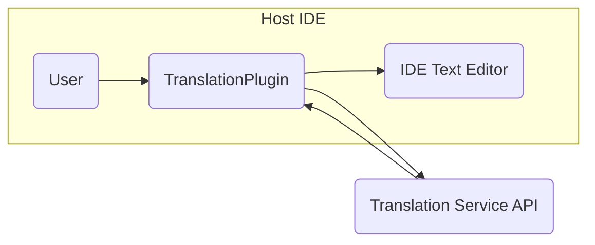
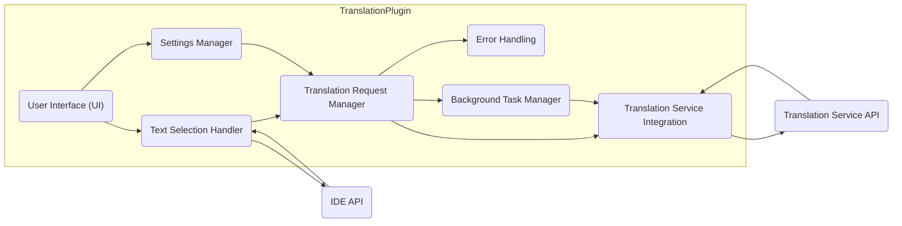

# Project Design Document: TranslationPlugin

**Version:** 1.1
**Date:** October 26, 2023
**Author:** AI Software Architect

## 1. Introduction

This document details the design of the TranslationPlugin project, as found in the GitHub repository [https://github.com/YiiGuxing/TranslationPlugin](https://github.com/YiiGuxing/TranslationPlugin). The purpose of this document is to provide a clear and comprehensive understanding of the plugin's architecture, components, and data flow. This detailed design will serve as the basis for subsequent threat modeling activities, enabling a thorough assessment of potential security vulnerabilities.

## 2. Goals and Objectives

The primary goal of the TranslationPlugin is to empower developers with a seamless and efficient in-IDE translation experience. Key objectives include:

*   **Text Translation:** Enabling users to translate selected text directly within their Integrated Development Environment (IDE).
*   **Multi-Service Support:**  Providing the flexibility to utilize various external translation services.
*   **User-Friendly Interface:** Offering an intuitive and easy-to-use interface for configuration and operation.
*   **Privacy and Security:**  Prioritizing user privacy and ensuring the secure handling of data.
*   **IDE Compatibility:**  Maintaining compatibility and seamless integration with target IDEs, primarily JetBrains products.

## 3. High-Level Architecture

The TranslationPlugin functions as an extension within the host IDE, facilitating communication between the user, the IDE's text editor, and external translation services.

*   **User:** The developer interacting with the IDE and utilizing the TranslationPlugin for translation tasks.
*   **TranslationPlugin:** The central component responsible for managing translation requests, processing data, and presenting results within the IDE.
*   **IDE Text Editor:** The specific component within the IDE where the user selects the text intended for translation.
*   **Translation Service API:** External, third-party services (e.g., Google Translate API, DeepL API) that provide the core translation functionality.

## 4. Detailed Architecture

The plugin's internal structure comprises several interconnected components, each with specific responsibilities:

*   **User Interface (UI):**
    *   Provides all visual elements for user interaction, built using the IDE's UI framework.
    *   Includes context menu items triggered on text selection.
    *   Displays translated text, potentially in popups, tool windows, or inline.
    *   Offers a settings panel for configuring translation services and API keys.
*   **Text Selection Handler:**
    *   Monitors and captures text selections made by the user within the IDE's text editor.
    *   Utilizes the **IDE API** to access selected text and relevant context (e.g., file type, language).
*   **Translation Request Manager:**
    *   Orchestrates the entire translation process, from receiving the request to delivering the result.
    *   Retrieves the configured translation service and necessary credentials from the **Settings Manager**.
    *   Manages the communication flow between the plugin and the **Translation Service Integration** component.
    *   May implement request queuing or throttling to manage API usage.
*   **Translation Service Integration:**
    *   Provides an abstraction layer for interacting with different translation service APIs.
    *   Contains specific implementations for each supported service, handling API-specific request formatting, authentication, and response parsing.
    *   Ensures that the plugin can support multiple translation providers without significant code changes in other components.
*   **Settings Manager:**
    *   Responsible for managing and persisting the plugin's configuration settings.
    *   Utilizes the IDE's settings storage mechanisms to save user preferences.
    *   Handles the storage and retrieval of sensitive information like API keys, potentially employing encryption.
*   **Error Handling:**
    *   Manages and logs errors and exceptions that occur during the translation process.
    *   Provides informative error messages to the user, aiding in troubleshooting.
    *   May include mechanisms for reporting errors or providing diagnostic information.
*   **Background Task Manager:**
    *   Handles potentially long-running operations, such as network requests to translation services, in a non-blocking manner.
    *   Prevents the IDE's UI from freezing during translation requests.

## 5. Data Flow

The sequence of actions and data exchange during a typical translation request is as follows:

1. The **User** selects a block of text within the **IDE Text Editor**.
2. The **Text Selection Handler**, through the **IDE API**, detects the text selection event.
3. The **Text Selection Handler** retrieves the content of the selected text.
4. The **User** initiates the translation process, typically via a context menu item provided by the **UI**.
5. The **UI** forwards the translation request to the **Translation Request Manager**, including the selected text.
6. The **Translation Request Manager** retrieves the user's preferred translation service and any necessary API credentials from the **Settings Manager**.
7. The **Translation Request Manager** passes the selected text and service information to the appropriate **Translation Service Integration** component.
8. The **Translation Service Integration** component formats the translation request according to the specific requirements of the target **Translation Service API**.
9. The formatted request is sent to the **Translation Service API** over a network connection, potentially managed by the **Background Task Manager**.
10. The **Translation Service API** processes the request and returns the translated text as a response.
11. The **Translation Service Integration** component receives and parses the translated text from the API response.
12. The **Translation Service Integration** component sends the translated text back to the **Translation Request Manager**.
13. The **Translation Request Manager** forwards the translated text to the **UI**.
14. The **UI** displays the translated text to the **User** within the IDE.
15. If any errors occur during this process (e.g., network issues, API errors), the **Error Handling** component is notified, and an appropriate message may be displayed to the **User**.

## 6. Components

This section provides a more detailed description of each key component's responsibilities and potential implementation details:

*   **User Interface (UI):**
    *   Likely implemented using Swing or the IntelliJ Platform UI framework.
    *   Context menu items will trigger translation actions.
    *   Translation results might be displayed in:
        *   A popup window that appears near the selected text.
        *   A dedicated tool window within the IDE.
        *   Potentially, inline replacement of the selected text (with user confirmation).
    *   The settings dialog will allow users to:
        *   Select their preferred translation service.
        *   Enter and manage API keys or authentication tokens.
        *   Configure display preferences (e.g., font size, language options).
*   **Text Selection Handler:**
    *   Utilizes listeners provided by the **IDE API** to detect text selection changes.
    *   Retrieves the selected text content and potentially metadata like the programming language of the file.
*   **Translation Request Manager:**
    *   Acts as a central hub for translation requests.
    *   May implement caching mechanisms to store recent translations and reduce redundant API calls.
    *   Handles potential rate limiting imposed by translation services.
*   **Translation Service Integration:**
    *   Each supported translation service will have its own dedicated class or module.
    *   These modules will encapsulate:
        *   API endpoint URLs.
        *   Request parameter formatting.
        *   Authentication mechanisms (e.g., API keys, OAuth).
        *   Response parsing logic.
    *   Examples of potential implementations: `GoogleTranslateIntegration`, `DeepLIntegration`.
*   **Settings Manager:**
    *   Leverages the IDE's `PersistentStateComponent` or similar mechanism for storing settings.
    *   API keys might be stored using the IDE's credential store for enhanced security.
*   **Error Handling:**
    *   Uses logging frameworks (e.g., SLF4j) to record errors and warnings.
    *   Provides user-friendly error messages, avoiding technical jargon.
    *   May include options for users to report errors or submit feedback.
*   **Background Task Manager:**
    *   Utilizes the IDE's threading utilities (e.g., `ApplicationManager.getApplication().executeOnPooledThread()`) to perform network operations asynchronously.
    *   Ensures that the main UI thread remains responsive.

## 7. Security Considerations

This section outlines potential security risks and considerations that will be the focus of subsequent threat modeling activities:

*   **API Key Security:**
    *   How are API keys for external translation services stored within the plugin's settings?
    *   Is encryption employed to protect these sensitive credentials at rest?
    *   Are there mechanisms to prevent accidental exposure or leakage of API keys?
    *   How are API keys handled during plugin updates, backups, or uninstallation?
*   **Data Transmission Security:**
    *   Is all communication between the plugin and external translation services conducted over secure HTTPS connections?
    *   Are there any risks of Man-in-the-Middle (MITM) attacks intercepting translation data?
*   **Privacy of Translated Text:**
    *   What data is transmitted to the translation service (selected text, source language, target language)?
    *   What are the data retention policies of the integrated translation services?
    *   Is there a risk of sensitive information being logged or stored by the translation service?
*   **Injection Vulnerabilities:**
    *   Could malicious content be injected through the translation process, potentially leading to Cross-Site Scripting (XSS) if the translated text is displayed in a web view or similar component without proper sanitization?
    *   Are there any risks of command injection if the plugin interacts with external processes based on translation results?
*   **Dependency Vulnerabilities:**
    *   Does the plugin rely on external libraries or dependencies?
    *   Are these dependencies regularly scanned for known vulnerabilities and updated promptly?
*   **Authentication and Authorization (if applicable):**
    *   If certain translation services require user accounts or more complex authentication, how is this handled securely?
    *   Is user authentication data protected?
*   **Code Injection/Execution Risks:**
    *   Are there any potential vulnerabilities in the plugin's code that could allow for the execution of arbitrary code within the IDE environment?
    *   This includes vulnerabilities related to deserialization, unsafe reflection, or improper handling of external input.
*   **Rate Limiting and Abuse:**
    *   Are there mechanisms in place to prevent abuse of the translation services, potentially leading to unexpected costs or service disruption?
    *   How does the plugin handle rate limiting imposed by the translation service APIs?

## 8. Deployment

The TranslationPlugin will be deployed as a plugin through the standard plugin marketplace of the target IDEs (e.g., JetBrains Marketplace for IntelliJ-based IDEs). The deployment process involves:

*   Packaging the plugin code, resources, and metadata into a distributable archive (typically a ZIP file).
*   Uploading the plugin archive to the marketplace.
*   Providing necessary information about the plugin (description, version, author, etc.).
*   Users can then discover and install the plugin directly from within their IDE.

## 9. Future Considerations

*   **Support for a wider range of translation services.**
*   **Automatic language detection for source text.**
*   **Customizable translation options and glossaries.**
*   **Integration with other IDE features, such as code completion or refactoring.**
*   **Improved error handling and more detailed user feedback.**
*   **Offline translation capabilities (if feasible).**
*   **Contextual translation based on the surrounding code or text.**

This improved design document provides a more detailed and comprehensive overview of the TranslationPlugin's architecture and functionality. It serves as a robust foundation for conducting a thorough threat model and addressing potential security concerns.