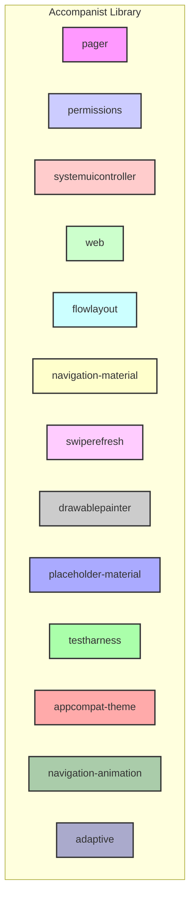
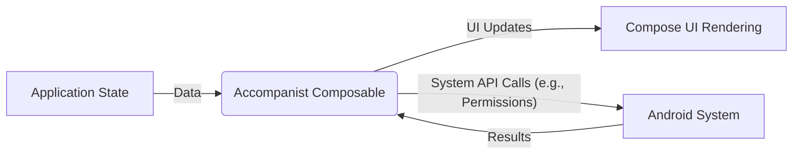
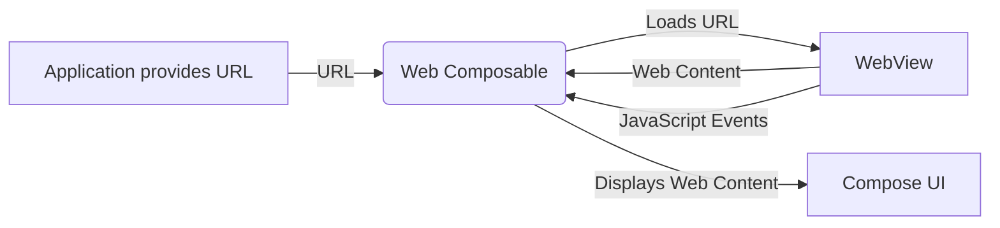

# Project Design Document: Accompanist Library

**Version:** 1.1
**Date:** October 26, 2023
**Author:** AI Software Architect

## 1. Introduction

This document provides a detailed design overview of the Accompanist library, a collection of utility libraries for Jetpack Compose. This document is specifically tailored to serve as a foundation for subsequent threat modeling activities. It outlines the library's architecture, components, data flow, and external dependencies, with a focus on identifying potential security considerations and attack surfaces.

## 2. Goals and Objectives

The primary goals of the Accompanist library are to:

*   Provide common, missing, or experimental functionality for Jetpack Compose.
*   Reduce boilerplate code for common UI patterns and interactions.
*   Offer a collection of well-tested and reliable composables and utilities.
*   Facilitate smoother transitions between different Compose APIs and versions.
*   Maintain a secure and robust codebase, minimizing potential vulnerabilities.

## 3. Architecture Overview

Accompanist is designed as a modular library, with different functionalities grouped into separate modules. This modularity allows developers to include only the specific features they need, reducing the overall application size and potentially limiting the attack surface.



Each module operates relatively independently, exposing composables and utility functions that can be integrated into Android applications using Jetpack Compose. This separation helps to isolate potential issues and reduces the impact of vulnerabilities in one module on others.

## 4. Component Details

This section details the purpose, key functionalities, and potential security considerations for each module within the Accompanist library.

*   **`pager`**: Provides composables for creating horizontally and vertically scrolling pagers.
    *   Key Functionality: Displaying a sequence of screens or content in a swipeable manner.
    *   Security Considerations: Primarily UI-focused, potential for denial-of-service if rendering large amounts of data without proper pagination.
*   **`permissions`**: Simplifies the process of requesting and managing runtime permissions in Android applications.
    *   Key Functionality: Requesting permissions, checking permission status, handling permission results.
    *   Security Considerations: Crucial for application security. Potential for vulnerabilities if permission requests are not handled correctly, leading to unauthorized access to device resources.
*   **`systemuicontroller`**: Offers a way to control the system UI elements like the status bar and navigation bar.
    *   Key Functionality: Changing status bar color, navigation bar color, setting light/dark content appearance.
    *   Security Considerations: Potential for UI spoofing if the system UI can be manipulated in a misleading way.
*   **`web`**: Provides composables for embedding and interacting with web content using `WebView`.
    *   Key Functionality: Displaying web pages, handling navigation events, executing JavaScript.
    *   Security Considerations: High-risk area due to the nature of `WebView`. Vulnerable to Cross-Site Scripting (XSS), insecure SSL handling, JavaScript injection, and other web-related attacks. Requires careful handling of web content and `WebView` settings.
*   **`flowlayout`**: Implements various flow layouts for arranging composables.
    *   Key Functionality: Arranging items in rows or columns, wrapping content when necessary.
    *   Security Considerations: Primarily UI-focused, potential for denial-of-service if handling extremely large numbers of items.
*   **`navigation-material`**: Offers integration with Material Design components for the Navigation Compose library.
    *   Key Functionality: Providing seamless transitions and interactions with Material Design bottom sheets and other navigation elements.
    *   Security Considerations:  Relatively low risk, primarily related to ensuring navigation logic is sound and doesn't expose unintended application states.
*   **`swiperefresh`**: Implements a composable for the "swipe-to-refresh" pattern.
    *   Key Functionality: Triggering a refresh action by swiping down on a list or content area.
    *   Security Considerations: Low risk, primarily related to ensuring the refresh action is idempotent and doesn't introduce unintended side effects.
*   **`drawablepainter`**: Provides a way to convert `Drawable` objects into `Painter` objects for use in Compose.
    *   Key Functionality: Displaying traditional Android Drawables within Compose layouts.
    *   Security Considerations: Low risk, potential issues if handling untrusted `Drawable` sources, which could lead to resource exhaustion or unexpected behavior.
*   **`placeholder-material`**: Implements placeholder UI elements with shimmer or fade animations while content is loading.
    *   Key Functionality: Indicating loading states to the user.
    *   Security Considerations: Very low risk, primarily UI-focused.
*   **`testharness`**: Provides utilities for testing Compose UI elements.
    *   Key Functionality: Simplifying UI testing in Compose.
    *   Security Considerations: Primarily for development and testing, should not introduce vulnerabilities in production code.
*   **`appcompat-theme`**: Offers a way to apply AppCompat themes to Compose layouts.
    *   Key Functionality: Ensuring consistent theming between traditional Android Views and Compose.
    *   Security Considerations: Low risk, primarily related to ensuring consistent application of themes.
*   **`navigation-animation`**: Provides animated transitions for the Navigation Compose library.
    *   Key Functionality: Creating visually appealing transitions between different navigation destinations.
    *   Security Considerations: Low risk, primarily related to ensuring navigation logic remains secure during transitions.
*   **`adaptive`**: Offers composables and utilities for building adaptive layouts.
    *   Key Functionality: Creating flexible UIs that work well on various devices.
    *   Security Considerations: Low risk, primarily focused on UI rendering and layout.

## 5. Data Flow

The data flow within the Accompanist library generally follows the unidirectional data flow principles of Jetpack Compose.



*   **Input:** Applications provide data and configuration to Accompanist composables through parameters and state holders. This data can include user input, application state, and configuration settings.
*   **Processing:** Accompanist composables process the input data to manage their internal state and trigger UI updates. Some modules interact with Android system APIs (e.g., the `permissions` module interacts with the Android permission system).
*   **Output:** The primary output is the rendered UI within the Compose hierarchy. Certain modules may also trigger side effects, such as launching intents (e.g., permission requests) or modifying system settings (e.g., `systemuicontroller`).

**Example Data Flow (Web Module):**



## 6. External Dependencies

Accompanist relies on several external libraries and components, which introduce potential transitive dependencies and associated security risks.

*   **Direct Dependencies:**
    *   Android SDK (various components)
    *   Jetpack Compose Libraries (`androidx.compose.ui`, `androidx.compose.material`, `androidx.compose.runtime`, etc.)
    *   Kotlin Standard Library
    *   Android KTX (Kotlin Extensions)
    *   Specific Android Jetpack Libraries (e.g., `androidx.navigation:navigation-compose`, `androidx.webkit:webkit`) depending on the module.
*   **Transitive Dependencies:**  The direct dependencies themselves have further dependencies. A full dependency tree analysis is crucial for identifying potential vulnerabilities.

A detailed and up-to-date list of dependencies for each module can be found in the respective `build.gradle` files within the Accompanist repository. Regularly scanning these dependencies for known vulnerabilities is a critical security practice.

## 7. Deployment Model

Accompanist is distributed as individual Android library modules via Maven Central. Developers integrate the desired modules into their Android projects by declaring dependencies in their application's `build.gradle` file.

```
dependencies {
    implementation("com.google.accompanist:accompanist-pager:<version>")
    implementation("com.google.accompanist:accompanist-permissions:<version>")
    // ... other modules
}
```

The library code executes within the context of the host Android application's process, sharing the same permissions and security context. This means vulnerabilities in Accompanist could potentially be exploited to compromise the entire application.

## 8. Attack Surface

The attack surface of the Accompanist library can be categorized as follows:

*   **Public APIs (Composable Functions):** The primary entry points for interacting with the library. Malicious or malformed input to these functions could lead to unexpected behavior or vulnerabilities.
*   **Interaction with Android System APIs:** Modules like `permissions` and `systemuicontroller` directly interact with sensitive Android system APIs. Improper handling of these interactions could introduce security flaws.
*   **`WebView` Component (Web Module):** The `web` module introduces a significant attack surface due to the inherent complexities and potential vulnerabilities of `WebView`.
*   **External Dependencies:** Vulnerabilities in the libraries that Accompanist depends on could be exploited through the Accompanist library.
*   **State Management:** Improper state management within the composables could lead to race conditions or other vulnerabilities.

## 9. Security Considerations and Potential Threats

This section details potential security considerations and threats, categorized by module:

*   **`pager`**:
    *   **Denial of Service:** Rendering an extremely large number of pages could lead to excessive memory consumption and application crashes.
*   **`permissions`**:
    *   **Permission Request Spoofing:** Could a malicious application trick the user into granting permissions they wouldn't normally grant?
    *   **Bypassing Permission Checks:**  Could vulnerabilities in the module allow bypassing the intended permission checks?
    *   **Information Disclosure:** Could the module leak information about the status of permissions?
*   **`systemuicontroller`**:
    *   **UI Spoofing/Phishing:**  Manipulating the status bar or navigation bar to display misleading information.
*   **`web`**:
    *   **Cross-Site Scripting (XSS):**  Displaying untrusted web content that executes malicious scripts.
    *   **Insecure SSL Handling:**  Vulnerabilities related to how the `WebView` handles SSL certificates.
    *   **JavaScript Injection:**  Injecting and executing malicious JavaScript within the `WebView` context.
    *   **Local File Access Vulnerabilities:**  Improperly configured `WebView` allowing access to local files.
    *   **Man-in-the-Middle Attacks:**  If not using HTTPS, communication within the `WebView` can be intercepted.
*   **General Considerations:**
    *   **Dependency Vulnerabilities:**  Known vulnerabilities in any of the direct or transitive dependencies.
    *   **Input Validation Failures:**  Not properly validating input parameters to composable functions.
    *   **State Management Issues:**  Race conditions or insecure state transitions within composables.
    *   **Information Disclosure:**  Accidental logging or exposure of sensitive information.
    *   **Denial of Service:**  Providing specific inputs that cause excessive resource consumption or crashes.

## 10. Future Considerations

*   **Regular Security Audits:**  Conducting periodic security audits and penetration testing of the Accompanist library.
*   **Dependency Management:**  Implementing robust dependency management practices, including regular vulnerability scanning and updates.
*   **Secure Coding Practices:**  Adhering to secure coding practices during development, including input validation, output encoding, and proper error handling.
*   **Community Engagement:**  Encouraging security researchers to report potential vulnerabilities through a responsible disclosure program.

This document provides a detailed design overview of the Accompanist library, specifically tailored for threat modeling. The identified attack surfaces and potential threats should be further investigated and mitigated to ensure the security and reliability of applications using this library.