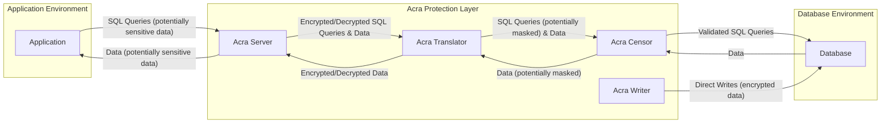

# Project Design Document: Acra Data Protection Suite

**Version:** 1.1
**Date:** October 26, 2023
**Author:** AI Software Architect

## 1. Introduction

This document provides an enhanced architectural design of the Acra Data Protection Suite, an open-source suite of database security tools focused on ensuring data confidentiality and integrity. This document serves as a detailed blueprint for understanding the system's components, their interactions, and the overall architecture. It will be used as the foundation for subsequent threat modeling activities, providing a clear and comprehensive view of the system's structure and security mechanisms.

## 2. Goals and Objectives

The primary goals of Acra are to:

*   Robustly protect sensitive data stored in databases from unauthorized access, both internal and external, and data breaches.
*   Provide a highly flexible and adaptable solution that can be seamlessly integrated with a wide range of database systems (e.g., PostgreSQL, MySQL) and diverse application architectures (e.g., microservices, monolithic).
*   Offer granular levels of data protection, including strong encryption, dynamic data masking, and proactive intrusion detection and prevention capabilities.
*   Maintain the integrity of data, ensuring that it remains consistent, trustworthy, and free from unauthorized modification.
*   Provide comprehensive audit trails and detailed logging capabilities for thorough security monitoring, compliance reporting, and forensic analysis.

## 3. System Architecture

Acra employs a modular, microservices-oriented architecture, allowing for independent deployment and scaling of its key components. This design promotes flexibility and resilience. The core components are designed to be deployed independently or in various combinations, precisely tailored to meet specific security requirements and deployment environments.

### 3.1. High-Level Architecture Diagram

### 3.2. Component Descriptions

*   **Acra Server:**
    *   Functions as a secure, intelligent proxy positioned between the application and the database.
    *   Core responsibility is the encryption and decryption of sensitive data exchanged with the database.
    *   Manages cryptographic keys securely, often integrating with Hardware Security Modules (HSMs) or Key Management Systems (KMS).
    *   Authenticates and authorizes incoming requests from applications, ensuring only legitimate clients can access protected data.
    *   Provides a well-defined API (e.g., gRPC, REST) for applications to interact with Acra, abstracting away the complexities of encryption.
    *   Offers various operational modes, including transparent proxy (seamless integration), sidecar proxy (deployed alongside the application), and network proxy (centralized deployment).

*   **Acra Translator:**
    *   Acts as an intermediary layer situated between Acra Server and the target database.
    *   Translates encrypted data received from Acra Server into a format that the database can understand and process. This might involve adapting data types or structures.
    *   Performs the reverse translation for data retrieved from the database, converting it back into an encrypted format for secure transmission to Acra Server.
    *   Implements data masking and redaction rules based on pre-configured policies, allowing for selective anonymization or pseudonymization of sensitive data.
    *   Significantly minimizes the impact of Acra's encryption logic on the application's core database interaction code, promoting cleaner application development.

*   **Acra Censor:**
    *   Operates as a security policy enforcement point, meticulously monitoring all SQL queries flowing through it.
    *   Enforces predefined security policies by actively blocking or modifying queries that violate these rules, preventing unauthorized data access or manipulation.
    *   Detects and actively prevents SQL injection attacks and other forms of malicious database interactions by analyzing query syntax and parameters.
    *   Provides detailed audit logging of all database interactions, including successful and failed attempts, offering valuable insights for security monitoring and incident investigation.
    *   Can be deployed in different modes, such as inline (actively blocking malicious queries) or out-of-band (passively monitoring and logging).

*   **Acra Writer:**
    *   A dedicated utility designed for securely writing encrypted data directly to the database, bypassing the typical application interaction flow.
    *   Particularly useful for initial data loading, bulk data imports, or batch processing scenarios where direct application involvement is not required or feasible.
    *   Utilizes the same robust encryption mechanisms as Acra Server, ensuring consistent data protection across all data entry points.

## 4. Data Flow

The typical data flow within the Acra ecosystem for a standard application interaction involves these key stages:

1. **Application Initiates Request:** The application constructs and sends a SQL query intended for the database, potentially containing sensitive data that requires protection.
2. **Acra Server Interception and Processing:** The request is intercepted by the strategically positioned Acra Server.
3. **Encryption of Outgoing Data:** If the query involves writing or updating sensitive data, Acra Server encrypts the relevant data fields using the configured encryption keys and algorithms.
4. **Forwarding to Translator:** The (potentially encrypted) query is then securely forwarded to the Acra Translator component.
5. **Translation and Masking:** Acra Translator receives the query. If necessary, it translates the encrypted data into a database-compatible format. It also applies any configured data masking or redaction rules to the query or its parameters.
6. **Database Interaction:** The processed query is sent to the target database for execution.
7. **Database Processing and Response:** The database executes the query and generates a response containing the requested data.
8. **Response Handling by Translator:** The database response is intercepted by Acra Translator.
9. **Translation and Masking (Reverse):** Acra Translator translates the data retrieved from the database back into its encrypted form (if applicable) and applies any configured masking or redaction rules to the returned data.
10. **Decryption by Server:** The translated response is sent back to Acra Server. Acra Server decrypts the data if it was previously encrypted.
11. **Response to Application:** Acra Server sends the decrypted (and potentially masked) data back to the originating application.

For direct data writes using Acra Writer:

1. **Data Input to Writer:** Data intended for the database is provided as input to the Acra Writer utility.
2. **Encryption by Writer:** Acra Writer encrypts the sensitive data using the configured encryption mechanisms.
3. **Direct Database Write:** Acra Writer establishes a direct connection to the database and writes the encrypted data.

## 5. Security Considerations

This section details critical security considerations for the Acra system, forming the basis for subsequent threat modeling exercises.

*   **Key Management:**
    *   The secure generation, storage, rotation, and destruction of cryptographic keys are paramount.
    *   Acra offers integration with various key management solutions, including local file-based storage (for development/testing), Hardware Security Modules (HSMs) for enhanced security, and cloud-based Key Management Systems (KMS) for scalability and manageability.
    *   Strict access control mechanisms must be enforced to limit access to key material to only authorized components and personnel.

*   **Authentication and Authorization:**
    *   Robust authentication mechanisms are required for Acra Server to verify the identity of applications attempting to connect. This may involve API keys, mutual TLS, or other authentication protocols.
    *   Granular authorization policies are necessary to control which applications have permission to access specific data or perform certain operations.
    *   Secure communication channels, such as TLS/SSL with strong cipher suites, are mandatory for all communication between Acra components and between applications and Acra.

*   **Encryption:**
    *   The use of strong, industry-standard encryption algorithms (e.g., AES-256, ChaCha20) is essential for protecting data at rest and in transit.
    *   Configuration options should allow for selecting appropriate encryption schemes based on specific security requirements and performance considerations.
    *   Data integrity should be ensured through the use of authenticated encryption modes or separate integrity checks to detect any unauthorized modifications.

*   **Input Validation and Sanitization:**
    *   Acra Censor plays a vital role in rigorously validating and sanitizing all incoming SQL queries to prevent SQL injection and other injection-based attacks.
    *   Sophisticated parsing and analysis of SQL query syntax and parameters are necessary to identify and neutralize malicious code.

*   **Secure Communication:**
    *   All communication between Acra components (Server, Translator, Censor, Writer) must be encrypted using TLS/SSL with mutual authentication to prevent eavesdropping and tampering.
    *   Secure configuration of TLS settings, including the selection of strong cipher suites and proper certificate management, is crucial.

*   **Auditing and Logging:**
    *   Comprehensive and detailed audit logs of all security-relevant events, including authentication attempts (successful and failed), policy violations detected by Acra Censor, and key management operations, are essential for security monitoring, incident response, and compliance auditing.
    *   Logs should be securely stored in a centralized location, protected from unauthorized access and modification, and ideally integrated with a Security Information and Event Management (SIEM) system.

*   **Vulnerability Management:**
    *   A proactive vulnerability management program, including regular security assessments, penetration testing, and code reviews, is necessary to identify and address potential security weaknesses in Acra components.
    *   A well-defined process for patching and updating Acra components promptly to address identified vulnerabilities is critical.

*   **Deployment Security:**
    *   Secure deployment practices are paramount, including proper network segmentation to isolate Acra components, implementing strong access controls to the underlying infrastructure, and following the principle of least privilege.
    *   Careful consideration should be given to the environment where Acra components are deployed, whether it's containerized environments (e.g., Docker, Kubernetes), cloud platforms (e.g., AWS, Azure, GCP), or on-premise infrastructure. Secure container image management and secure orchestration practices are important in containerized deployments.

## 6. Deployment Considerations

Acra components offer flexible deployment options to suit various application architectures and infrastructure setups:

*   **Transparent Proxy Deployment:** Acra Server is deployed as a transparent proxy directly in front of the database. This mode requires minimal application changes as Acra intercepts all database traffic seamlessly. However, it can introduce a single point of failure if not properly configured for high availability.
*   **Sidecar Proxy Deployment:** Acra Server runs as a sidecar container alongside each application instance. This provides isolation and can simplify deployment in microservices architectures. Each application instance has its own dedicated Acra Server.
*   **Network Proxy Deployment:** Acra Server is deployed as a centralized network proxy, routing traffic between multiple applications and databases. This can simplify management but requires careful network configuration.
*   **Combined Deployments:** Hybrid deployments are possible, combining different deployment modes for different components or applications based on specific needs and security requirements.

Key considerations for deployment include:

*   **Network Latency:** Introducing proxy components can potentially add network latency. Careful consideration of network topology and component placement is important to minimize this impact.
*   **Resource Requirements:** Each Acra component has its own resource requirements (CPU, memory, storage). Proper capacity planning is essential to ensure optimal performance.
*   **Scalability and High Availability:** The deployment architecture should be designed for scalability to handle increasing traffic and for high availability to ensure continuous operation in case of component failures. Load balancing and redundancy are important considerations.
*   **Complexity:** Different deployment modes introduce varying levels of complexity in terms of configuration and management.

## 7. Future Enhancements (Out of Scope for Initial Threat Model)

While not directly within the scope of the initial threat model, potential future enhancements for Acra could include:

*   Broader integration with a wider range of key management systems and protocols.
*   Implementation of more advanced and dynamic data masking techniques based on user roles or context.
*   Enhanced intrusion detection and prevention capabilities, potentially incorporating machine learning for anomaly detection.
*   Support for a more extensive set of database systems and data storage technologies.
*   Improved monitoring and alerting features with richer metrics and integration with monitoring platforms.

## 8. Conclusion

This enhanced design document provides a more detailed and comprehensive overview of the Acra Data Protection Suite's architecture, components, and security considerations. It clarifies the data flow and expands on deployment options. This document serves as a robust foundation for understanding the system's functionality and potential security vulnerabilities, making it a valuable resource for the upcoming threat modeling activities.