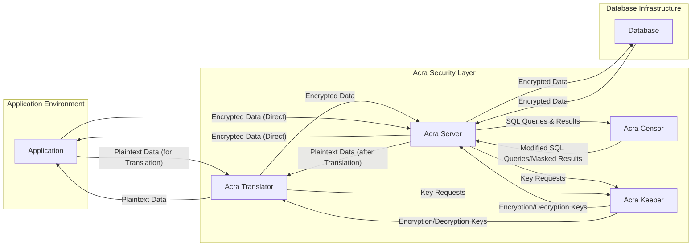
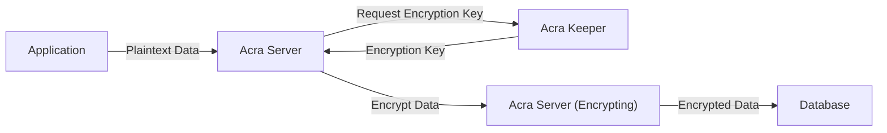
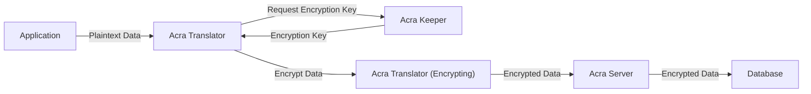
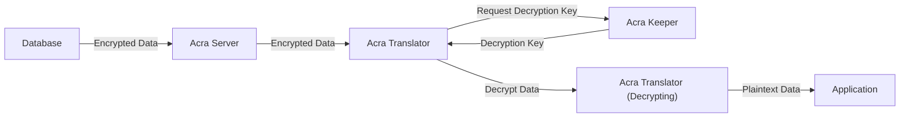
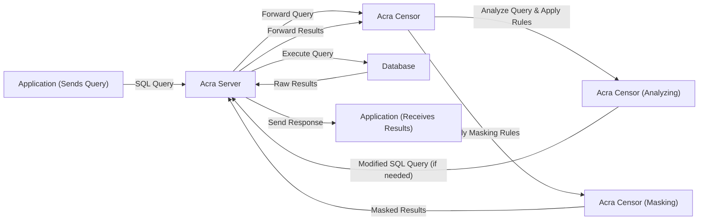

# Project Design Document: Acra Data Protection Suite

**Version:** 1.1
**Date:** October 26, 2023
**Author:** AI Software Architect

## 1. Introduction

This document provides an enhanced design overview of the Acra Data Protection Suite, an open-source, multi-layered database security platform. Acra is designed to protect sensitive data at the application level and within the database infrastructure, focusing on data confidentiality, integrity, and availability. This document serves as a foundational resource for subsequent threat modeling exercises, detailing the core components, their interactions, data flows, and deployment considerations with a security-centric perspective.

## 2. Project Goals

The primary goals of the Acra project are to:

* **Provide robust data-at-rest and data-in-transit protection:** Employ encryption to secure sensitive data both when stored in databases and during transmission between applications and databases.
* **Offer versatile and granular encryption strategies:** Support a range of encryption methodologies, including symmetric and asymmetric encryption, allowing for tailored security measures based on specific data sensitivity and application requirements.
* **Implement dynamic data masking and redaction capabilities:** Enable real-time masking or redaction of sensitive data elements based on user roles, permissions, or predefined security policies, ensuring data privacy and compliance.
* **Streamline and secure cryptographic key lifecycle management:** Provide integrated mechanisms for the secure generation, storage, distribution, and rotation of encryption keys, minimizing the risk of key compromise.
* **Facilitate comprehensive audit logging and proactive intrusion detection:** Monitor database access patterns, identify anomalous activities, and generate detailed audit trails for security analysis and compliance reporting.
* **Ensure seamless integration with existing application and database ecosystems:** Minimize integration friction by offering flexible deployment options and compatibility with common database systems and application frameworks.

## 3. System Architecture

Acra's architecture is modular, comprising several interacting components that collaboratively enforce data protection policies. The following diagram illustrates the high-level architecture and key interactions:

### 3.1. Component Descriptions

* **Acra Server:** The central proxy component responsible for core encryption and decryption operations. It intercepts communication between applications and databases, enforcing security policies.
    * **Responsibilities:**
        * Intercepting and processing database requests and responses.
        * Encrypting outgoing data destined for the database.
        * Decrypting incoming data retrieved from the database.
        * Enforcing access control policies based on configured rules.
        * Generating detailed audit logs of all data access and security events.
        * Communicating securely with Acra Keeper to obtain necessary encryption keys.
        * Optionally interacting with Acra Censor for query modification and result masking.
* **Acra Translator:** A lightweight, application-integrated library that performs client-side encryption and decryption. This offloads processing from Acra Server and provides an additional layer of security.
    * **Responsibilities:**
        * Encrypting sensitive data within the application before it reaches Acra Server.
        * Decrypting data received from Acra Server before it is processed by the application.
        * Reducing the processing load on the central Acra Server, particularly in high-throughput environments.
        * Requesting encryption keys directly from Acra Keeper.
* **Acra Censor:** An SQL firewall and data masking engine that inspects and modifies SQL queries and results in real-time. It enhances security by preventing SQL injection attacks and enforcing data masking policies.
    * **Responsibilities:**
        * Parsing and analyzing incoming SQL queries for potential threats.
        * Identifying and blocking malicious or unauthorized SQL statements.
        * Applying configurable masking or redaction rules to sensitive data within query results.
        * Generating alerts and logs for suspicious database activity.
        * Enforcing data access controls based on user roles and permissions.
* **Acra Keeper:** A dedicated and secure key management service responsible for the generation, storage, and distribution of cryptographic keys used by Acra Server and Acra Translator.
    * **Responsibilities:**
        * Generating strong encryption and decryption keys.
        * Securely storing encryption keys, minimizing the risk of unauthorized access.
        * Providing keys to authorized Acra Server and Acra Translator instances upon secure request.
        * Supporting key rotation policies to enhance security over time.
        * Potentially integrating with Hardware Security Modules (HSMs) or cloud-based key management services for enhanced security.

## 4. Data Flow Diagrams

The following diagrams illustrate the typical data flow for encryption, decryption, and data masking operations within the Acra ecosystem.

### 4.1. Encryption Flow (Application -> Database via Acra Server)

**Description:**

* The application sends plaintext data intended for the database to Acra Server.
* Acra Server initiates a request for an encryption key from Acra Keeper.
* Acra Keeper securely provides the appropriate encryption key to Acra Server.
* Acra Server utilizes the key to encrypt the incoming data.
* Acra Server transmits the encrypted data to the target database.

### 4.2. Decryption Flow (Database -> Application via Acra Server)

**Description:**

* The application requests data from the database.
* The database returns encrypted data to Acra Server.
* Acra Server requests the corresponding decryption key from Acra Keeper.
* Acra Keeper securely provides the decryption key to Acra Server.
* Acra Server uses the key to decrypt the data received from the database.
* Acra Server sends the decrypted plaintext data back to the requesting application.

### 4.3. Encryption Flow (Application -> Database via Acra Translator & Acra Server)

**Description:**

* The application sends plaintext data to the integrated Acra Translator.
* Acra Translator requests the necessary encryption key directly from Acra Keeper.
* Acra Keeper securely provides the encryption key to Acra Translator.
* Acra Translator encrypts the data locally within the application.
* Acra Translator sends the encrypted data to Acra Server.
* Acra Server forwards the already encrypted data to the database.

### 4.4. Decryption Flow (Database -> Application via Acra Server & Acra Translator)

**Description:**

* The application requests data from the database.
* The database returns encrypted data to Acra Server.
* Acra Server forwards the encrypted data to the integrated Acra Translator within the application.
* Acra Translator requests the decryption key from Acra Keeper.
* Acra Keeper provides the decryption key to Acra Translator.
* Acra Translator decrypts the data locally within the application.
* Acra Translator provides the decrypted plaintext data to the application.

### 4.5. Data Masking Flow (Application -> Acra Server -> Acra Censor -> Application)

**Description:**

* The application sends an SQL query to Acra Server.
* Acra Server forwards the query to Acra Censor for inspection.
* Acra Censor analyzes the query based on configured rules and may modify it (e.g., adding security constraints).
* Acra Server executes the (potentially modified) query against the database.
* The database returns the raw query results to Acra Server.
* Acra Server forwards the results to Acra Censor.
* Acra Censor applies configured masking rules to the sensitive data within the results.
* Acra Server sends the masked results back to the application.

## 5. Deployment Scenarios

Acra offers flexible deployment options to suit various architectural patterns and infrastructure requirements. Common deployment scenarios include:

* **Network Proxy Deployment (Acra Server):** Acra Server is deployed as a network proxy intercepting all communication between applications and databases. This is a common approach for centralized security enforcement.
    * **Characteristics:** Centralized encryption and decryption, easier integration with existing applications without code changes, potential single point of failure if not properly configured for high availability.
* **Direct Integration with Acra Translator:** Acra Translator is integrated directly into the application code as a library. This enables client-side encryption and decryption, reducing the load on Acra Server and providing end-to-end encryption.
    * **Characteristics:** Distributed encryption and decryption, improved performance for high-throughput applications, requires application code changes for integration.
* **Sidecar Container Deployment (Kubernetes/Containers):** Acra Server is deployed as a sidecar container alongside the application container within a container orchestration platform like Kubernetes. This provides isolation and simplifies management in containerized environments.
    * **Characteristics:**  Isolated security context, simplified deployment and management in containerized environments, leverages container orchestration features for scalability and resilience.
* **Hybrid Deployment:** A combination of network proxy and direct integration, where some applications utilize Acra Server as a proxy while others integrate Acra Translator directly. This allows for a tailored approach based on specific application needs and security requirements.
    * **Characteristics:**  Flexibility in choosing the optimal deployment model for different applications, potentially more complex to manage.

## 6. Security Considerations

Security is paramount in Acra's design. Key security considerations include:

* **Robust Key Management:** Acra Keeper is the cornerstone of security, ensuring the confidentiality and integrity of encryption keys. Secure storage, access control, and key rotation are critical aspects.
* **Mutual Authentication:** Secure and authenticated communication between Acra components (Server, Translator, Keeper) is essential to prevent unauthorized access and man-in-the-middle attacks. TLS with mutual authentication can be employed.
* **Least Privilege Principle:**  Components should operate with the minimum necessary permissions. For example, Acra Server should only have the permissions required to encrypt and decrypt data, not to modify database schemas.
* **Input Validation and Sanitization:** Acra Censor plays a crucial role in preventing SQL injection attacks by validating and sanitizing incoming SQL queries.
* **Audit Logging and Monitoring:** Comprehensive audit logs provide visibility into data access patterns and security events, enabling detection of suspicious activity and facilitating security investigations.
* **Secure Configuration Management:**  Configuration files and settings for Acra components must be securely stored and managed to prevent unauthorized modification.
* **Regular Security Audits and Penetration Testing:**  Periodic security assessments are necessary to identify and address potential vulnerabilities in the Acra implementation.
* **Protection Against Side-Channel Attacks:**  Consideration should be given to potential side-channel attacks, such as timing attacks, and mitigation strategies implemented where necessary.

## 7. Technology Stack

* **Primary Programming Language:** Go (for core components like Acra Server, Keeper, and Censor).
* **Programming Language (Acra Translator):** Go (with potential for other language bindings in the future).
* **Supported Databases:** PostgreSQL, MySQL, and potentially others.
* **Cryptography Libraries:** Standard Go cryptography libraries (e.g., `crypto/tls`, `crypto/aes`).
* **Communication Protocols:** gRPC (for internal communication between components), potentially HTTPS for external access.
* **Configuration Management:** YAML files, environment variables.
* **Logging Framework:** Standard logging libraries, potentially integrated with centralized logging systems.
* **Key Storage:**  Filesystem (for development/testing), potentially integration with secure key stores, HSMs, or cloud KMS for production.

## 8. Future Considerations

* **Enhanced Integration with Cloud-Native Technologies:** Deeper integration with cloud platforms and services, such as managed Kubernetes offerings and serverless functions.
* **Advanced Threat Detection and Response Capabilities:**  Expanding Acra Censor's capabilities to detect and respond to more sophisticated database attacks.
* **Support for Homomorphic Encryption or Secure Enclaves:** Exploring the integration of advanced cryptographic techniques to enable computation on encrypted data.
* **Improved Key Management Automation:**  Developing more sophisticated tools and workflows for automated key rotation and lifecycle management.
* **Granular Data Access Control Policies:**  Implementing more fine-grained control over data access based on user attributes, data sensitivity, and context.
* **Simplified Deployment and Management Tools:**  Creating user-friendly interfaces and tools for easier deployment, configuration, and monitoring of Acra.

This improved design document provides a more detailed and comprehensive overview of the Acra Data Protection Suite. It highlights the key components, their interactions, data flows, and security considerations, serving as a robust foundation for subsequent threat modeling and security analysis.