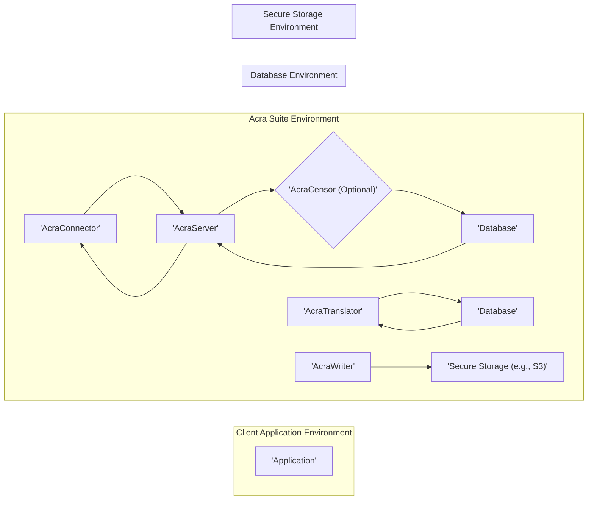

# Project Design Document: Acra Data Protection Suite

**Version:** 1.1
**Date:** October 26, 2023
**Author:** AI Software Architect

## 1. Introduction

This document provides an enhanced architectural design of the Acra Data Protection Suite, an open-source suite of database security tools focused on data confidentiality and integrity. This detailed design serves as a crucial foundation for subsequent threat modeling activities, enabling a comprehensive analysis of potential security risks. It meticulously outlines the key components, their interactions, data flows, and security considerations within the Acra ecosystem.

## 2. Goals

*   Provide a comprehensive and technically detailed overview of the Acra architecture.
*   Clearly define the responsibilities, internal workings, and communication protocols of each component.
*   Illustrate the data flow within the system, highlighting security transformations at each stage.
*   Elaborate on key security features, mechanisms, and potential vulnerabilities.
*   Serve as a robust and informative basis for identifying potential threats, attack vectors, and vulnerabilities during threat modeling exercises.

## 3. High-Level Architecture

Acra operates as a set of interconnected components that strategically intercept and process database traffic to provide various data protection mechanisms. The core principle is to minimize the exposure of sensitive data to unauthorized entities by implementing security controls at different layers.

**Key Concepts:**

*   **Transparent Interception:** Acra components often act as transparent proxies or interceptors for database traffic, minimizing application changes.
*   **Multi-Layered Data Protection:** Acra offers various data protection techniques, including encryption, tokenization, data masking, and redaction, which can be combined for enhanced security.
*   **Policy-Based Enforcement:** AcraCensor enables the definition and enforcement of security policies on database queries, providing granular control over data access.
*   **Secure Key Management:**  Acra emphasizes secure key generation, storage, and rotation practices, often leveraging dedicated components like AcraWriter.
*   **Comprehensive Auditability:** Acra generates detailed audit logs of security-relevant events, facilitating monitoring, incident response, and compliance.
*   **Modular Design:** The modular architecture allows for flexible deployment and integration of specific Acra components based on project needs.

## 4. Component Details

This section provides detailed information about the individual components of the Acra suite, including their functionalities, internal mechanisms, and security considerations.

*   **AcraConnector:**
    *   **Purpose:** A lightweight, client-side library integrated into applications to establish secure and authenticated communication channels with AcraServer.
    *   **Responsibilities:**
        *   Establishing mutually authenticated TLS connections with AcraServer.
        *   Serializing and deserializing database requests and responses using a defined protocol (e.g., Protocol Buffers).
        *   Optionally performing client-side encryption of sensitive data before transmission to AcraServer, depending on the configured protection mode.
        *   Handling connection pooling and management.
    *   **Key Technologies:** Language-specific libraries (Go, Python, Java, etc.), TLS/SSL libraries.
    *   **Security Considerations:**  The security of AcraConnector relies on the secure implementation of TLS and the integrity of the library itself. Vulnerabilities in the library could expose application secrets or allow bypassing security controls.

*   **AcraServer:**
    *   **Purpose:** The central, security-critical component responsible for intercepting, decrypting, processing, and re-encrypting database traffic based on configured security policies.
    *   **Responsibilities:**
        *   Authenticating and authorizing connections from AcraConnectors using mechanisms like TLS client certificates or pre-shared keys.
        *   Decrypting data received from AcraConnectors using configured encryption keys.
        *   Applying configured data protection rules, including encryption (using various algorithms like AES-GCM), tokenization (mapping sensitive data to non-sensitive tokens), and data masking/redaction.
        *   Forwarding the processed database requests to the target database.
        *   Receiving responses from the database.
        *   Encrypting sensitive data in the response before sending it back to the originating AcraConnector.
        *   Generating detailed audit logs of all security-relevant events, including connection attempts, decryption/encryption operations, and policy enforcement actions.
        *   Managing encryption keys, potentially retrieving them from secure storage via AcraWriter.
    *   **Key Technologies:** Go, cryptographic libraries (e.g., Go standard library `crypto`), network communication libraries.
    *   **Security Considerations:** AcraServer is a primary target for attacks. Security considerations include secure key management, protection against memory corruption vulnerabilities, robust authentication and authorization mechanisms, and protection against denial-of-service attacks.

*   **AcraCensor (Optional):**
    *   **Purpose:** An optional but highly valuable component that acts as a policy enforcement firewall for database queries, inspecting and potentially modifying queries before they reach the database.
    *   **Responsibilities:**
        *   Parsing and analyzing SQL queries to identify potentially malicious or unauthorized operations.
        *   Enforcing predefined security policies defined using a declarative language (e.g., YAML or a domain-specific language).
        *   Blocking specific types of queries (e.g., `DROP TABLE`, `UPDATE` without `WHERE` clauses).
        *   Redacting sensitive data from query logs to prevent information leakage.
        *   Preventing SQL injection attacks by identifying and blocking suspicious query patterns.
        *   Generating alerts and notifications based on policy violations.
    *   **Key Technologies:** Go, SQL parsing libraries (e.g., `vitess`), policy evaluation engines.
    *   **Security Considerations:** The effectiveness of AcraCensor depends on the accuracy and comprehensiveness of the defined security policies. Bypassing AcraCensor could allow attackers to directly interact with the database without security controls. Performance overhead of query parsing and policy evaluation needs to be considered.

*   **AcraTranslator:**
    *   **Purpose:** A component designed for out-of-band data protection, enabling the encryption and decryption of data stored in the database without requiring direct interception of real-time database traffic. This is often used for encrypting historical data or during data migration.
    *   **Responsibilities:**
        *   Encrypting data provided to it using specified encryption keys and algorithms.
        *   Decrypting data provided to it using the corresponding encryption keys.
        *   Managing encryption keys used for out-of-band operations.
        *   Supporting various input and output formats for data processing.
    *   **Key Technologies:** Go, cryptographic libraries.
    *   **Security Considerations:** Secure storage and management of encryption keys used by AcraTranslator are paramount. Access control to AcraTranslator itself is crucial to prevent unauthorized encryption or decryption of data.

*   **AcraWriter:**
    *   **Purpose:** A dedicated component responsible for securely storing and managing sensitive data, primarily encryption keys and audit logs, in an external and protected storage backend.
    *   **Responsibilities:**
        *   Encrypting sensitive data before writing it to the configured storage backend.
        *   Retrieving encrypted data from the storage backend upon request from other Acra components (e.g., AcraServer).
        *   Managing access control to the storage backend, ensuring only authorized Acra components can access sensitive information.
        *   Supporting various storage backends, such as cloud storage services (e.g., AWS S3, Google Cloud Storage), secure key-value stores (e.g., HashiCorp Vault), or encrypted local filesystems.
    *   **Key Technologies:** Go, integration libraries for various storage backends, cryptographic libraries for encryption at rest.
    *   **Security Considerations:** AcraWriter is a critical component for key management. The security of the chosen storage backend and the access controls implemented within AcraWriter are essential. Compromise of AcraWriter or the underlying storage could lead to the exposure of encryption keys, undermining the entire security architecture.

## 5. Data Flow

This section details the typical flow of data through the Acra system during different database interaction scenarios, highlighting security transformations at each step.

*   **Scenario 1: Application sending a protected query to the database (with AcraServer and optional AcraCensor):**
    1. The `'Application'` sends a database query through the `'AcraConnector'`.
    2. `'AcraConnector'` may perform client-side encryption of sensitive data within the query, depending on the configured protection mode.
    3. The (potentially encrypted) query is transmitted over a mutually authenticated TLS connection to `'AcraServer'`.
    4. `'AcraServer'` authenticates the connection from `'AcraConnector'`.
    5. `'AcraServer'` decrypts the query if it was encrypted by the `'AcraConnector'`.
    6. Optionally, `'AcraCensor'` intercepts the decrypted query and inspects it based on configured security policies.
    7. If the query violates a policy, `'AcraCensor'` blocks the query and notifies `'AcraServer'`.
    8. If the query is allowed, `'AcraServer'` forwards the (potentially modified by `'AcraCensor'`) query to the `'Database'`.
    9. The `'Database'` processes the query and returns a response.
    10. `'AcraServer'` receives the response from the `'Database'`.
    11. `'AcraServer'` encrypts sensitive data within the response before sending it back to the `'AcraConnector'`.
    12. `'AcraServer'` transmits the encrypted response to `'AcraConnector'` over the secure TLS connection.
    13. `'AcraConnector'` decrypts the response and returns the plaintext data to the `'Application'`.

*   **Scenario 2: Using AcraTranslator for out-of-band data encryption:**
    1. An `'Application'` or a separate process sends plaintext data to `'AcraTranslator'`.
    2. `'AcraTranslator'` encrypts the data using its configured encryption keys and algorithms.
    3. The encrypted data is then stored directly in the `'Database'` (e.g., through a standard database client, bypassing the real-time interception of `'AcraServer'`).

*   **Scenario 3: Using AcraWriter for storing sensitive information:**
    1. An Acra component (e.g., `'AcraServer'`, `'AcraTranslator'`) needs to store sensitive information, such as encryption keys or audit logs.
    2. The component encrypts the sensitive data.
    3. The encrypted data is sent to `'AcraWriter'`.
    4. `'AcraWriter'` encrypts the data again (encryption at rest) and stores it in the configured `'Secure Storage'`. When retrieving, the process is reversed.

## 6. Security Considerations

This section elaborates on key security aspects, potential vulnerabilities, and mitigation strategies within the Acra architecture.

*   **Encryption and Cryptography:**
    *   Acra relies on robust and well-vetted encryption algorithms (e.g., AES-GCM) for data confidentiality.
    *   Proper key management practices, including secure generation, storage (using AcraWriter), rotation, and access control, are paramount.
    *   Vulnerabilities in the underlying cryptographic libraries or improper implementation could compromise data security.

*   **Authentication and Authorization:**
    *   Mutual TLS authentication between `'AcraConnector'` and `'AcraServer'` ensures the identity of both parties.
    *   Authorization mechanisms within `'AcraServer'` control which applications can access protected data.
    *   Weak or improperly configured authentication credentials can be exploited by attackers.

*   **Access Control and Policy Enforcement:**
    *   `'AcraCensor'` provides fine-grained access control over database operations, mitigating the risk of unauthorized data access or modification.
    *   Bypassing `'AcraCensor'` or exploiting vulnerabilities within it could allow attackers to execute malicious queries.
    *   The security of the system depends on the correctness and comprehensiveness of the defined security policies.

*   **Audit Logging and Monitoring:**
    *   Detailed audit logs generated by Acra components provide valuable insights for security monitoring, incident response, and compliance.
    *   Secure storage and access control to audit logs are crucial to prevent tampering or deletion.
    *   Lack of proper monitoring and analysis of audit logs can delay the detection of security breaches.

*   **Separation of Duties and Least Privilege:**
    *   The modular design of Acra promotes separation of duties, limiting the impact of a compromise in a single component.
    *   Applying the principle of least privilege to the configuration and operation of Acra components minimizes the potential damage from compromised accounts.

*   **Secure Configuration and Deployment:**
    *   Proper configuration of Acra components, including strong passwords, secure key management settings, and appropriate network configurations, is critical.
    *   Insecure deployment practices can introduce vulnerabilities.

*   **Protection against Injection Attacks:**
    *   `'AcraCensor'` helps mitigate SQL injection attacks by inspecting and potentially blocking malicious queries.
    *   Regularly updating Acra components and dependencies is essential to patch known vulnerabilities.

*   **Resilience and Availability:**
    *   Consideration should be given to the resilience and availability of Acra components to prevent single points of failure.

## 7. Deployment Scenarios

Acra offers flexible deployment options, each with its own security implications.

*   **Proxy Mode:** `'AcraServer'` acts as a transparent network proxy between the `'Application'` and the `'Database'`.
    *   **Advantages:** Minimal application changes required, centralized security enforcement.
    *   **Security Considerations:** `'AcraServer'` becomes a critical point of failure and a prime target for attacks. Network security around `'AcraServer'` is crucial.

*   **Sidecar Mode:** `'AcraServer'` runs as a sidecar container alongside the `'Application'`.
    *   **Advantages:** Improved isolation, simplified deployment in containerized environments, potentially reduced network latency.
    *   **Security Considerations:** Security of the container environment and communication between the application container and the AcraServer container needs careful consideration.

*   **Out-of-Band Encryption with AcraTranslator:** `'AcraTranslator'` is used independently for encrypting data at rest.
    *   **Advantages:** Suitable for encrypting existing data without real-time interception.
    *   **Security Considerations:** Secure management of encryption keys used by `'AcraTranslator'` is paramount. Access control to `'AcraTranslator'` is critical.

## 8. Future Considerations

*   **Integration with Hardware Security Modules (HSMs):** Enhance the security of key management by integrating with HSMs for secure key generation and storage.
*   **Advanced Threat Detection and Response:** Incorporate more sophisticated threat detection capabilities within `'AcraCensor'`, such as anomaly detection and behavioral analysis, and automated response mechanisms.
*   **Support for Homomorphic Encryption or Secure Enclaves:** Explore the integration of advanced cryptographic techniques like homomorphic encryption or secure enclaves for performing computations on encrypted data.
*   **Enhanced Key Rotation and Management Features:** Implement more robust and automated key rotation and management workflows.
*   **Centralized Management and Monitoring Platform:** Develop a centralized platform for managing, configuring, and monitoring Acra deployments across multiple environments, including security dashboards and alerting capabilities.

This enhanced document provides a more detailed and technically rich design overview of the Acra Data Protection Suite. It serves as a more robust and informative resource for understanding the system's architecture and will be invaluable in conducting thorough threat modeling to identify and mitigate potential security risks effectively.