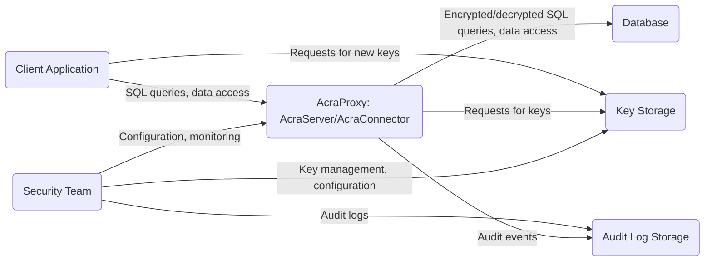
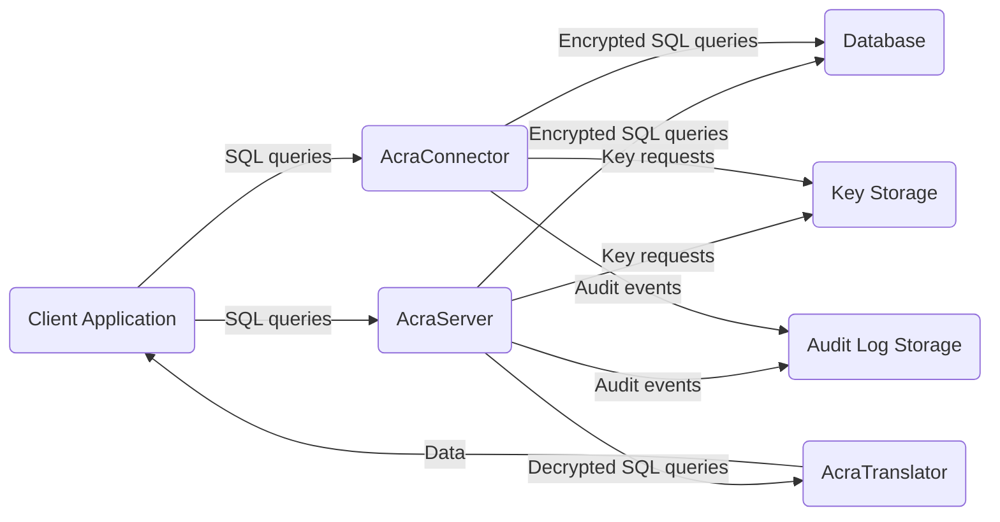
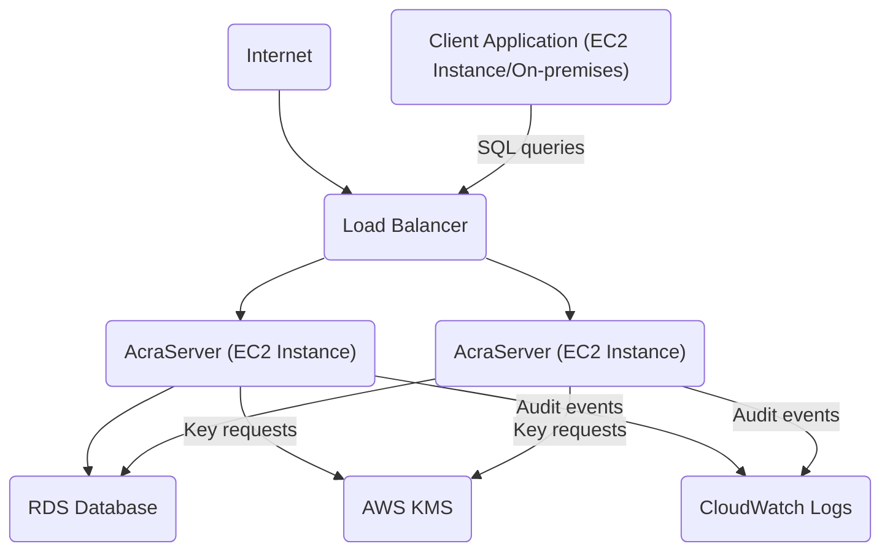
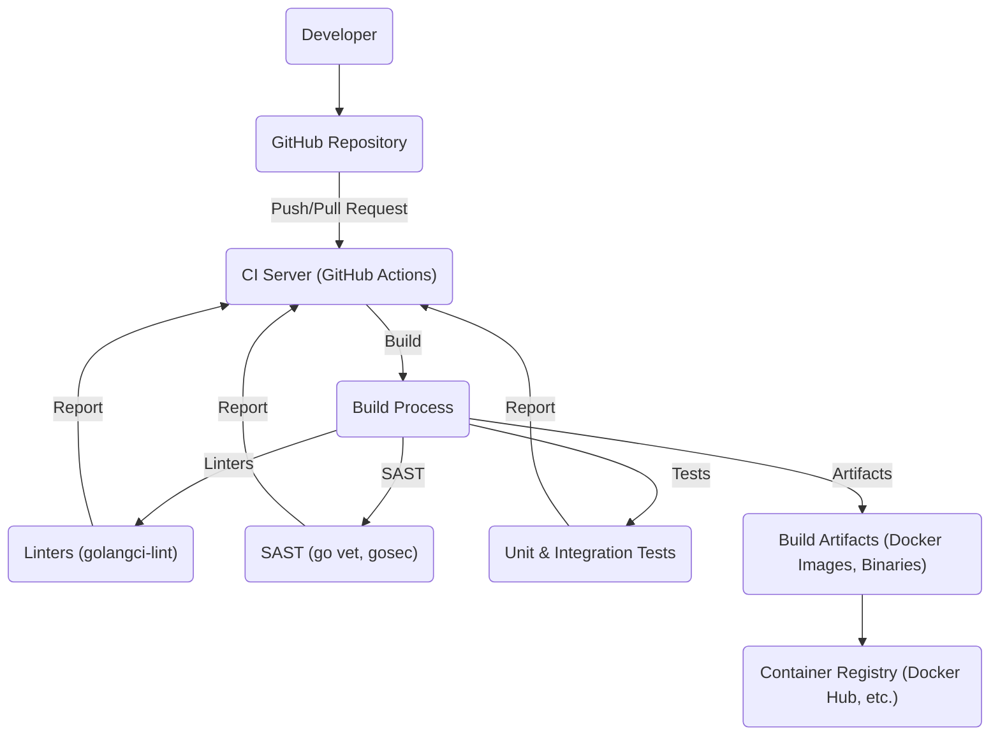

# Acra Database Security Suite Design Document

## BUSINESS POSTURE

Acra is a database security suite designed to protect sensitive data stored in databases. It provides encryption, data masking, tokenization, and access control features. Based on the GitHub repository, here's a breakdown of the business posture:

Priorities and Goals:

*   Provide strong data protection for databases, especially in cloud environments.
*   Minimize the risk of data breaches and unauthorized access.
*   Simplify the implementation of database security measures for developers.
*   Offer a flexible and customizable solution that can be adapted to various database systems and deployment models.
*   Maintain high performance and minimize the impact on database operations.
*   Provide audit trails and monitoring capabilities.

Business Risks:

*   Data breaches leading to exposure of sensitive information (e.g., PII, financial data, intellectual property).
*   Unauthorized access to the database by malicious actors or insiders.
*   Compliance violations with data protection regulations (e.g., GDPR, HIPAA, PCI DSS).
*   Data loss or corruption due to attacks or system failures.
*   Performance degradation of the database due to security measures.
*   Complexity of implementation and maintenance, leading to errors and vulnerabilities.
*   Supply chain attacks targeting Acra or its dependencies.

## SECURITY POSTURE

Existing Security Controls:

*   security control: Data encryption at rest and in transit (using AcraCensor, AcraTranslator, AcraWriter). Implemented in Acra components.
*   security control: Data masking and tokenization (using AcraCensor). Implemented in Acra components.
*   security control: Access control and firewalling (using AcraCensor). Implemented in Acra components.
*   security control: Audit logging (using AcraCensor). Implemented in Acra components.
*   security control: Key management (using AcraKeymaker and AcraConnector). Implemented in Acra components.
*   security control: Secure communication using TLS. Described in documentation.

Accepted Risks:

*   accepted risk: Performance overhead due to encryption and decryption operations.
*   accepted risk: Complexity of key management and rotation.
*   accepted risk: Potential vulnerabilities in third-party dependencies.
*   accepted risk: Reliance on the security of the underlying infrastructure (e.g., cloud provider, operating system).

Recommended Security Controls:

*   security control: Implement regular security audits and penetration testing.
*   security control: Integrate with a centralized logging and monitoring system (e.g., SIEM).
*   security control: Implement strong authentication and authorization mechanisms for accessing Acra components.
*   security control: Enforce the principle of least privilege for database access.
*   security control: Implement robust input validation and sanitization to prevent injection attacks.
*   security control: Regularly update Acra and its dependencies to patch security vulnerabilities.
*   security control: Implement a secure software development lifecycle (SSDLC) with code reviews, static analysis, and dynamic analysis.

Security Requirements:

*   Authentication:
    *   Acra components must authenticate with each other using strong cryptographic mechanisms (e.g., TLS with mutual authentication).
    *   Users and applications accessing the database through Acra must be authenticated using appropriate methods (e.g., passwords, API keys, certificates).
*   Authorization:
    *   Access to data and Acra functionalities must be controlled based on the principle of least privilege.
    *   Role-based access control (RBAC) should be implemented to manage user permissions.
*   Input Validation:
    *   All inputs to Acra components and the database must be validated and sanitized to prevent injection attacks (e.g., SQL injection, command injection).
    *   Data received from external sources must be treated as untrusted and carefully validated.
*   Cryptography:
    *   Strong cryptographic algorithms and key lengths must be used for encryption, hashing, and digital signatures.
    *   Key management must be secure and follow best practices (e.g., key rotation, secure storage).
    *   Cryptographic operations must be performed using secure libraries and APIs.

## DESIGN

### C4 CONTEXT

Element Descriptions:

*   Element:
    *   Name: Client Application
    *   Type: Application
    *   Description: Application that needs to access the database.
    *   Responsibilities: Sending SQL queries, processing data.
    *   Security controls: Authentication to AcraProxy, input validation.

*   Element:
    *   Name: AcraProxy: AcraServer/AcraConnector
    *   Type: Software System
    *   Description: Proxy that intercepts database traffic and performs security operations.
    *   Responsibilities: Encryption/decryption, data masking, access control, audit logging.
    *   Security controls: TLS, encryption, data masking, access control, audit logging, key management.

*   Element:
    *   Name: Database
    *   Type: Database System
    *   Description: The database storing the sensitive data.
    *   Responsibilities: Storing and retrieving data.
    *   Security controls: Database-level security controls (e.g., user accounts, permissions).

*   Element:
    *   Name: Key Storage
    *   Type: Storage
    *   Description: Secure storage for cryptographic keys.
    *   Responsibilities: Storing and managing keys.
    *   Security controls: Access control, encryption, key management.

*   Element:
    *   Name: Security Team
    *   Type: User
    *   Description: Team responsible for managing Acra's security.
    *   Responsibilities: Key management, configuration, monitoring.
    *   Security controls: Strong authentication, access control.

*   Element:
    *   Name: Audit Log Storage
    *   Type: Storage
    *   Description: Storage for audit logs.
    *   Responsibilities: Storing audit logs.
    *   Security controls: Access control, integrity protection.

### C4 CONTAINER

Element Descriptions:

*   Element:
    *   Name: Client Application
    *   Type: Application
    *   Description: Application that needs to access the database.
    *   Responsibilities: Sending SQL queries, processing data.
    *   Security controls: Authentication to AcraProxy, input validation.

*   Element:
    *   Name: AcraServer
    *   Type: Container (Proxy)
    *   Description: Proxy that intercepts database traffic and performs security operations (server-side).
    *   Responsibilities: Encryption/decryption, data masking, access control, audit logging.
    *   Security controls: TLS, encryption, data masking, access control, audit logging, key management.

*   Element:
    *   Name: AcraConnector
    *   Type: Container (Client-side library)
    *   Description: Client-side library that integrates with the application and communicates with AcraServer.
    *   Responsibilities: Encryption/decryption, key management, communication with AcraServer.
    *   Security controls: TLS, encryption, key management.

*   Element:
    *   Name: AcraTranslator
    *   Type: Container (Service)
    *   Description: Service that handles decryption and data processing for specific applications.
    *   Responsibilities: Decryption, data transformation, communication with AcraServer.
    *   Security controls: TLS, encryption, key management.

*   Element:
    *   Name: Database
    *   Type: Database System
    *   Description: The database storing the sensitive data.
    *   Responsibilities: Storing and retrieving data.
    *   Security controls: Database-level security controls (e.g., user accounts, permissions).

*   Element:
    *   Name: Key Storage
    *   Type: Storage
    *   Description: Secure storage for cryptographic keys.
    *   Responsibilities: Storing and managing keys.
    *   Security controls: Access control, encryption, key management.

*   Element:
    *   Name: Audit Log Storage
    *   Type: Storage
    *   Description: Storage for audit logs.
    *   Responsibilities: Storing audit logs.
    *   Security controls: Access control, integrity protection.

### DEPLOYMENT

Possible Deployment Solutions:

1.  **Cloud-based deployment (e.g., AWS, GCP, Azure):** Acra components can be deployed as containers (e.g., Docker) on virtual machines or managed container services (e.g., Kubernetes, ECS, AKS). Key storage can be implemented using cloud-based key management services (e.g., AWS KMS, GCP Cloud KMS, Azure Key Vault).
2.  **On-premises deployment:** Acra components can be deployed on physical or virtual servers within the organization's data center. Key storage can be implemented using hardware security modules (HSMs) or dedicated key management servers.
3.  **Hybrid deployment:** A combination of cloud-based and on-premises deployment, where some components are deployed in the cloud and others are deployed on-premises.

Chosen Deployment Solution (Example: AWS-based):

Element Descriptions:

*   Element:
    *   Name: Internet
    *   Type: Network
    *   Description: The public internet.
    *   Responsibilities: Routing traffic to the load balancer.
    *   Security controls: Firewall, DDoS protection.

*   Element:
    *   Name: Load Balancer
    *   Type: Network Appliance
    *   Description: Distributes traffic across multiple AcraServer instances.
    *   Responsibilities: Load balancing, SSL termination.
    *   Security controls: TLS, access control.

*   Element:
    *   Name: AcraServer (EC2 Instance)
    *   Type: Virtual Machine
    *   Description: An EC2 instance running the AcraServer container.
    *   Responsibilities: Encryption/decryption, data masking, access control, audit logging.
    *   Security controls: TLS, encryption, data masking, access control, audit logging, key management, instance security groups.

*   Element:
    *   Name: RDS Database
    *   Type: Managed Database Service
    *   Description: An AWS RDS instance storing the sensitive data.
    *   Responsibilities: Storing and retrieving data.
    *   Security controls: Database-level security controls, encryption at rest, network access control.

*   Element:
    *   Name: AWS KMS
    *   Type: Key Management Service
    *   Description: AWS Key Management Service for storing and managing cryptographic keys.
    *   Responsibilities: Storing and managing keys.
    *   Security controls: Access control, encryption, key management.

*   Element:
    *   Name: CloudWatch Logs
    *   Type: Logging Service
    *   Description: AWS CloudWatch Logs for storing and monitoring audit logs.
    *   Responsibilities: Storing and monitoring audit logs.
    *   Security controls: Access control, encryption.

*   Element:
    *   Name: Client Application (EC2 Instance/On-premises)
    *   Type: Application Server
    *   Description: The application server running the client application. Can be an EC2 instance or an on-premises server.
    *   Responsibilities: Running the client application.
    *   Security controls: Application-level security controls, network access control.

### BUILD

The Acra project utilizes a build process involving several steps and tools to ensure security and code quality.

Build Process Description:

1.  Developer: Developers write code and commit it to the GitHub repository.
2.  GitHub Repository: The central repository for Acra's source code.
3.  CI Server (GitHub Actions): GitHub Actions is used as the CI/CD platform. Workflows are triggered on pushes and pull requests.
4.  Build Process: The build process includes several steps:
    *   Linters (golangci-lint): Static analysis tools to enforce code style and identify potential issues.
    *   SAST (go vet, gosec): Static application security testing tools to detect security vulnerabilities in the code.
    *   Tests (Unit & Integration Tests): Automated tests to ensure code correctness and functionality.
5.  Build Artifacts: The build process produces build artifacts, such as Docker images and binaries.
6.  Container Registry: Build artifacts are pushed to a container registry (e.g., Docker Hub).

Security Controls in Build Process:

*   security control: Code reviews: Pull requests are used to review code changes before merging them into the main branch.
*   security control: Static analysis: Linters and SAST tools are used to identify potential code quality and security issues.
*   security control: Automated testing: Unit and integration tests are run automatically to ensure code correctness.
*   security control: Dependency management: Dependencies are managed using Go modules, and their versions are tracked.
*   security control: Signed commits: Developers are encouraged to sign their commits to ensure code integrity.
*   security control: Container image scanning: Docker images should be scanned for vulnerabilities before being deployed.

## RISK ASSESSMENT

Critical Business Processes:

*   Data storage and retrieval: The core functionality of the database must be protected to ensure data availability and integrity.
*   Secure data access: Access to sensitive data must be controlled and monitored to prevent unauthorized access.
*   Key management: Cryptographic keys must be securely managed to protect the confidentiality of encrypted data.

Data Sensitivity:

*   The data protected by Acra is considered highly sensitive, as it may include PII, financial data, or other confidential information.
*   The sensitivity level of the data depends on the specific use case and the type of data stored in the database.
*   Data is stored encrypted, reducing sensitivity.
*   Data is accessed in decrypted form, increasing sensitivity.

## QUESTIONS & ASSUMPTIONS

Questions:

*   What specific compliance requirements (e.g., GDPR, HIPAA, PCI DSS) must Acra adhere to?
*   What are the performance requirements for Acra (e.g., latency, throughput)?
*   What are the specific threat models that Acra should be designed to protect against?
*   What is the expected scale of deployment (e.g., number of databases, number of users)?
*   What are the existing security controls in the environment where Acra will be deployed?
*   What level of access will the security team have to the database and Acra components?
*   What are the specific key management requirements (e.g., key rotation frequency, key storage location)?
*   What are the specific audit logging requirements (e.g., log retention period, log format)?

Assumptions:

*   BUSINESS POSTURE: The organization has a moderate to low risk appetite.
*   BUSINESS POSTURE: The organization prioritizes data security and compliance.
*   SECURITY POSTURE: The underlying infrastructure (e.g., cloud provider, operating system) is secure.
*   SECURITY POSTURE: The database system is configured securely.
*   DESIGN: Acra will be deployed in a cloud-based environment (AWS).
*   DESIGN: The client application will connect to AcraProxy using TLS.
*   DESIGN: AWS KMS will be used for key management.
*   DESIGN: AWS CloudWatch Logs will be used for audit logging.
*   DESIGN: GitHub Actions will be used for CI/CD.