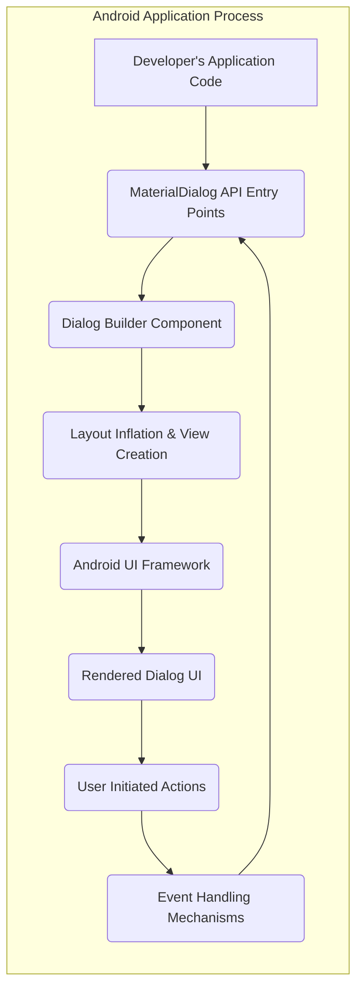
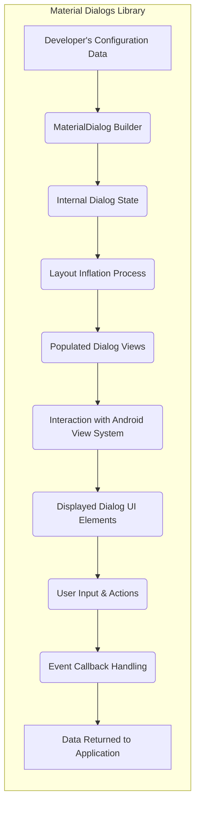

# Project Design Document: Material Dialogs Library

**Version:** 1.1
**Date:** October 26, 2023
**Prepared By:** AI Software Architect

## 1. Introduction

This document provides an enhanced design overview of the Material Dialogs library for Android, located on GitHub at [https://github.com/afollestad/material-dialogs](https://github.com/afollestad/material-dialogs). This refined document aims to offer a clearer and more comprehensive understanding of the library's architecture, components, and data flow, specifically tailored for subsequent threat modeling activities. Improvements focus on clarity, detail, and direct relevance to security considerations.

## 2. Project Overview

The Material Dialogs library is a widely adopted open-source Android library designed to streamline the creation and customization of visually appealing dialogs adhering to Material Design specifications. It offers a fluent and intuitive API, enabling developers to easily construct various dialog types, including informative alerts, user input prompts, selectable lists, progress indicators, and dialogs with custom layouts. The primary goal is to simplify dialog implementation compared to using the standard Android `AlertDialog` directly, promoting a consistent and modern user experience.

## 3. Goals and Objectives

*   Provide a straightforward and expressive API for building Material Design compliant dialogs.
*   Offer extensive customization options for diverse dialog presentation and behavior.
*   Increase developer efficiency by minimizing the amount of code required for dialog implementation.
*   Ensure visual consistency and a unified user experience across different Android versions.
*   Facilitate seamless integration into existing Android application projects.
*   Maintain a well-structured and understandable codebase for easier maintenance and contributions.

## 4. Target Audience

The primary users of this library are Android application developers seeking a convenient and aesthetically pleasing way to implement dialogs within their applications while adhering to Material Design guidelines. This includes developers of varying experience levels, from beginners to seasoned professionals.

## 5. System Architecture

The Material Dialogs library operates as a client-side component deeply integrated within the lifecycle of an Android application. It leverages the Android SDK and its UI rendering capabilities to display dialogs within the application's process.

**Detailed Component Descriptions:**

*   **Developer's Application Code:** This represents the sections of the Android application where developers instantiate and configure dialogs using the Material Dialogs library.
*   **MaterialDialog API Entry Points:** These are the public classes and methods provided by the library, primarily the `MaterialDialog` class and its associated `Builder`. Developers interact with these to initiate dialog creation and customization.
*   **Dialog Builder Component:** This component (typically the `MaterialDialog.Builder` class) is responsible for orchestrating the construction of a `MaterialDialog` instance based on the configuration parameters provided by the developer. It manages settings for titles, content, buttons, input fields, lists, and custom views.
*   **Layout Inflation & View Creation:** This stage involves taking XML layout definitions (either pre-defined by the library or custom layouts provided by the developer) and converting them into actual `View` objects that can be displayed on the screen. The Android `LayoutInflater` is used for this process.
*   **Android UI Framework:** This refers to the underlying Android framework components responsible for managing the display and interaction of UI elements. This includes the `WindowManager`, `View` hierarchy, and event dispatching mechanisms.
*   **Rendered Dialog UI:** This is the visual representation of the dialog presented to the user on the device's screen. It consists of various UI elements like `TextView` for text, `Button` for actions, `EditText` for input, and `RecyclerView` or `ListView` for lists.
*   **User Initiated Actions:** These are interactions performed by the user with the displayed dialog, such as tapping buttons, entering text, selecting items from a list, or dismissing the dialog.
*   **Event Handling Mechanisms:** The library provides various mechanisms for handling user interactions, including:
    *   **Button Click Listeners:**  Callbacks invoked when the user taps positive, negative, or neutral buttons.
    *   **Input Callbacks:**  Listeners that provide the text entered by the user in input dialogs.
    *   **List Item Selection Listeners:** Callbacks triggered when the user selects an item from a list dialog.
    *   **Dismiss Listeners:**  Callbacks invoked when the dialog is dismissed.

## 6. Data Flow

The flow of data within the Material Dialogs library involves the configuration provided by the developer, the internal processing within the library, the interaction with the Android framework, and the user's input.

**Detailed Data Flow Description:**

*   **Developer's Configuration Data:** The developer provides data to the `MaterialDialog.Builder` to define the dialog's characteristics. This includes text for titles and messages, button labels, initial input text, list of items, custom views, and event listeners.
*   **MaterialDialog Builder:** The builder component receives the configuration data and stores it internally. It validates and organizes this data to prepare for dialog creation.
*   **Internal Dialog State:** The builder uses the configuration data to create and manage the internal state of the `MaterialDialog` object. This includes storing the text content, button actions, list data, and references to custom views.
*   **Layout Inflation Process:** Based on the dialog type and configuration, the appropriate layout XML file is inflated. For custom views, the developer-provided layout is used.
*   **Populated Dialog Views:** The inflated layout's `View` objects are populated with the data from the internal dialog state. Text views are set, list adapters are populated, and custom views are integrated.
*   **Interaction with Android View System:** The `MaterialDialog` interacts with the Android `WindowManager` to add the dialog's root `View` to the window hierarchy, making it visible on the screen.
*   **Displayed Dialog UI Elements:** The user sees the rendered dialog with all its configured elements: text, buttons, input fields, lists, etc.
*   **User Input & Actions:** The user interacts with the displayed dialog by tapping buttons, entering text, or selecting list items. These actions generate events within the Android framework.
*   **Event Callback Handling:** The Material Dialogs library intercepts these user interaction events and invokes the appropriate callbacks or listeners that were configured by the developer.
*   **Data Returned to Application:** Through the callbacks, data resulting from user interaction (e.g., entered text, selected list item) is passed back to the developer's application code for further processing.

## 7. Key Components

*   **`MaterialDialog` Class:** The central class representing the dialog. It extends `androidx.appcompat.app.AlertDialog` and encapsulates the dialog's state and behavior.
*   **`MaterialDialog.Builder` Class:** Implements the Builder pattern, providing a fluent interface for constructing `MaterialDialog` instances. It handles configuration and validation of dialog properties.
*   **Predefined Layout XML Files:**  XML layout files defining the structure of standard dialog types (e.g., basic message, input, list). These provide a consistent look and feel.
*   **Button Handling Logic:**  Manages the creation, styling, and event handling for positive, negative, and neutral buttons.
*   **Input Handling Components:**  Includes logic for managing `EditText` fields in input dialogs, handling text input, and potentially providing input validation mechanisms (though this often relies on developer implementation in callbacks).
*   **List Handling Components:**  Manages the display of lists using `RecyclerView` or `ListView`, including adapters for populating the list with data and handling item selection events.
*   **Progress Indicator Components:**  Handles the display of progress bars (both determinate and indeterminate) and associated messages in progress dialogs.
*   **Custom View Integration Logic:**  Allows developers to embed their own custom layouts and views within the dialog. The library provides mechanisms to inflate and display these custom views.
*   **Theme and Style Attributes:** Defines the visual appearance of the dialogs, adhering to Material Design principles. Allows for customization through themes and styles applied by the developer.
*   **Event Listener Interfaces:**  Interfaces (e.g., `onPositive`, `onNegative`, `onItemSelected`) that developers implement to handle user interactions with the dialog.

## 8. Security Considerations (Detailed)

This section expands on potential security considerations, providing more specific examples and potential threats relevant for threat modeling.

*   **Improper Input Validation by Developers:** While the library provides input dialogs, it largely relies on the developer to validate the data received through callbacks. Failure to properly validate user input within the application code could lead to vulnerabilities if this data is used in subsequent operations (e.g., SQL injection if used in database queries, command injection if used in system commands).
*   **Cross-Site Scripting (XSS) via Custom Views:** If developers display user-generated content within custom views embedded in the dialog, and this content is not properly sanitized, it could be vulnerable to XSS attacks. Although this is within the application's responsibility, the library facilitates this integration, making it a relevant consideration.
*   **Callback Hijacking (Limited Scope):**  While direct hijacking of callbacks within the library's process is unlikely without significant compromise of the application, a malicious actor gaining control of parts of the application could potentially manipulate the state or data being passed through these callbacks, leading to unexpected behavior or data breaches within the application's context.
*   **Vulnerabilities in Custom View Implementations:** If developers use custom views with security vulnerabilities (e.g., insecure data handling, exposed intents), these vulnerabilities could be exploited when the custom view is displayed within a Material Dialog.
*   **Information Disclosure via Logging or Error Handling:**  Improperly configured logging within the application or the library (if debug builds are used in production) could inadvertently expose sensitive information displayed within the dialogs.
*   **Denial of Service (DoS) through Malicious Input (Less Likely):** While less probable, excessively long or malformed input provided by a user could potentially cause performance issues or even crashes if not handled robustly by the application's input validation logic after receiving it from the dialog.
*   **Dependency Vulnerabilities:**  As the library depends on other AndroidX libraries, vulnerabilities in those dependencies could indirectly affect applications using Material Dialogs. Regularly updating dependencies is crucial.
*   **Insecure Data Handling in Callbacks:** If sensitive data is passed back to the application through dialog callbacks, the application must handle this data securely (e.g., avoid storing it insecurely, use appropriate encryption). The library itself doesn't enforce this, but it's a critical consideration for developers.

## 9. Technologies Used

*   **Primary Programming Language:** Kotlin
*   **Target Android SDK:**  (Specify the target and minimum SDK versions as defined in the library's `build.gradle` file)
*   **AndroidX Libraries:**  Leverages various components from the AndroidX library suite, including `AppCompat`, `RecyclerView`, and `Material Components`.
*   **Build Tool:** Gradle

## 10. Deployment

The Material Dialogs library is distributed as an Android Archive (AAR) file. Developers integrate it into their Android projects by adding a dependency declaration to their application's `build.gradle` file, typically through a repository like Maven Central.

## 11. Future Considerations

*   Exploring more advanced dialog patterns and UI elements.
*   Enhancing accessibility features to support a wider range of users.
*   Potential for more sophisticated input validation mechanisms within the library (though this might limit flexibility).
*   Continued maintenance, bug fixes, and security updates.

This improved design document provides a more detailed and security-focused overview of the Material Dialogs library. It serves as a solid foundation for conducting a comprehensive threat modeling exercise, enabling the identification of potential vulnerabilities and the development of appropriate mitigation strategies both within the library itself and in applications that utilize it.
