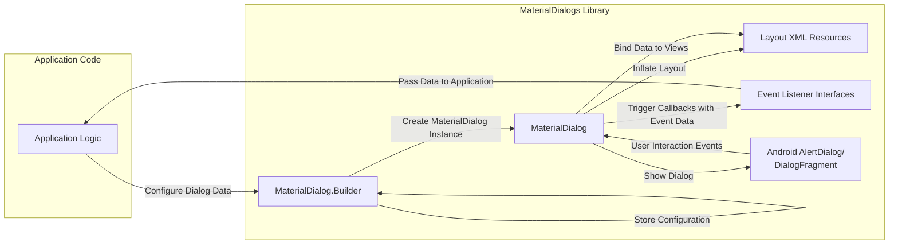
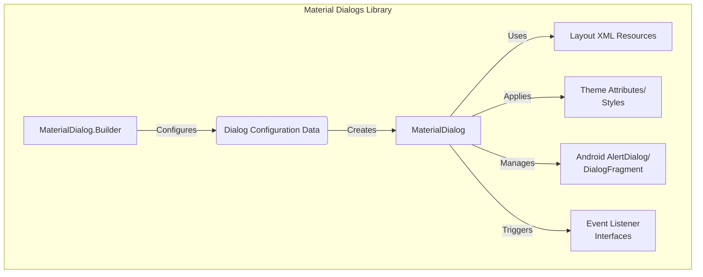
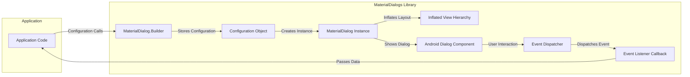

# Project Design Document: Material Dialogs Library

**Version:** 1.1
**Date:** October 26, 2023
**Author:** Gemini (AI Language Model)

## 1. Introduction

This document provides an enhanced design overview of the Material Dialogs library for Android, located at [https://github.com/afollestad/material-dialogs](https://github.com/afollestad/material-dialogs). This document aims to provide a more detailed understanding of the library's architecture, component interactions, and data flow to facilitate comprehensive threat modeling.

## 2. Goals and Objectives

The primary goal of the Material Dialogs library is to offer Android developers a robust, flexible, and aesthetically pleasing way to present dialogs within their applications, adhering closely to Material Design guidelines. Key objectives include:

*   Providing a declarative and intuitive API for constructing diverse dialog types.
*   Enabling extensive customization of dialog appearance, behavior, and content.
*   Simplifying the management of user interactions and responses within dialogs.
*   Maintaining broad compatibility across various Android API levels.
*   Ensuring the library remains performant and has a minimal impact on application size.

## 3. Architecture Overview

The library employs a builder pattern as its primary mechanism for dialog creation, allowing developers to fluently chain method calls to configure dialog properties. The core architectural elements can be categorized as follows:

*   **Core Builders:**  Classes like `MaterialDialog.Builder` serve as the central point for initiating dialog creation. They encapsulate configuration settings and orchestrate the dialog instantiation process.
*   **Specialized Dialog Builders:**  For specific dialog types (e.g., input, list, custom), specialized builder extensions or methods within the core builder provide type-specific configuration options.
*   **Dialog Instances:** The `MaterialDialog` class represents the actual dialog object, holding the configured state and managing its lifecycle.
*   **Layout Definitions:** XML layout files define the visual structure for different dialog variations, including standard elements like titles, content areas, buttons, and input fields.
*   **Theming and Styling Infrastructure:**  The library provides mechanisms for applying themes and styles to dialogs, allowing for consistent visual integration with the host application.
*   **Event Handling Mechanisms:** Interfaces and callback functions enable developers to handle user interactions within the dialogs, such as button presses, list item selections, and text input.
*   **Abstraction over Android Dialog Components:** The library internally leverages standard Android components like `AlertDialog` and `DialogFragment`, providing a higher-level, more consistent API.

## 4. Detailed Design

### 4.1. In-Depth Look at Dialog Creation

The process of creating and displaying a dialog typically follows these steps:

1. **Initiating the Builder:** The developer begins by instantiating `MaterialDialog.Builder`, providing the necessary `Context`.
2. **Applying Configuration Options:**  The developer then utilizes the builder's methods to set various dialog attributes. Examples include:
    *   Setting the dialog title using `title()`.
    *   Defining the main message content with `content()`.
    *   Adding action buttons (positive, negative, neutral) using `positiveText()`, `negativeText()`, and `neutralText()`, along with corresponding click listeners.
    *   Specifying the dialog type, such as an input dialog using `input()`, or a list dialog using `items()`.
    *   Providing data for list dialogs (e.g., an array of strings) via methods like `items()`.
    *   Setting input field properties (hint, input type, pre-filled text) for input dialogs using methods within the `input()` configuration block.
    *   Applying custom themes or styles using `theme()` or style attributes.
    *   Inflating and setting custom views using `customView()`.
3. **Building the `MaterialDialog` Instance:** The `build()` method is invoked on the builder, which constructs and configures the `MaterialDialog` object based on the provided settings.
4. **Displaying the Dialog:** The `show()` method of the `MaterialDialog` instance is called to make the dialog visible to the user. This typically involves using a `DialogFragment` or directly managing the `AlertDialog`.

### 4.2. Key Components and their Responsibilities

*   **`MaterialDialog.Builder`:**
    *   Serves as the primary interface for configuring dialog properties.
    *   Manages the internal state representing the dialog's configuration.
    *   Provides a fluent API through method chaining.
    *   Performs preliminary validation of input parameters.
    *   Orchestrates the creation of the `MaterialDialog` instance.
*   **`MaterialDialog`:**
    *   Extends or internally utilizes Android's `AlertDialog` or `DialogFragment`.
    *   Holds the final, configured state of the dialog.
    *   Manages the dialog's lifecycle (creation, showing, dismissal).
    *   Handles user interactions with dialog elements (buttons, list items, input fields).
    *   Invokes registered event listeners based on user actions.
    *   Updates the UI of the dialog based on configuration and user input.
*   **Specialized Builder Components (e.g., within `input()` or `listItems()`):**
    *   Provide type-specific configuration options and logic.
    *   Encapsulate the details of setting up input fields, list views, etc.
    *   Often use internal data structures to manage type-specific data.
*   **Layout XML Resources (e.g., `md_dialog_basic.xml`, `md_dialog_input.xml`, `md_dialog_list.xml`):**
    *   Define the visual structure and layout of different dialog types and variations.
    *   Contain standard Android UI elements like `TextView`, `Button`, `EditText`, `RecyclerView`, etc.
    *   Utilize theming attributes for consistent styling.
*   **Theme Attributes and Style Definitions:**
    *   Allow developers to customize the visual appearance of dialogs (colors, fonts, spacing, etc.).
    *   Can be applied globally or to specific dialog instances.
    *   Leverage Android's theming system.
*   **Event Listener Interfaces (e.g., `OnClickListener`, `InputCallback`, `ListCallback`):**
    *   Define contracts for handling specific user interactions within the dialog.
    *   Implemented by the application developer to respond to dialog events.
    *   Provide data related to the interaction (e.g., the text entered, the index of the selected list item).

### 4.3. Detailed Data Flow

The flow of data within the library can be described in more detail as follows:

1. **Configuration Data Input:** The application developer provides configuration data (strings for title and message, button labels, list of items, input hints, etc.) to the `MaterialDialog.Builder` instance through its various methods.
2. **Builder State Management:** The `MaterialDialog.Builder` internally stores this configuration data, often in member variables or internal data structures.
3. **`MaterialDialog` Instantiation and Configuration:** When the `build()` method is called, the builder uses the stored configuration data to create a new `MaterialDialog` instance. This involves setting internal properties of the `MaterialDialog` object.
4. **Layout Inflation and View Creation:** The `MaterialDialog` then inflates the appropriate layout XML resource based on the dialog type and configuration. This creates the visual hierarchy of the dialog.
5. **Data Binding to Views:** The configuration data is then bound to the UI elements within the inflated layout. For example, the title string is set to the `TextView` for the title, button labels are set to the `Button` elements, and list data is used to populate a `RecyclerView` or `ListView`.
6. **Dialog Display via Android Components:** The `MaterialDialog` uses Android's `AlertDialog` or `DialogFragment` to manage the actual display of the dialog on the screen.
7. **User Interaction and Event Capture:** When the user interacts with the dialog (e.g., clicks a button, types in an input field, selects a list item), the underlying Android UI components capture these events.
8. **Event Handling within `MaterialDialog`:** The `MaterialDialog` receives these events from the Android components.
9. **Callback Invocation:** Based on the captured event, the `MaterialDialog` invokes the appropriate event listener interface that was previously registered by the application developer. This involves passing relevant data about the interaction back to the application (e.g., the button that was clicked, the text entered in an input field, the selected item from a list).

## 5. Security Considerations

While the Material Dialogs library primarily deals with UI presentation, several security considerations are relevant for threat modeling:

*   **Input Validation in Input Dialogs:** While the library might offer basic input type settings, it's crucial for the application developer to implement robust validation of user input received through input dialogs. Failure to do so can lead to vulnerabilities like injection attacks (e.g., SQL injection if the input is used in database queries) or cross-site scripting (XSS) if the input is displayed in a web view.
*   **Handling Sensitive Data in Callbacks:** If sensitive information is displayed in the dialog or returned through event listener callbacks, developers must ensure this data is handled securely within their application code. This includes proper storage, transmission, and display practices to prevent unauthorized access or disclosure.
*   **Security of Custom Views:** If the library is used to display custom views within dialogs, the security of those custom views becomes the responsibility of the application developer. Vulnerabilities within the custom view could be exploited.
*   **Potential for UI Redressing/Clickjacking:** While less likely with simple dialogs, if complex custom layouts are used, there's a theoretical risk of UI redressing or clickjacking attacks if the dialog's presentation is manipulated.
*   **Dependency Management:**  It's important to keep the Material Dialogs library and its dependencies up-to-date to patch any known security vulnerabilities in the library itself or its underlying components.
*   **Locale Handling:** Ensure proper handling of locales and potentially sensitive information within dialog content to prevent information leakage due to incorrect localization.
*   **Permissions Context:** While the library itself doesn't directly request permissions, the context in which it's used (the hosting Activity or Application) might have permissions that could be relevant in a broader security assessment.

## 6. Deployment and Integration

Integrating the Material Dialogs library into an Android project is typically done by adding a dependency declaration to the project's `build.gradle` file. No specific deployment procedures beyond the standard Android application build process are required.

## 7. Diagrams

### 7.1. Component Diagram (Detailed)

### 7.2. Data Flow Diagram (More Granular)

## 8. Future Considerations

Potential future enhancements to the Material Dialogs library could include:

*   Support for more advanced dialog patterns and UI elements.
*   Improved accessibility features and compliance.
*   More granular control over dialog animations and transitions.
*   Built-in support for common data binding patterns.
*   Further refinements to the API for increased clarity and ease of use.
*   Ongoing maintenance and security updates to address emerging threats.

This enhanced design document provides a more in-depth understanding of the Material Dialogs library's internal workings, offering a stronger foundation for conducting thorough threat modeling and identifying potential security risks associated with its use.