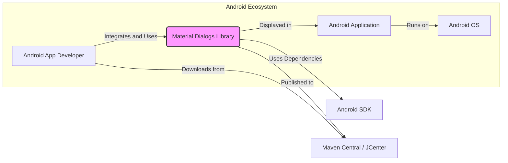
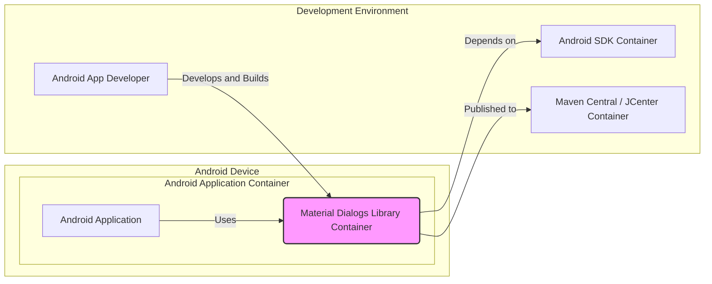
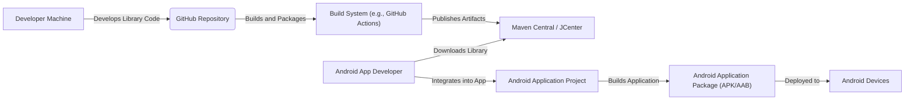

# BUSINESS POSTURE

The Material Dialogs library for Android aims to provide developers with a simple, flexible, and aesthetically pleasing way to create dialogs in their Android applications.

- Business Priorities and Goals:
  - Enhance User Experience: Provide visually appealing and user-friendly dialogs to improve the overall user experience of Android applications.
  - Developer Productivity: Offer a well-documented and easy-to-use library that simplifies dialog creation, saving developers time and effort.
  - Code Consistency: Promote consistent dialog design across different Android applications using the library.
  - Open Source Community Contribution: Foster a collaborative open-source project that benefits the Android developer community.

- Business Risks:
  - Security Vulnerabilities: If the library contains security vulnerabilities, applications using it may become vulnerable, potentially leading to data breaches or other security incidents.
  - Library Instability: Bugs or lack of maintenance in the library could lead to application crashes or unexpected behavior, negatively impacting user experience and developer trust.
  - Dependency Issues: Compatibility problems with other libraries or Android versions could hinder adoption and create integration challenges for developers.
  - License Compliance: Incorrect licensing or license violations could lead to legal issues for developers using the library.

# SECURITY POSTURE

- Security Controls:
  - security control: Open Source Code - The source code is publicly available on GitHub, allowing for community review and scrutiny. Implemented: GitHub Repository.
  - security control: Issue Tracking - GitHub Issues are used to report bugs and feature requests, including potential security vulnerabilities. Implemented: GitHub Repository.
  - security control: Pull Requests - Code changes are submitted via pull requests, enabling code review and collaboration. Implemented: GitHub Repository.

- Accepted Risks:
  - accepted risk: Reliance on Community Security Review - Security depends on the vigilance of the open-source community to identify and report vulnerabilities.
  - accepted risk: Potential for Undiscovered Vulnerabilities - Like any software, there is a risk of undiscovered security vulnerabilities in the library.
  - accepted risk: Third-Party Dependencies - The library may depend on other third-party libraries, which could introduce their own vulnerabilities.

- Recommended Security Controls:
  - security control: Automated Static Analysis Security Testing (SAST) - Integrate SAST tools into the development workflow to automatically scan the codebase for potential security vulnerabilities.
  - security control: Dependency Scanning - Implement dependency scanning to identify known vulnerabilities in third-party libraries used by Material Dialogs.
  - security control: Regular Security Audits - Conduct periodic security audits of the codebase by security experts to proactively identify and address potential security weaknesses.
  - security control: Secure Development Practices Documentation - Document secure coding practices and guidelines for contributors to follow.

- Security Requirements:
  - Authentication: Not directly applicable to a UI library itself. However, developer authentication is required for contributing to the project via GitHub (security control: GitHub Authentication).
  - Authorization: Not directly applicable to the library's runtime behavior. Authorization is relevant for code contributions and repository management on GitHub (security control: GitHub Authorization).
  - Input Validation: The library should handle user-provided input to dialogs safely to prevent potential injection vulnerabilities (e.g., in custom view handling or string formatting). Security requirement: Implement robust input validation for all user-provided data processed by the library.
  - Cryptography:  Not a primary requirement for a UI library. Cryptography might be relevant if the library were to handle sensitive data display or input, but in its current scope, it's less critical. Security requirement: Evaluate the need for cryptography if future features involve handling sensitive data.

# DESIGN

## C4 CONTEXT

- Context Diagram Elements:
  - Element:
    - Name: Android App Developer
    - Type: Person
    - Description: Developers who build Android applications and want to use Material Dialogs to create dialogs in their apps.
    - Responsibilities: Integrate the Material Dialogs library into their Android projects, use the library's API to create and display dialogs, and ensure proper handling of dialog interactions within their applications.
    - Security controls: Responsible for securely using the library within their applications, including handling any data displayed or collected by dialogs in a secure manner.

  - Element:
    - Name: Material Dialogs Library
    - Type: Software System
    - Description: An open-source Android library that provides a simple and customizable way to create dialogs in Android applications.
    - Responsibilities: Provide a well-designed and easy-to-use API for creating various types of dialogs, ensure the library is robust and performs well, and address bug fixes and security vulnerabilities.
    - Security controls: Implement secure coding practices, address reported security vulnerabilities, and potentially integrate automated security testing tools.

  - Element:
    - Name: Android Application
    - Type: Software System
    - Description: An Android application developed by Android App Developers that incorporates the Material Dialogs library.
    - Responsibilities: Utilize the Material Dialogs library to enhance user interface, handle user interactions with dialogs, and manage application logic.
    - Security controls: Application developers are responsible for the overall security of their applications, including the secure usage of libraries like Material Dialogs and handling of user data.

  - Element:
    - Name: Android OS
    - Type: Software System
    - Description: The Android Operating System, which provides the runtime environment for Android applications.
    - Responsibilities: Provide a secure and stable platform for running Android applications, manage system resources, and enforce security policies.
    - Security controls: Android OS implements various security controls, including permissions, sandboxing, and system updates, to protect applications and user data.

  - Element:
    - Name: Android SDK
    - Type: Software System
    - Description: The Android Software Development Kit, which provides tools and libraries necessary for developing Android applications, including core Android libraries that Material Dialogs might depend on.
    - Responsibilities: Provide stable and secure APIs for Android development, including necessary components for UI development and library compatibility.
    - Security controls: Android SDK is maintained by Google and undergoes security reviews and updates.

  - Element:
    - Name: Maven Central / JCenter
    - Type: Software System
    - Description: Package repositories where the Material Dialogs library is published and distributed for developers to download and include in their projects.
    - Responsibilities: Host and distribute the Material Dialogs library, ensure the integrity and availability of the library packages.
    - Security controls: Package repositories implement security measures to protect against malware and ensure the integrity of hosted packages.

## C4 CONTAINER

- Container Diagram Elements:
  - Element:
    - Name: Material Dialogs Library Container
    - Type: Library
    - Description: The compiled and packaged Material Dialogs library, distributed as an AAR or JAR file. It contains the code, resources, and assets necessary to create and display dialogs in Android applications.
    - Responsibilities: Provide the core functionality of the Material Dialogs library, including dialog creation, customization, and display logic.
    - Security controls: Code within the library container should adhere to secure coding practices. Security vulnerabilities in this container could directly impact applications using it.

  - Element:
    - Name: Android Application Container
    - Type: Application
    - Description: The container representing an Android application that integrates and uses the Material Dialogs library.
    - Responsibilities: Host and run the Android application, utilize the Material Dialogs library to create dialogs, and manage the application's overall functionality and user interface.
    - Security controls: Application container is responsible for application-level security controls, including secure data handling, user authentication and authorization (if applicable), and secure integration with libraries like Material Dialogs.

  - Element:
    - Name: Android SDK Container
    - Type: SDK
    - Description: The Android Software Development Kit container, providing necessary APIs and tools for building Android applications and libraries.
    - Responsibilities: Provide the development environment and necessary libraries for building Android software, including components that Material Dialogs depends on.
    - Security controls: Security of the Android SDK container is managed by Google. Developers should use updated and trusted versions of the SDK.

  - Element:
    - Name: Maven Central / JCenter Container
    - Type: Repository
    - Description: The container representing the Maven Central and JCenter repositories, which host and distribute Java and Android libraries, including Material Dialogs.
    - Responsibilities: Store and distribute the Material Dialogs library package, ensure its availability and integrity.
    - Security controls: Repository containers implement security measures to protect against unauthorized access and malware injection.

## DEPLOYMENT

For Material Dialogs, the deployment is primarily about how the library is made available to and used by Android application developers.

- Deployment Architecture: Library Distribution and Integration

- Deployment Diagram Elements:
  - Element:
    - Name: Developer Machine
    - Type: Environment
    - Description: The local development environment used by library developers to write, test, and contribute code to the Material Dialogs project.
    - Responsibilities: Code development, local testing, and contribution to the project repository.
    - Security controls: Developer machine security is the responsibility of the developer. Secure coding practices and secure development environment setup are important.

  - Element:
    - Name: GitHub Repository
    - Type: Code Repository
    - Description: The central repository hosted on GitHub where the Material Dialogs source code is stored and managed.
    - Responsibilities: Version control, code collaboration, issue tracking, and pull request management.
    - Security controls: GitHub provides access control, authentication, and audit logging. Branch protection rules can be configured to enforce code review and prevent direct commits to main branches.

  - Element:
    - Name: Build System (e.g., GitHub Actions)
    - Type: Automation System
    - Description: An automated build system, such as GitHub Actions, used to compile, test, and package the Material Dialogs library.
    - Responsibilities: Automate the build process, run tests, generate library artifacts (AAR/JAR), and potentially perform security checks during the build.
    - Security controls: Secure configuration of the build pipeline, access control to build configurations, and secure storage of build artifacts.

  - Element:
    - Name: Maven Central / JCenter
    - Type: Artifact Repository
    - Description: Public repositories where the compiled Material Dialogs library is published for distribution to Android application developers.
    - Responsibilities: Host and distribute the library artifacts, ensure availability and integrity of the packages.
    - Security controls: Repository providers implement security measures to protect against unauthorized uploads and ensure package integrity.

  - Element:
    - Name: Android App Developer
    - Type: Person/Environment
    - Description: Developers who use development environments (like Android Studio) to build Android applications and integrate the Material Dialogs library.
    - Responsibilities: Download and integrate the library into their projects, use the library API, and build their applications.
    - Security controls: Developers are responsible for the security of their development environments and for securely integrating and using third-party libraries.

  - Element:
    - Name: Android Application Project
    - Type: Software Project
    - Description: The Android application project where the Material Dialogs library is integrated as a dependency.
    - Responsibilities: Utilize the library to create dialogs within the application, manage application logic, and build the final application package.
    - Security controls: Application projects should follow secure development practices and ensure secure usage of all dependencies.

  - Element:
    - Name: Android Application Package (APK/AAB)
    - Type: Artifact
    - Description: The final packaged Android application (APK or AAB file) that includes the Material Dialogs library code.
    - Responsibilities: Contain the complete application code, resources, and libraries ready for deployment to Android devices.
    - Security controls: Application packages should be signed and potentially undergo security scanning before distribution.

  - Element:
    - Name: Android Devices
    - Type: Environment
    - Description: End-user Android devices where Android applications using Material Dialogs are installed and run.
    - Responsibilities: Execute Android applications, display dialogs created by Material Dialogs, and provide the user interface.
    - Security controls: Android devices rely on the Android OS for security, including application sandboxing and permission management.

## BUILD

```mermaid
flowchart LR
    A["Developer"] -- "Code Changes" --> B["GitHub Repository"]
    B -- "Push/Pull Request" --> C["GitHub Actions Workflow"]
    C -- "Checkout Code" --> D["Build Environment (GitHub Actions Runner)"]
    D -- "Compile & Test" --> E["Build Artifacts (AAR/JAR)"]
    E -- "Security Checks (SAST, Dependency Scan - Recommended)" --> F["Validated Artifacts"]
    F -- "Publish Artifacts" --> G["Maven Central / JCenter"]
```

- Build Process Elements:
  - Element:
    - Name: Developer
    - Type: Person
    - Description: A software developer contributing to the Material Dialogs project.
    - Responsibilities: Write code, fix bugs, implement features, and submit code changes via pull requests.
    - Security controls: Follow secure coding practices, use secure development environments, and authenticate to GitHub securely.

  - Element:
    - Name: GitHub Repository
    - Type: Code Repository
    - Description: The central Git repository hosted on GitHub, storing the source code of Material Dialogs.
    - Responsibilities: Version control, manage code changes, and trigger build processes.
    - Security controls: Access control, branch protection, and audit logging provided by GitHub.

  - Element:
    - Name: GitHub Actions Workflow
    - Type: CI/CD System
    - Description: Automated workflows defined in GitHub Actions to build, test, and publish the library.
    - Responsibilities: Automate the build process, run tests, perform security checks (if configured), and publish artifacts.
    - Security controls: Secure workflow definitions, access control to workflow configurations, and secure secrets management for publishing credentials.

  - Element:
    - Name: Build Environment (GitHub Actions Runner)
    - Type: Execution Environment
    - Description: The environment where the GitHub Actions workflow executes, typically a virtual machine or container provided by GitHub.
    - Responsibilities: Execute build steps defined in the workflow, compile code, run tests, and generate build artifacts.
    - Security controls: Security of the runner environment is managed by GitHub. Secure build practices within the workflow are the responsibility of the project.

  - Element:
    - Name: Build Artifacts (AAR/JAR)
    - Type: Software Artifact
    - Description: The compiled and packaged library files (AAR for Android, JAR for Java) produced by the build process.
    - Responsibilities: Contain the compiled code and resources of the Material Dialogs library, ready for distribution.
    - Security controls: Artifacts should be generated from trusted source code and build processes. Integrity checks (e.g., checksums) can be used to verify artifacts.

  - Element:
    - Name: Validated Artifacts
    - Type: Software Artifact
    - Description: Build artifacts that have undergone security checks, such as SAST and dependency scanning (recommended).
    - Responsibilities: Represent artifacts that have been assessed for potential security vulnerabilities before publication.
    - Security controls: Security checks performed during the build process, such as SAST and dependency scanning.

  - Element:
    - Name: Maven Central / JCenter
    - Type: Artifact Repository
    - Description: Public repositories where validated build artifacts are published for distribution.
    - Responsibilities: Host and distribute the validated library artifacts, ensuring availability and integrity.
    - Security controls: Repository security controls and secure publishing processes.

# RISK ASSESSMENT

- Critical Business Processes:
  - Providing a functional, reliable, and user-friendly UI library for Android dialogs to enhance developer productivity and application user experience.
  - Maintaining the integrity and availability of the Material Dialogs library for the Android developer community.

- Data to Protect and Sensitivity:
  - Source Code: Publicly available, but integrity and availability are crucial for the project's continuity and trust. Sensitivity: Public, Integrity and Availability: High.
  - Build Artifacts (AAR/JAR): Publicly distributed, but integrity is critical to prevent supply chain attacks. Sensitivity: Public, Integrity: High.
  - Developer Credentials (for publishing): Sensitive and confidential. Sensitivity: Confidential, Integrity and Availability: High.

# QUESTIONS & ASSUMPTIONS

- Questions:
  - Are there any specific security compliance requirements that the Material Dialogs library needs to adhere to (e.g., OWASP, specific industry standards)?
  - Are there any plans to introduce features that might handle sensitive user data in dialogs in the future?
  - What is the current process for handling reported security vulnerabilities in the library?
  - Are there any existing automated security checks in the current build process?

- Assumptions:
  - The primary goal of the Material Dialogs library is to provide UI enhancements and improve developer experience, not to handle or process sensitive user data directly.
  - The library is intended for use in a wide range of Android applications with varying security requirements.
  - Security is considered important for the project, and there is a willingness to improve security posture.
  - The project relies on the open-source community for security reviews and vulnerability reporting.