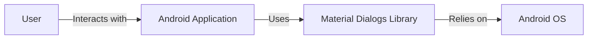
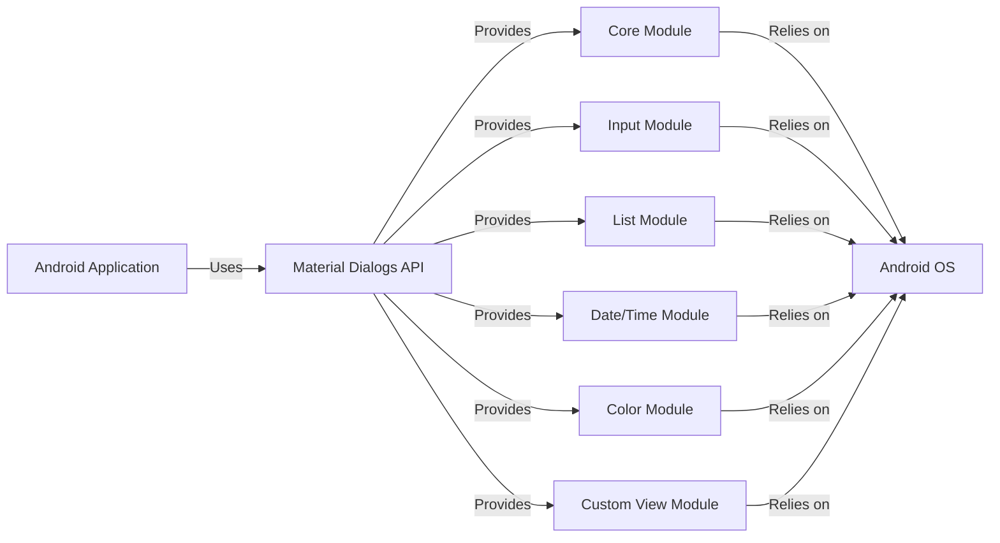
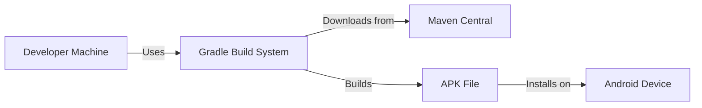
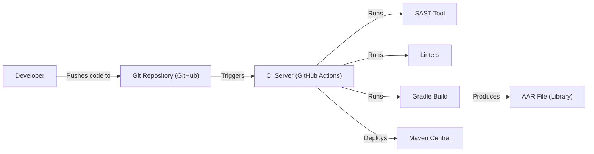

# BUSINESS POSTURE

Business Priorities and Goals:

*   Provide a user-friendly and customizable dialog library for Android applications.
*   Maintain backward compatibility with older Android versions.
*   Offer a wide range of dialog types and features to cater to diverse developer needs.
*   Ensure the library is easy to integrate and use.
*   Maintain a high level of code quality and stability.
*   Foster a community around the library for support and contributions.

Most Important Business Risks:

*   Security vulnerabilities in the library could expose applications using it to attacks.
*   Compatibility issues with different Android versions or devices could limit adoption.
*   Lack of features or poor usability could lead developers to choose alternative libraries.
*   Bugs or performance issues could negatively impact the user experience of applications using the library.
*   Failure to keep up with Android platform updates could render the library obsolete.

# SECURITY POSTURE

Existing Security Controls:

*   security control: The library's code is publicly available on GitHub, allowing for community review and scrutiny. (Described in: GitHub repository)
*   security control: The library uses standard Android UI components and APIs, reducing the risk of introducing custom vulnerabilities. (Implemented in: Library source code)
*   security control: The library is focused on UI presentation and does not handle sensitive data directly. (Implemented in: Library design)

Accepted Risks:

*   accepted risk: The library relies on the underlying Android platform for security features like sandboxing and permission management.
*   accepted risk: The library does not implement specific input validation or sanitization, as it primarily deals with displaying pre-existing data.
*   accepted risk: The library does not include built-in encryption or data protection mechanisms, as it is not designed for handling sensitive data.

Recommended Security Controls:

*   security control: Implement static code analysis (SAST) during the build process to identify potential vulnerabilities.
*   security control: Conduct regular security reviews of the codebase, focusing on areas that handle user input or interact with external resources.
*   security control: Provide clear documentation on secure usage of the library, including best practices for handling user input and data.

Security Requirements:

*   Authentication: Not applicable, as the library does not handle user authentication.
*   Authorization: Not applicable, as the library does not manage user permissions or access control.
*   Input Validation: While the library itself doesn't directly handle user input, it's crucial that applications using the library implement proper input validation and sanitization to prevent vulnerabilities like injection attacks.
*   Cryptography: Not applicable, as the library does not handle sensitive data requiring encryption.

# DESIGN

## C4 CONTEXT

Context Diagram Element List:

*   Element:
    *   Name: User
    *   Type: Person
    *   Description: The end-user interacting with the Android application.
    *   Responsibilities: Interacting with the application's UI, including dialogs.
    *   Security controls: None (relies on application and OS security).

*   Element:
    *   Name: Material Dialogs Library
    *   Type: Software System
    *   Description: The library providing customizable dialogs for Android applications.
    *   Responsibilities: Providing a consistent and easy-to-use API for creating various types of dialogs.
    *   Security controls: Code review, reliance on standard Android components.

*   Element:
    *   Name: Android Application
    *   Type: Software System
    *   Description: The application utilizing the Material Dialogs library.
    *   Responsibilities: Implementing application logic, handling user input, and displaying dialogs using the library.
    *   Security controls: Application-specific security measures, input validation, secure data handling.

*   Element:
    *   Name: Android OS
    *   Type: Software System
    *   Description: The underlying Android operating system.
    *   Responsibilities: Providing the platform and core services for running Android applications.
    *   Security controls: Android OS security features (sandboxing, permissions, etc.).

## C4 CONTAINER

Container Diagram Element List:

*   Element:
    *   Name: Android Application
    *   Type: Software System
    *   Description: The application utilizing the Material Dialogs library.
    *   Responsibilities: Implementing application logic, handling user input, and displaying dialogs.
    *   Security controls: Application-specific security measures.

*   Element:
    *   Name: Material Dialogs API
    *   Type: API
    *   Description: The public API of the Material Dialogs library.
    *   Responsibilities: Providing a consistent interface for developers to create and manage dialogs.
    *   Security controls: API design best practices.

*   Element:
    *   Name: Core Module
    *   Type: Module
    *   Description: Contains the core functionality for creating and displaying basic dialogs.
    *   Responsibilities: Handling dialog lifecycle, basic UI elements, and event handling.
    *   Security controls: Code review, reliance on standard Android components.

*   Element:
    *   Name: Input Module
    *   Type: Module
    *   Description: Provides functionality for creating dialogs with input fields.
    *   Responsibilities: Handling text input, validation, and error display.
    *   Security controls: Input validation (in the application using the library).

*   Element:
    *   Name: List Module
    *   Type: Module
    *   Description: Provides functionality for creating dialogs with lists of items.
    *   Responsibilities: Handling list display, item selection, and event handling.
    *   Security controls: Code review.

*   Element:
    *   Name: Date/Time Module
    *   Type: Module
    *   Description: Provides functionality for creating date and time picker dialogs.
    *   Responsibilities: Handling date/time selection and formatting.
    *   Security controls: Code review.

*   Element:
    *   Name: Color Module
    *   Type: Module
    *   Description: Provides functionality for creating color picker dialogs.
    *   Responsibilities: Handling color selection and display.
    *   Security controls: Code review.

*   Element:
    *   Name: Custom View Module
    *   Type: Module
    *   Description: Allows developers to use custom views within dialogs.
    *   Responsibilities: Integrating custom views into the dialog layout.
    *   Security controls: Code review, reliance on application-provided custom views.

*   Element:
    *   Name: Android OS
    *   Type: Software System
    *   Description: The underlying Android operating system.
    *   Responsibilities: Providing the platform and core services.
    *   Security controls: Android OS security features.

## DEPLOYMENT

Possible Deployment Solutions:

1.  Direct Integration: Developers manually download the library's source code or AAR file and include it in their Android project.
2.  Dependency Management (Recommended): Developers use a dependency management system like Gradle or Maven to automatically download and integrate the library from a repository (e.g., Maven Central, JCenter).
3.  Local Repository: Developers host the library's AAR file in a local repository within their organization's network.

Chosen Solution (Dependency Management with Gradle):

Deployment Diagram Element List:

*   Element:
    *   Name: Developer Machine
    *   Type: Workstation
    *   Description: The developer's computer where the Android application is developed.
    *   Responsibilities: Writing code, building the application, and managing dependencies.
    *   Security controls: Developer machine security best practices.

*   Element:
    *   Name: Gradle Build System
    *   Type: Software System
    *   Description: The build system used for Android applications.
    *   Responsibilities: Managing dependencies, compiling code, and packaging the application.
    *   Security controls: Secure configuration of Gradle, dependency verification.

*   Element:
    *   Name: Maven Central
    *   Type: Repository
    *   Description: A public repository hosting open-source libraries and dependencies.
    *   Responsibilities: Providing a reliable source for downloading the Material Dialogs library.
    *   Security controls: Maven Central security measures (e.g., checksum verification).

*   Element:
    *   Name: Android Device
    *   Type: Device
    *   Description: The physical or emulated Android device where the application is deployed.
    *   Responsibilities: Running the Android application.
    *   Security controls: Android OS security features.

*   Element:
    *   Name: APK File
    *   Type: File
    *   Description: The Android application package file.
    *   Responsibilities: Containing the compiled code, resources, and manifest of the application.
    *   Security controls: Code signing, APK verification.

## BUILD

Build Process Description:

1.  Developer: The developer writes code and pushes changes to the Git repository hosted on GitHub.
2.  Git Repository (GitHub): The repository stores the source code and triggers the CI/CD pipeline upon changes.
3.  CI Server (GitHub Actions): GitHub Actions is used as the CI/CD platform. It automates the build, test, and deployment process.
4.  SAST Tool: A Static Application Security Testing (SAST) tool (e.g., FindBugs, PMD, Checkstyle) is integrated into the CI pipeline to analyze the source code for potential security vulnerabilities.
5.  Linters: Linters (e.g., Android Lint) are used to enforce code style and identify potential issues.
6.  Gradle Build: The Gradle build system compiles the code, runs tests, and generates the AAR (Android Archive) file, which is the library's distributable package.
7.  AAR File (Library): The AAR file contains the compiled code, resources, and manifest of the library.
8.  Maven Central: The CI pipeline is configured to automatically deploy the AAR file to Maven Central, making it available for developers to use as a dependency.

Security Controls in Build Process:

*   security control: SAST tool integration for vulnerability detection.
*   security control: Linters for code quality and style enforcement.
*   security control: Automated build process to ensure consistency and reduce manual errors.
*   security control: Dependency management (Gradle) with checksum verification to prevent the use of compromised dependencies.
*   security control: Deployment to a trusted repository (Maven Central) with its own security measures.

# RISK ASSESSMENT

Critical Business Processes to Protect:

*   Application Functionality: Ensure that applications using the library function as intended without crashes or unexpected behavior caused by the library.
*   User Experience: Maintain a positive user experience by providing a visually appealing and responsive dialog interface.
*   Developer Productivity: Enable developers to easily integrate and use the library, saving them time and effort.

Data to Protect and Sensitivity:

*   The library itself does not handle sensitive data directly. It primarily deals with displaying pre-existing data provided by the application. Therefore, the sensitivity of the data depends on the application using the library. The application is responsible for protecting any sensitive data it displays through the dialogs.

# QUESTIONS & ASSUMPTIONS

Questions:

*   Are there any specific compliance requirements (e.g., GDPR, HIPAA) that the library needs to consider, even if it doesn't directly handle sensitive data?
*   What is the expected level of support and maintenance for the library?
*   Are there any plans to add features that might involve handling user input or data, which would require additional security considerations?

Assumptions:

*   BUSINESS POSTURE: The primary goal is to provide a functional and user-friendly dialog library, with security being a secondary but important consideration.
*   SECURITY POSTURE: The library relies on the underlying Android platform and the application using it for most security aspects.
*   DESIGN: The library's design is relatively simple and focused on UI presentation.
*   The library is used by applications that implement their own security measures for handling sensitive data.
*   Developers using the library are responsible for following secure coding practices and implementing appropriate input validation in their applications.
*   The Android OS provides a secure environment for running applications.