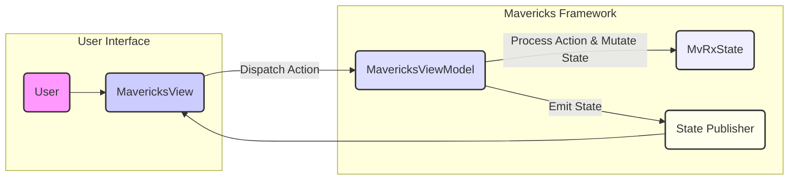
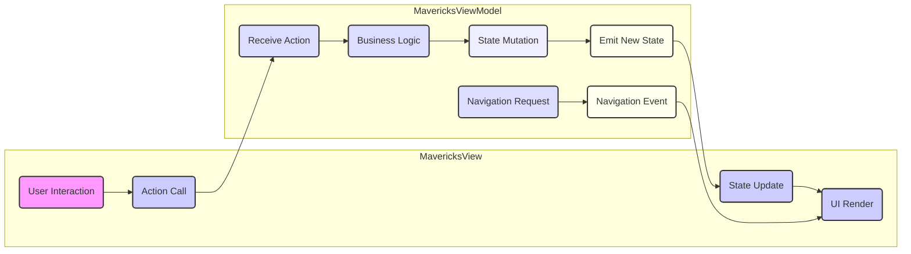

# Project Design Document: Mavericks - Declarative UI with MVVM

**Version:** 1.1
**Date:** October 26, 2023
**Author:** AI Software Architect

## 1. Introduction

This document provides an enhanced architectural design of the Mavericks library, a Kotlin Multiplatform library developed by Airbnb for building declarative user interfaces (UI) following the Model-View-ViewModel (MVVM) pattern. This iteration builds upon the previous version, offering more granular details about the library's components, data flow, and key functionalities. This document serves as a comprehensive resource for understanding the library's design, which is crucial for subsequent threat modeling activities and ongoing development.

## 2. Goals and Objectives

The primary goals of this design document are:

*   To provide a detailed and unambiguous articulation of the architecture and components of the Mavericks library.
*   To clearly describe the data flow and interactions between the various elements within the library.
*   To identify and explain the purpose of key functionalities and their underlying mechanisms.
*   To establish a solid foundation for understanding potential attack surfaces and vulnerabilities inherent in the library's design.
*   To serve as a definitive reference point for future development efforts, security audits, and architectural discussions.

## 3. Architectural Overview

Mavericks is architected as a robust framework designed to streamline the development of UIs, particularly in complex applications requiring sophisticated state management. It leverages the power of Kotlin's language features, including coroutines, sealed classes, and extension functions, to offer a type-safe and efficient approach to managing application state and driving UI updates. The core architectural principles emphasize unidirectional data flow, immutable state, and reactive UI rendering.

## 4. Key Components

*   **MvRxState:**
    *   Definition: Represents the immutable state of a specific screen or a distinct part of the user interface.
    *   Implementation: Typically implemented as a Kotlin `data class`, ensuring immutability and providing built-in methods for copying and comparison.
    *   Role: Serves as the single source of truth for the UI, with all UI changes being a direct reflection of modifications to this state.
*   **MavericksViewModel:**
    *   Definition: Responsible for managing and holding the `MvRxState` for a particular view or screen.
    *   Responsibilities: Encapsulates business logic, handles user interactions originating from the `MavericksView`, and orchestrates state updates.
    *   Asynchronous Operations: Leverages Kotlin Coroutines to perform asynchronous tasks such as network requests or database operations, updating the state upon completion.
    *   State Updates: Provides mechanisms (e.g., `setState`, `withState`) to safely and immutably update the `MvRxState`.
*   **MavericksView:**
    *   Definition: Represents the UI component responsible for rendering the user interface (e.g., an Android Activity, Fragment, or a Jetpack Compose Composable).
    *   State Observation: Observes changes in the `MvRxState` held by its associated `MavericksViewModel` using reactive streams or similar mechanisms.
    *   UI Rendering: Renders the UI based on the current values within the observed `MvRxState`.
    *   Action Dispatch: Facilitates user interactions by dispatching actions (invoking functions) on the associated `MavericksViewModel`.
*   **Mavericks Actions:**
    *   Definition: Represent specific events or user interactions that trigger state changes within the application.
    *   Implementation: Typically implemented as functions within the `MavericksViewModel`.
    *   Purpose: Serve as the primary way for the `MavericksView` to communicate user intents to the `MavericksViewModel`.
*   **Async:**
    *   Definition: A sealed class provided by Mavericks to represent the different lifecycle states of an asynchronous operation.
    *   States: Includes states like `Uninitialized`, `Loading`, `Success`, and `Fail`, each potentially holding associated data or error information.
    *   Usage: Simplifies the management of asynchronous data fetching and updates, allowing the UI to react appropriately to different stages of the operation.
*   **Navigation (using Mavericks Navigation):**
    *   Definition: An optional module within Mavericks that offers a type-safe and structured approach to handling screen navigation within an application.
    *   Features: Defines navigation actions, associated arguments, and provides mechanisms for triggering and handling navigation events.
*   **EventBus (Internal):**
    *   Definition: An internal mechanism used by Mavericks for specific internal communication and handling of side-effects that don't directly involve state updates.
    *   Scope: Primarily used for communication within the Mavericks framework itself.

## 5. Data Flow

The data flow within Mavericks adheres to a strict unidirectional pattern, ensuring predictability and simplifying debugging:

1. **User Interaction:** A user interacts with the `MavericksView`, triggering an event (e.g., a button click, a text input change).
2. **Action Dispatch:** The `MavericksView` responds to the user interaction by invoking a specific function (an Action) on its associated `MavericksViewModel`.
3. **ViewModel Processing:** The `MavericksViewModel` receives the dispatched action. This triggers the execution of business logic, which may involve data manipulation, API calls, or other operations.
4. **State Mutation:** Based on the processed action, the `MavericksViewModel` updates the `MvRxState`. This update is performed immutably, meaning a new instance of the `MvRxState` is created with the modified data.
5. **State Emission:** The `MavericksViewModel` emits the newly created `MvRxState`. This emission signals that the application state has changed.
6. **View Observation:** The `MavericksView` is actively observing the `MvRxState` emitted by its `MavericksViewModel`. Upon receiving the new state, it triggers a UI update.
7. **UI Rendering:** The `MavericksView` re-renders its UI components based on the data contained within the newly received `MvRxState`, reflecting the changes to the user.

## 6. Detailed Component Interaction

*   **ViewModel Initialization and Scoping:** When a `MavericksView` is created (e.g., an Activity starts), it either creates a new instance of its associated `MavericksViewModel` or retrieves an existing instance based on the defined scope (e.g., activity-scoped, fragment-scoped). This ensures the ViewModel persists across configuration changes.
*   **State Observation Mechanisms:** The `MavericksView` subscribes to state updates from the `MavericksViewModel` using various mechanisms provided by Mavericks, such as `subscribe()` for observing specific state properties or `collectAsState()` in Jetpack Compose for reactive state updates.
*   **Action Handling and Business Logic:** User interactions within the `MavericksView` trigger calls to specific action handling functions within the `MavericksViewModel`. These functions encapsulate the core business logic required to process the interaction and determine the necessary state changes.
*   **Asynchronous Operations with `Async`:** When the `MavericksViewModel` needs to perform asynchronous operations (e.g., fetching data from a remote server), it typically uses Kotlin Coroutines in conjunction with the `Async` sealed class. The `Async` wrapper allows the ViewModel to represent the different states of the asynchronous operation (Loading, Success, Fail) and update the UI accordingly.
*   **Navigation Flow and Argument Passing:** When navigation is required, the `MavericksViewModel` can trigger navigation events using the Mavericks Navigation module. This involves specifying the target destination and any necessary arguments, ensuring type safety during navigation. The `MavericksView` observes these navigation events and performs the actual navigation using the underlying platform's navigation mechanisms.

## 7. Security Considerations (For Threat Modeling)

This section provides a more detailed breakdown of potential security concerns relevant to the Mavericks library, categorized for clarity during threat modeling.

*   **State Integrity and Tampering:**
    *   Risk: The `MvRxState`, representing the application's current state, could be susceptible to unauthorized modification outside the intended ViewModel logic.
    *   Considerations:
        *   Are there any mechanisms that could allow external components to directly manipulate the state?
        *   Could vulnerabilities in the ViewModel's state update logic lead to unintended or malicious state changes?
*   **Data Confidentiality and Exposure:**
    *   Risk: Sensitive information might be stored within the `MvRxState`, potentially leading to exposure if not handled securely.
    *   Considerations:
        *   How is sensitive data handled within the state? Is encryption or other protection mechanisms employed?
        *   Are there risks of unintentional data leakage through state updates or logging?
*   **Action Security and Injection:**
    *   Risk: Malicious actors might attempt to trigger unintended actions on the `MavericksViewModel`, leading to unexpected behavior or security breaches.
    *   Considerations:
        *   Are action handlers properly secured and validated to prevent unauthorized invocation or malicious input?
        *   Could vulnerabilities in the View layer allow for the injection of arbitrary actions?
*   **Navigation Security and Manipulation:**
    *   Risk: The navigation flow could be manipulated to bypass intended screens, access restricted areas, or inject malicious navigation targets.
    *   Considerations:
        *   Are navigation actions and arguments properly validated to prevent manipulation?
        *   Could vulnerabilities in the navigation module allow for unauthorized navigation transitions?
*   **Asynchronous Operation Security:**
    *   Risk: Vulnerabilities in the handling of asynchronous operations, particularly error states or malicious server responses, could lead to security issues.
    *   Considerations:
        *   Are error states from asynchronous operations handled securely to prevent information disclosure or unexpected behavior?
        *   Is the application resilient to malicious or unexpected responses from external services?
*   **Dependency Management and Vulnerabilities:**
    *   Risk: Mavericks relies on third-party libraries, which might contain known vulnerabilities that could be exploited.
    *   Considerations:
        *   How are dependencies managed and updated to address security vulnerabilities?
        *   Is there a process for monitoring and mitigating risks associated with third-party dependencies?
*   **Internal Event Bus Security (Limited Scope):**
    *   Risk: Although internal, potential vulnerabilities in the event bus mechanism could allow unauthorized components to send or receive events, leading to unexpected behavior.
    *   Considerations:
        *   Are there any security implications of the internal event bus mechanism?
        *   Is access to the event bus properly controlled?
*   **Serialization/Deserialization Vulnerabilities:**
    *   Risk: If the state is persisted or transmitted (e.g., for state restoration), vulnerabilities in serialization or deserialization could be exploited.
    *   Considerations:
        *   If state persistence is used, are appropriate security measures in place to protect serialized data?
        *   Are there risks associated with deserializing potentially malicious data?

## 8. Deployment Considerations

Mavericks, being a library, is integrated directly into the application's codebase. Its deployment is inherently tied to the deployment process of the application itself.

*   **Platform-Specific Deployment:** The deployment process will vary depending on the target platform:
    *   **Android:** Mavericks is included as a dependency in the `build.gradle` file and is packaged within the APK or AAB during the build process. Deployment involves distributing the signed application package through the Google Play Store or other distribution channels.
    *   **iOS:** Mavericks can be integrated using dependency management tools like CocoaPods or Swift Package Manager. The library is compiled into the application bundle, and deployment involves distributing the IPA file through the App Store or enterprise distribution mechanisms.
    *   **Web (using Kotlin/JS):** When targeting the web, Mavericks code is compiled to JavaScript and bundled with the web application's assets. Deployment involves deploying these assets to a web server or CDN.
    *   **Desktop (using Kotlin/JVM or Kotlin/Native):** Deployment involves packaging the application and its dependencies into an executable package for the target operating system.
*   **No Separate Mavericks Deployment:** There are no specific deployment steps required solely for the Mavericks library itself. Its lifecycle is entirely managed within the context of the application it's integrated into.

## 9. Technologies Used

*   **Kotlin:** The primary language for developing Mavericks and for building applications that utilize it.
*   **Kotlin Coroutines:** Used extensively for managing asynchronous operations within ViewModels.
*   **Android SDK:** Required for building Android applications using Mavericks.
*   **Swift/Objective-C Interoperability:** For seamless integration with iOS UI components.
*   **Jetpack Compose (Optional):** A modern UI toolkit for Android that can be used with Mavericks.
*   **Kotlin/JS (Optional):** For targeting web platforms.
*   **Kotlin/Native (Optional):** For targeting native platforms beyond Android and iOS.
*   **Build Tools:** Gradle (for Android), Maven, or other build systems for managing dependencies.

## 10. Future Considerations

*   **Enhanced State Management Features:** Exploring potential enhancements to state management capabilities, such as more advanced state persistence or time-travel debugging.
*   **Improved Testing Infrastructure:** Continuously improving the tooling and support for writing comprehensive unit and integration tests for Mavericks-based components.
*   **Security Audits and Hardening:** Regular security audits and proactive measures to identify and mitigate potential vulnerabilities within the library.
*   **Community Contributions and Extensions:** Fostering community contributions to expand the functionality and address specific use cases.

This enhanced design document provides a more detailed and structured understanding of the Mavericks library's architecture and components. The refined security considerations offer a more concrete starting point for a thorough threat modeling exercise, enabling the identification of potential vulnerabilities and the development of effective mitigation strategies.