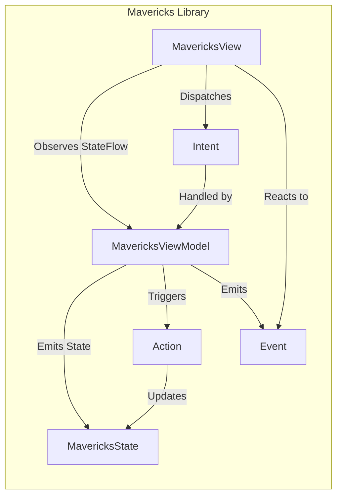
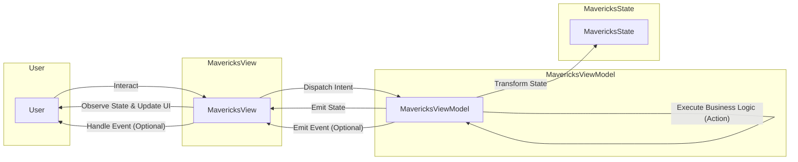

# Project Design Document: Airbnb Mavericks (Improved)

**Project Repository:** [https://github.com/airbnb/mavericks](https://github.com/airbnb/mavericks)

**Document Version:** 1.1
**Date:** October 26, 2023
**Author:** Gemini (AI Language Model)

## 1. Introduction

This document provides an enhanced design overview of the Airbnb Mavericks library, specifically tailored for threat modeling purposes. It builds upon the initial design by providing more granular detail about the components, their interactions, and potential security considerations. This document aims to equip security professionals with the necessary understanding to effectively identify and analyze potential vulnerabilities within systems leveraging Mavericks.

## 2. Project Overview

Mavericks is a powerful Kotlin library developed by Airbnb to facilitate the creation of declarative user interfaces on the Android platform. Adhering to the Model-View-Intent (MVI) architectural pattern, Mavericks simplifies complex state management, streamlines asynchronous operations, and provides a structured approach to navigation within Android applications. Its foundation lies in the reactive programming capabilities of Kotlin Coroutines and Flow.

## 3. Goals of this Document

*   Deliver a refined and more detailed architectural understanding of Mavericks.
*   Clearly delineate the responsibilities and interactions of key components.
*   Illustrate the flow of data and control within the library.
*   Serve as a dedicated resource for identifying potential threat vectors and attack surfaces.
*   Provide a comprehensive reference for security assessments, penetration testing, and code audits.

## 4. Target Audience

*   Security Engineers and Architects responsible for securing Android applications using Mavericks.
*   Software Developers involved in the design, development, and maintenance of Mavericks-based applications.
*   Quality Assurance Engineers focused on security testing and vulnerability analysis.

## 5. Architectural Overview

Mavericks' architecture is centered around the Model-View-Intent (MVI) pattern, promoting a unidirectional data flow. The core components work in concert to manage UI state and respond to user interactions. Understanding these components and their relationships is crucial for identifying potential security weaknesses.

*   **`MavericksState`:**  Represents the immutable snapshot of the UI's data at a specific point in time.
*   **`MavericksViewModel<State>`:** The orchestrator of state management. It receives user Intents, processes them by executing business logic (Actions), and produces new states. It exposes the state as a reactive stream (`StateFlow`).
*   **`MavericksView<State>`:**  The UI layer (typically an Android `Fragment`, `Activity`, or custom view) responsible for rendering the UI based on the current `MavericksState` and dispatching user-initiated Intents.
*   **Intents:**  Represent discrete user actions or external events that signal a desired change in the application's state.
*   **Actions (within ViewModel):** Encapsulated business logic within the `MavericksViewModel` that responds to Intents. These often involve asynchronous operations and ultimately lead to state transitions.
*   **Events (within ViewModel):**  Represent one-off occurrences that the View needs to react to, such as displaying transient messages or triggering navigation.

## 6. Detailed Component Description

### 6.1. `MavericksState`

*   **Purpose:** To encapsulate all the data required to render a specific UI element or screen.
*   **Characteristics:**
    *   **Immutability:**  Ensures predictable state transitions and simplifies reasoning about state changes. New states are derived from previous states.
    *   **Data Class Implementation:** Typically implemented as a Kotlin `data class`, providing built-in methods for equality checks, copying, and destructuring.
    *   **Serialization Requirement:** Often needs to be serializable (e.g., using `Parcelable` or `Serializable`) for Android's state saving and restoration mechanisms, particularly during configuration changes or process termination. **Security Consideration:** Improper serialization or deserialization of sensitive data in the state could lead to information disclosure.
    *   **Potential Attack Surface:** If the state is persisted insecurely, attackers might be able to modify it directly, leading to unexpected application behavior or information manipulation.

### 6.2. `MavericksViewModel<State>`

*   **Purpose:** The central hub for managing the application's state and handling business logic.
*   **Responsibilities:**
    *   **Intent Processing:** Receiving and interpreting Intents dispatched from the View.
    *   **Asynchronous Operations:** Executing background tasks, such as network requests or database interactions, typically using Kotlin Coroutines. **Security Consideration:**  Vulnerabilities in these asynchronous operations (e.g., insecure network communication) can compromise the application.
    *   **State Updates:**  Transforming the current state into a new state based on the outcome of Actions. State updates should be performed atomically and thread-safely.
    *   **State Exposure:** Publishing the current state as a `StateFlow`, allowing the View to reactively observe changes.
    *   **Event Emission:**  Broadcasting one-off Events to the View for actions that should only occur once.
*   **Key Features:**
    *   **State Management Primitives:** Provides utilities for safely and predictably updating the state.
    *   **Coroutine Integration:** Leverages Kotlin Coroutines for managing asynchronous tasks and ensuring main-safety.
    *   **Testability:** Designed to be easily testable, facilitating thorough unit and integration testing.
    *   **Lifecycle Awareness:** Integrates with the Android lifecycle to prevent memory leaks and ensure resources are managed correctly.
    *   **Potential Attack Surface:**  The ViewModel is a critical component. Vulnerabilities here could allow attackers to manipulate the application's state, execute arbitrary code (if not properly isolated), or leak sensitive information.

### 6.3. `MavericksView<State>`

*   **Purpose:** To present the UI to the user and handle user interactions.
*   **Responsibilities:**
    *   **State Observation:** Subscribing to the `StateFlow` emitted by the `MavericksViewModel` to receive state updates.
    *   **UI Rendering:**  Displaying information to the user based on the data contained within the current `MavericksState`.
    *   **Intent Dispatch:**  Transmitting user actions as Intents to the `MavericksViewModel`. **Security Consideration:**  Ensuring that Intents are constructed correctly and do not inadvertently expose sensitive information is important.
    *   **Event Handling:**  Reacting to one-off Events emitted by the `MavericksViewModel`.
*   **Implementation:** Typically implemented as an Android `Fragment`, `Activity`, or a custom `View`.
    *   **Potential Attack Surface:** While primarily a presentation layer, vulnerabilities in the View (e.g., improper handling of user input leading to cross-site scripting-like issues within the app, or insecure data binding) can be exploited.

### 6.4. Intents

*   **Purpose:** To represent user intentions or external triggers for state changes.
*   **Characteristics:**
    *   **Immutability:**  Typically implemented as Kotlin `data classes` or `sealed classes` to ensure their state cannot be modified after creation.
    *   **Descriptive Naming:**  Should clearly indicate the user's action or the event that occurred.
    *   **Unidirectional Flow:**  Dispatched from the `MavericksView` to the `MavericksViewModel`.
    *   **Potential Attack Surface:** Malicious or crafted Intents could be used to trigger unintended actions or state transitions if not properly validated by the ViewModel.

### 6.5. Actions (within ViewModel)

*   **Purpose:** To encapsulate the business logic executed within the `MavericksViewModel` in response to received Intents.
*   **Characteristics:**
    *   **Asynchronous Execution:** Often involve asynchronous operations using Kotlin Coroutines to avoid blocking the main thread.
    *   **Data Source Interaction:** May interact with various data sources, such as network APIs, local databases, or shared preferences. **Security Consideration:** Secure interaction with data sources is paramount. This includes proper authentication, authorization, and data validation.
    *   **State Modification:** Ultimately lead to updates to the `MavericksState`.
    *   **Potential Attack Surface:**  Vulnerabilities within Actions, such as insecure API calls or improper data handling, can be exploited to compromise the application's data or functionality.

### 6.6. Events (within ViewModel)

*   **Purpose:** To communicate one-time events from the `MavericksViewModel` to the `MavericksView`.
*   **Characteristics:**
    *   **Single Consumption:** Typically implemented using `Channel` or similar reactive streams to ensure the event is consumed only once by the View.
    *   **Non-State Bearing:**  Do not directly contribute to the core application state but rather trigger side effects in the View.
    *   **Examples:** Displaying a toast message, navigating to a different screen, showing a dialog.
    *   **Potential Attack Surface:**  While less critical than state, malicious actors might try to trigger unintended events to disrupt the user experience or potentially exploit vulnerabilities in how the View handles these events.

## 7. Data Flow

The flow of data and control in a Mavericks application is strictly unidirectional, making it easier to reason about state changes and potential vulnerabilities.

1. **User Interaction:** The user interacts with the `MavericksView`, triggering an action.
2. **Intent Dispatch:** The `MavericksView` creates and dispatches an `Intent` representing the user's action to the `MavericksViewModel`.
3. **Intent Reception and Action Invocation:** The `MavericksViewModel` receives the `Intent` and invokes the corresponding `Action` to handle it.
4. **Business Logic Execution (within Action):** The `Action` executes the necessary business logic, potentially involving asynchronous operations and interactions with data sources.
5. **State Transformation:** Based on the outcome of the `Action`, the `MavericksViewModel` creates a new, immutable `MavericksState`.
6. **State Emission:** The `MavericksViewModel` emits the new `MavericksState` through its `StateFlow`.
7. **State Observation and UI Update:** The `MavericksView` observes the `StateFlow` and receives the updated state, triggering a re-render of the UI.
8. **Event Emission (Conditional):**  The `MavericksViewModel` may emit a one-off `Event` to signal a side effect.
9. **Event Handling (Conditional):** The `MavericksView` reacts to the emitted `Event`, performing the necessary action (e.g., displaying a toast).

## 8. Security Considerations (Detailed for Threat Modeling)

This section expands on the initial security considerations, providing more specific examples of potential threats and vulnerabilities related to each component and the data flow.

*   **`MavericksState` Security:**
    *   **Information Disclosure:** Sensitive data stored in the state could be exposed if the state is persisted insecurely (e.g., in shared preferences without encryption) or if serialization is not handled carefully.
    *   **State Tampering (if persistence is involved):** If the state is persisted, attackers might try to modify the persisted state directly, leading to unexpected application behavior or bypassing security checks.
    *   **Memory Leaks of Sensitive Data:** Ensure sensitive data within the state is cleared or overwritten when no longer needed to prevent it from lingering in memory.
*   **`MavericksViewModel` Security:**
    *   **Logic Vulnerabilities in Actions:**  Vulnerabilities in the business logic implemented within Actions (e.g., SQL injection if interacting with a local database, insecure API calls) can be exploited.
    *   **Improper Handling of Asynchronous Operations:**  Not handling errors correctly in asynchronous operations could lead to crashes or unexpected state. Insecure network communication (e.g., using HTTP instead of HTTPS) can expose data in transit.
    *   **State Corruption:** Race conditions or improper synchronization during state updates could lead to inconsistent or corrupted state.
    *   **Exposure of Internal Data:**  Carelessly exposing internal data or implementation details through the state could provide attackers with valuable information.
*   **`MavericksView` Security:**
    *   **Input Validation Vulnerabilities:** If the View doesn't properly sanitize user input before dispatching Intents, it could lead to vulnerabilities in the ViewModel's Actions.
    *   **Data Binding Vulnerabilities:** Improper use of data binding could potentially lead to cross-site scripting-like vulnerabilities within the app's UI.
    *   **Information Leakage through UI:**  Displaying sensitive information unnecessarily or in debug builds could lead to information disclosure.
*   **Intent Security:**
    *   **Intent Spoofing:**  Applications should ensure that Intents are originating from trusted sources and not being spoofed by malicious apps.
    *   **Intent Data Injection:**  Validate the data contained within Intents to prevent malicious data from triggering unintended actions or state changes.
*   **Action Security:**
    *   **Insecure API Integrations:**  Ensure all API calls made within Actions use HTTPS, proper authentication and authorization, and validate responses.
    *   **Database Security:**  If Actions interact with local databases, use parameterized queries to prevent SQL injection and enforce appropriate access controls.
    *   **Data Validation:**  Thoroughly validate all data received from external sources before using it to update the state.
*   **Event Security:**
    *   **Event Injection:** While less common, consider the potential for malicious actors to trigger unintended events if the event emission mechanism is not properly secured.

## 9. Assumptions

*   Developers utilizing Mavericks adhere to secure coding principles and best practices.
*   The underlying Android platform and its inherent security features are functioning as designed.
*   Any third-party libraries integrated with the application are secure and up-to-date.
*   Sensitive data is handled according to relevant privacy regulations and security policies.

## 10. Out of Scope

This document specifically focuses on the design of the Mavericks library and its core components. The following are explicitly excluded from the scope of this document:

*   Detailed implementation specifics of individual applications built using Mavericks.
*   In-depth security analysis of the Android operating system itself.
*   Comprehensive security assessments of third-party libraries used in conjunction with Mavericks within specific applications.
*   Specific code examples or internal implementation details of the Mavericks library.
*   Network security considerations beyond the application layer (e.g., network infrastructure security).

## 11. Future Considerations

*   This document should be treated as a living document and updated to reflect any significant architectural changes or the introduction of new features within the Mavericks library.
*   The threat model derived from this design document should be regularly reviewed and updated to address emerging threats and vulnerabilities.
*   Consider incorporating static and dynamic analysis tools into the development pipeline for Mavericks-based applications to proactively identify security weaknesses.

This improved design document provides a more detailed and security-focused overview of Airbnb Mavericks, enabling more effective threat modeling and security analysis of applications built with this library.