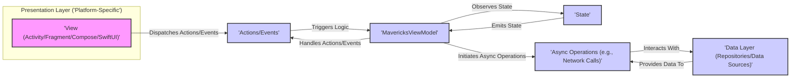
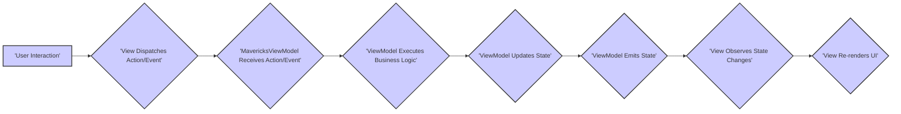

# Project Design Document: Mavericks by Airbnb

**Version:** 1.1
**Date:** October 26, 2023
**Author:** AI Software Architect

## 1. Introduction

This document provides an enhanced architectural overview of the Mavericks project, an open-source Kotlin Multiplatform (KMP) framework developed by Airbnb for building declarative UI. This revised document aims to provide a more robust foundation for subsequent threat modeling activities by offering greater clarity and detail regarding the project's components, data flow, and potential security considerations.

## 2. Goals of Mavericks

* To simplify user interface development, particularly in multiplatform contexts.
* To improve the maintainability of UI code through well-defined architectural patterns.
* To enhance developer productivity by providing efficient tools and abstractions.
* To enable the creation of user interfaces that can be shared across diverse platforms (e.g., Android, iOS, Desktop, Web).
* To promote a reactive programming paradigm for effective state management and asynchronous operation handling.

## 3. Architectural Overview

Mavericks implements a Model-View-Intent (MVI) or Unidirectional Data Flow architecture. This pattern enforces a strict separation of concerns between the user interface (`View`), the business logic (`ViewModel`), and the application's state (`State`). This clear separation is beneficial for reasoning about the system and identifying potential vulnerabilities.

Here's a refined high-level architectural diagram:

**Key Architectural Layers:**

* **Presentation Layer (View):**
    * The layer responsible for rendering the user interface elements and managing user interactions.
    * Implemented using platform-specific UI toolkits such as Android Views, Jetpack Compose on Android, or SwiftUI on iOS.
    * Observes the immutable `State` emitted by the `MavericksViewModel` to reflect the current application state.
    * Dispatches user-initiated `Actions` or internal `Events` to the `MavericksViewModel`.
* **Business Logic Layer (ViewModel):**
    * Encapsulates the application's business logic and is responsible for managing the UI's state.
    * Classes extend the `MavericksViewModel` base class, inheriting its state management capabilities.
    * Holds the single source of truth for the screen's `State`.
    * Reacts to `Actions` or `Events` received from the `View`.
    * Performs necessary operations, potentially interacting with the `Data Layer` to fetch or persist data.
    * Updates the `State`, which subsequently triggers UI re-renders in the `View`.
    * Leverages Kotlin Coroutines for managing asynchronous operations in a structured manner.
* **State:**
    * Represents the immutable snapshot of the UI's data at a given point in time.
    * Typically implemented as a data class, ensuring immutability for predictable state transitions.
    * Emitted by the `MavericksViewModel` whenever the application state changes.
    * Consumed by the `View` to render the UI accurately.
* **Actions/Events:**
    * Represent discrete user interactions (Actions) or internal occurrences (Events) that signal a need for a change in the application state.
    * Dispatched from the `View` to the `MavericksViewModel` to initiate business logic execution.
* **Data Layer:**
    * Abstracts the mechanisms for data retrieval and persistence.
    * Commonly composed of repositories that orchestrate data access from various data sources (e.g., local databases, remote network APIs).
    * Interacted with by the `MavericksViewModel` to fetch or update data.
* **Common Layer (Kotlin Multiplatform):**
    * Contains code shared across different target platforms, maximizing code reuse.
    * The core `MavericksViewModel` and other fundamental framework components reside within this layer.

## 4. Key Components

This section provides a more detailed description of the essential components within the Mavericks framework:

* **`MavericksViewModel<State>`:**
    * The cornerstone for managing UI state and encapsulating business logic within the MVI architecture.
    * Extends the `ViewModel` class from Android Architecture Components on Android, providing lifecycle awareness.
    * Offers methods like `setState` and `reduce` for safely and predictably updating the `State`.
    * Utilizes `viewModelScope` (backed by Kotlin Coroutines) for managing the lifecycle of asynchronous operations.
    * Exposes the current `State` as `LiveData` on Android or `StateFlow` in Kotlin Multiplatform, enabling reactive updates in the `View`.
    * Provides a mechanism for emitting one-off events through `MavericksEvents`, preventing unintended side effects from repeated state emissions.
* **`MavericksState`:**
    * An interface that all state classes within a Mavericks application must implement.
    * Typically implemented as a data class to leverage immutability and structural equality.
    * Represents the complete data required to render a specific screen or UI component.
* **`MavericksView<State>`:**
    * An interface designed for platform-specific views that consume and react to changes in the `MavericksState`.
    * Offers lifecycle-aware mechanisms for observing state updates, ensuring efficient resource management.
    * Responsible for rendering the UI based on the data contained within the current `State`.
* **`MavericksEvent`:**
    * Represents singular events that should be processed exactly once, such as displaying a toast message or navigating to a different screen.
    * Helps to avoid unintended consequences from replaying state updates that might trigger side effects.
* **`ViewModelContext`:**
    * Provides contextual information to the `MavericksViewModel`, including access to the saved state registry for persisting state across configuration changes and arguments passed to the ViewModel.
* **`MavericksRepository` (Conceptual):**
    * While not a direct component of the Mavericks library itself, the repository pattern is a common and recommended practice when using Mavericks.
    * Repositories encapsulate the logic for retrieving and persisting data, abstracting the underlying data sources.
* **`Mavericks` Object:**
    * A singleton object that provides global configuration options and utility functions for the Mavericks framework.

## 5. Data Flow

The data flow within a Mavericks application adheres to a strict unidirectional pattern, making it easier to trace and understand state changes:

1. **User Interaction:** A user interacts with the user interface, triggering an event (e.g., a button press, text input).
2. **Action/Event Dispatch:** The `View` translates the user interaction into a specific `Action` or `Event` and dispatches it to the associated `MavericksViewModel`.
3. **ViewModel Processing:** The `MavericksViewModel` receives the dispatched `Action` or `Event`.
4. **Business Logic Execution:** The ViewModel executes the necessary business logic in response to the received Action/Event. This might involve data manipulation, calling methods in the Data Layer, or performing other operations.
5. **State Update:** Based on the outcome of the business logic execution, the ViewModel updates the application's `State` using methods like `setState` or `reduce`. These methods ensure thread-safe and predictable state transitions.
6. **State Emission:** The `MavericksViewModel` emits the newly updated `State`.
7. **View Observation:** The `View` observes the emitted `State` changes.
8. **UI Re-render:** Upon receiving the new `State`, the `View` re-renders itself to reflect the updated data.

Here's a more detailed flowchart illustrating the data flow:

## 6. Security Considerations

While Mavericks primarily focuses on UI architecture and state management, several security considerations are important when developing applications using this framework:

* **State Management Security:**
    * **Sensitive Data in State:** Exercise caution when storing sensitive information directly within the `State`. While immutability enhances predictability, it doesn't inherently protect sensitive data. Consider encrypting sensitive data before storing it in the state or avoiding storing it altogether if possible.
    * **State Tampering:** While Mavericks provides a structured way to manage state, ensure that the underlying platform and application logic prevent unauthorized modification or injection of malicious state data.
* **Data Layer Security:**
    * **Secure Data Fetching:** Mavericks relies on underlying data fetching mechanisms. It's crucial to enforce secure communication protocols (HTTPS) for all network requests and implement robust authentication and authorization mechanisms when interacting with backend APIs.
    * **Secure Data Storage:** If local data persistence is required, implement appropriate encryption techniques and access controls to protect sensitive data at rest. Consider using platform-specific secure storage options.
* **Input Validation and Sanitization:**
    * Implement thorough input validation and sanitization within the `MavericksViewModel` before processing user inputs or passing data to the Data Layer. This helps prevent common vulnerabilities like injection attacks.
* **Error Handling and Information Disclosure:**
    * Implement robust error handling mechanisms to prevent sensitive information from being leaked in error messages, logs, or stack traces. Avoid displaying detailed error information to end-users in production environments.
* **Dependency Management and Vulnerability Scanning:**
    * Regularly review and update project dependencies to ensure they are free from known security vulnerabilities. Utilize dependency scanning tools to identify and address potential risks.
* **Platform Security Considerations:**
    * The security of the underlying platform (Android, iOS, etc.) is paramount. Mavericks operates within the security context provided by the host platform. Adhere to platform-specific security best practices.
* **MavericksEvents Security:**
    * Ensure that `MavericksEvents` that trigger sensitive actions are appropriately protected and cannot be easily triggered by malicious actors or through unintended means.
* **Secure Coding Practices:**
    * Follow secure coding practices throughout the application development lifecycle, including principles like least privilege, secure defaults, and defense in depth.

## 7. Deployment Considerations

Deployment considerations for applications built with Mavericks are largely dependent on the target platform:

* **Mobile App Stores (Google Play Store, Apple App Store):** Adhere to the security guidelines and review processes of the respective app stores. This includes code signing, permissions management, and data privacy considerations.
* **Desktop Applications:** Follow platform-specific best practices for secure application distribution and installation. Consider code signing and mechanisms for secure updates.
* **Web Applications (if using Mavericks for web):** Implement standard web security measures, including protection against common web vulnerabilities like Cross-Site Scripting (XSS) and Cross-Site Request Forgery (CSRF).

## 8. Technology Stack

* **Kotlin:** The primary programming language used for Mavericks development.
* **Kotlin Coroutines:** Used extensively for managing asynchronous operations and concurrent tasks.
* **Kotlin Multiplatform (KMP):** Enables code sharing between different target platforms.
* **Android Architecture Components (on Android):** Leverages components like `ViewModel`, `LiveData`, and `SavedStateRegistry` for Android-specific functionality.
* **Jetpack Compose (on Android):** A modern declarative UI toolkit often used in conjunction with Mavericks on Android.
* **SwiftUI (on iOS):** Can be used as the UI framework when targeting iOS with Mavericks.
* **Various Platform-Specific Libraries:** Mavericks integrates with platform-specific libraries for UI rendering and other functionalities.

## 9. Future Considerations

* **Continued Multiplatform Enhancements:** As Kotlin Multiplatform evolves, Mavericks is likely to adopt new features and improvements to further enhance cross-platform development.
* **Integration with Emerging Technologies:** Exploration of integration possibilities with other relevant libraries and technologies within the mobile and multiplatform ecosystem.
* **Performance and Optimization Efforts:** Ongoing efforts to optimize the performance and resource utilization of the framework.

This improved document provides a more detailed and nuanced understanding of the Mavericks project's architecture and components, specifically tailored to facilitate effective threat modeling activities. The added details and emphasis on security considerations should provide a stronger foundation for identifying and mitigating potential vulnerabilities.