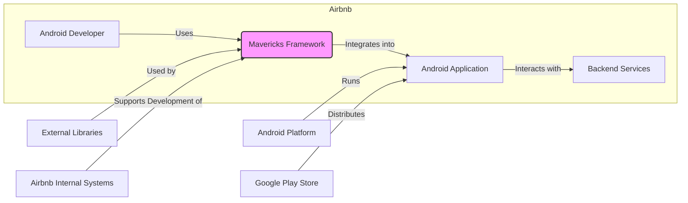
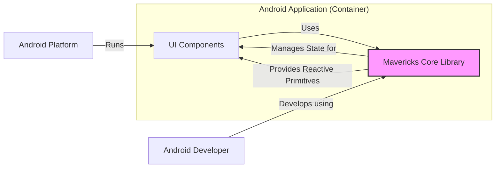
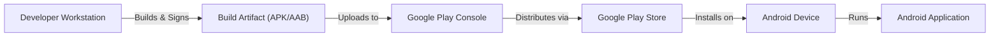
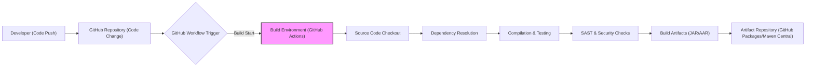

# BUSINESS POSTURE

This project, Mavericks, is an Android framework developed by Airbnb to simplify and enhance the development of reactive Android applications. It aims to improve developer productivity, code maintainability, and application performance within Airbnb and potentially for the wider Android development community if open-sourced and adopted externally.

Business Priorities and Goals:
- Enhance Android Developer Productivity: Mavericks aims to reduce boilerplate code and simplify complex UI development, allowing developers to build features faster.
- Improve Code Maintainability: By promoting a reactive architecture and component-based UI development, Mavericks should lead to more maintainable and testable Android codebases.
- Increase Application Performance: Reactive programming principles and optimized UI rendering techniques within Mavericks can contribute to better performing Android applications.
- Foster Innovation and Feature Velocity: By addressing common Android development challenges, Mavericks can enable faster iteration and innovation in Airbnb's Android applications.
- Attract and Retain Talent: Using modern and efficient frameworks like Mavericks can make Airbnb's Android development environment more attractive to skilled engineers.
- Community Engagement and Branding (if open-sourced): Open-sourcing Mavericks can enhance Airbnb's reputation within the Android developer community and potentially drive adoption and contributions.

Business Risks:
- Adoption Risk: Developers might resist adopting a new framework, especially if it requires significant learning or changes to existing workflows.
- Maintenance Overhead: Maintaining and evolving Mavericks requires ongoing investment in development and support.
- Security Vulnerabilities in Framework: Security flaws in Mavericks itself could be inherited by all applications built using it, posing a widespread risk.
- Compatibility Issues: Mavericks might have compatibility issues with certain Android versions, devices, or third-party libraries, limiting its applicability.
- Performance Bottlenecks: Despite aiming for performance improvements, unforeseen performance bottlenecks within Mavericks could negatively impact applications.

# SECURITY POSTURE

Existing Security Controls:
- security control: Code Reviews: Airbnb likely employs code reviews for contributions to Mavericks to identify potential security vulnerabilities and code quality issues.
- security control: Static Analysis Security Testing (SAST): Airbnb might use SAST tools to automatically scan Mavericks' codebase for common security flaws during development.
- security control: Dependency Management: Secure dependency management practices are likely in place to ensure that third-party libraries used by Mavericks are vetted and up-to-date with security patches.
- security control: Secure Development Lifecycle (SDLC): Airbnb likely follows a SDLC that incorporates security considerations throughout the development process.
- security control: Access Control: Access to the Mavericks repository and related infrastructure is likely controlled based on the principle of least privilege.
- security control: Build Pipeline Security: Security checks might be integrated into the build pipeline for Mavericks, such as vulnerability scanning of dependencies and build artifacts.
- accepted risk: Framework Vulnerabilities: There is an inherent risk that vulnerabilities might be discovered in Mavericks after release, requiring patching and updates.
- accepted risk: Misuse by Developers: Developers using Mavericks might misuse its features or introduce vulnerabilities in their applications despite the framework's security measures.

Recommended Security Controls:
- security control: Dynamic Analysis Security Testing (DAST): Implement DAST to test applications built with Mavericks in a runtime environment to identify vulnerabilities that might not be apparent in static analysis.
- security control: Security Training for Developers: Provide security training to developers using Mavericks to educate them on secure coding practices and common pitfalls when using the framework.
- security control: Regular Security Audits: Conduct periodic security audits of Mavericks by internal or external security experts to identify and address potential vulnerabilities.
- security control: Vulnerability Disclosure Program: Establish a vulnerability disclosure program to allow security researchers to report vulnerabilities in Mavericks responsibly.
- security control: Automated Dependency Scanning: Implement automated tools to continuously monitor dependencies for known vulnerabilities and trigger alerts for necessary updates.

Security Requirements:
- Authentication: Not directly applicable to Mavericks framework itself. Authentication is a concern for applications built using Mavericks.
- Authorization: Not directly applicable to Mavericks framework itself. Authorization is a concern for applications built using Mavericks.
- Input Validation: Mavericks should encourage or enforce input validation within applications built using it, especially when handling user inputs or data from external sources. Framework should provide mechanisms to easily validate data within reactive components.
- Cryptography: Mavericks itself might not directly implement cryptography, but it should not hinder or complicate the use of cryptography in applications built with it. Framework should be compatible with standard Android cryptography libraries and best practices. Framework should not introduce any cryptographic vulnerabilities.

# DESIGN

## C4 CONTEXT

Context Diagram Elements:

- Element:
    - Name: Android Developer
    - Type: Person
    - Description: Airbnb software engineers who develop Android applications.
    - Responsibilities: Develop Android applications for Airbnb using Mavericks framework.
    - Security controls: Access control to development environments, code review participation, security training.

- Element:
    - Name: Mavericks Framework
    - Type: Software System
    - Description: Airbnb's reactive Android framework for building user interfaces.
    - Responsibilities: Provide a framework for building reactive Android applications, simplify UI development, improve code maintainability and performance.
    - Security controls: Code reviews, SAST, dependency management, secure SDLC, build pipeline security, DAST, security audits, vulnerability disclosure program, automated dependency scanning.

- Element:
    - Name: Android Application
    - Type: Software System
    - Description: Android applications developed by Airbnb, built using Mavericks framework.
    - Responsibilities: Provide Airbnb's services to users on Android platform, interact with backend services, handle user data.
    - Security controls: Authentication, authorization, input validation, cryptography, secure storage, network security, penetration testing, vulnerability management.

- Element:
    - Name: Backend Services
    - Type: Software System
    - Description: Airbnb's backend infrastructure and APIs that Android applications interact with.
    - Responsibilities: Provide data and business logic to Android applications, manage user accounts, process transactions, store data.
    - Security controls: Authentication, authorization, API security, input validation, data encryption, intrusion detection, security monitoring.

- Element:
    - Name: Android Platform
    - Type: Technology Platform
    - Description: Google's Android operating system and ecosystem.
    - Responsibilities: Provide runtime environment for Android applications, manage device resources, provide APIs for hardware and software features.
    - Security controls: Operating system security features, permission model, security updates, sandboxing.

- Element:
    - Name: Google Play Store
    - Type: Technology Platform
    - Description: Google's official app store for Android applications.
    - Responsibilities: Distribute and manage Android applications, provide app updates, handle app reviews and security checks.
    - Security controls: App signing, malware scanning, developer account verification, app review process.

- Element:
    - Name: External Libraries
    - Type: Software System
    - Description: Third-party libraries and dependencies used by Mavericks framework.
    - Responsibilities: Provide reusable functionalities to Mavericks framework.
    - Security controls: Dependency scanning, vulnerability monitoring, license compliance checks.

- Element:
    - Name: Airbnb Internal Systems
    - Type: Software System
    - Description: Internal tools and infrastructure at Airbnb that support the development and maintenance of Mavericks, such as code repositories, build systems, and issue trackers.
    - Responsibilities: Host code repository, manage build process, track issues and feature requests for Mavericks.
    - Security controls: Access control, audit logging, infrastructure security, backup and recovery.

## C4 CONTAINER

Container Diagram Elements:

- Element:
    - Name: Mavericks Core Library
    - Type: Library
    - Description: The core component of Mavericks framework, providing reactive primitives, state management, and UI component building blocks.
    - Responsibilities: State management, reactive data flow, UI component lifecycle management, abstraction over Android framework complexities.
    - Security controls: Code reviews, SAST, dependency management, secure SDLC, build pipeline security, DAST, security audits, vulnerability disclosure program, automated dependency scanning.

- Element:
    - Name: UI Components
    - Type: Software Component
    - Description: Reusable UI elements built using Mavericks framework, forming the user interface of Android applications.
    - Responsibilities: Rendering UI, handling user interactions, displaying data, implementing application features.
    - Security controls: Input validation, secure data handling, UI rendering logic security, adherence to secure coding practices.

- Element:
    - Name: Android Developer
    - Type: Person
    - Description: Airbnb software engineers who develop Android applications.
    - Responsibilities: Develop UI components and application logic using Mavericks framework.
    - Security controls: Access control to development environments, code review participation, security training.

- Element:
    - Name: Android Platform
    - Type: Technology Platform
    - Description: Google's Android operating system and ecosystem.
    - Responsibilities: Provide runtime environment for Android applications and Mavericks framework.
    - Security controls: Operating system security features, permission model, security updates, sandboxing.

## DEPLOYMENT

Deployment Architecture: Android Application Deployment

Deployment Diagram Elements:

- Element:
    - Name: Developer Workstation
    - Type: Environment
    - Description: Development machines used by Android developers to write code, build, and test applications.
    - Responsibilities: Code development, local testing, building application packages.
    - Security controls: Workstation security hardening, access control, endpoint security software, data loss prevention.

- Element:
    - Name: Build Artifact (APK/AAB)
    - Type: File
    - Description: Compiled and packaged Android application (APK or Android App Bundle).
    - Responsibilities: Contain the complete Android application code and resources ready for deployment.
    - Security controls: Code signing, integrity checks, secure storage during transit and at rest.

- Element:
    - Name: Google Play Console
    - Type: Platform
    - Description: Web interface for Android developers to manage and publish their applications on Google Play Store.
    - Responsibilities: Application management, release management, store listing configuration, app signing management.
    - Security controls: Authentication, authorization, access control, audit logging, secure communication, data encryption.

- Element:
    - Name: Google Play Store
    - Type: Platform
    - Description: Google's official app store for Android applications.
    - Responsibilities: Distribute and manage Android applications, provide app updates, handle app reviews and security checks.
    - Security controls: App signing verification, malware scanning, developer account verification, app review process, secure distribution network.

- Element:
    - Name: Android Device
    - Type: Device
    - Description: User's Android mobile device where the application is installed and run.
    - Responsibilities: Run Android applications, provide user interface, access device resources.
    - Security controls: Device encryption, screen lock, OS security features, app permissions, sandboxing.

- Element:
    - Name: Android Application
    - Type: Software System
    - Description: Deployed and running Android application on user's device.
    - Responsibilities: Provide Airbnb's services to users, interact with backend services, handle user data.
    - Security controls: Application-level security controls (as described in previous sections).

## BUILD

Build Process: GitHub Workflows (Assumed, as it's a GitHub repository)

Build Diagram Elements:

- Element:
    - Name: Developer (Code Push)
    - Type: Person
    - Description: Android developer pushing code changes to the GitHub repository.
    - Responsibilities: Writing code, committing changes, initiating build process through code push.
    - Security controls: Authentication to GitHub, access control to repository, code review participation.

- Element:
    - Name: GitHub Repository (Code Change)
    - Type: Code Repository
    - Description: GitHub repository hosting the Mavericks framework source code.
    - Responsibilities: Version control, code storage, trigger build workflows on code changes.
    - Security controls: Access control, branch protection, audit logging, vulnerability scanning of repository settings.

- Element:
    - Name: GitHub Workflow Trigger
    - Type: Automation
    - Description: GitHub Actions workflow triggered by code changes in the repository.
    - Responsibilities: Automate the build process, orchestrate build steps, trigger security checks.
    - Security controls: Workflow configuration security, access control to workflow definitions, secret management for build credentials.

- Element:
    - Name: Build Environment (GitHub Actions)
    - Type: Environment
    - Description: GitHub Actions environment where the build process is executed.
    - Responsibilities: Provide isolated environment for build execution, execute build steps defined in workflow.
    - Security controls: Secure build agents, isolated execution environment, access control to build environment, audit logging.

- Element:
    - Name: Source Code Checkout
    - Type: Build Step
    - Description: Step in the build process where source code is checked out from the repository.
    - Responsibilities: Retrieve the latest source code for building.
    - Security controls: Secure access to repository, integrity checks of checked out code.

- Element:
    - Name: Dependency Resolution
    - Type: Build Step
    - Description: Step in the build process where project dependencies are resolved and downloaded.
    - Responsibilities: Manage project dependencies, download required libraries.
    - Security controls: Dependency scanning for vulnerabilities, secure dependency sources, dependency integrity checks.

- Element:
    - Name: Compilation & Testing
    - Type: Build Step
    - Description: Step in the build process where source code is compiled and unit tests are executed.
    - Responsibilities: Compile code into executable artifacts, run automated tests to ensure code quality.
    - Security controls: Secure compilation process, test environment isolation, code coverage analysis.

- Element:
    - Name: SAST & Security Checks
    - Type: Build Step
    - Description: Step in the build process where Static Application Security Testing (SAST) and other security checks are performed.
    - Responsibilities: Identify potential security vulnerabilities in the code, enforce security policies.
    - Security controls: SAST tool configuration, vulnerability reporting, security policy enforcement.

- Element:
    - Name: Build Artifacts (JAR/AAR)
    - Type: File
    - Description: Compiled Java/Android Archive (JAR/AAR) files produced by the build process.
    - Responsibilities: Contain compiled framework code ready for distribution or integration.
    - Security controls: Artifact signing, integrity checks, secure storage during transit and at rest.

- Element:
    - Name: Artifact Repository (GitHub Packages/Maven Central)
    - Type: Repository
    - Description: Repository where build artifacts are published for distribution and consumption.
    - Responsibilities: Host and distribute build artifacts, manage artifact versions.
    - Security controls: Access control, artifact integrity verification, secure artifact storage, audit logging.

# RISK ASSESSMENT

Critical Business Processes:
- Android Application Development: Mavericks directly supports the process of developing Android applications for Airbnb, which are crucial for customer engagement and service delivery.
- Feature Delivery and Innovation: By improving developer productivity, Mavericks indirectly supports faster feature delivery and innovation in Airbnb's Android applications, impacting competitiveness and user experience.

Data Sensitivity:
- Mavericks framework itself primarily deals with code, configuration, and build artifacts. The data handled directly by the framework is not highly sensitive in terms of personal user data.
- However, vulnerabilities in Mavericks could lead to vulnerabilities in applications built using it, which might handle sensitive user data (e.g., user profiles, location data, payment information).
- Sensitivity levels:
    - Mavericks Codebase: Confidential (Airbnb intellectual property)
    - Build Artifacts: Confidential (potentially contain internal implementation details)
    - Dependencies: Publicly available, but integrity and vulnerability status are important.

# QUESTIONS & ASSUMPTIONS

Questions:
- What specific SAST and DAST tools are currently used or planned for Mavericks and applications built with it?
- Is there a formal vulnerability disclosure program in place for Mavericks?
- What security training is provided to developers using Mavericks?
- What are the specific security requirements for applications built using Mavericks (beyond general Android security best practices)?
- What is the process for handling security vulnerabilities discovered in Mavericks?
- Is there a dedicated security team involved in the development and maintenance of Mavericks?

Assumptions:
- Airbnb follows a Secure Development Lifecycle (SDLC) for software development, including Mavericks.
- Code reviews are a standard practice for Mavericks development.
- Airbnb uses GitHub Actions for CI/CD and build automation for Mavericks.
- Security is a significant concern for Airbnb, and they are proactive in addressing security risks.
- Mavericks is intended to be used for building production-level Android applications at Airbnb.
- The deployment model for applications built with Mavericks is primarily through the Google Play Store.