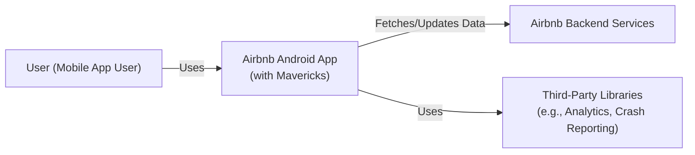
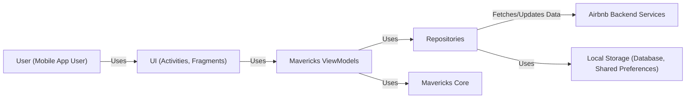
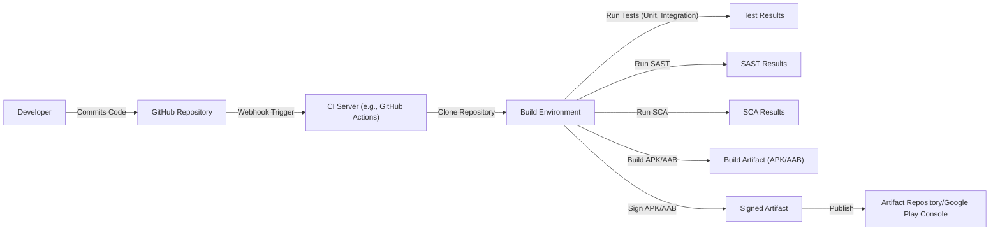

Okay, let's create a design document for the Airbnb Mavericks project, focusing on aspects relevant for threat modeling.

# BUSINESS POSTURE

Business Priorities and Goals:

*   Provide a simplified, yet powerful Android architecture framework to reduce boilerplate and improve developer productivity within Airbnb.
*   Enable faster development cycles for Android features.
*   Improve the maintainability and testability of Airbnb's Android codebase.
*   Reduce the complexity of state management in Android applications.
*   Provide a consistent and predictable way to handle asynchronous operations.
*   Make it easier for developers, especially those new to Android or the Airbnb codebase, to contribute effectively.

Most Important Business Risks:

*   Introduction of new, unforeseen bugs or regressions in the existing Airbnb application due to the adoption of a new framework.
*   Increased application size (APK size) due to the inclusion of the Mavericks library, potentially impacting user experience, especially in regions with limited bandwidth or device storage.
*   Steep learning curve for existing Airbnb Android developers, potentially slowing down development in the short term.
*   Potential for the framework to become outdated or unsupported, leading to technical debt in the long run.
*   Security vulnerabilities introduced by the framework itself or through its misuse, potentially exposing user data or compromising application integrity.
*   Performance issues, such as increased memory usage or slower UI rendering, impacting user experience.

# SECURITY POSTURE

Existing Security Controls (based on the repository and common Android practices):

*   security control: ProGuard/R8 configuration: The library likely includes ProGuard/R8 rules to optimize and obfuscate the code, making reverse engineering more difficult. (Inferred, needs verification in the project's build configuration).
*   security control: Dependency Management: The project uses Gradle for dependency management, allowing for controlled inclusion of external libraries. (Visible in build.gradle files).
*   security control: Standard Android Security Practices: It's assumed that Airbnb follows standard Android security best practices, such as using HTTPS for network communication, securely storing sensitive data, and handling permissions appropriately. (Assumption, based on Airbnb's reputation and general Android development guidelines).
*   security control: Testing: The library includes unit and integration tests, which help to identify and prevent bugs, including potential security vulnerabilities. (Visible in the test directories).
*   security control: Open Source: Being open source allows for community scrutiny and contributions, potentially leading to faster identification and resolution of security issues.

Accepted Risks:

*   accepted risk: Reliance on Third-Party Libraries: Like any project, Mavericks depends on other libraries (e.g., Kotlin Coroutines, AndroidX libraries). Vulnerabilities in these dependencies could impact Mavericks.
*   accepted risk: Framework Misuse: While Mavericks aims to simplify development, incorrect usage by developers could still introduce security vulnerabilities. This is mitigated by documentation and training, but the risk remains.
*   accepted risk: Evolving Android Security Landscape: New Android security features and vulnerabilities are constantly emerging. Mavericks will need to be updated regularly to address these changes.

Recommended Security Controls:

*   security control: Static Application Security Testing (SAST): Integrate SAST tools into the build process to automatically scan the Mavericks codebase for potential vulnerabilities.
*   security control: Dynamic Application Security Testing (DAST): Perform regular DAST scans on applications using Mavericks to identify runtime vulnerabilities.
*   security control: Software Composition Analysis (SCA): Use SCA tools to identify and track vulnerabilities in third-party dependencies used by Mavericks.
*   security control: Security Training: Provide specific security training to Airbnb developers on how to use Mavericks securely and avoid common pitfalls.
*   security control: Penetration Testing: Conduct regular penetration testing on applications using Mavericks to identify and address exploitable vulnerabilities.

Security Requirements:

*   Authentication: Mavericks itself does not handle authentication directly. It relies on the application using it to implement appropriate authentication mechanisms (e.g., OAuth 2.0, session management).
*   Authorization: Mavericks does not provide built-in authorization mechanisms. Authorization logic should be implemented within the application using Mavericks, potentially leveraging Mavericks' state management capabilities to control access to features and data.
*   Input Validation: Mavericks encourages the use of immutable data structures, which inherently helps prevent some types of injection attacks. However, applications using Mavericks must still perform explicit input validation on all user-provided data to prevent vulnerabilities like Cross-Site Scripting (XSS) and SQL injection (if applicable).
*   Cryptography: Mavericks does not provide cryptographic primitives directly. Applications using Mavericks should use standard Android cryptography libraries (e.g., Jetpack Security) for encryption and other security-sensitive operations.

# DESIGN

## C4 CONTEXT

Element Descriptions:

*   Element:
    *   Name: User
    *   Type: Person
    *   Description: A user of the Airbnb mobile application on an Android device.
    *   Responsibilities: Interacts with the Airbnb app to search for listings, book accommodations, manage their profile, etc.
    *   Security controls: N/A (External to the system)

*   Element:
    *   Name: Airbnb Android App (with Mavericks)
    *   Type: Software System
    *   Description: The Airbnb Android application, built using the Mavericks framework.
    *   Responsibilities: Provides the user interface, handles user interactions, manages application state, communicates with backend services.
    *   Security controls: ProGuard/R8, Dependency Management, Standard Android Security Practices, Testing.

*   Element:
    *   Name: Airbnb Backend Services
    *   Type: Software System
    *   Description: The backend services that provide data and functionality to the Airbnb app.
    *   Responsibilities: Handles user authentication, manages listings, processes bookings, etc.
    *   Security controls: (Assumed to have robust security controls, but outside the scope of this document).

*   Element:
    *   Name: Third-Party Libraries
    *   Type: Software System
    *   Description: External libraries used by the Airbnb app for various purposes (e.g., analytics, crash reporting).
    *   Responsibilities: Varies depending on the specific library.
    *   Security controls: (Dependent on the specific library; should be vetted for security).

## C4 CONTAINER

Element Descriptions:

*   Element:
    *   Name: User
    *   Type: Person
    *   Description: A user of the Airbnb mobile application on an Android device.
    *   Responsibilities: Interacts with the Airbnb app.
    *   Security controls: N/A

*   Element:
    *   Name: UI (Activities, Fragments)
    *   Type: Container (Android UI Components)
    *   Description: The user interface components of the Airbnb app, built using standard Android UI elements.
    *   Responsibilities: Displays data to the user, handles user input.
    *   Security controls: Input validation (implemented within the UI or ViewModel).

*   Element:
    *   Name: Mavericks ViewModels
    *   Type: Container (Mavericks Components)
    *   Description: ViewModels that extend MavericksViewModel, managing the state and business logic for specific UI components.
    *   Responsibilities: Holds and manages UI-related data, handles user actions, interacts with Repositories.
    *   Security controls: State management best practices (e.g., immutability).

*   Element:
    *   Name: Repositories
    *   Type: Container (Data Access Components)
    *   Description: Classes responsible for accessing data from various sources (network, local storage).
    *   Responsibilities: Fetches data from the network or local storage, provides data to ViewModels.
    *   Security controls: Secure data handling practices (e.g., HTTPS, encryption of sensitive data in local storage).

*   Element:
    *   Name: Mavericks Core
    *   Type: Container (Library)
    *   Description: The core functionality of the Mavericks framework.
    *   Responsibilities: Provides base classes and utilities for ViewModels, state management, and asynchronous operations.
    *   Security controls: ProGuard/R8, Dependency Management.

*   Element:
    *   Name: Airbnb Backend Services
    *   Type: Software System
    *   Description: The backend services that provide data and functionality to the Airbnb app.
    *   Responsibilities: Handles user authentication, manages listings, processes bookings, etc.
    *   Security controls: (Assumed to have robust security controls).

*   Element:
    *   Name: Local Storage
    *   Type: Container (Data Storage)
    *   Description: Local storage mechanisms on the Android device (e.g., database, Shared Preferences).
    *   Responsibilities: Stores data locally on the device.
    *   Security controls: Encryption of sensitive data, secure access controls.

## DEPLOYMENT

Possible Deployment Solutions:

1.  Standard Google Play Store Deployment: The most common deployment method for Android applications.
2.  Internal Testing Tracks (Alpha/Beta): Utilize Google Play Console's testing tracks for internal distribution and testing before release.
3.  Enterprise Distribution: For internal Airbnb use only, could be distributed via an internal app store or Mobile Device Management (MDM) solution.

Chosen Solution (for detailed description): Standard Google Play Store Deployment

```mermaid
graph LR
    DevMachine["Developer Machine"] -- "Commits Code" --> GitRepo["Git Repository (GitHub)"]
    GitRepo -- "Triggers Build" --> CI["CI/CD Pipeline (e.g., GitHub Actions)"]
    CI -- "Builds APK/AAB" --> BuildArtifact["Build Artifact (APK/AAB)"]
    BuildArtifact -- "Uploads to" --> PlayConsole["Google Play Console"]
    PlayConsole -- "Releases to" --> PlayStore["Google Play Store"]
    PlayStore -- "Downloads to" --> UserDevice["User's Android Device"]

```

Element Descriptions:

*   Element:
    *   Name: Developer Machine
    *   Type: Infrastructure Node
    *   Description: The developer's workstation where code is written and tested.
    *   Responsibilities: Code development, local testing.
    *   Security controls: Local security measures (e.g., antivirus, firewall).

*   Element:
    *   Name: Git Repository (GitHub)
    *   Type: Infrastructure Node
    *   Description: The Git repository hosted on GitHub, storing the source code.
    *   Responsibilities: Version control, code collaboration.
    *   Security controls: Access controls, branch protection rules.

*   Element:
    *   Name: CI/CD Pipeline (e.g., GitHub Actions)
    *   Type: Infrastructure Node
    *   Description: The continuous integration and continuous deployment pipeline.
    *   Responsibilities: Automates the build, test, and deployment process.
    *   Security controls: Secure configuration, secrets management, SAST, SCA.

*   Element:
    *   Name: Build Artifact (APK/AAB)
    *   Type: Software Artifact
    *   Description: The compiled application package (APK or Android App Bundle).
    *   Responsibilities: Contains the application code and resources.
    *   Security controls: Code signing.

*   Element:
    *   Name: Google Play Console
    *   Type: Infrastructure Node
    *   Description: Google's platform for managing and publishing Android applications.
    *   Responsibilities: App management, release management, testing.
    *   Security controls: Google's security infrastructure.

*   Element:
    *   Name: Google Play Store
    *   Type: Infrastructure Node
    *   Description: Google's app store for Android devices.
    *   Responsibilities: Distributes the application to users.
    *   Security controls: Google's security infrastructure.

*   Element:
    *   Name: User's Android Device
    *   Type: Infrastructure Node
    *   Description: The user's Android device where the app is installed.
    *   Responsibilities: Runs the application.
    *   Security controls: Android's built-in security features.

## BUILD

Build Process Description:

1.  Developer commits code to the GitHub repository.
2.  A webhook triggers the CI server (e.g., GitHub Actions).
3.  The CI server clones the repository into a build environment.
4.  Unit and integration tests are executed.
5.  SAST tools scan the codebase for vulnerabilities.
6.  SCA tools analyze dependencies for known vulnerabilities.
7.  The application is built, producing an APK or AAB file.
8.  The APK/AAB is signed with a release key.
9.  The signed artifact is published to an artifact repository or directly to the Google Play Console.

Security Controls in Build Process:

*   security control: Code Review: Pull requests are used to enforce code review before merging changes.
*   security control: Branch Protection: Protect main and release branches from unauthorized changes.
*   security control: SAST: Static Application Security Testing tools are integrated into the build process.
*   security control: SCA: Software Composition Analysis tools are used to identify vulnerabilities in dependencies.
*   security control: Code Signing: The APK/AAB is signed with a release key to ensure authenticity and integrity.
*   security control: Secrets Management: Sensitive information (e.g., API keys, signing keys) are securely managed and not stored directly in the repository.
*   security control: Build Automation: The entire build process is automated, reducing the risk of manual errors.

# RISK ASSESSMENT

Critical Business Processes:

*   User Account Management: Protecting user accounts from unauthorized access and modification.
*   Booking and Payment Processing: Ensuring secure and reliable handling of financial transactions.
*   Listing Management: Maintaining the integrity and accuracy of property listings.
*   Communication: Secure communication between users (guests and hosts).

Data Sensitivity:

*   Personally Identifiable Information (PII): User names, email addresses, phone numbers, addresses, profile pictures, etc. (High Sensitivity)
*   Financial Information: Payment card details, bank account information (if applicable). (High Sensitivity)
*   Booking Details: Travel dates, accommodation details, guest information. (Medium Sensitivity)
*   Communication Data: Messages exchanged between users. (Medium Sensitivity)
*   Location Data: User location (if permission granted). (Medium Sensitivity)
*   Usage Data: App usage patterns, search history. (Low to Medium Sensitivity)

# QUESTIONS & ASSUMPTIONS

Questions:

*   What specific SAST and SCA tools are currently used or planned for use with Mavericks?
*   What is the process for handling security vulnerabilities reported in Mavericks or its dependencies?
*   What level of security training is provided to Airbnb developers regarding secure Android development and Mavericks usage?
*   Are there any specific regulatory compliance requirements (e.g., GDPR, CCPA) that need to be considered?
*   What is the current ProGuard/R8 configuration for Mavericks?
*   What are the specific mechanisms used for inter-process communication (IPC) within the Airbnb app, and how are they secured?
*   How are feature flags used, and how is their security managed?

Assumptions:

*   BUSINESS POSTURE: Airbnb has a mature security program and prioritizes the security of its users and their data.
*   SECURITY POSTURE: Standard Android security best practices are followed in the Airbnb app.
*   DESIGN: The Airbnb backend services have robust security controls in place. The provided diagrams are a simplified representation of the actual architecture. The build process includes automated security checks.